# Guia Definitivo de Detecção de Conteúdo Gerado por IA 🔍

## Visão Geral

Este guia apresenta uma metodologia abrangente e prática para identificação de conteúdo gerado por IA, estruturado em um framework visual e intuitivo que facilita a aplicação em diversos contextos.

## 1. Arquitetura do Sistema de Detecção

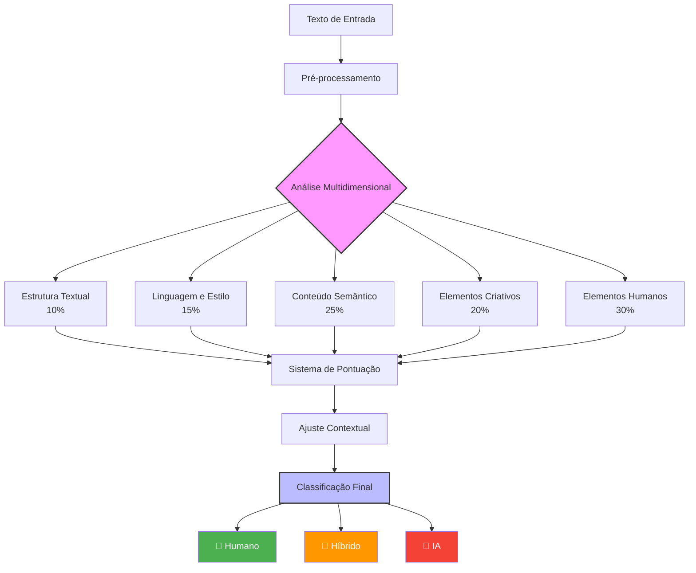

## 2. Metodologia de Avaliação

### 2.1 Processo de Análise em 5 Fases

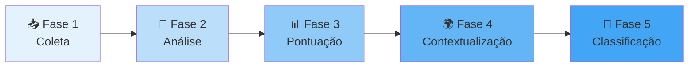

### 2.2 Matriz de Pesos por Categoria

|Categoria|Peso|Impacto na Detecção|Indicadores Principais|
|---|---|---|---|
|🧠 **Elementos Humanos**|30%|Alto|Perspectiva pessoal, emoções, vieses naturais|
|📚 **Conteúdo Semântico**|25%|Alto|Profundidade, contextualização, nuances|
|🎨 **Elementos Criativos**|20%|Médio-Alto|Originalidade, metáforas, surpresas|
|✍️ **Linguagem e Estilo**|15%|Médio|Variações, coloquialismos, erros|
|📋 **Estrutura Textual**|10%|Médio-Baixo|Fluxo, transições, digressões|

## 3. Categorias de Análise Detalhadas

### 3.1 Elementos Humanos (30%)

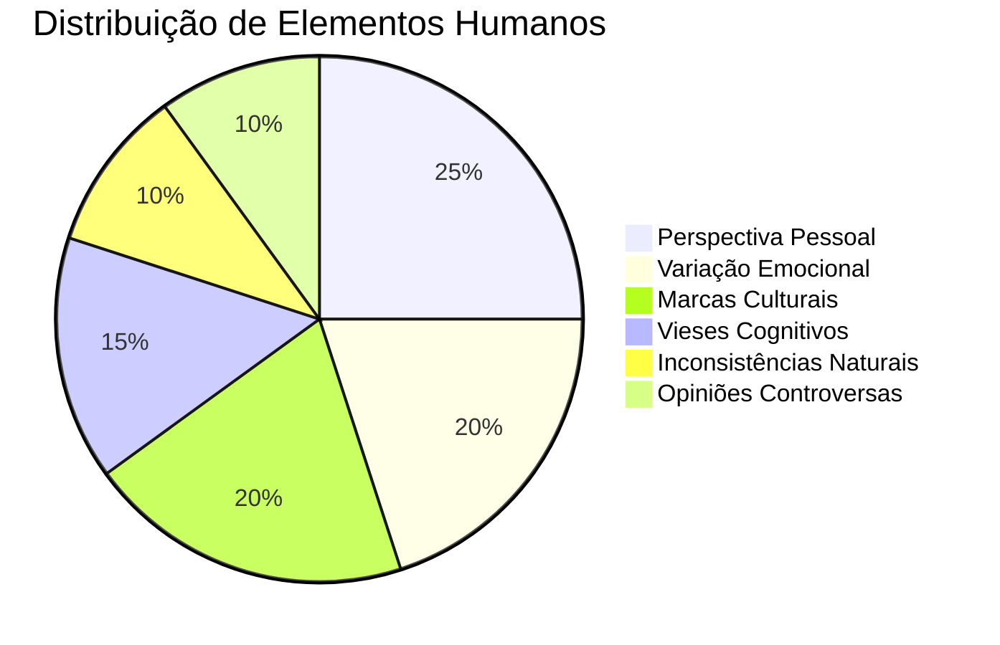

#### Principais Indicadores

|ID|Característica|Descrição Detalhada|Peso|
|---|---|--:|--:|
|HUM01|Perspectiva Pessoal|Experiências vividas, opiniões próprias|5|
|HUM02|Flutuação Emocional|Mudanças naturais de tom ao longo do texto|4|
|HUM03|Marcas Culturais|Regionalismos, gírias, referências locais|4|
|HUM04|Inconsistências Naturais|Pequenas contradições que humanizam|4|
|HUM05|Vieses Cognitivos|Tendências de pensamento humanas|4|
|HUM06|Posicionamentos Éticos|Julgamentos morais e valores pessoais|4|
|HUM07|Humor Situacional|Piadas contextuais, ironias naturais|3|
|HUM08|Digressões Pessoais|Desvios baseados em associações|3|
|HUM09|Imperfeições Estilísticas|Idiossincrasias e marcas pessoais|4|
|HUM10|Evolução de Ideias|Mudança de pensamento durante o texto|4|

### 3.2 Conteúdo Semântico (25%)

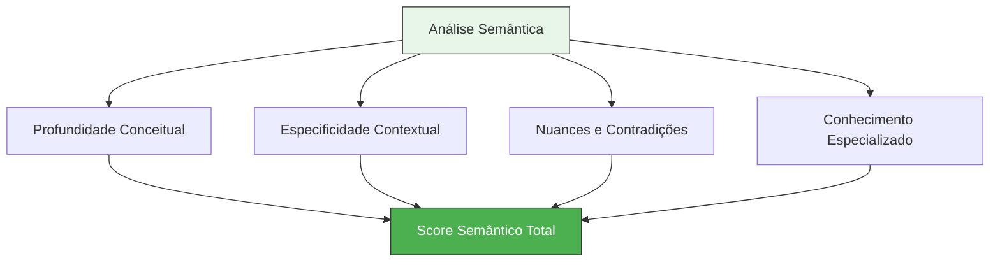

#### Matriz de Indicadores Semânticos

|Aspecto|Característica IA|Característica Humana|Peso|
|---|---|---|---|
|**Profundidade**|Superficial mas articulada|Complexa com camadas|5|
|**Exemplos**|Genéricos e repetitivos|Específicos e únicos|4|
|**Contextualização**|Limitada ao óbvio|Rica em referências|4|
|**Nuances**|Simplificação excessiva|Contradições naturais|5|
|**Citações**|Plausíveis mas imprecisas|Verificáveis e precisas|4|

### 3.3 Elementos Criativos (20%)

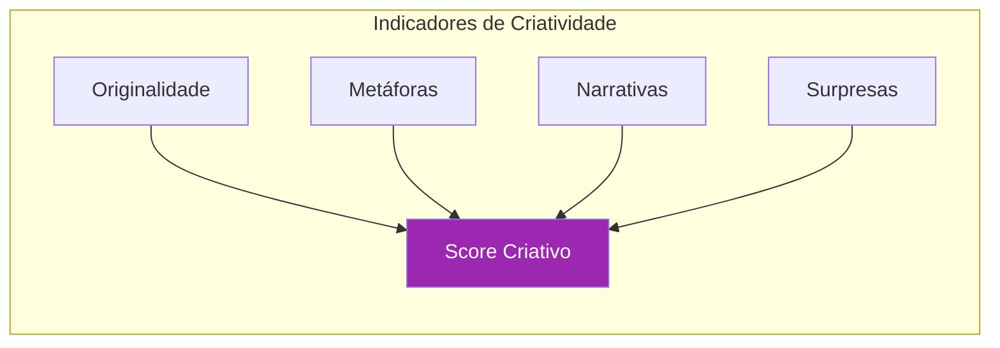

#### Tabela de Avaliação Criativa

|Elemento|Padrão IA|Padrão Humano|Peso|
|---|---|---|---|
|🎯 **Originalidade**|Combinações previsíveis|Conexões inesperadas|4|
|🌈 **Metáforas**|Clichês comuns|Comparações únicas|3|
|📖 **Storytelling**|Linear e didático|Envolvente e complexo|4|
|⚡ **Surpresas**|Desenvolvimento óbvio|Reviravoltas genuínas|4|
|🎭 **Ambiguidade**|Evitação sistemática|Uso intencional|4|

### 3.4 Linguagem e Estilo (15%)

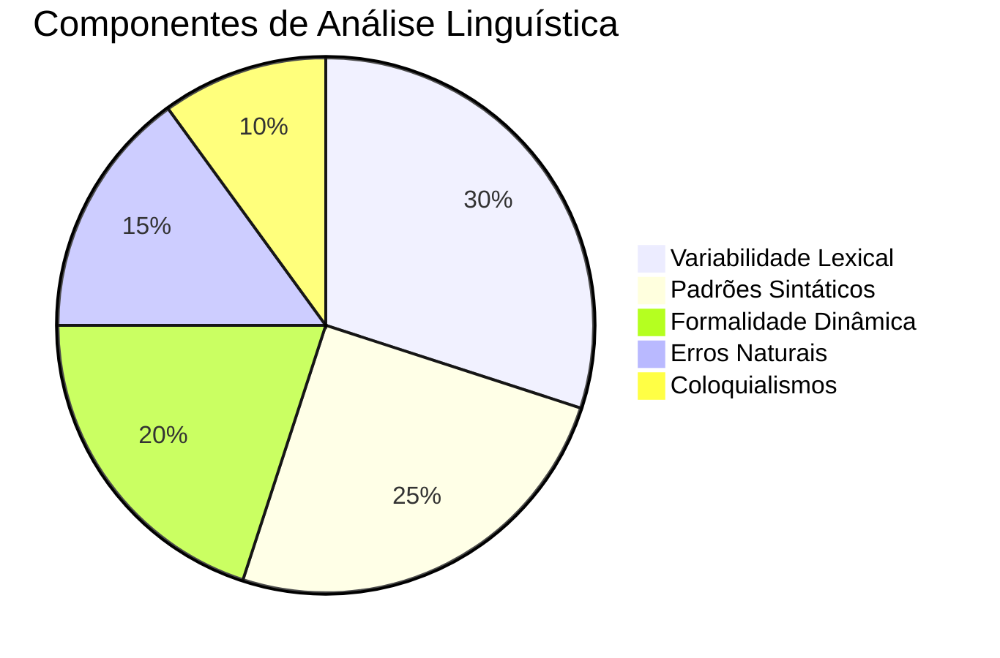

#### Características Linguísticas Distintivas

|Categoria|Indicadores IA|Indicadores Humanos|Peso|
|---|---|--:|---|
|**Vocabulário**|Uniforme e previsível|Variado e contextual|4|
|**Sintaxe**|Repetitiva e perfeita|Diversa com falhas|3|
|**Formalidade**|Constante|Adaptativa|4|
|**Erros**|Ausentes|Presentes naturalmente|5|
|**Expressões**|Neutras e genéricas|Regionais e idiomáticas|3|

### 3.5 Estrutura Textual (10%)

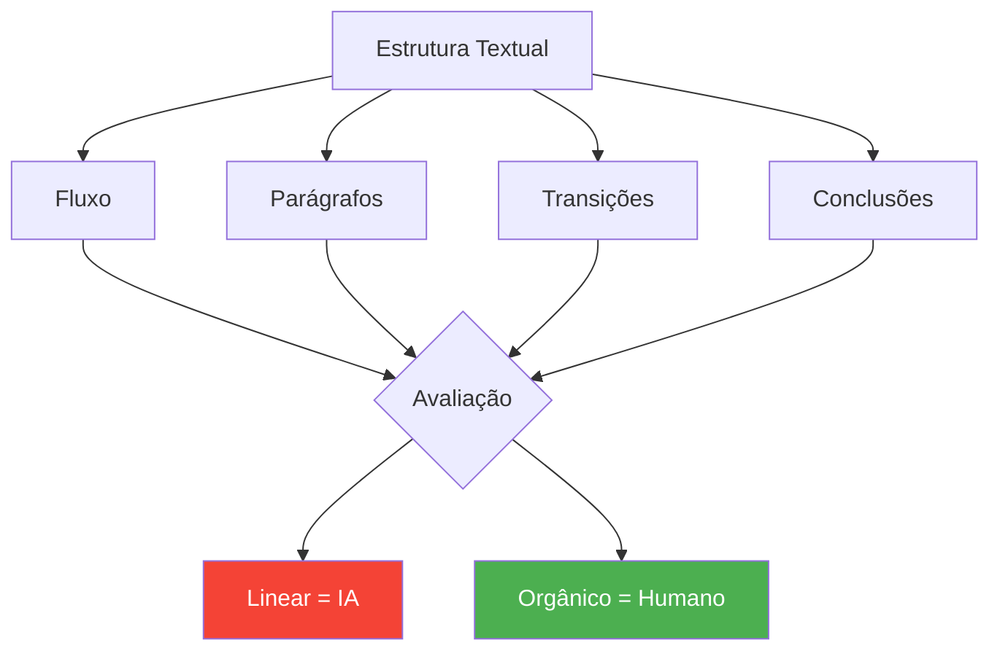

## 4. Sistema de Classificação

### 4.1 Escala de Pontuação

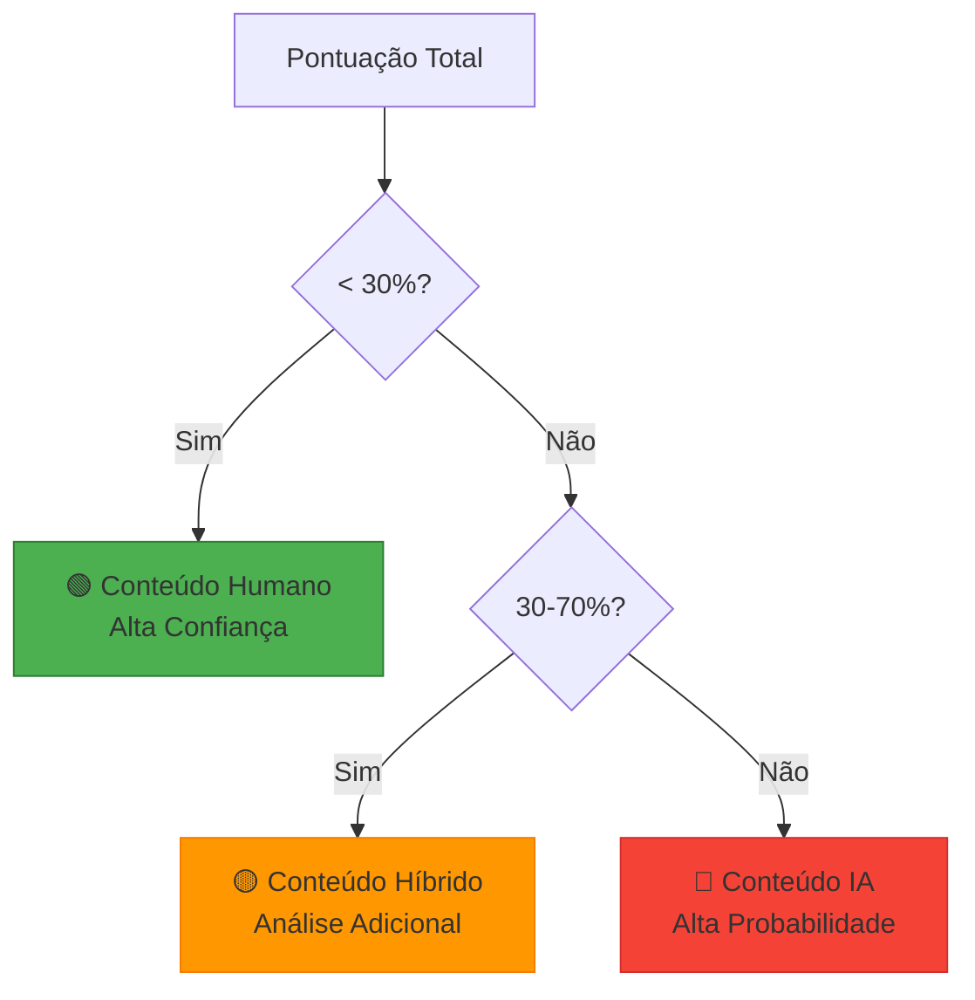

### 4.2 Matriz de Interpretação

|Faixa de Score|Classificação|Ação Recomendada|Confiança|
|---|---|---|---|
|0-30%|Humano|Aceitar como autêntico|Alta|
|31-50%|Provavelmente Híbrido|Investigar fonte|Média|
|51-70%|Possivelmente IA|Verificar autoria|Média-Baixa|
|71-100%|IA|Considerar como gerado|Alta|

## 5. Aplicação Prática por Contexto

### 5.1 Ajustes Contextuais

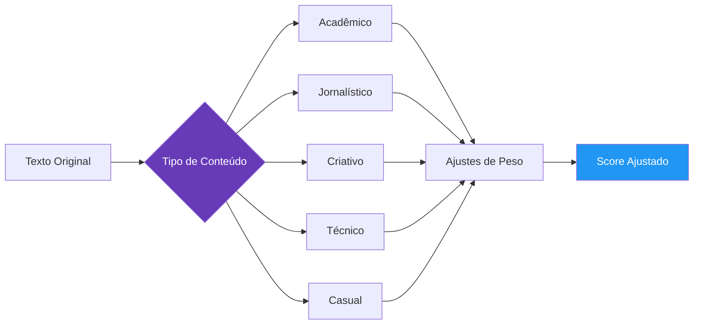

### 5.2 Tabela de Modificadores Contextuais

|Contexto|EST|LIN|CON|CRI|HUM|Justificativa|
|---|---|---|---|---|---|---|
|📚 **Acadêmico**|+5%|+5%|0%|-5%|-5%|Formalidade esperada|
|📰 **Jornalístico**|0%|0%|+10%|-5%|-5%|Objetividade requerida|
|🎨 **Criativo**|-10%|-5%|-5%|+15%|+5%|Liberdade artística|
|⚙️ **Técnico**|+5%|+10%|+5%|-10%|-10%|Precisão prioritária|
|💬 **Casual**|-5%|-10%|-5%|+5%|+15%|Informalidade natural|

## 6. Guia de Detecção Rápida

### 6.1 Checklist Visual

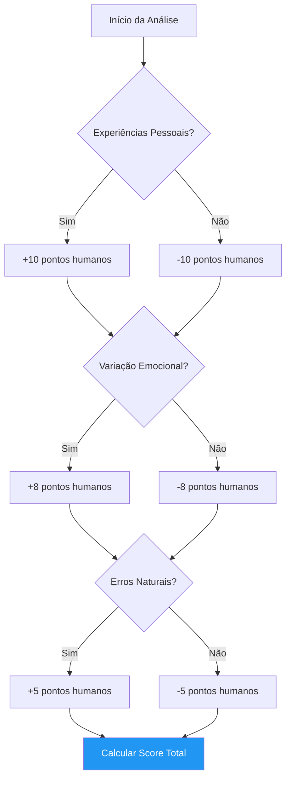

### 6.2 Indicadores Rápidos por Categoria

|Categoria|🟢 Humano|🔴 IA|
|---|---|---|
|**Estrutura**|Digressões e quebras de padrão|Linearidade perfeita|
|**Linguagem**|Variações e imperfeições|Uniformidade constante|
|**Conteúdo**|Exemplos específicos e datados|Generalizações abstratas|
|**Criatividade**|Conexões inesperadas|Associações óbvias|
|**Humanidade**|Opiniões e emoções claras|Neutralidade sistemática|

## 7. Evolução e Tendências

### 7.1 Linha do Tempo da Detecção

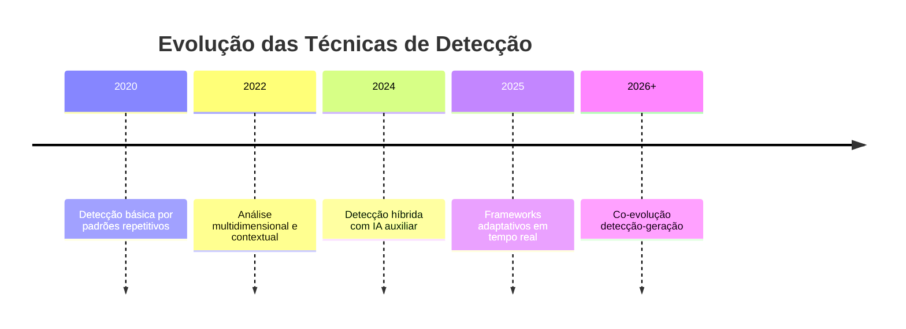

### 7.2 Desafios Emergentes

|Desafio|Impacto|Estratégia de Mitigação|
|---|---|---|
|**IAs Adversariais**|Alto|Análise multimodal|
|**Conteúdo Híbrido**|Médio-Alto|Detecção granular|
|**Evolução Rápida**|Alto|Atualização contínua|
|**Contextos Diversos**|Médio|Modelos especializados|
|**Escala de Análise**|Baixo-Médio|Agregação estatística|

## 8. Melhores Práticas

### 8.1 Processo Recomendado

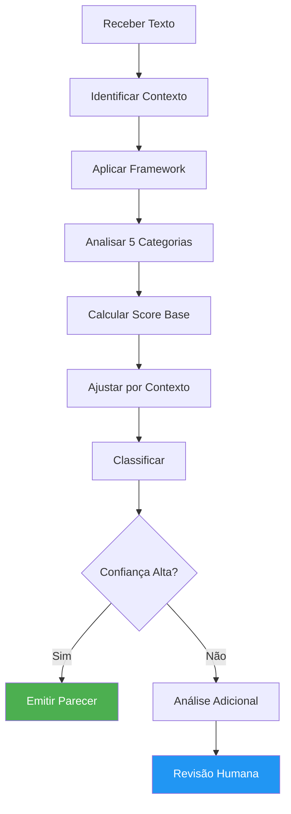

### 8.2 Dicas de Implementação

|Etapa|Ação Recomendada|Evitar|
|---|---|---|
|**Preparação**|Entender contexto e propósito|Análise sem contexto|
|**Análise**|Usar todas as categorias|Focar em único aspecto|
|**Pontuação**|Aplicar pesos adequados|Ignorar ajustes contextuais|
|**Classificação**|Considerar margem de erro|Certeza absoluta|
|**Conclusão**|Documentar justificativas|Parecer sem fundamento|

## 9. Conclusão

### 9.1 Princípios Fundamentais

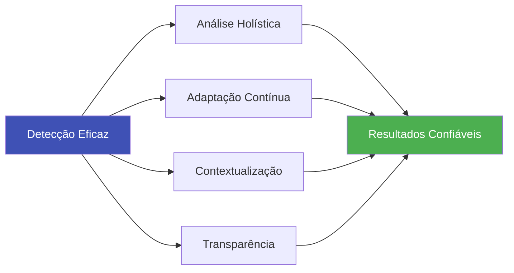

### 9.2 Recomendações Finais

1. **Abordagem Sistemática**: Utilize o framework completo, não apenas partes isoladas
2. **Contexto é Crucial**: Sempre ajuste a análise ao tipo de conteúdo
3. **Evolução Constante**: Atualize regularmente os critérios de detecção
4. **Documentação**: Mantenha registro das análises para aprendizado
5. **Colaboração**: Compartilhe insights com a comunidade

### 9.3 Visão de Futuro

A detecção de conteúdo gerado por IA é uma disciplina em rápida evolução. Este guia fornece uma base sólida e estruturada, mas deve ser tratado como um documento vivo, sujeito a atualizações conforme as tecnologias e nosso entendimento evoluem.

---

**Última Atualização**: Maio 2025  
**Versão**: 3.0  
**Status**: Documento Ativo