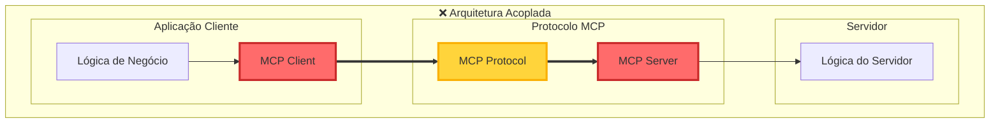
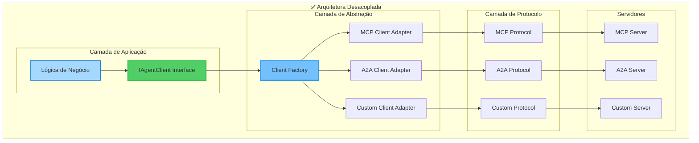
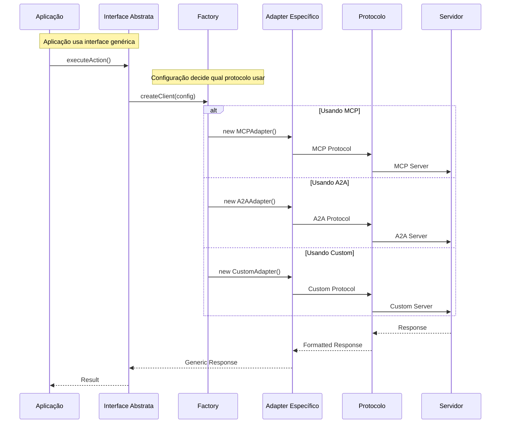
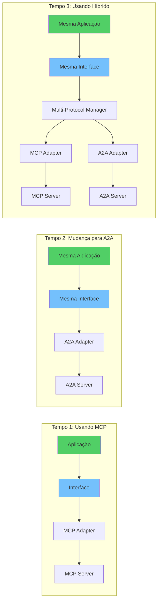
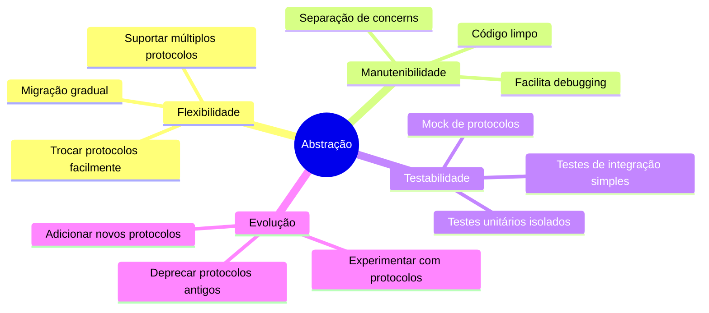
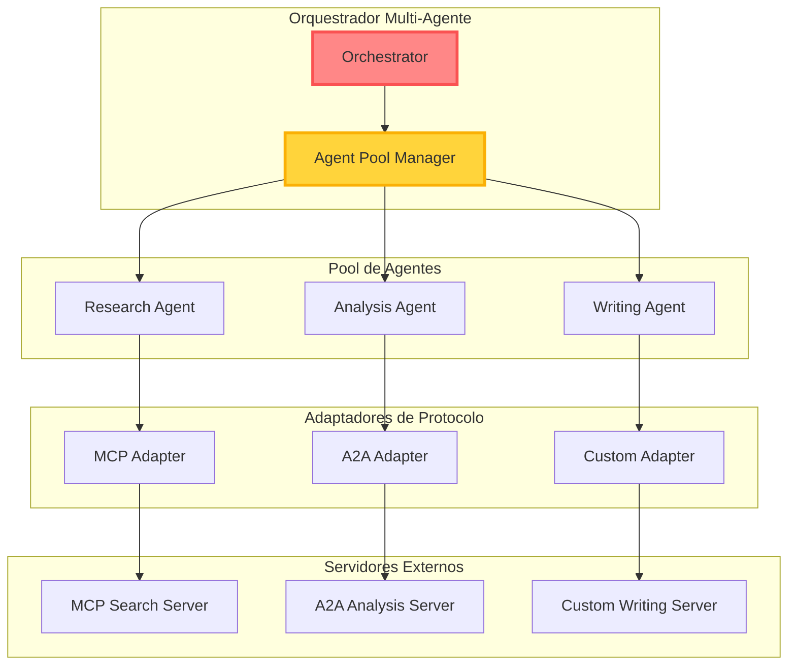

# 🔒 Problema De Acoplamento Vs 🔓 Solução Com Abstração

## 1. O Problema: Acoplamento Direto (Sem Abstração)



### Problemas Desta Abordagem

- 🔐 **Cliente e Servidor amarrados ao MCP**
- 🚫 **Impossível mudar protocolo sem reescrever ambos os lados**
- 📝 **Código de negócio misturado com código de protocolo**
- 🔄 **Difícil testar e manter**

## 2. A Solução: Arquitetura Com Abstração



## 3. Fluxo De Mudança De Protocolo



## 4. Exemplo Visual: Trocando Protocolos



## 5. Benefícios Da Abstração Em Ação



## 6. Implementação Prática: Antes E Depois

### ❌ Antes (Acoplado)

```typescript
// Código amarrado ao MCP
class MyApplication {
  private mcpClient: MCPClient;
  
  constructor() {
    // Diretamente acoplado ao MCP
    this.mcpClient = new MCPClient({...});
  }
  
  async doWork() {
    // Usa API específica do MCP
    const tools = await this.mcpClient.listTools();
    const result = await this.mcpClient.callTool("analyze", data);
    // Se quiser mudar para A2A, precisa reescrever tudo!
  }
}
```

### ✅ Depois (Desacoplado)

```typescript
// Código usando abstração
class MyApplication {
  private agent: IAgentProtocol;
  
  constructor(protocolType: string) {
    // Desacoplado através de factory
    this.agent = AgentFactory.create(protocolType);
  }
  
  async doWork() {
    // Usa interface genérica
    const tools = await this.agent.listTools();
    const result = await this.agent.executeTool("analyze", data);
    // Mudar protocolo = mudar 1 linha de config!
  }
}

// Uso
const appMCP = new MyApplication("mcp");    // Usa MCP
const appA2A = new MyApplication("a2a");    // Usa A2A
const appCustom = new MyApplication("custom"); // Usa Custom
```

## 7. Arquitetura Multi-Protocolo Avançada



## Conclusão

A abstração resolve o problema fundamental do acoplamento:

1. **Sem abstração**: Mudar de protocolo = reescrever aplicação e servidor
2. **Com abstração**: Mudar de protocolo = mudar configuração

É a diferença entre estar **preso** a uma tecnologia e ter **liberdade** para evoluir! 🚀