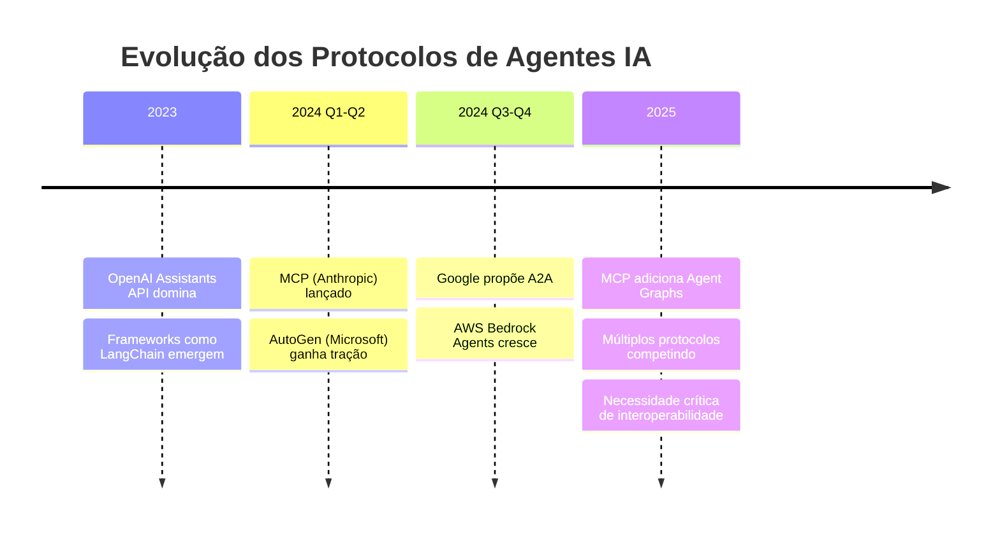
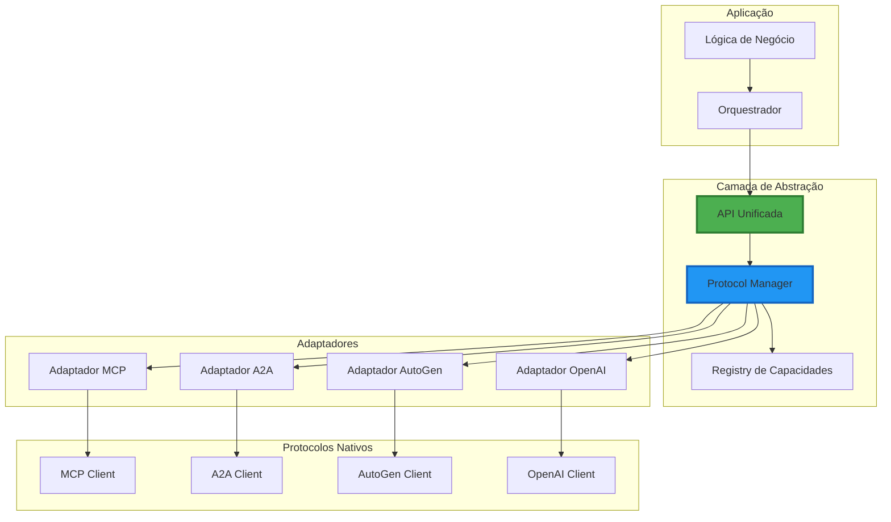
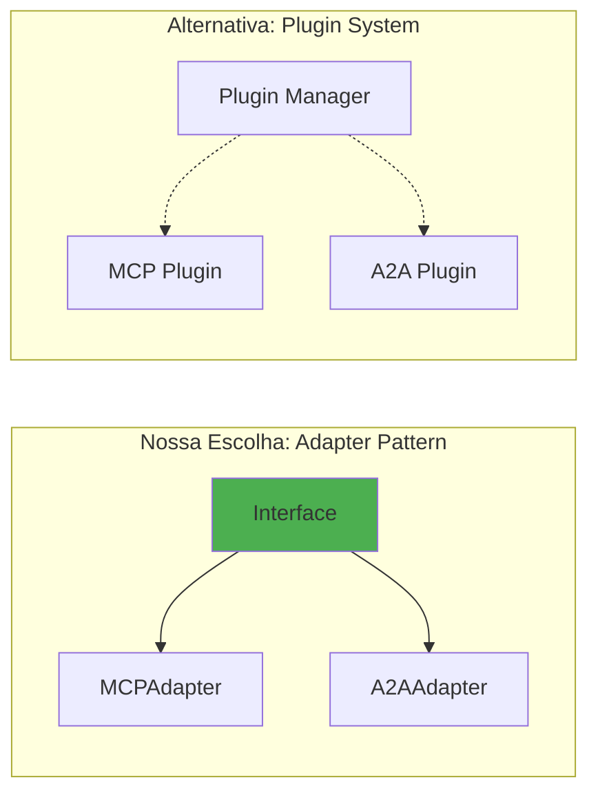
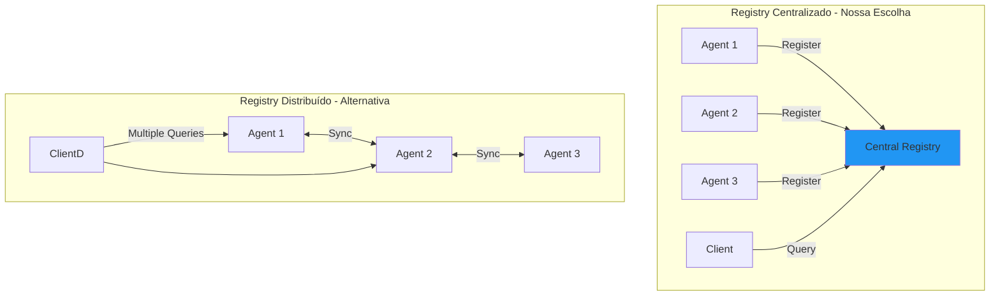
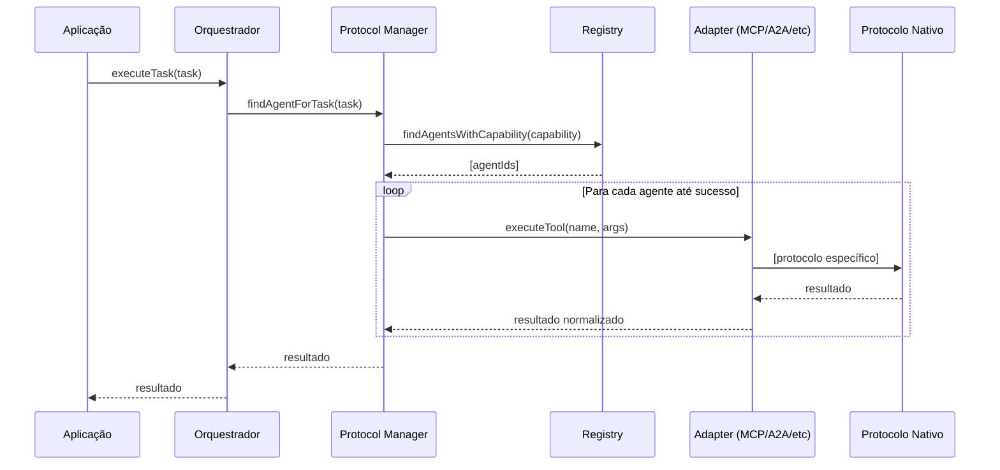
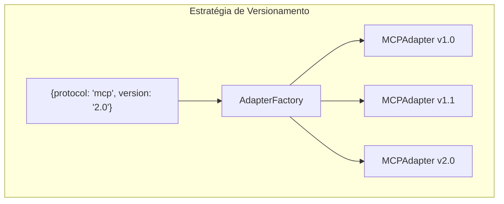
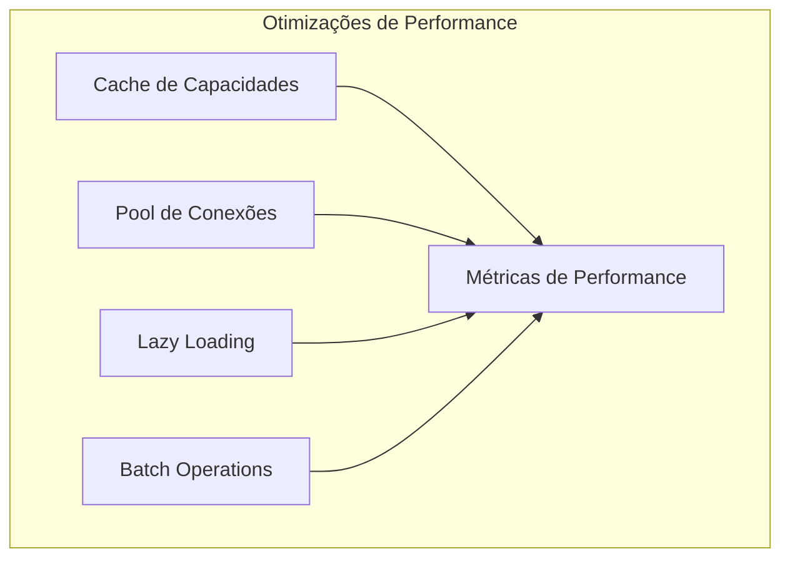

# Design Doc: Arquitetura Multi-Protocolo para Agentes IA

## Sumário Executivo

Este documento descreve a arquitetura de um sistema capaz de integrar múltiplos protocolos de agentes IA (MCP, A2A, AutoGen, etc.) através de uma camada de abstração unificada. A solução permite flexibilidade para evolução futura, mantendo simplicidade de implementação e uso.

## 1. Contexto e Problema

### 1.1 Cenário Atual

O ecossistema de agentes IA está fragmentado com múltiplos protocolos competindo:



### 1.2 Desafio Principal

Como construir aplicações que possam:

- Trabalhar com múltiplos protocolos simultaneamente
- Migrar entre protocolos sem reescrever código
- Adaptar-se a novos protocolos que surgirem
- Manter performance e simplicidade

### 1.3 Requisitos Técnicos

1. **Flexibilidade**: Suportar protocolos atuais e futuros
2. **Performance**: Overhead mínimo da abstração
3. **Simplicidade**: API intuitiva para desenvolvedores
4. **Resiliência**: Fallback entre protocolos quando necessário
5. **Evolução**: Capacidade de adicionar features incrementalmente

## 2. Arquitetura Proposta

### 2.1 Visão Geral



### 2.2 Componentes Principais

#### 2.2.1 Interface Unificada

A interface define um contrato comum para todos os protocolos:

```typescript
interface IAgentService {
  // Ciclo de vida
  initialize(config: AgentConfig): Promise<void>;
  connect(): Promise<void>;
  disconnect(): Promise<void>;
  
  // Descoberta de capacidades
  getCapabilities(): Promise<AgentCapabilities>;
  
  // Operações básicas
  listTools(): Promise<Tool[]>;
  executeTool(name: string, args: any): Promise<ExecutionResult>;
  
  // Operações avançadas (opcionais)
  listResources?(): Promise<Resource[]>;
  readResource?(uri: string): Promise<any>;
  sendMessage?(to: AgentId, message: Message): Promise<void>;
  generateResponse?(prompt: string, context?: any): Promise<string>;
}

interface AgentCapabilities {
  tools: boolean;
  resources: boolean;
  prompts: boolean;
  sampling: boolean;
  messaging: boolean;
  streaming: boolean;
  multiModal: boolean;
}
```

#### 2.2.2 Padrão Adapter

Escolhemos o padrão Adapter ao invés de um sistema de plugins por várias razões:



**Razões da escolha:**

- ✅ Type safety em tempo de compilação
- ✅ Debugging mais simples e stack traces claros
- ✅ Melhor performance (sem overhead de carregamento dinâmico)
- ✅ Maior segurança (menor superfície de ataque)
- ✅ Melhor suporte de IDEs

**Trade-offs aceitos:**

- ❌ Requer recompilação para novos protocolos
- ❌ Menos flexível para extensões de terceiros

Implementação exemplo:

```typescript
abstract class BaseProtocolAdapter implements IAgentService {
  protected config: AgentConfig;
  protected capabilities: AgentCapabilities;
  
  async initialize(config: AgentConfig): Promise<void> {
    this.config = config;
    this.capabilities = await this.detectCapabilities();
  }
  
  abstract detectCapabilities(): Promise<AgentCapabilities>;
  abstract connect(): Promise<void>;
  abstract disconnect(): Promise<void>;
  abstract listTools(): Promise<Tool[]>;
  abstract executeTool(name: string, args: any): Promise<ExecutionResult>;
}

class MCPAdapter extends BaseProtocolAdapter {
  private client: MCPClient;
  
  async detectCapabilities(): Promise<AgentCapabilities> {
    // Detecta capacidades específicas do MCP
    const serverInfo = await this.client.getServerInfo();
    return {
      tools: !!serverInfo.capabilities.tools,
      resources: !!serverInfo.capabilities.resources,
      prompts: !!serverInfo.capabilities.prompts,
      sampling: false, // MCP não suporta ainda
      messaging: false,
      streaming: !!serverInfo.capabilities.streaming,
      multiModal: false
    };
  }
  
  async connect(): Promise<void> {
    this.client = new MCPClient(this.config);
    await this.client.initialize();
  }
  
  async listTools(): Promise<Tool[]> {
    const mcpTools = await this.client.listTools();
    return mcpTools.map(this.transformTool);
  }
  
  private transformTool(mcpTool: MCPTool): Tool {
    return {
      id: mcpTool.name,
      name: mcpTool.name,
      description: mcpTool.description,
      parameters: mcpTool.inputSchema,
      type: 'function'
    };
  }
}
```

#### 2.2.3 Gerenciador de Protocolos

```typescript
class ProtocolManager {
  private adapters: Map<string, IAgentService> = new Map();
  private registry: CapabilityRegistry;
  
  constructor() {
    this.registry = new CapabilityRegistry();
  }
  
  async registerAgent(
    agentId: string,
    type: ProtocolType,
    config: ProtocolConfig
  ): Promise<void> {
    const adapter = AdapterFactory.create(type, config);
    await adapter.initialize(config);
    
    this.adapters.set(agentId, adapter);
    
    const capabilities = await adapter.getCapabilities();
    this.registry.register(agentId, capabilities);
  }
  
  async execute(
    agentId: string,
    operation: string,
    params: any[]
  ): Promise<any> {
    const adapter = this.adapters.get(agentId);
    if (!adapter) {
      throw new Error(`Agent ${agentId} not found`);
    }
    
    // Verifica se operação é suportada
    if (!this.isOperationSupported(agentId, operation)) {
      throw new Error(`Operation ${operation} not supported by ${agentId}`);
    }
    
    return await adapter[operation](...params);
  }
  
  private isOperationSupported(agentId: string, operation: string): boolean {
    const capabilities = this.registry.getCapabilities(agentId);
    // Lógica para verificar se operação é suportada baseado nas capacidades
    return true; // simplificado
  }
}
```

#### 2.2.4 Registry de Capacidades

Optamos por um registry centralizado ao invés de distribuído pelas seguintes razões:



**Razões da escolha:**

- ✅ Implementação mais simples
- ✅ Queries mais rápidas (ponto único)
- ✅ Consistência garantida
- ✅ Debugging facilitado

**Trade-offs aceitos:**

- ❌ Ponto único de falha (mitigado com cache e backup)
- ❌ Possível gargalo de performance (mitigado com otimizações)

Implementação com mitigações:

```typescript
class CapabilityRegistry {
  private capabilities: Map<string, AgentCapabilities> = new Map();
  private cache: LRUCache<string, string[]>;
  
  constructor() {
    this.cache = new LRUCache({ max: 1000 });
  }
  
  register(agentId: string, capabilities: AgentCapabilities): void {
    this.capabilities.set(agentId, capabilities);
    this.invalidateCache();
  }
  
  findAgentsWithCapability(capability: string): string[] {
    // Verifica cache primeiro
    const cached = this.cache.get(capability);
    if (cached) return cached;
    
    // Busca agentes com a capacidade
    const agents = Array.from(this.capabilities.entries())
      .filter(([_, caps]) => caps[capability])
      .map(([agentId, _]) => agentId);
    
    // Atualiza cache
    this.cache.set(capability, agents);
    return agents;
  }
  
  getCapabilities(agentId: string): AgentCapabilities | undefined {
    return this.capabilities.get(agentId);
  }
}

// Registry resiliente com fallback
class ResilientRegistry extends CapabilityRegistry {
  private backup: BackupRegistry;
  private healthChecker: HealthChecker;
  
  constructor() {
    super();
    this.backup = new BackupRegistry();
    this.healthChecker = new HealthChecker(this);
  }
  
  async register(agentId: string, capabilities: AgentCapabilities): Promise<void> {
    try {
      super.register(agentId, capabilities);
      await this.backup.sync(agentId, capabilities);
    } catch (error) {
      // Em caso de falha, tenta backup
      await this.backup.register(agentId, capabilities);
      throw error;
    }
  }
}
```

### 2.3 Fluxo de Operação



### 2.4 Versionamento de Protocolos

Adotamos versionamento semântico com adaptadores versionados:



```typescript
interface VersionedConfig {
  protocol: string;
  version: string;
  fallbackVersion?: string;
}

class VersionedAdapterFactory {
  private static adapters: Map<string, new() => IAgentService> = new Map([
    ['mcp-1.0', MCPAdapterV1_0],
    ['mcp-1.1', MCPAdapterV1_1],
    ['mcp-2.0', MCPAdapterV2_0],
    ['a2a-1.0', A2AAdapterV1_0],
  ]);
  
  static create(config: VersionedConfig): IAgentService {
    const key = `${config.protocol}-${config.version}`;
    const AdapterClass = this.adapters.get(key);
    
    if (AdapterClass) {
      return new AdapterClass();
    }
    
    // Tenta fallback
    if (config.fallbackVersion) {
      const fallbackKey = `${config.protocol}-${config.fallbackVersion}`;
      const FallbackClass = this.adapters.get(fallbackKey);
      if (FallbackClass) {
        console.warn(`Using fallback version ${config.fallbackVersion}`);
        return new FallbackClass();
      }
    }
    
    throw new Error(`No adapter found for ${config.protocol} v${config.version}`);
  }
  
  static isVersionSupported(protocol: string, version: string): boolean {
    return this.adapters.has(`${protocol}-${version}`);
  }
}
```

## 3. Casos de Uso

### 3.1 Orquestração Multi-Protocolo

```typescript
class MultiAgentOrchestrator {
  private protocolManager: ProtocolManager;
  
  async executeWorkflow(workflow: Workflow) {
    for (const step of workflow.steps) {
      const result = await this.executeStep(step);
      if (!result.success) {
        await this.handleFailure(step, result);
      }
    }
  }
  
  private async executeStep(step: WorkflowStep) {
    // Encontra agentes capazes de executar a tarefa
    const capableAgents = this.protocolManager
      .findAgentsWithCapability(step.requiredCapability);
    
    // Tenta executar com fallback
    for (const agentId of capableAgents) {
      try {
        return await this.protocolManager.execute(
          agentId,
          step.operation,
          step.params
        );
      } catch (error) {
        console.warn(`Agent ${agentId} failed:`, error);
        continue; // Tenta próximo agente
      }
    }
    
    throw new Error(`No agent could execute step: ${step.name}`);
  }
}
```

### 3.2 Migração Entre Protocolos

```typescript
class ProtocolMigrationService {
  async migrate(from: MigrationSource, to: MigrationTarget) {
    // 1. Backup estado atual
    const state = await this.exportState(from);
    
    // 2. Valida compatibilidade
    await this.validateCompatibility(state, to);
    
    // 3. Executa migração
    await this.importState(state, to);
    
    // 4. Verifica integridade
    await this.verifyMigration(from, to);
  }
  
  private async exportState(source: MigrationSource) {
    const adapter = this.getAdapter(source);
    return {
      tools: await adapter.listTools(),
      capabilities: await adapter.getCapabilities(),
      configuration: source.config,
      metadata: {
        exportedAt: new Date(),
        version: source.version
      }
    };
  }
}
```

## 4. Considerações de Implementação

### 4.1 Performance



```typescript
class PerformanceOptimizedManager extends ProtocolManager {
  private connectionPool: ConnectionPool;
  private operationCache: OperationCache;
  
  constructor() {
    super();
    this.connectionPool = new ConnectionPool({ maxSize: 10 });
    this.operationCache = new OperationCache({ ttl: 60000 });
  }
  
  async execute(agentId: string, operation: string, params: any[]) {
    // Verifica cache
    const cacheKey = this.getCacheKey(agentId, operation, params);
    const cached = this.operationCache.get(cacheKey);
    if (cached) return cached;
    
    // Executa com connection pooling
    const connection = await this.connectionPool.acquire(agentId);
    try {
      const result = await super.execute(agentId, operation, params);
      this.operationCache.set(cacheKey, result);
      return result;
    } finally {
      this.connectionPool.release(connection);
    }
  }
}
```

### 4.2 Segurança

```typescript
class SecureProtocolManager extends ProtocolManager {
  private validator: InputValidator;
  private rateLimiter: RateLimiter;
  private auditor: SecurityAuditor;
  
  async execute(agentId: string, operation: string, params: any[]) {
    // Validação de entrada
    this.validator.validate(operation, params);
    
    // Rate limiting
    await this.rateLimiter.checkLimit(agentId, operation);
    
    // Executa operação
    const result = await super.execute(agentId, operation, params);
    
    // Auditoria
    await this.auditor.log({
      agentId,
      operation,
      timestamp: new Date(),
      result: result.success
    });
    
    return result;
  }
}
```

### 4.3 Monitoramento

```typescript
interface SystemMetrics {
  operationsPerSecond: number;
  averageLatency: number;
  errorRate: number;
  activeConnections: number;
  protocolDistribution: Record<string, number>;
}

class MonitoringService {
  private metrics: MetricsCollector;
  private alerts: AlertManager;
  
  async collectMetrics(): Promise<SystemMetrics> {
    return {
      operationsPerSecond: await this.metrics.getOpsPerSecond(),
      averageLatency: await this.metrics.getAvgLatency(),
      errorRate: await this.metrics.getErrorRate(),
      activeConnections: await this.metrics.getActiveConnections(),
      protocolDistribution: await this.metrics.getProtocolUsage()
    };
  }
  
  async checkHealth(): Promise<HealthStatus> {
    const metrics = await this.collectMetrics();
    
    if (metrics.errorRate > 0.05) {
      await this.alerts.trigger('HIGH_ERROR_RATE', metrics);
    }
    
    if (metrics.averageLatency > 1000) {
      await this.alerts.trigger('HIGH_LATENCY', metrics);
    }
    
    return {
      status: this.calculateHealthStatus(metrics),
      metrics
    };
  }
}
```

## 5. Plano de Implementação

### 5.1 Fase 1: MVP (4 semanas)

- Interface básica IAgentService
- Adaptadores para MCP e OpenAI
- Protocol Manager simples
- Testes unitários básicos

### 5.2 Fase 2: Expansão (6 semanas)

- Registry de capacidades
- Suporte a A2A e AutoGen
- Sistema de versionamento
- Métricas básicas

### 5.3 Fase 3: Produção (8 semanas)

- Otimizações de performance
- Segurança e rate limiting
- Monitoramento completo
- Documentação e exemplos

### 5.4 Fase 4: Evolução (Contínuo)

- Novos adaptadores conforme necessário
- Melhorias baseadas em feedback
- Otimizações avançadas
- Ferramentas de desenvolvimento

## 6. Riscos e Mitigações

|Risco|Impacto|Probabilidade|Mitigação|
|---|---|---|---|
|Mudanças breaking em protocolos|Alto|Alta|Versionamento rigoroso, testes de regressão|
|Overhead de performance|Médio|Média|Benchmarks contínuos, profiling|
|Complexidade crescente|Alto|Alta|Documentação detalhada, exemplos|
|Adoção lenta|Médio|Média|Developer experience excelente|

## 7. Métricas de Sucesso

1. **Performance**
    
    - Latência de abstração < 5ms
    - Throughput > 1000 ops/segundo
    - Memory overhead < 50MB
2. **Confiabilidade**
    
    - Disponibilidade > 99.9%
    - Taxa de erro < 0.1%
    - Tempo de recuperação < 30s
3. **Adoção**
    
    - Tempo de integração < 1 dia
    - Satisfação do desenvolvedor > 4.5/5
    - Número de protocolos suportados > 5

## 8. Conclusão

Esta arquitetura fornece uma base sólida para integração multi-protocolo com:

- **Flexibilidade** para adaptar-se ao ecossistema em evolução
- **Simplicidade** para desenvolvedores implementarem
- **Performance** adequada para produção
- **Resiliência** para lidar com falhas

O design permite evolução incremental, começando simples e adicionando complexidade conforme necessário.

## 9. Apêndices

### A. Exemplos de Código

```typescript
// Exemplo completo de uso
async function main() {
  const orchestrator = new MultiAgentOrchestrator();
  
  // Registra agentes com diferentes protocolos
  await orchestrator.registerAgent('researcher', {
    protocol: 'mcp',
    version: '2.0',
    config: {
      command: 'node',
      args: ['./mcp-server.js']
    }
  });
  
  await orchestrator.registerAgent('analyzer', {
    protocol: 'a2a',
    version: '1.0',
    config: {
      endpoint: 'https://analyzer.example.com'
    }
  });
  
  // Executa workflow multi-protocolo
  const result = await orchestrator.executeWorkflow({
    name: 'Research and Analysis',
    steps: [
      {
        name: 'Research',
        agentId: 'researcher',
        operation: 'search',
        params: { query: 'AI protocols comparison' }
      },
      {
        name: 'Analyze',
        agentId: 'analyzer',
        operation: 'analyze',
        params: { data: '${steps.research.result}' }
      }
    ]
  });
  
  console.log('Workflow completed:', result);
}
```

### B. Glossário

- **Adapter**: Componente que traduz entre protocolo específico e interface unificada
- **Capability**: Funcionalidade que um agente/protocolo suporta
- **Protocol Manager**: Componente central que gerencia todos os adaptadores
- **Registry**: Sistema de descoberta de capacidades dos agentes

### C. Referências

- MCP Specification (Anthropic)
- Google A2A Protocol Proposal
- Microsoft AutoGen Documentation
- OpenAI Assistants API Reference