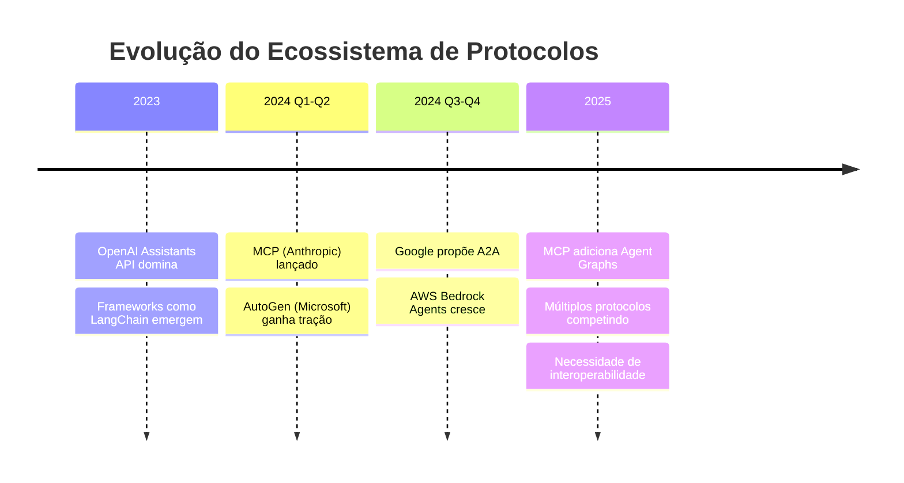
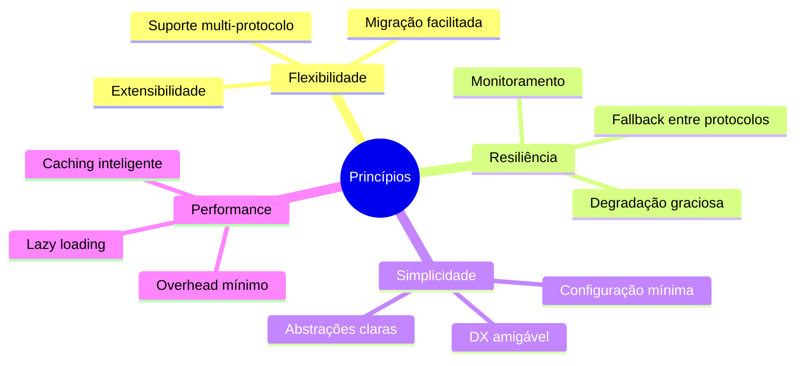
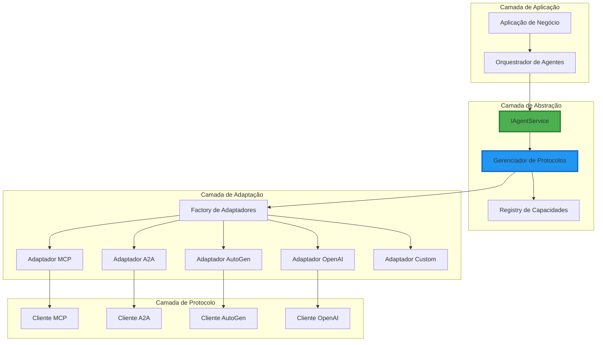

# 📋 Documento de Design: Arquitetura Multi-Protocolo para Agentes IA

## 1. Contexto e Justificativa

### 1.1 Panorama Atual dos Protocolos

Estamos vivendo um momento de **proliferação de protocolos** para agentes IA, com múltiplos players competindo para estabelecer padrões:



### 1.2 Protocolos Principais e Seus Roadmaps

|Protocolo|Empresa|Status|Direção Futura|
|---|---|---|---|
|**MCP**|Anthropic|Produção|Agent Graphs, Multi-agent, Registry|
|**A2A**|Google|Proposto|Comunicação peer-to-peer nativa|
|**AutoGen**|Microsoft|Framework|Protocolo implícito emergindo|
|**Assistants API**|OpenAI|Produção|Padrão de facto do mercado|
|**Bedrock Agents**|AWS|Produção|Integração enterprise|

### 1.3 Tendências Identificadas

1. **Convergência para Multi-Agente**: Todos os protocolos estão evoluindo para suportar sistemas multi-agente
2. **Necessidade de Interoperabilidade**: Mercado demanda integração entre diferentes protocolos
3. **Especialização por Camadas**: Protocolos focando em diferentes aspectos (tools vs comunicação vs orquestração)

## 2. Decisões Arquiteturais

### 2.1 Princípios de Design



### 2.2 Arquitetura Proposta



## 3. Componentes Principais

### 3.1 Interface de Agente Unificada

```typescript
// Definição agnóstica de protocolo
interface IAgentService {
  // Ciclo de vida
  initialize(config: AgentConfig): Promise<void>;
  connect(): Promise<void>;
  disconnect(): Promise<void>;
  
  // Capacidades básicas
  getCapabilities(): Promise<AgentCapabilities>;
  
  // Ferramentas
  listTools(): Promise<Tool[]>;
  executeTool(name: string, args: any): Promise<ExecutionResult>;
  
  // Recursos (quando suportado)
  listResources?(): Promise<Resource[]>;
  readResource?(uri: string): Promise<any>;
  
  // Comunicação (quando suportado)
  sendMessage?(to: AgentId, message: Message): Promise<void>;
  onMessage?(handler: MessageHandler): void;
  
  // Sampling/Geração (quando suportado)
  generateResponse?(prompt: string, context?: any): Promise<string>;
}
```

### 3.2 Gerenciador de Protocolos

```typescript
class ProtocolManager {
  private adapters: Map<string, IAgentService> = new Map();
  private registry: CapabilityRegistry;
  
  async registerProtocol(
    type: ProtocolType, 
    config: ProtocolConfig
  ): Promise<void> {
    const adapter = await AdapterFactory.create(type, config);
    await adapter.initialize(config);
    this.adapters.set(config.agentId, adapter);
    
    // Registra capacidades
    const capabilities = await adapter.getCapabilities();
    this.registry.register(config.agentId, capabilities);
  }
  
  async routeRequest(
    agentId: string, 
    operation: string, 
    params: any
  ): Promise<any> {
    const adapter = this.adapters.get(agentId);
    if (!adapter) throw new Error(`Agent ${agentId} not found`);
    
    // Verifica se operação é suportada
    const capabilities = this.registry.get(agentId);
    if (!this.isOperationSupported(operation, capabilities)) {
      throw new Error(`Operation ${operation} not supported`);
    }
    
    // Executa operação
    return await adapter[operation](...params);
  }
}
```

### 3.3 Sistema de Adaptadores

```typescript
abstract class BaseProtocolAdapter implements IAgentService {
  protected config: AgentConfig;
  protected capabilities: AgentCapabilities;
  
  // Implementação base comum
  async initialize(config: AgentConfig): Promise<void> {
    this.config = config;
    this.capabilities = await this.detectCapabilities();
  }
  
  abstract detectCapabilities(): Promise<AgentCapabilities>;
  
  // Métodos que subclasses devem implementar
  abstract connect(): Promise<void>;
  abstract disconnect(): Promise<void>;
  abstract listTools(): Promise<Tool[]>;
  abstract executeTool(name: string, args: any): Promise<ExecutionResult>;
}

// Exemplo: Adaptador MCP
class MCPAdapter extends BaseProtocolAdapter {
  private mcpClient: MCPClient;
  
  async detectCapabilities(): Promise<AgentCapabilities> {
    // Detecta capacidades do servidor MCP
    return {
      tools: true,
      resources: true,
      prompts: true,
      sampling: false,
      messaging: false
    };
  }
  
  async connect(): Promise<void> {
    this.mcpClient = new MCPClient(this.config);
    await this.mcpClient.initialize();
  }
  
  async listTools(): Promise<Tool[]> {
    const mcpTools = await this.mcpClient.listTools();
    return this.transformMCPTools(mcpTools);
  }
  
  private transformMCPTools(mcpTools: any[]): Tool[] {
    // Transforma formato MCP para formato unificado
    return mcpTools.map(tool => ({
      id: tool.name,
      name: tool.name,
      description: tool.description,
      parameters: tool.inputSchema,
      type: 'function'
    }));
  }
}
```

### 3.4 Registry de Capacidades

```typescript
interface AgentCapabilities {
  tools?: boolean;
  resources?: boolean;
  prompts?: boolean;
  sampling?: boolean;
  messaging?: boolean;
  streaming?: boolean;
  multiModal?: boolean;
  [key: string]: boolean | undefined;
}

class CapabilityRegistry {
  private capabilities: Map<string, AgentCapabilities> = new Map();
  
  register(agentId: string, capabilities: AgentCapabilities): void {
    this.capabilities.set(agentId, capabilities);
  }
  
  get(agentId: string): AgentCapabilities | undefined {
    return this.capabilities.get(agentId);
  }
  
  findAgentsWithCapability(capability: string): string[] {
    return Array.from(this.capabilities.entries())
      .filter(([_, caps]) => caps[capability])
      .map(([agentId, _]) => agentId);
  }
}
```

## 4. Padrões de Uso

### 4.1 Orquestração Multi-Protocolo

```typescript
class MultiProtocolOrchestrator {
  private protocolManager: ProtocolManager;
  private capabilityRegistry: CapabilityRegistry;
  
  constructor() {
    this.protocolManager = new ProtocolManager();
    this.capabilityRegistry = new CapabilityRegistry();
  }
  
  async setupAgents() {
    // Registra agentes com diferentes protocolos
    await this.protocolManager.registerProtocol('mcp', {
      agentId: 'researcher',
      type: 'mcp',
      config: { /* config MCP */ }
    });
    
    await this.protocolManager.registerProtocol('a2a', {
      agentId: 'analyzer',
      type: 'a2a',
      config: { /* config A2A */ }
    });
    
    await this.protocolManager.registerProtocol('openai', {
      agentId: 'writer',
      type: 'openai',
      config: { /* config OpenAI */ }
    });
  }
  
  async executeWorkflow(task: WorkflowTask) {
    // Encontra agente com capacidade necessária
    cons
```