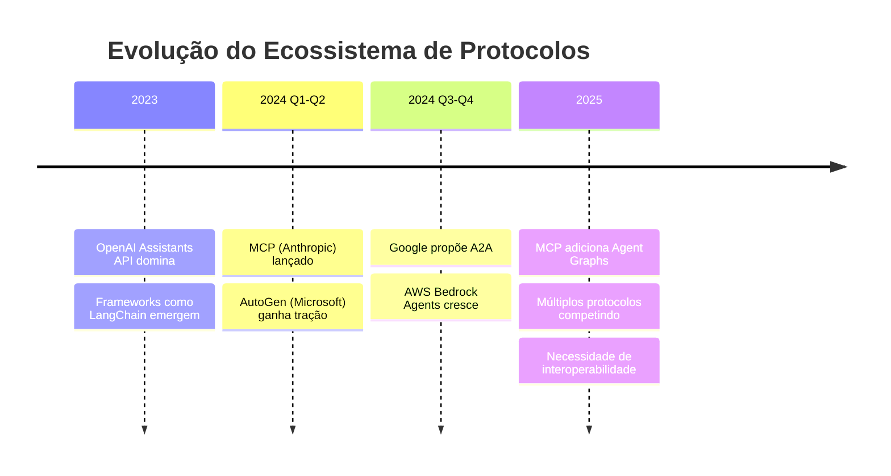
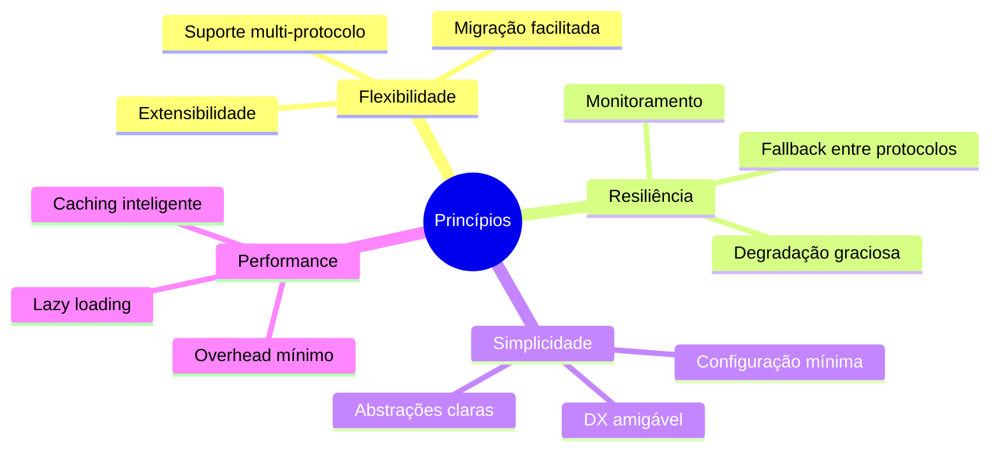
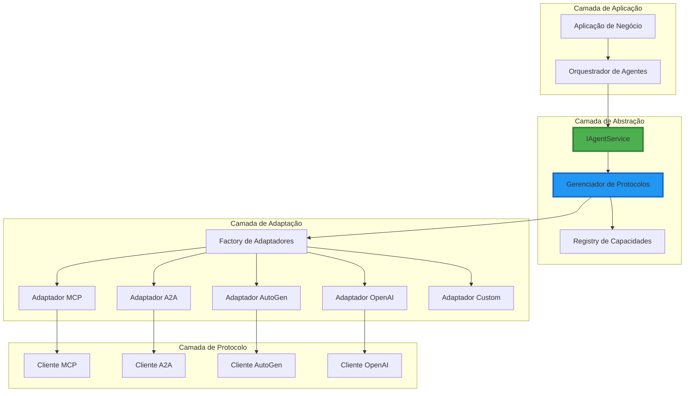

# 📋 Documento de Design: Arquitetura Multi-Protocolo para Agentes IA

## 1. Contexto e Justificativa

### 1.1 Panorama Atual dos Protocolos

Estamos vivendo um momento de **proliferação de protocolos** para agentes IA, com múltiplos players competindo para estabelecer padrões:



### 1.2 Protocolos Principais e Seus Roadmaps

|Protocolo|Empresa|Status|Direção Futura|
|---|---|---|---|
|**MCP**|Anthropic|Produção|Agent Graphs, Multi-agent, Registry|
|**A2A**|Google|Proposto|Comunicação peer-to-peer nativa|
|**AutoGen**|Microsoft|Framework|Protocolo implícito emergindo|
|**Assistants API**|OpenAI|Produção|Padrão de facto do mercado|
|**Bedrock Agents**|AWS|Produção|Integração enterprise|

### 1.3 Tendências Identificadas

1. **Convergência para Multi-Agente**: Todos os protocolos estão evoluindo para suportar sistemas multi-agente
2. **Necessidade de Interoperabilidade**: Mercado demanda integração entre diferentes protocolos
3. **Especialização por Camadas**: Protocolos focando em diferentes aspectos (tools vs comunicação vs orquestração)

## 2. Decisões Arquiteturais

### 2.1 Princípios de Design



### 2.2 Arquitetura Proposta



## 3. Componentes Principais

### 3.1 Interface de Agente Unificada

```typescript
// Definição agnóstica de protocolo
interface IAgentService {
  // Ciclo de vida
  initialize(config: AgentConfig): Promise<void>;
  connect(): Promise<void>;
  disconnect(): Promise<void>;
  
  // Capacidades básicas
  getCapabilities(): Promise<AgentCapabilities>;
  
  // Ferramentas
  listTools(): Promise<Tool[]>;
  executeTool(name: string, args: any): Promise<ExecutionResult>;
  
  // Recursos (quando suportado)
  listResources?(): Promise<Resource[]>;
  readResource?(uri: string): Promise<any>;
  
  // Comunicação (quando suportado)
  sendMessage?(to: AgentId, message: Message): Promise<void>;
  onMessage?(handler: MessageHandler): void;
  
  // Sampling/Geração (quando suportado)
  generateResponse?(prompt: string, context?: any): Promise<string>;
}
```

### 3.2 Gerenciador de Protocolos

```typescript
class ProtocolManager {
  private adapters: Map<string, IAgentService> = new Map();
  private registry: CapabilityRegistry;
  
  async registerProtocol(
    type: ProtocolType, 
    config: ProtocolConfig
  ): Promise<void> {
    const adapter = await AdapterFactory.create(type, config);
    await adapter.initialize(config);
    this.adapters.set(config.agentId, adapter);
    
    // Registra capacidades
    const capabilities = await adapter.getCapabilities();
    this.registry.r
```