# AI Mesh: Da Infraestrutura Tradicional ao Futuro dos Sistemas Inteligentes

## 1. Evolução das Arquiteturas de Comunicação

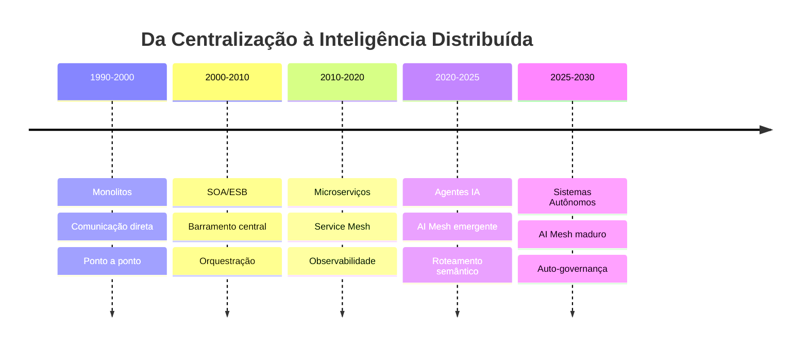

## 2. O que é um "Mesh"?

### Conceito Fundamental

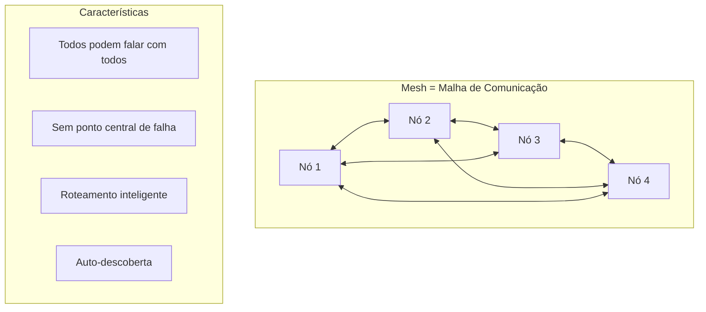

### Service Mesh: O Conceito Maduro

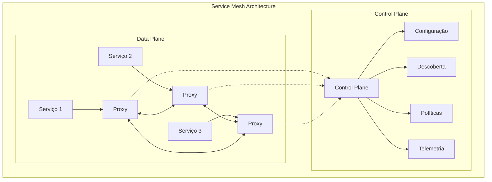

**Benefícios do Service Mesh:**

- 🔍 **Observabilidade**: Ver tudo que acontece
- 🔒 **Segurança**: Comunicação criptografada
- 🚦 **Controle de Tráfego**: Roteamento inteligente
- 💪 **Resiliência**: Circuit breakers, retries
- 📊 **Políticas**: Rate limiting, access control

## 3. AI Mesh: A Próxima Evolução

### Por que precisamos de AI Mesh?

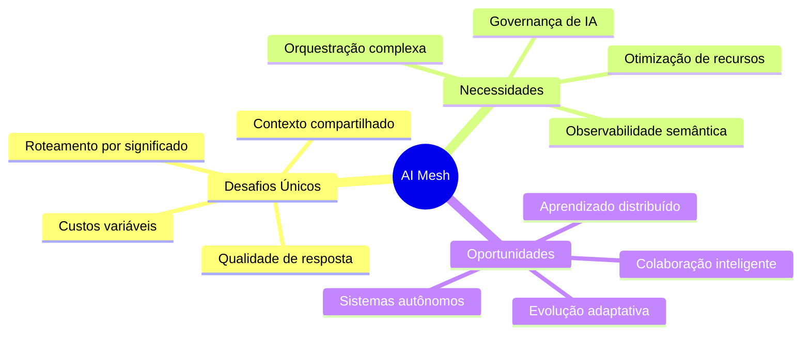

### Arquitetura Conceitual do AI Mesh

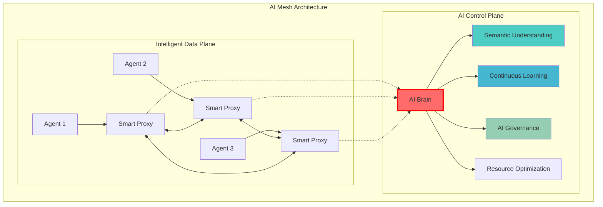

## 4. Componentes Chave do AI Mesh

### 4.1 Roteamento Semântico

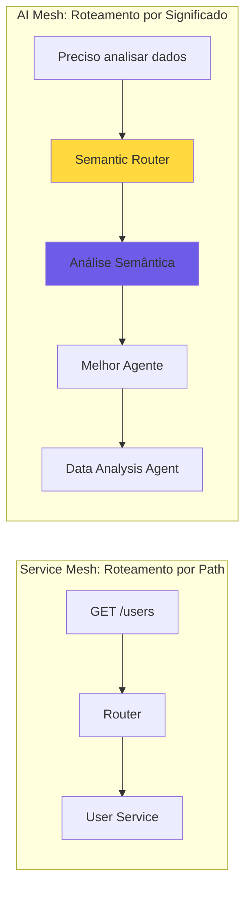

### 4.2 Governança de IA

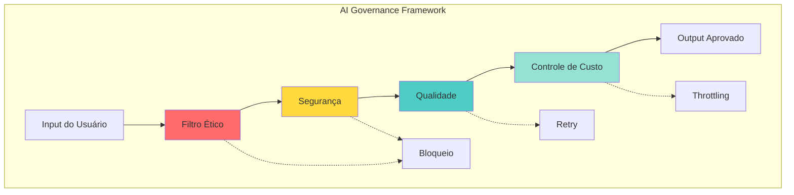

### 4.3 Observabilidade Inteligente

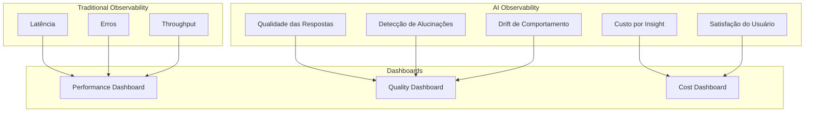

## 5. Casos de Uso e Padrões

### 5.1 Padrão: Sistema de Pesquisa Distribuído

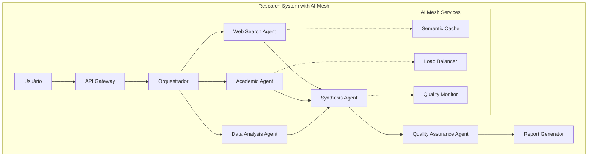

### 5.2 Padrão: Pipeline de Desenvolvimento Autônomo

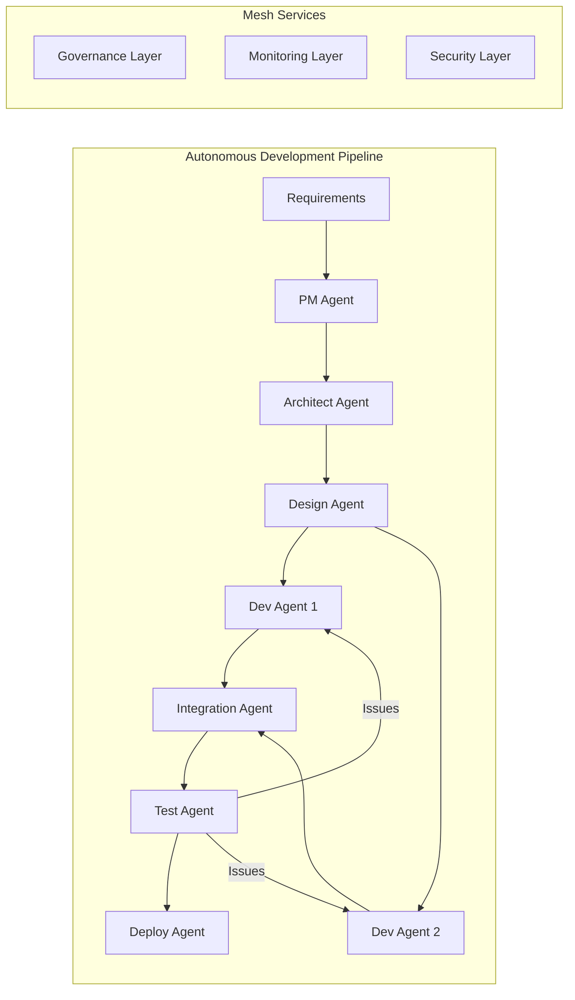

## 6. Tendências e Futuro

### 6.1 Evolução Prevista

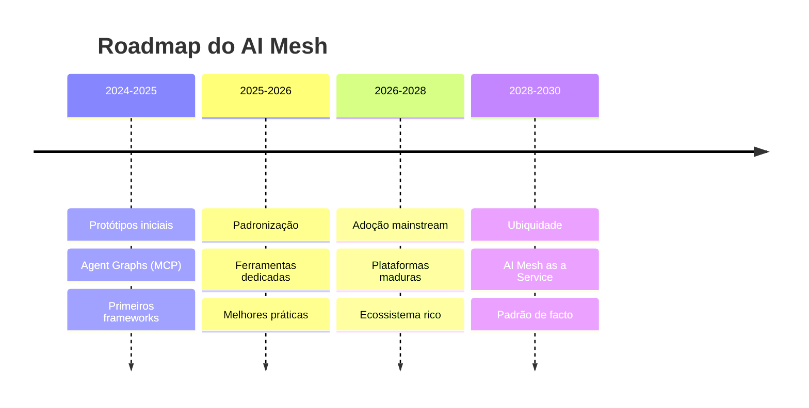

### 6.2 Convergência de Tecnologias

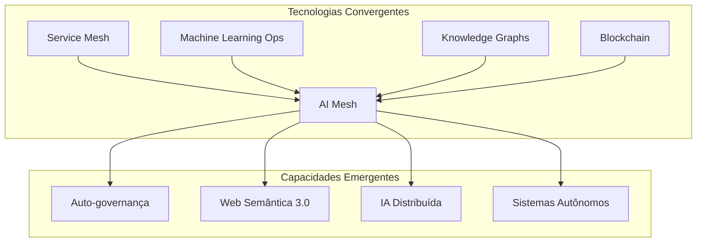

## 7. Governança no AI Mesh

### 7.1 Pilares da Governança

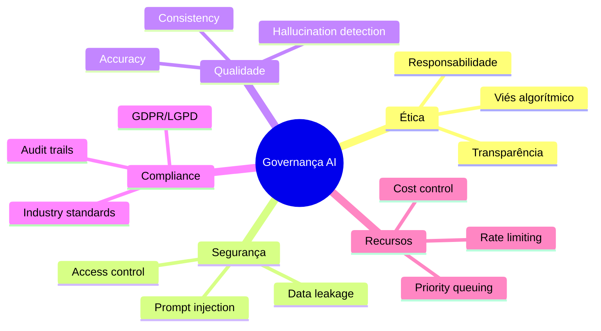

### 7.2 Framework de Governança

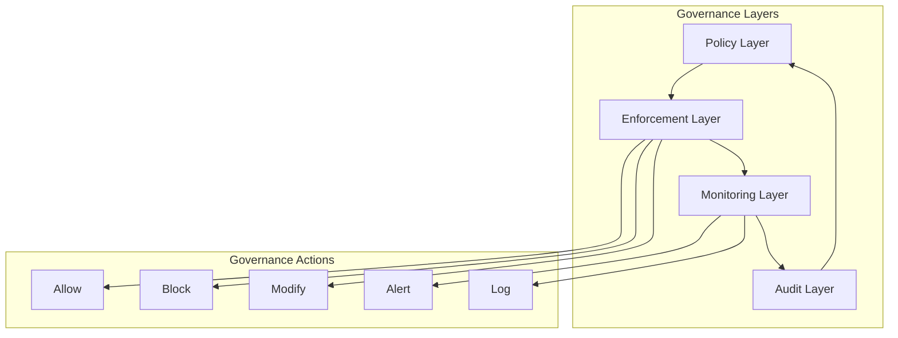

## 8. Desafios e Oportunidades

### 8.1 Principais Desafios

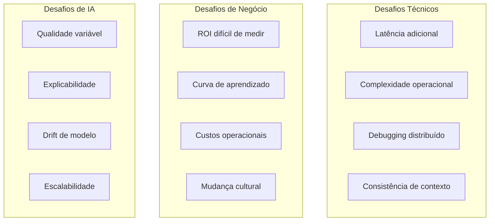

### 8.2 Oportunidades de Mercado

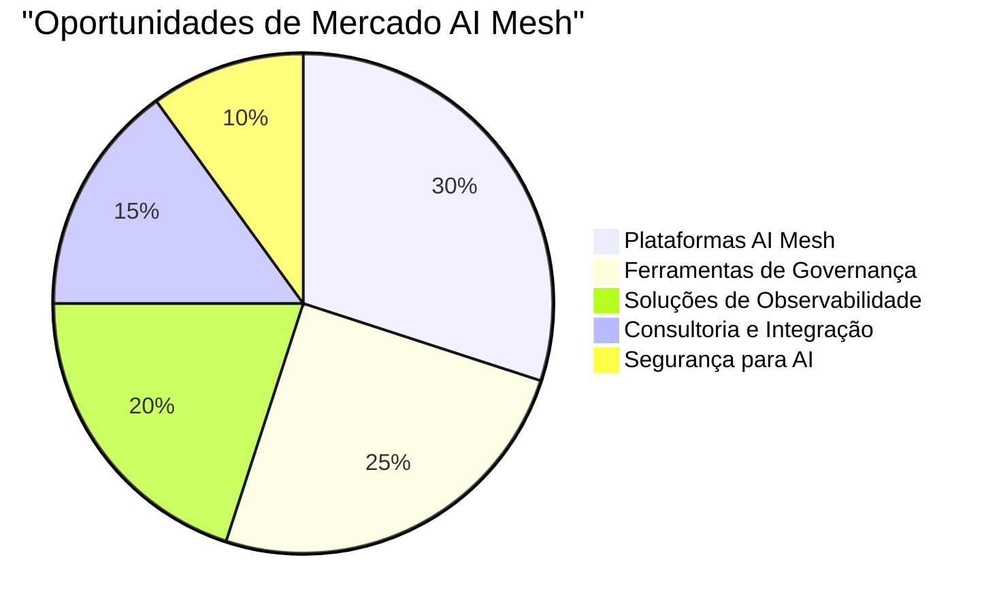

## 9. Conclusões

### AI Mesh representa:

1. **Evolução Natural**: Do service mesh tradicional para sistemas inteligentes
2. **Necessidade Real**: Gerenciar complexidade crescente de sistemas multi-agente
3. **Oportunidade Única**: Criar nova categoria de infraestrutura
4. **Desafio Técnico**: Resolver problemas únicos de sistemas de IA

### Recomendações:

- **Para Empresas**: Começar experimentação com protótipos
- **Para Desenvolvedores**: Aprender conceitos de mesh e IA
- **Para Arquitetos**: Planejar arquiteturas preparadas para AI Mesh
- **Para Investidores**: Observar startups neste espaço

O AI Mesh não é apenas uma tendência tecnológica, mas uma necessidade emergente para gerenciar a crescente complexidade dos sistemas baseados em IA.