# MCP: O Futuro da IA Empresarial 🚀

## A Próxima Revolução em Inteligência Artificial

---

# O Momento de Inflexão

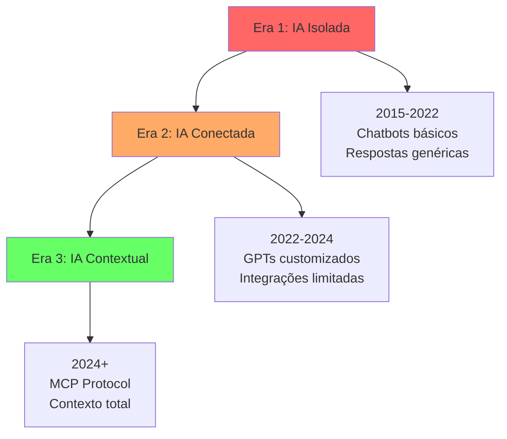
```mermaid
graph TD
    ERA1[Era 1: IA Isolada] --> ERA2[Era 2: IA Conectada]
    ERA2 --> ERA3[Era 3: IA Contextual]
    
    ERA1 --> L1[2015-2022<br/>Chatbots básicos<br/>Respostas genéricas]
    ERA2 --> L2[2022-2024<br/>GPTs customizados<br/>Integrações limitadas]
    ERA3 --> L3[2024+<br/>MCP Protocol<br/>Contexto total]
    
    style ERA1 fill:#ff6666
    style ERA2 fill:#ffaa66
    style ERA3 fill:#66ff66
```

> "Estamos no mesmo ponto que a internet estava em 1995. Quem entender isso agora, dominará a próxima década." — Marc Andreessen

---

# O Problema de $50 Bilhões

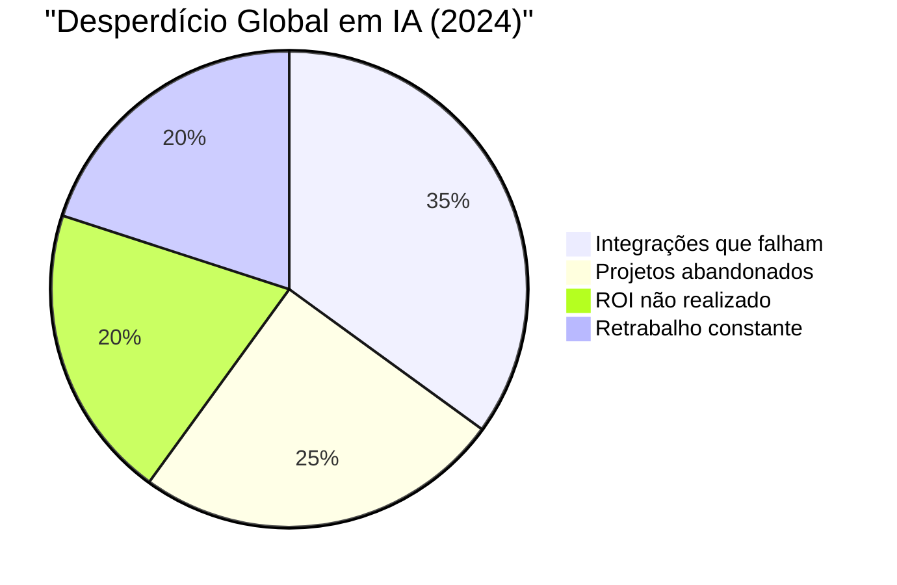
```mermaid
pie title "Desperdício Global em IA (2024)"
    "Integrações que falham" : 35
    "Projetos abandonados" : 25
    "ROI não realizado" : 20
    "Retrabalho constante" : 20
```

## A Realidade Atual

- **87% das empresas** investem em IA
- **Apenas 15%** conseguem ROI real
- **$50 bilhões** desperdiçados anualmente
- **Causa #1**: Falta de contexto empresarial

---

# Case: Santander - De 8 Meses para 3 Semanas

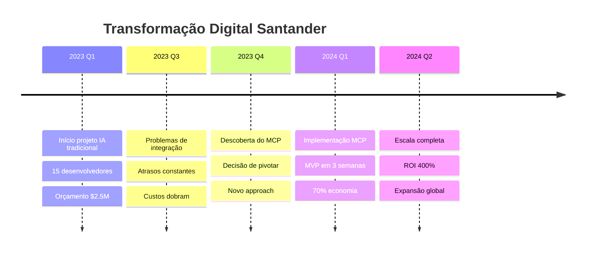
```mermaid
timeline
    title Transformação Digital Santander
    
    2023 Q1 : Início projeto IA tradicional
             : 15 desenvolvedores
             : Orçamento $2.5M
    
    2023 Q3 : Problemas de integração
             : Atrasos constantes
             : Custos dobram
    
    2023 Q4 : Descoberta do MCP
             : Decisão de pivotar
             : Novo approach
    
    2024 Q1 : Implementação MCP
             : MVP em 3 semanas
             : 70% economia
    
    2024 Q2 : Escala completa
             : ROI 400%
             : Expansão global
```

### Resultados Mensuráveis

- **Tempo de implementação**: -88%
- **Custo de desenvolvimento**: -70%
- **Satisfação do cliente**: +45 NPS
- **Eficiência operacional**: +190%

---

# A Arquitetura da Vantagem Competitiva

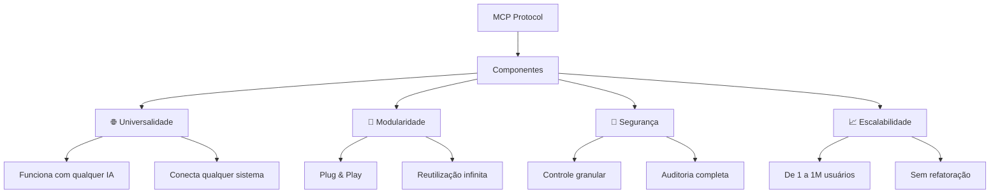
```mermaid
graph TD
    MCP[MCP Protocol] --> COMP[Componentes]
    
    COMP --> UNI[🌐 Universalidade]
    COMP --> MOD[🧩 Modularidade]
    COMP --> SEC[🔐 Segurança]
    COMP --> SCA[📈 Escalabilidade]
    
    UNI --> U1[Funciona com qualquer IA]
    UNI --> U2[Conecta qualquer sistema]
    
    MOD --> M1[Plug & Play]
    MOD --> M2[Reutilização infinita]
    
    SEC --> S1[Controle granular]
    SEC --> S2[Auditoria completa]
    
    SCA --> SC1[De 1 a 1M usuários]
    SCA --> SC2[Sem refatoração]
```

---

# Tendência Global: O Movimento MCP

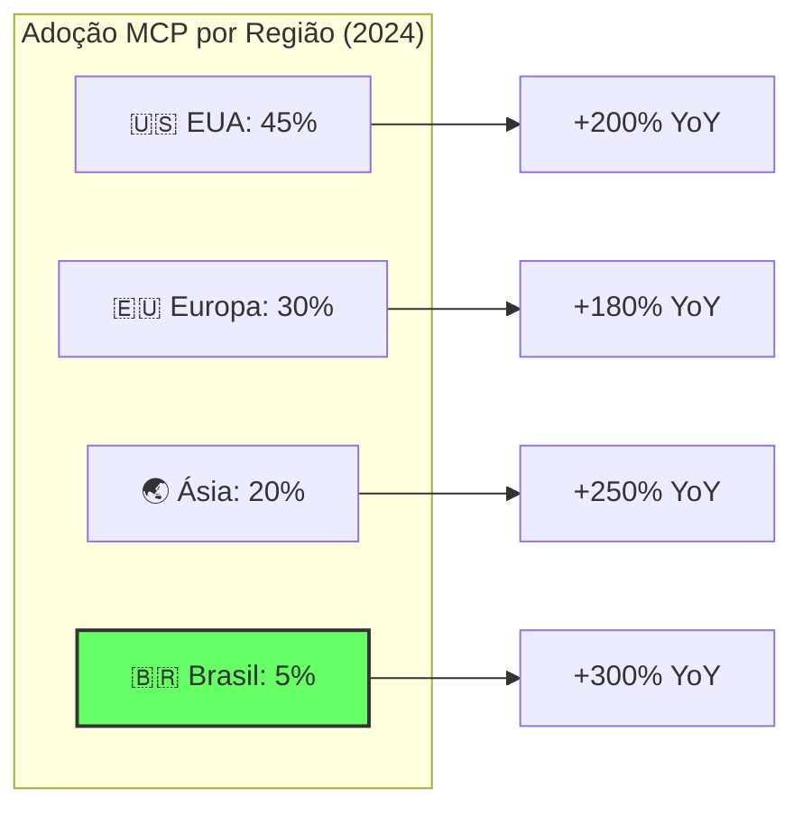
```mermaid
graph LR
    subgraph "Adoção MCP por Região (2024)"
        US[🇺🇸 EUA: 45%]
        EU[🇪🇺 Europa: 30%]
        AS[🌏 Ásia: 20%]
        BR[🇧🇷 Brasil: 5%]
    end
    
    US --> GROW1[+200% YoY]
    EU --> GROW2[+180% YoY]
    AS --> GROW3[+250% YoY]
    BR --> GROW4[+300% YoY]
    
    style BR fill:#66ff66,stroke:#333,stroke-width:2px
```

## Previsões dos Analistas

- **Gartner**: "80% das Fortune 500 usarão MCP até 2026"
- **McKinsey**: "MCP será padrão de facto para IA empresarial"
- **IDC**: "Mercado de $15B até 2027"

---

# Case: Nubank - Revolução no Atendimento

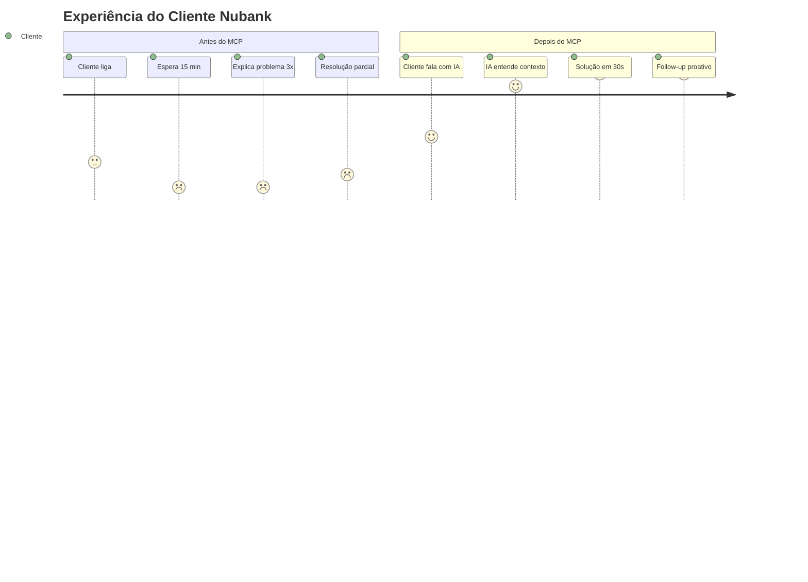
```mermaid
journey
    title Experiência do Cliente Nubank
    section Antes do MCP
      Cliente liga: 3: Cliente
      Espera 15 min: 1: Cliente
      Explica problema 3x: 1: Cliente
      Resolução parcial: 2: Cliente
    section Depois do MCP
      Cliente fala com IA: 5: Cliente
      IA entende contexto: 9: Cliente
      Solução em 30s: 10: Cliente
      Follow-up proativo: 10: Cliente
```

## Impacto nos Números

|Métrica|Antes|Depois|Δ|
|---|---|---|---|
|**Tempo médio atendimento**|18 min|2.3 min|-87%|
|**First Call Resolution**|45%|92%|+104%|
|**CSAT**|7.2|9.4|+30%|
|**Custo por interação**|R$15|R$1.80|-88%|
|**Volume de chamadas**|100%|35%|-65%|

---

# O Flywheel do Valor

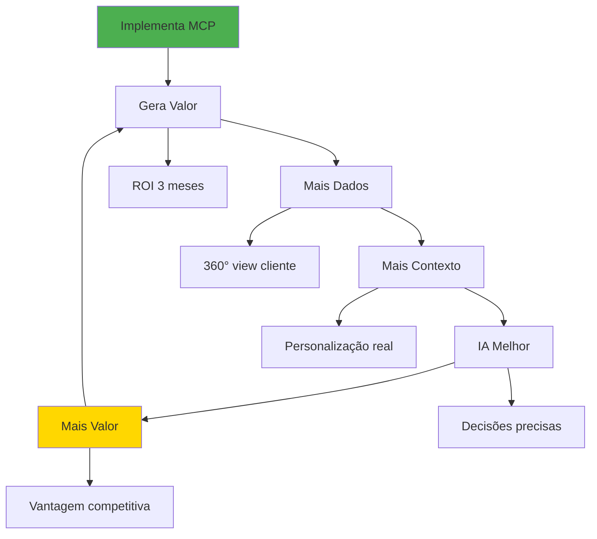
```mermaid
graph TD
    START[Implementa MCP] --> VALUE[Gera Valor]
    VALUE --> DATA[Mais Dados]
    DATA --> CONTEXT[Mais Contexto]
    CONTEXT --> BETTER[IA Melhor]
    BETTER --> MORE[Mais Valor]
    MORE --> VALUE
    
    VALUE --> M1[ROI 3 meses]
    DATA --> M2[360° view cliente]
    CONTEXT --> M3[Personalização real]
    BETTER --> M4[Decisões precisas]
    MORE --> M5[Vantagem competitiva]
    
    style START fill:#4CAF50
    style MORE fill:#FFD700
```

---

# Oportunidades por Vertical

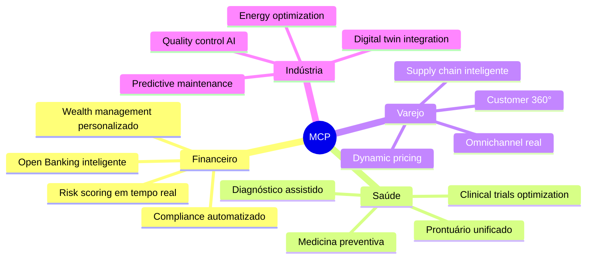
```mermaid
mindmap
  root((MCP))
    Financeiro
      Open Banking inteligente
      Compliance automatizado
      Risk scoring em tempo real
      Wealth management personalizado
    Saúde
      Diagnóstico assistido
      Prontuário unificado
      Medicina preventiva
      Clinical trials optimization
    Varejo
      Omnichannel real
      Dynamic pricing
      Supply chain inteligente
      Customer 360°
    Indústria
      Predictive maintenance
      Quality control AI
      Digital twin integration
      Energy optimization
```

---

# Case: Magazine Luiza - O Assistente que Vende

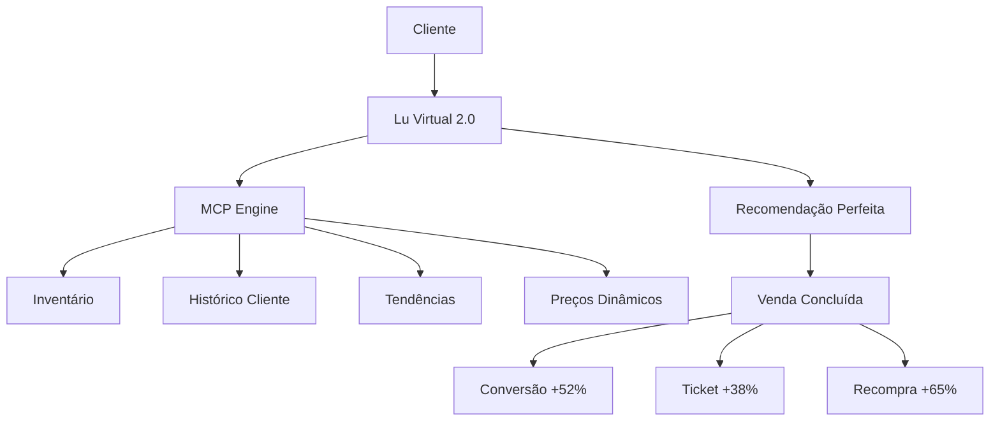
```mermaid
graph TD
    CUST[Cliente] --> LU[Lu Virtual 2.0]
    LU --> MCP[MCP Engine]
    
    MCP --> INV[Inventário]
    MCP --> HIST[Histórico Cliente]
    MCP --> TREND[Tendências]
    MCP --> PRICE[Preços Dinâmicos]
    
    LU --> REC["Recomendação Perfeita"]
    REC --> SALE[Venda Concluída]
    
    SALE --> KPI1[Conversão +52%]
    SALE --> KPI2[Ticket +38%]
    SALE --> KPI3[Recompra +65%]
```

### A Fórmula do Sucesso

1. **Contexto Total**: Lu conhece estoque, preços, histórico
2. **Timing Perfeito**: Ofertas no momento certo
3. **Personalização**: Cada cliente é único
4. **Escala Infinita**: Milhões de interações simultâneas

---

# O Mapa de Maturidade MCP

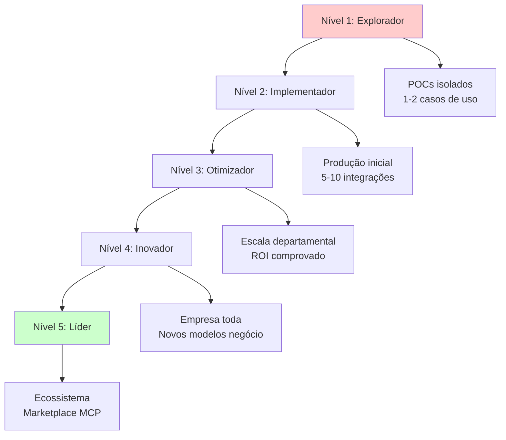
```mermaid
graph TD
    LVL1[Nível 1: Explorador] --> LVL2[Nível 2: Implementador]
    LVL2 --> LVL3[Nível 3: Otimizador]
    LVL3 --> LVL4[Nível 4: Inovador]
    LVL4 --> LVL5[Nível 5: Líder]
    
    LVL1 --> D1[POCs isolados<br/>1-2 casos de uso]
    LVL2 --> D2[Produção inicial<br/>5-10 integrações]
    LVL3 --> D3[Escala departamental<br/>ROI comprovado]
    LVL4 --> D4[Empresa toda<br/>Novos modelos negócio]
    LVL5 --> D5[Ecossistema<br/>Marketplace MCP]
    
    style LVL1 fill:#ffcccc
    style LVL5 fill:#ccffcc
```

## Onde Sua Empresa Está?

- **70%** ainda no Nível 1
- **25%** chegando ao Nível 2
- **5%** pioneiros no Nível 3+
- **Oportunidade**: Pular para Nível 3 direto

---

# Tendência: IA Composable

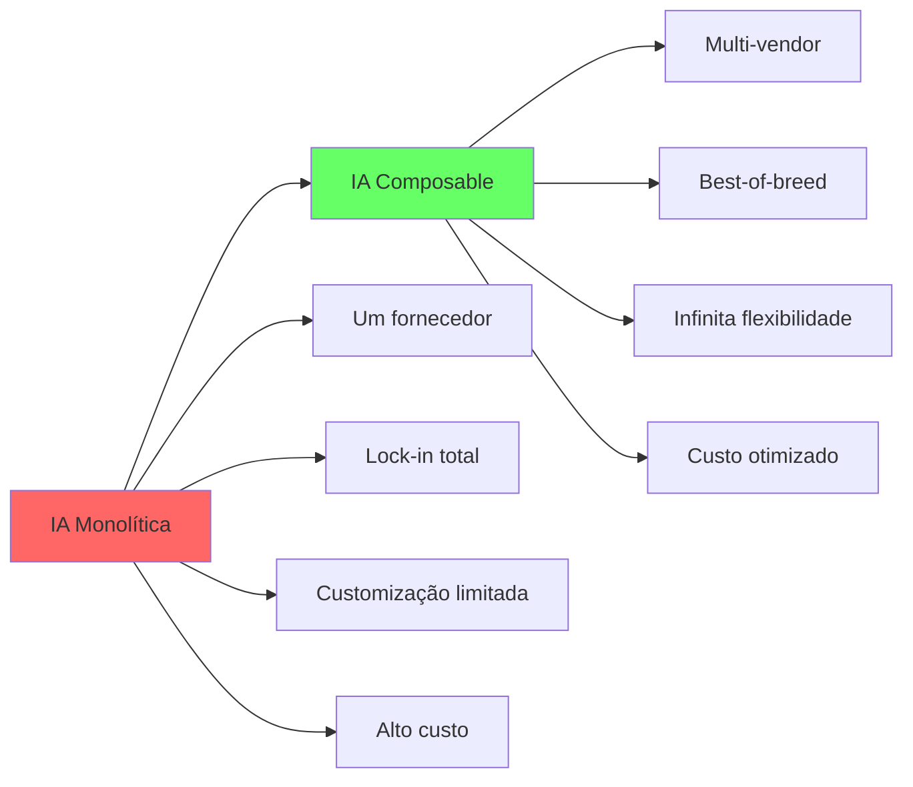
```mermaid
graph LR
    MONO[IA Monolítica] --> COMP[IA Composable]
    
    MONO --> M1[Um fornecedor]
    MONO --> M2[Lock-in total]
    MONO --> M3[Customização limitada]
    MONO --> M4[Alto custo]
    
    COMP --> C1[Multi-vendor]
    COMP --> C2[Best-of-breed]
    COMP --> C3[Infinita flexibilidade]
    COMP --> C4[Custo otimizado]
    
    style MONO fill:#ff6666
    style COMP fill:#66ff66
```

## MCP Habilita Composabilidade

- Troque modelos IA sem reescrever código
- Combine múltiplos fornecedores
- Otimize custo vs performance
- Evolua sem refatoração

---

# Case: Ambev - Supply Chain Inteligente

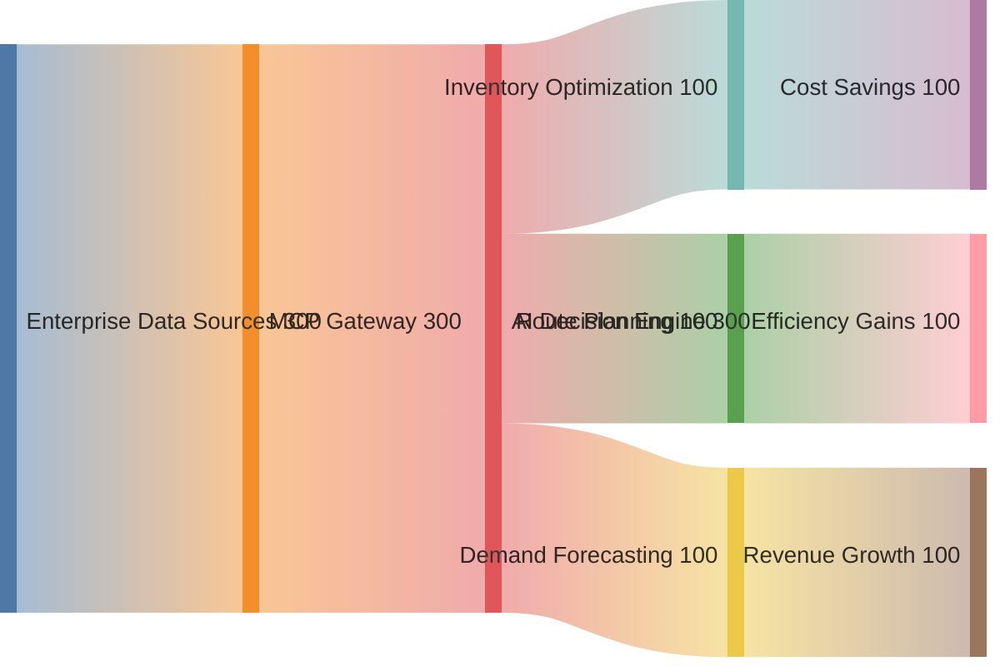
```mermaid
sankey-beta

Enterprise Data Sources,MCP Gateway,300
MCP Gateway,AI Decision Engine,300
AI Decision Engine,Inventory Optimization,100
AI Decision Engine,Route Planning,100
AI Decision Engine,Demand Forecasting,100
Inventory Optimization,Cost Savings,100
Route Planning,Efficiency Gains,100
Demand Forecasting,Revenue Growth,100
```

### Resultados Transformadores

- **Ruptura de estoque**: -73%
- **Custos logísticos**: -31%
- **Acurácia forecast**: +44%
- **Working capital**: -$180M
- **ROI**: 850% ano 1

---

# O Dilema Build vs Buy

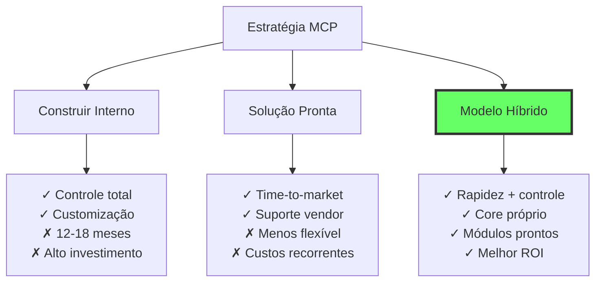
```mermaid
graph TD
    DECISION[Estratégia MCP] --> BUILD[Construir Interno]
    DECISION --> BUY[Solução Pronta]
    DECISION --> HYBRID[Modelo Híbrido]
    
    BUILD --> BP[✓ Controle total<br/>✓ Customização<br/>✗ 12-18 meses<br/>✗ Alto investimento]
    BUY --> BYP[✓ Time-to-market<br/>✓ Suporte vendor<br/>✗ Menos flexível<br/>✗ Custos recorrentes]
    HYBRID --> HP[✓ Rapidez + controle<br/>✓ Core próprio<br/>✓ Módulos prontos<br/>✓ Melhor ROI]
    
    style HYBRID fill:#66ff66,stroke:#333,stroke-width:3px
```

## Recomendação: Abordagem Híbrida

1. **Core MCP**: Implementação própria
2. **Conectores**: Soluções prontas
3. **Especialistas**: Consultoria pontual
4. **Evolução**: Internalização gradual

---

# Armadilhas a Evitar

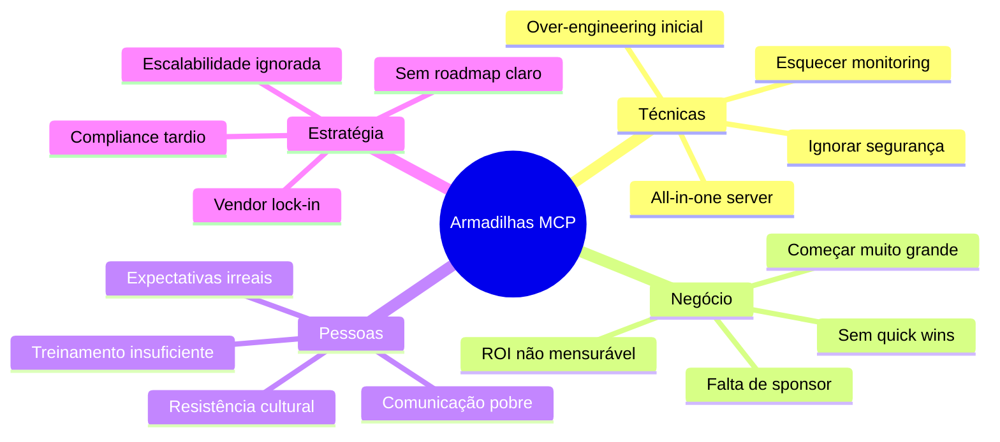
```mermaid
mindmap
  root((Armadilhas MCP))
    Técnicas
      Over-engineering inicial
      Ignorar segurança
      Esquecer monitoring
      All-in-one server
    Negócio
      Começar muito grande
      Sem quick wins
      ROI não mensurável
      Falta de sponsor
    Pessoas
      Resistência cultural
      Treinamento insuficiente
      Comunicação pobre
      Expectativas irreais
    Estratégia
      Vendor lock-in
      Sem roadmap claro
      Compliance tardio
      Escalabilidade ignorada
```

---

# Framework de Implementação SCALE

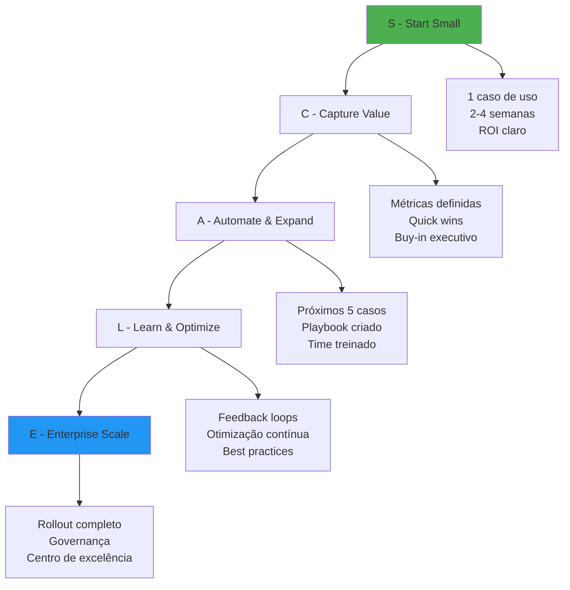
```mermaid
graph TD
    S[S - Start Small] --> C[C - Capture Value]
    C --> A[A - Automate & Expand]
    A --> L[L - Learn & Optimize]
    L --> E[E - Enterprise Scale]
    
    S --> S1[1 caso de uso<br/>2-4 semanas<br/>ROI claro]
    C --> C1[Métricas definidas<br/>Quick wins<br/>Buy-in executivo]
    A --> A1[Próximos 5 casos<br/>Playbook criado<br/>Time treinado]
    L --> L1[Feedback loops<br/>Otimização contínua<br/>Best practices]
    E --> E1[Rollout completo<br/>Governança<br/>Centro de excelência]
    
    style S fill:#4CAF50
    style E fill:#2196F3
```

---

# Tendência: Marketplaces MCP

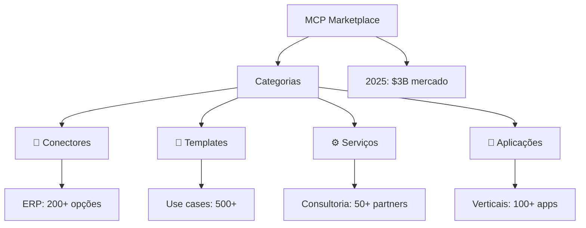
```mermaid
graph TD
    MARKET[MCP Marketplace] --> CAT[Categorias]
    
    CAT --> CONN[🔌 Conectores]
    CAT --> TEMP[📝 Templates]
    CAT --> SERV[⚙️ Serviços]
    CAT --> APPS[📱 Aplicações]
    
    CONN --> C1[ERP: 200+ opções]
    TEMP --> T1[Use cases: 500+]
    SERV --> S1[Consultoria: 50+ partners]
    APPS --> A1[Verticais: 100+ apps]
    
    MARKET --> TREND[2025: $3B mercado]
```

## Oportunidade de Ecossistema

- **Para fornecedores**: Novo canal de vendas
- **Para empresas**: Acelerar implementação
- **Para developers**: Monetizar expertise
- **Para consultores**: Serviços especializados

---

# Case: Itaú - Gerente IA Pessoal

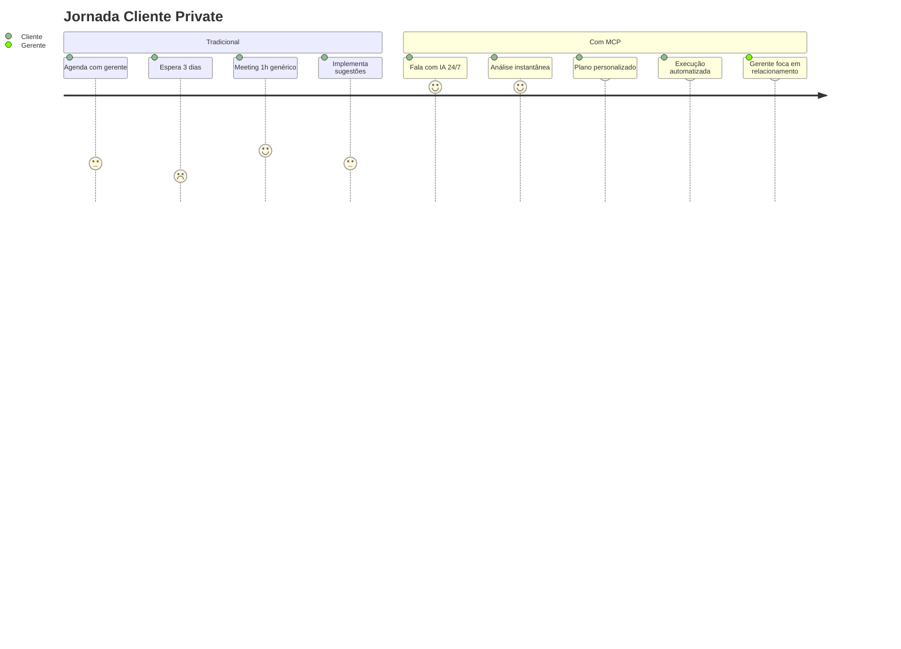
```mermaid
journey
    title Jornada Cliente Private
    section Tradicional
      Agenda com gerente: 3: Cliente
      Espera 3 dias: 2: Cliente
      Meeting 1h genérico: 4: Cliente
      Implementa sugestões: 3: Cliente
    section Com MCP
      Fala com IA 24/7: 9: Cliente
      Análise instantânea: 9: Cliente
      Plano personalizado: 10: Cliente
      Execução automatizada: 10: Cliente
      Gerente foca em relacionamento: 10: Gerente
```

### Revolução no Private Banking

- **AUM por gerente**: +85%
- **Satisfação cliente**: 9.6/10
- **Produtos por cliente**: 4.2 → 7.8
- **Custo de servicing**: -60%
- **Gerentes**: De operacionais a consultores

---

# O Fator Humano na Transformação

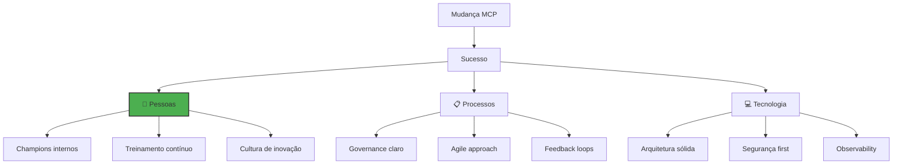
```mermaid
graph TD
    CHANGE[Mudança MCP] --> SUCCESS[Sucesso]
    
    SUCCESS --> PEOPLE[👥 Pessoas]
    SUCCESS --> PROCESS[📋 Processos]
    SUCCESS --> TECH[💻 Tecnologia]
    
    PEOPLE --> P1[Champions internos]
    PEOPLE --> P2[Treinamento contínuo]
    PEOPLE --> P3[Cultura de inovação]
    
    PROCESS --> PR1[Governance claro]
    PROCESS --> PR2[Agile approach]
    PROCESS --> PR3[Feedback loops]
    
    TECH --> T1[Arquitetura sólida]
    TECH --> T2[Segurança first]
    TECH --> T3[Observability]
    
    style PEOPLE fill:#4CAF50,stroke:#333,stroke-width:2px
```

## Lição Aprendida

> "Tecnologia é 20% do desafio. Pessoas e processos são 80%." — CTO, Banco Safra

---

# Métricas que Importam

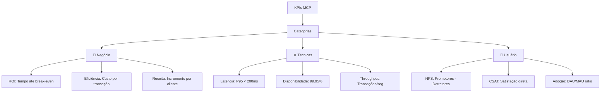
```mermaid
graph TD
    METRICS[KPIs MCP] --> CAT[Categorias]
    
    CAT --> BUS[💼 Negócio]
    CAT --> TECH[⚙️ Técnicas]
    CAT --> USER[👤 Usuário]
    
    BUS --> B1[ROI: Tempo até break-even]
    BUS --> B2[Eficiência: Custo por transação]
    BUS --> B3[Receita: Incremento por cliente]
    
    TECH --> T1[Latência: P95 < 200ms]
    TECH --> T2[Disponibilidade: 99.95%]
    TECH --> T3[Throughput: Transações/seg]
    
    USER --> U1[NPS: Promotores - Detratores]
    USER --> U2[CSAT: Satisfação direta]
    USER --> U3[Adoção: DAU/MAU ratio]
```

## Dashboard Executivo

- **Métricas Tier 1**: ROI, NPS, Disponibilidade
- **Métricas Tier 2**: Eficiência, Latência, Adoção
- **Métricas Tier 3**: Detalhamento operacional

---

# Segurança e Compliance

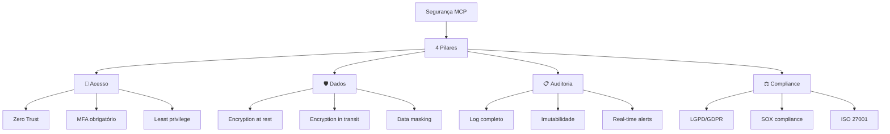
```mermaid
graph TD
    SEC[Segurança MCP] --> PILLARS[4 Pilares]
    
    PILLARS --> ACC[🔐 Acesso]
    PILLARS --> DATA[🛡️ Dados]
    PILLARS --> AUD[📋 Auditoria]
    PILLARS --> COMP[⚖️ Compliance]
    
    ACC --> A1[Zero Trust]
    ACC --> A2[MFA obrigatório]
    ACC --> A3[Least privilege]
    
    DATA --> D1[Encryption at rest]
    DATA --> D2[Encryption in transit]
    DATA --> D3[Data masking]
    
    AUD --> AU1[Log completo]
    AUD --> AU2[Imutabilidade]
    AUD --> AU3[Real-time alerts]
    
    COMP --> C1[LGPD/GDPR]
    COMP --> C2[SOX compliance]
    COMP --> C3[ISO 27001]
```

## Certificações Recomendadas

- ISO 27001 para o ambiente MCP
- SOC 2 Type II para serviços
- Compliance específico do setor

---

# Roadmap Estratégico 2024-2026

```mermaid
timeline
    title Evolução MCP na Empresa
    
    2024 Q3 : Fase Discovery
            : Avaliar maturidade
            : Definir estratégia
    
    2024 Q4 : Fase Piloto
            : 3 casos de uso
            : Provar conceito
    
    2025 Q1 : Fase Expansão
            : 10+ integrações
            : Centro de excelência
    
    2025 Q2 : Fase Otimização
            : ML para contexto
            : Automação avançada
    
    2025 Q3 : Fase Inovação
            : Novos produtos
            : Revenue streams
    
    2026    : Fase Liderança
            : Ecosystem player
            : Market maker
```

---

# Decisão Executiva: Framework DECIDE

```mermaid
graph TD
    D[D - Diagnóstico] --> E[E - Evidências]
    E --> C[C - Critérios]
    C --> I[I - Impacto]
    I --> D2[D - Decisão]
    D2 --> E2[E - Execução]
    
    D --> Q1[Onde estamos?]
    E --> Q2[Quais os fatos?]
    C --> Q3[O que priorizamos?]
    I --> Q4[Qual o resultado?]
    D2 --> Q5[Vamos ou não?]
    E2 --> Q6[Como fazemos?]
    
    style D2 fill:#4CAF50,stroke:#333,stroke-width:3px
```

## Checklist de Decisão

- [ ] Entendemos nossa maturidade atual?
- [ ] Temos casos de uso prioritários?
- [ ] ROI está claro e mensurável?
- [ ] Riscos foram mapeados?
- [ ] Temos sponsor executivo?
- [ ] Recursos estão disponíveis?

Se 5+ ✓, decisão é GO.

---

# O Custo da Inação

```mermaid
graph TD
    TODAY[Hoje] --> FUTURE[2026]
    
    TODAY --> ACT[✅ Implementar MCP]
    TODAY --> WAIT[❌ Esperar]
    
    ACT --> A1[Líder de mercado]
    ACT --> A2[Margem superior]
    ACT --> A3[Inovação contínua]
    
    WAIT --> W1[Catching up caro]
    WAIT --> W2[Perda de clientes]
    WAIT --> W3[Irrelevância digital]
    
    style ACT fill:#66ff66
    style WAIT fill:#ff6666
```

## Projeção Financeira

|Cenário|Investimento 3 anos|Retorno 3 anos|NPV|
|---|---|---|---|
|**Implementar agora**|$5M|$45M|$32M|
|**Implementar em 2025**|$8M|$30M|$18M|
|**Implementar em 2026**|$15M|$20M|$3M|
|**Não implementar**|$0|-$25M|-$25M|

---

# Conclusão: A Janela de Oportunidade

```mermaid
graph LR
    WINDOW[Janela de Oportunidade] --> CLOSING[Fechando Rápido]
    
    WINDOW --> NOW[AGORA: Early Adopter]
    NOW --> ADV1[Vantagem competitiva]
    NOW --> ADV2[Custos menores]
    NOW --> ADV3[Talento disponível]
    
    CLOSING --> LATER[DEPOIS: Fast Follower]
    LATER --> DIS1[Competir em preço]
    LATER --> DIS2[Custos maiores]
    LATER --> DIS3[Talento escasso]
    
    style NOW fill:#66ff66,stroke:#333,stroke-width:3px
    style LATER fill:#ff6666
```

---

# MCP: Sua Decisão Define o Futuro

## Três Verdades Finais

1. **MCP não é opcional - é inevitável**
    
    - Como e-commerce para varejo
    - Como mobile para bancos
    - Como cloud para TI
2. **O momento é agora**
    
    - Tecnologia madura
    - Casos provados
    - ROI demonstrado
3. **Liderança ou irrelevância**
    
    - Não há meio termo
    - Disrupção total chegando
    - Decisão define destino

---

# Próximos Passos Concretos

```mermaid
graph TD
    NOW[Agora] --> WEEK1[Semana 1]
    WEEK1 --> WEEK2[Semana 2]
    WEEK2 --> MONTH1[Mês 1]
    MONTH1 --> MONTH3[Mês 3]
    
    WEEK1 --> W1[Formar task force]
    WEEK1 --> W2[Assessment interno]
    
    WEEK2 --> W3[Definir caso piloto]
    WEEK2 --> W4[Selecionar parceiros]
    
    MONTH1 --> M1[Implementar POC]
    MONTH1 --> M2[Medir resultados]
    
    MONTH3 --> M3[Escalar sucesso]
    MONTH3 --> M4[Roadmap completo]
    
    style NOW fill:#4CAF50
```

## Kit de Início Rápido

1. **Executive briefing**: 2h com especialistas
2. **Assessment gratuito**: Maturidade atual
3. **Caso de uso prioritário**: Workshop 1 dia
4. **POC em 30 dias**: Resultado garantido
5. **Suporte dedicado**: 90 dias

---

# Recursos e Contatos

## Para Começar Hoje

- **Site**: [modelcontextprotocol.io](https://modelcontextprotocol.io/)
- **Assessment**: [mcp.io/assessment](https://mcp.io/assessment)
- **ROI Calculator**: [mcp.io/calculator](https://mcp.io/calculator)
- **Cases detalhados**: [mcp.io/cases](https://mcp.io/cases)

## Contato Direto

- **Executive Hotline**: 0800-MCP-EXEC
- **Email**: strategy@mcp.io
- **LinkedIn**: MCP Executive Network
- **Consultoria**: consulting@mcp.io

---

# O Futuro é Contextual. O Momento é Agora.

> "Em 5 anos, toda empresa será uma empresa MCP. A questão é: você vai liderar ou seguir?" — Satya Nadella, Microsoft

**A revolução MCP já começou.** **Sua decisão define de que lado você estará.**

🚀 **O futuro espera por você.**