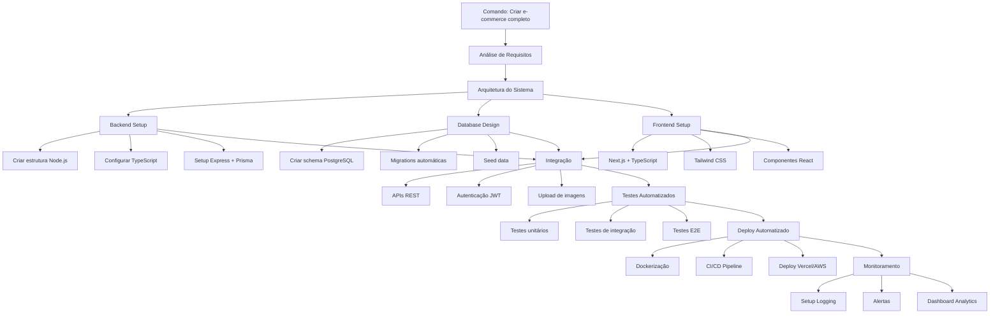
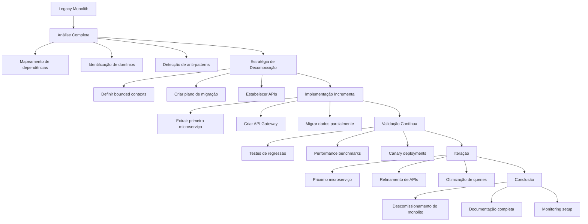
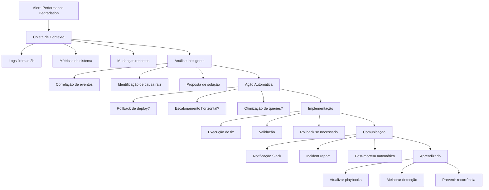
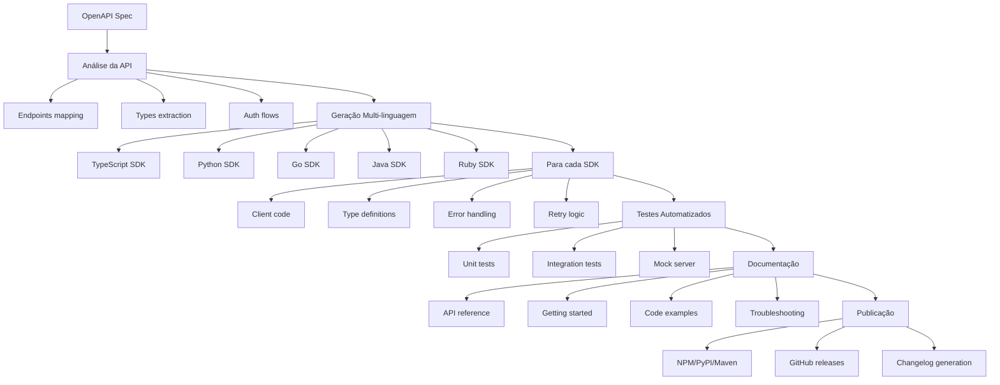
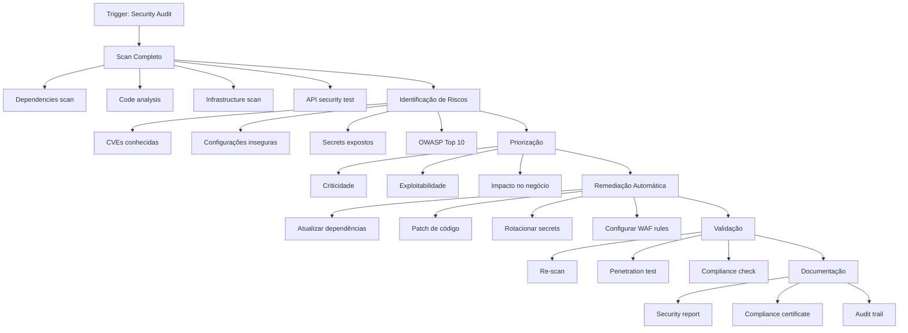

# 🚀 Demonstrações Avançadas De MCP Para VSCode

## Demo 1: Arquiteto Full-Stack Autônomo

### Cenário

**"Criar uma aplicação completa de e-commerce do zero, incluindo backend, frontend, banco de dados, testes e deploy"**

### MCP Servers Utilizados

- 🛢️ **PostgreSQL Server**: Gerencia banco de dados
- 🐙 **Git Server**: Controle de versão
- 📁 **Filesystem Server**: Manipulação de arquivos
- 🐳 **Docker Server**: Containerização
- 🧪 **Test Runner Server**: Execução de testes
- ☁️ **AWS/Vercel Server**: Deploy
- 📊 **Analytics Server**: Monitoramento

### Fluxo Da Demonstração

### Pontos De Impressão

1. **Velocidade**: Todo o processo em 10-15 minutos
2. **Complexidade**: Sistema completo e funcional
3. **Qualidade**: Código seguindo best practices
4. **Automação**: Zero intervenção manual

---

## Demo 2: Refatoração Inteligente De Legacy Code

### Cenário

**"Modernizar uma aplicação monolítica legada para microserviços, com migração de banco de dados e zero downtime"**

### MCP Servers Utilizados

- 🔍 **Code Analysis Server**: Análise estática de código
- 🔄 **Git Server**: Versionamento
- 🗄️ **Database Migration Server**: Migração de dados
- 🏗️ **Architecture Server**: Padrões arquiteturais
- 🐳 **Kubernetes Server**: Orquestração
- 📈 **Performance Server**: Métricas de performance

### Fluxo Da Demonstração

### Pontos De Impressão

1. **Complexidade Real**: Trabalha com código legado real
2. **Zero Downtime**: Migração sem interrupção
3. **Decisões Inteligentes**: Análise profunda do código
4. **Resultados Mensuráveis**: Performance antes/depois

---

## Demo 3: DevOps Inteligente Com Resolução Automática

### Cenário

**"Sistema que detecta, diagnostica e resolve problemas de produção automaticamente"**

### MCP Servers Utilizados

- 🚨 **Monitoring Server**: Alertas e métricas
- 📊 **Log Analysis Server**: Análise de logs
- 🔧 **Infrastructure Server**: Gerenciamento de infra
- 🧠 **AI Analysis Server**: Diagnóstico inteligente
- 🔄 **Automation Server**: Execução de fixes
- 📢 **Notification Server**: Comunicação com time

### Fluxo Da Demonstração

### Pontos De Impressão

1. **Autonomia**: Resolve problemas sem intervenção
2. **Inteligência**: Diagnóstico preciso
3. **Velocidade**: Resposta em segundos
4. **Aprendizado**: Melhora contínua

---

## Demo 4: Gerador De SDKs Multi-linguagem

### Cenário

**"Criar SDKs em 5 linguagens diferentes a partir de uma API REST, com documentação, testes e exemplos"**

### MCP Servers Utilizados

- 📜 **OpenAPI Server**: Parsing de especificações
- 🔤 **Code Generation Server**: Geração de código
- 📚 **Documentation Server**: Criação de docs
- 🧪 **Test Generator Server**: Criação de testes
- 📦 **Package Manager Server**: Publicação de pacotes
- 🌍 **Translation Server**: Internacionalização

### Fluxo Da Demonstração

### Pontos De Impressão

1. **Multiplicação de Esforço**: 1 spec → 5 SDKs
2. **Consistência**: Mesma qualidade em todas linguagens
3. **Completude**: Docs, testes, exemplos incluídos
4. **Manutenção**: Atualização automática

---

## Demo 5: Arquiteto De Segurança Proativo

### Cenário

**"Análise completa de segurança de uma aplicação, com detecção de vulnerabilidades e aplicação automática de patches"**

### MCP Servers Utilizados

- 🔒 **Security Scanner Server**: Análise de vulnerabilidades
- 🔍 **SAST Server**: Análise estática
- 🌐 **DAST Server**: Análise dinâmica
- 📋 **Compliance Server**: Verificação de conformidade
- 🛡️ **WAF Server**: Configuração de firewall
- 🔑 **Secrets Manager Server**: Gestão de credenciais

### Fluxo Da Demonstração

### Pontos De Impressão

1. **Proatividade**: Encontra problemas antes dos hackers
2. **Automação**: Corrige vulnerabilidades automaticamente
3. **Compliance**: Certificações automáticas
4. **Visibilidade**: Dashboard de segurança em tempo real

---

## 🎯 Elementos Chave Para O Sucesso Das Demos

### 1. Preparação Do Ambiente

- Ter todos os MCP servers rodando e configurados
- Dados realistas pré-carregados
- Cenários de falha preparados para mostrar recuperação

### 2. Narrativa Envolvente

- Começar com um problema real e doloroso
- Mostrar o "antes" (processo manual) vs "depois" (MCP)
- Quantificar ganhos (tempo, qualidade, custo)

### 3. Interatividade

- Permitir que a audiência sugira mudanças
- Mostrar adaptabilidade do sistema
- Demonstrar edge cases e recuperação de erros

### 4. Métricas De Impacto

- Tempo economizado (horas → minutos)
- Redução de erros (bugs encontrados)
- Cobertura de testes aumentada
- Velocity do time melhorada

### 5. Finalização Poderosa

- Mostrar o sistema completo funcionando
- Destacar a manutenibilidade
- Enfatizar a escalabilidade da solução

## 🎪 Dicas De Apresentação

1. **Comece devagar**: Mostre um comando simples primeiro
2. **Escale gradualmente**: Adicione complexidade progressivamente
3. **Mantenha transparência**: Mostre logs e processos internos
4. **Prepare falhas**: Tenha recuperação automática de erros
5. **Finalize com bang**: Termine com o resultado impressionante

Essas demonstrações vão além do básico e mostram o verdadeiro poder transformador do MCP no desenvolvimento moderno. A chave é escolher um cenário que ressoe com sua audiência e preparar meticulosamente cada etapa da demo.