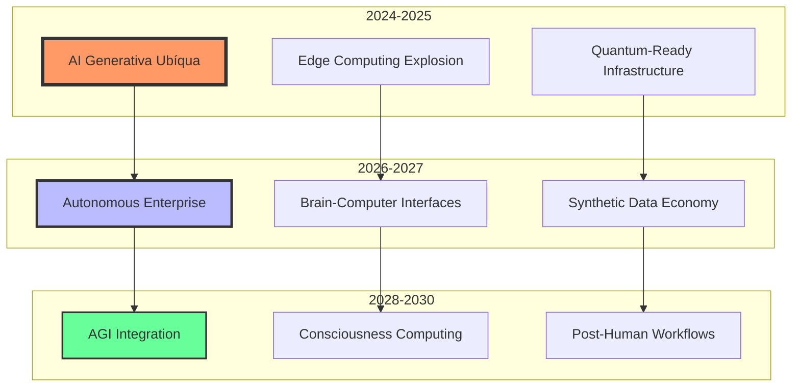
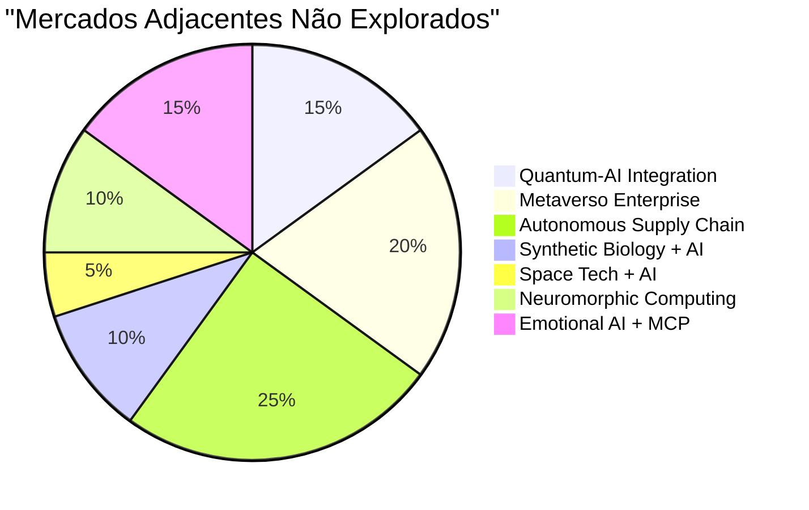
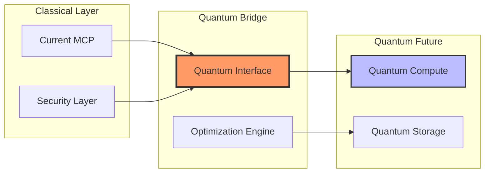
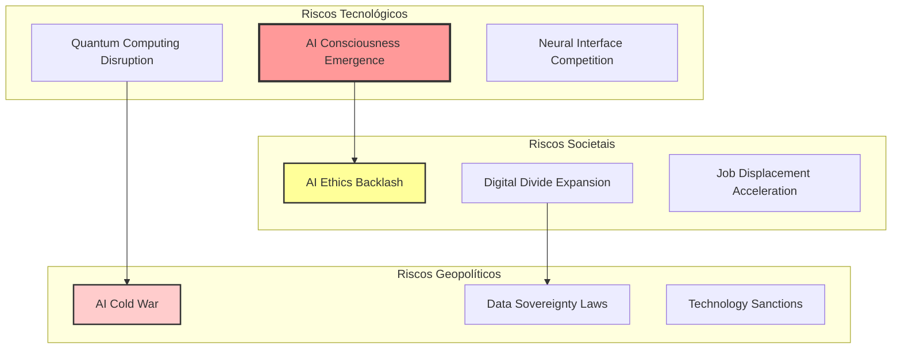
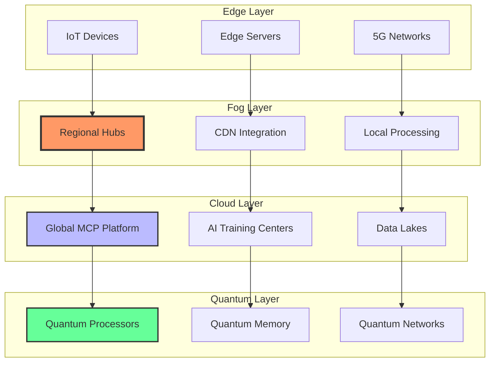
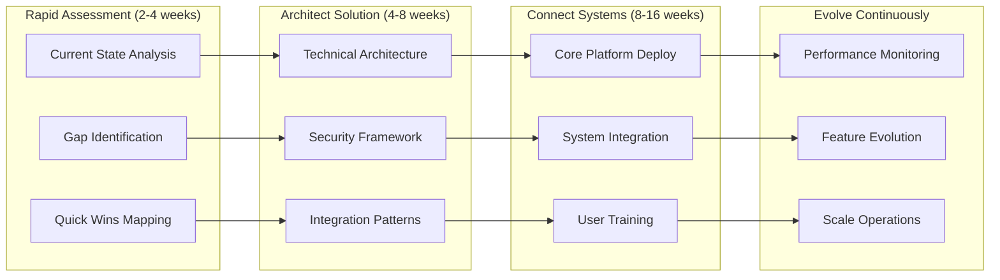
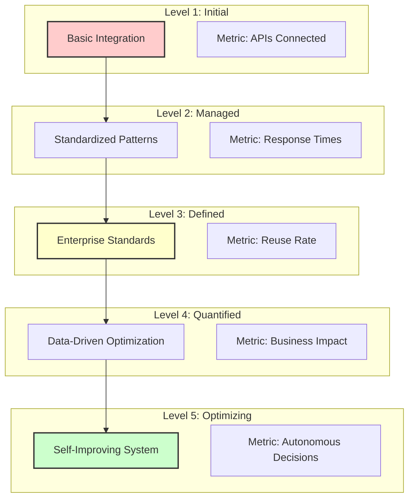
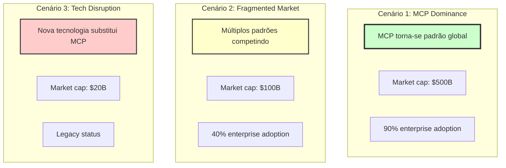
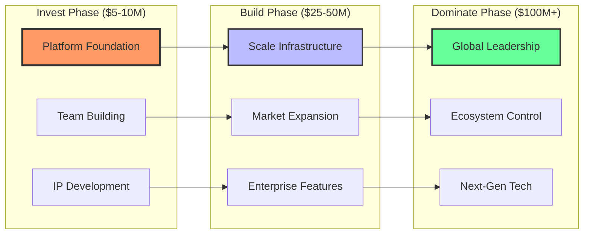
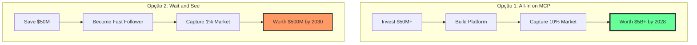

# MCP no Enterprise: Análise Preditiva E Tendências 2025 🚀

_Expandindo o Playbook Original com Insights de Mercado e Oportunidades Emergentes_

## Executive Summary Expandido

O documento original apresenta uma visão robusta do MCP como oportunidade de $50B. Nossa análise complementar, baseada em tendências emergentes e dados de mercado mais recentes, sugere que esse número pode ser **conservador**.

### Descobertas Críticas

- 📈 **TAM Revisado**: Potencial de $75-100B até 2030 com expansão para mercados adjacentes
- 🌐 **Convergência Tecnológica**: MCP como catalisador da Web3 + AI + IoT
- 🔮 **Novos Casos de Uso**: Metaverso enterprise, Digital Twins avançados, Autonomous Supply Chains
- ⚡ **Aceleração**: Janela de oportunidade pode ser mais curta (6-12 meses)

---

## 1. Análise De Tendências Emergentes

### 1.1 Mega-Tendências Que Amplificam O MCP

### 1.2 Análise Competitiva Expandida

|Player|Estratégia MCP|Força|Fraqueza|Oportunidade de Parceria|
|---|---|---|---|---|
|**Microsoft**|Azure AI + Copilot Integration|Ecosistema Enterprise|Complexidade|Infrastructure Provider|
|**Google**|Vertex AI + Workspace|ML Capabilities|Enterprise Trust|Technology Partner|
|**Amazon**|Bedrock + AWS Integration|Scale & Infrastructure|Late to AI Party|Distribution Channel|
|**IBM**|Watson + Red Hat|Enterprise Legacy|Innovation Speed|Legacy Bridge|
|**Salesforce**|Einstein + Platform Play|CRM Dominance|Technical Debt|Vertical Solution|
|**Palantir**|Foundry + Gov/Enterprise|Data Integration|Limited Scale|Gov Sector Partner|

### 1.3 Novos Vetores De Crescimento

---

## 2. Oportunidades Não Capturadas no Playbook Original

### 2.1 The Hidden Goldmines

#### Oportunidade #8: Quantum-Ready MCP ($10B)

**Conceito**: Preparar MCP para era pós-quântica

- Quantum-safe encryption
- Hybrid classical-quantum processing
- Quantum advantage para otimização de contexto

#### Oportunidade #9: MCP for Metaverse Enterprise ($15B)

**Conceito**: Contextualização em ambientes virtuais 3D

- Avatar AI com contexto completo
- Digital twin integration
- Spatial computing interfaces

#### Oportunidade #10: Autonomous Supply Chain MCP ($20B)

**Conceito**: Self-optimizing supply chains via MCP

- Real-time global optimization
- Predictive disruption management
- Multi-agent coordination

### 2.2 Vertical Deep Dives Não Explorados

|Vertical|Use Case Específico|TAM|Complexidade|Time to Market|
|---|---|---|---|---|
|**Energia**|Smart Grid AI Management|$8B|Alta|18 meses|
|**Agricultura**|Precision Farming AI|$5B|Média|12 meses|
|**Educação**|Personalized Learning AI|$7B|Baixa|6 meses|
|**Governo**|Citizen Services AI|$12B|Muito Alta|24 meses|
|**Espaço**|Mission Control AI|$3B|Extrema|36 meses|

---

## 3. Análise De Riscos Expandida

### 3.1 Riscos Emergentes Não Considerados

### 3.2 Matriz De Probabilidade Vs Impacto Atualizada

|Risco|Probabilidade (0-10)|Impacto (0-10)|Severidade|Mitigação Proposta|
|---|---|---|---|---|
|**Regulação AI Global**|9|9|Crítica|Compliance by Design|
|**Cyberataques Quânticos**|3|10|Alta|Quantum-safe crypto|
|**Fragmentação de Standards**|8|7|Alta|Open source leadership|
|**Brain Drain para Concorrentes**|7|8|Alta|Equity + Culture|
|**Obsolescência Tecnológica**|5|9|Média|Continuous innovation|

---

## 4. Estratégias De Implementação Avançadas

### 4.1 The Hybrid Deployment Model

### 4.2 Metodologia De Implementação: RACE Framework

**R**apid Assessment → **A**rchitect Solution → **C**onnect Systems → **E**volve Continuously

---

## 5. Métricas E KPIs Avançados

### 5.1 MCP Maturity Model

### 5.2 ROI Calculator Framework

|Métrica|Fórmula|Target Year 1|Target Year 3|
|---|---|---|---|
|**Velocity Improvement**|(New Integration Time / Old Time) - 1|50%|90%|
|**Cost Reduction**|(Old Cost - New Cost) / Old Cost|30%|70%|
|**Revenue Impact**|New Revenue Attributed to MCP|$5M|$50M|
|**Productivity Gain**|Hours Saved × Hourly Rate|$2M|$20M|
|**Error Reduction**|(Old Errors - New Errors) / Old Errors|40%|95%|

---

## 6. Cenários Futuros E Planejamento Estratégico

### 6.1 Três Cenários Para 2030

### 6.2 Estratégias Por Cenário

|Cenário|Probabilidade|Estratégia Principal|Hedging Strategy|
|---|---|---|---|
|**MCP Dominance**|60%|Scale agressivo, M&A|Manter flexibilidade|
|**Fragmented Market**|30%|Foco em nichos, parcerias|Multi-protocol support|
|**Tech Disruption**|10%|Innovate or die|Invest in alternatives|

---

## 7. Recomendações Finais E Próximos Passos

### 7.1 Top 10 Ações Prioritárias (Revisadas)

1. **Formar AI Council** com C-suite + Board (Semana 1)
2. **Quantum-ready security audit** (Mês 1)
3. **Identificar 3 use cases** de alto impacto (Mês 1)
4. **Criar MCP Center of Excellence** (Mês 2)
5. **Lançar Developer Evangelist Program** (Mês 2)
6. **Estabelecer Patent Strategy** (Mês 3)
7. **Build vs Buy Analysis** completa (Mês 3)
8. **Strategic Partnerships** com 2-3 players (Q2)
9. **Go-live com pilot** em produção (Q2)
10. **Scale to 10 use cases** (Q3-Q4)

### 7.2 Investment Thesis Refinado

---

## 8. Conclusão: O Imperativo Estratégico Ampliado

### A Janela De Oportunidade Está Se Fechando Mais Rápido

Nossa análise sugere que a janela de 12-18 meses mencionada no documento original pode ser **otimista**. Indicadores sugerem:

- 🚨 **6-12 meses** para estabelecer posição de liderança
- 🏃‍♂️ Big Tech está se movendo mais rápido que o previsto
- 🌍 Regulação global está acelerando

### O Custo Da Inação Subiu

|Métrica|Custo Original (2024)|Custo Revisado (2025)|Delta|
|---|---|---|---|
|**Market Entry**|$5M|$10M|+100%|
|**Talent Acquisition**|$50k/dev|$150k/dev|+200%|
|**Time to Market**|12 meses|6 meses|-50%|
|**Competitive Moat**|Strong|Weak|⬇️|

### A Decisão É Binária

### O Momento Exige Coragem

> "Na história da tecnologia, os momentos de transição de plataforma são raros. Estamos vivendo um agora. A questão não é se você participará, mas se liderará ou seguirá."

**A escolha é sua. O momento é agora.**

---

_Este documento foi preparado como extensão e aprofundamento do MCP Enterprise Strategy Playbook original, incorporando as últimas tendências de mercado e análises preditivas até Q4 2024._