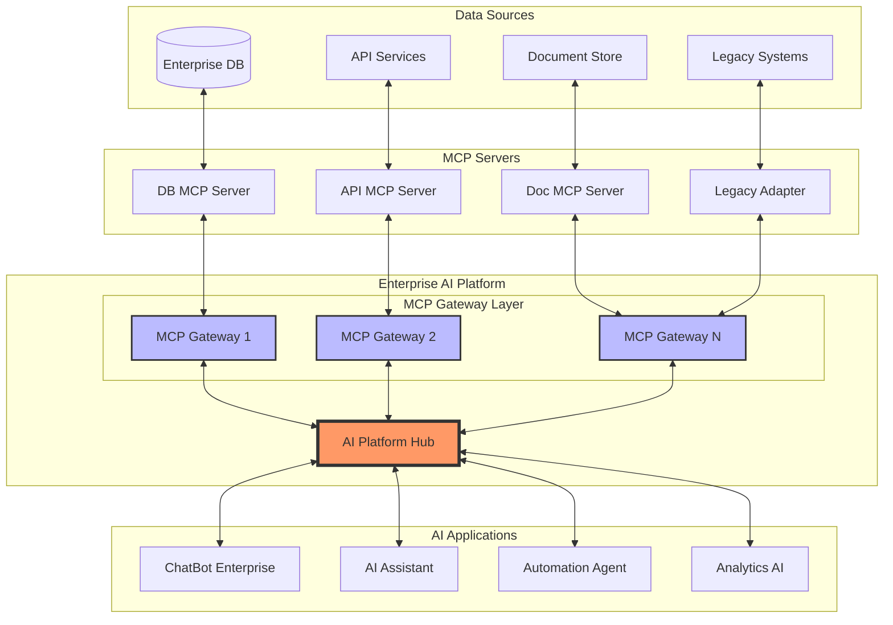
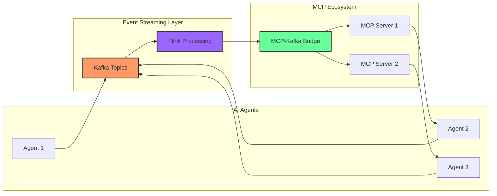
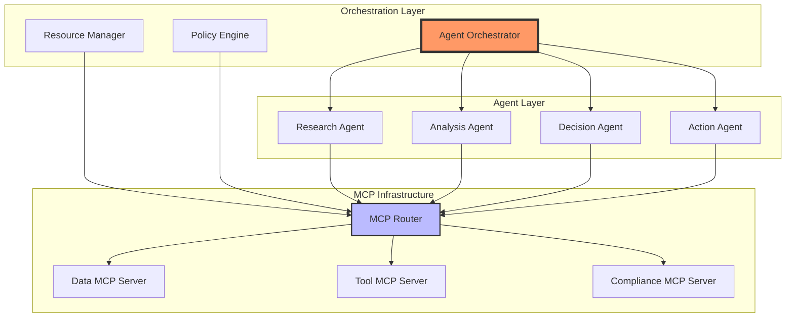
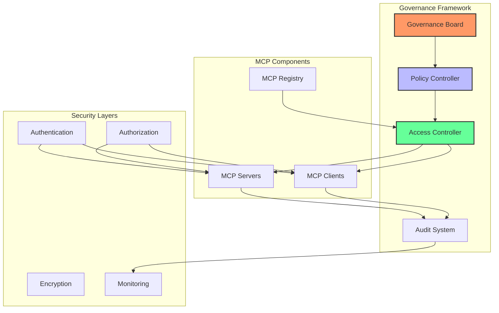
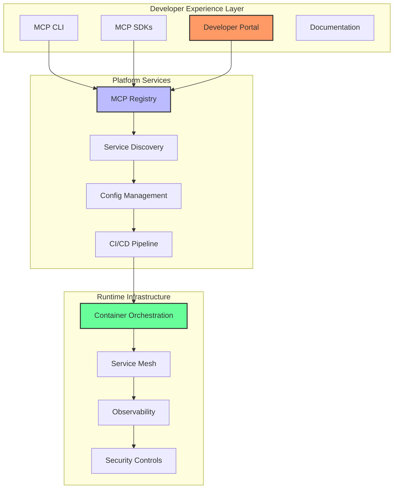
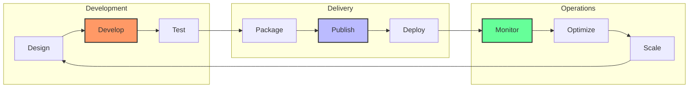
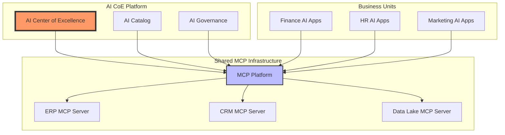
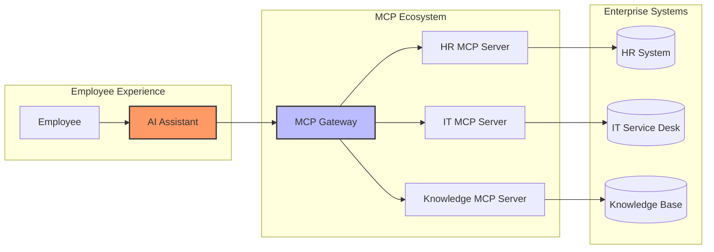

# MCP no Enterprise: Análise Preditiva e Tendências 🚀

## Visão Executiva

O Model Context Protocol está emergindo como o "USB-C" das aplicações IA, criando um padrão universal para conectar modelos de linguagem a fontes de dados e ferramentas. No contexto enterprise, o MCP promete revolucionar como as organizações integram IA em seus ecossistemas, transitando de integrações pontuais para uma abordagem baseada em plataforma.

## 1. Arquitetura Enterprise com MCP

### 1.1 Padrão Hub-and-Spoke Evoluído

### 1.2 Integração com Event-Driven Architecture

A convergência de MCP com Kafka e Flink cria uma nova stack para agentes AI:

### 1.3 Arquitetura Multi-Agent Orquestrada

## 2. Governança e Segurança Enterprise

### 2.1 Framework de Governança MCP

### 2.2 Modelo de Segurança Zero Trust para MCP

|Camada|Componente|Controles de Segurança|
|---|---|---|
|Network|MCP Transport|mTLS, Network Segmentation|
|Identity|MCP Auth|OAuth 2.1, JWT, MFA|
|Access|MCP Authorization|RBAC, ABAC, Policy Engine|
|Data|MCP Encryption|E2E Encryption, Key Management|
|Audit|MCP Logging|Immutable Logs, SIEM Integration|

## 3. Internal Developer Platform (IDP) com MCP

### 3.1 Arquitetura da Plataforma

### 3.2 Ciclo de Vida do Desenvolvimento MCP

## 4. Padrões e Melhores Práticas

### 4.1 Padrões de Implementação

|Padrão|Descrição|Caso de Uso|
|---|---|---|
|**Gateway Pattern**|Centralização de acesso MCP|Controle de acesso e rate limiting|
|**Sidecar Pattern**|MCP proxy ao lado de cada serviço|Microsserviços e service mesh|
|**Adapter Pattern**|Wrappers para sistemas legados|Integração com sistemas existentes|
|**Registry Pattern**|Catálogo centralizado de servers|Discovery e governança|
|**Circuit Breaker**|Resiliência em falhas|Alta disponibilidade|

### 4.2 Anti-Padrões a Evitar

⚠️ **Direct Connection**: Conectar aplicações diretamente aos MCP servers sem gateway ⚠️ **Credential Sprawl**: Espalhar credenciais por múltiplos servers ⚠️ **Monolithic Servers**: Criar servers que fazem muitas coisas ⚠️ **Lack of Versioning**: Não versionar APIs dos servers ⚠️ **No Rate Limiting**: Não implementar controles de taxa

## 5. Cenários de Uso Enterprise

### 5.1 Centro de Excelência AI

### 5.2 Digital Workplace Assistant

## 6. Roadmap de Implementação Enterprise

### Fase 1: Foundation (3-6 meses)

- ✅ Estabelecer governança MCP
- ✅ Implementar platform core
- ✅ Criar primeiros MCP servers
- ✅ Definir security policies

### Fase 2: Expansion (6-12 meses)

- 📊 Escalar para múltiplas BUs
- 🔄 Integrar com event streaming
- 🛠️ Desenvolver tooling avançado
- 📈 Implementar observability

### Fase 3: Maturity (12-18 meses)

- 🤖 Multi-agent orchestration
- 🌐 Federation entre enterprises
- 🚀 AI-driven automation
- 🎯 Business value optimization

## 7. Métricas de Sucesso

### 7.1 Technical Metrics

- **Latency**: < 100ms para chamadas MCP
- **Availability**: 99.9% uptime para servers críticos
- **Throughput**: 10k+ requests/second
- **Error Rate**: < 0.1% falhas

### 7.2 Business Metrics

- **Time to Market**: Redução de 60% no desenvolvimento de AI apps
- **Reuse Rate**: 80% de reuso de MCP servers
- **Developer Productivity**: 3x aumento na velocidade
- **ROI**: 200%+ em 18 meses

## 8. Conclusões e Recomendações

### 8.1 Principais Oportunidades

1. **Democratização da AI**: MCP permite que qualquer desenvolvedor construa aplicações AI sofisticadas
2. **Economia de Escala**: Reutilização massiva de integrações
3. **Governança Unificada**: Controle centralizado com execução distribuída
4. **Innovation Acceleration**: Redução drástica no time-to-market

### 8.2 Próximos Passos Recomendados

1. 🎯 Formar um tiger team para POC
2. 🏗️ Estabelecer MCP Center of Excellence
3. 📋 Definir roadmap de 18 meses
4. 🤝 Engajar vendors estratégicos
5. 📚 Treinar equipes de desenvolvimento

### 8.3 Chamada para Ação

> "O MCP representa uma mudança fundamental em como construímos e operamos sistemas AI em escala enterprise. As organizações que adotarem essa abordagem de plataforma estarão melhor posicionadas para capitalizar a revolução AI." - Visão ao estilo Marty Cagan

---

_Este documento é um living artifact e deve ser atualizado conforme o ecossistema MCP evolui._