# MCP Enterprise Strategy: The Definitive Playbook 🚀

_Transformando a Integração AI Enterprise através do Model Context Protocol_

## Executive Brief

O Model Context Protocol representa a maior oportunidade de transformação em integração enterprise desde o surgimento das APIs REST. Este playbook fornece uma estratégia completa para capturar valor em um mercado nascente de **$50 bilhões**, identificando **7 oportunidades críticas** e fornecendo um **roadmap de implementação de 18 meses**.

### Key Takeaways

- 🎯 **Oportunidade**: Mercado de $50B até 2028, com $5B capturáveis nos próximos 24 meses
- 🚀 **Timing**: Janela crítica de 12-18 meses antes d# MCP no Enterprise: Análise Preditiva e Tendências 🚀
        PIPE[CI/CD Pipeline]
    end
    
    ​subgraph "Runtime Infrastructure"
        ORC[Container Orchestration]
        MESH[Service Mesh]
        OBS[Observability]
        SEC[Security Controls]
    end
    
    CLI --> REG
    SDK --> REG
    UI --> REG
    
    REG --> DISC
    DISC --> CONF
    CONF --> PIPE
    
    PIPE --> ORC
    ORC --> MESH
    MESH --> OBS
    OBS --> SEC
    
    style UI fill:#f96,stroke:#333,stroke-width:2px
    style REG fill:#bbf,stroke:#333,stroke-width:2px
    style ORC fill:#6f9,stroke:#333,stroke-width:2px
```

​### 3.2 Ciclo de Vida do Desenvolvimento MCP

```mermaid
​graph LR
    ​subgraph "Development"
        D1[Design] --> D2[Develop]
        D2 --> D3[Test]
    end
    
    ​subgraph "Delivery"
        D3 --> P1[Package]
        P1 --> P2[Publish]
        P2 --> P3[Deploy]
    end
    
    ​subgraph "Operations"
        P3 --> O1[Monitor]
        O1 --> O2[Optimize]
        O2 --> O3[Scale]
    end
    
    O3 --> D1
    
    style D2 fill:#f96,stroke:#333,stroke-width:2px
    style P2 fill:#bbf,stroke:#333,stroke-width:2px
    style O1 fill:#6f9,stroke:#333,stroke-width:2px
```

​## 4. Padrões e Melhores Práticas

​### 4.1 Padrões de Implementação

Padrão
Descrição
Caso de Uso
Gateway Pattern
Centralização de acesso MCP
Controle de acesso e rate limiting
Sidecar Pattern
MCP proxy ao lado de cada serviço
Microsserviços e service mesh
Adapter Pattern
Wrappers para sistemas legados
Integração com sistemas existentes
Registry Pattern
Catálogo centralizado de servers
Discovery e governança
Circuit Breaker
Resiliência em falhas
Alta disponibilidade

​### 4.2 Anti-Padrões a Evitar

⚠️ **Direct Connection**: Conectar aplicações diretamente aos MCP servers sem gateway ⚠️ **Credential Sprawl**: Espalhar credenciais por múltiplos servers ⚠️ **Monolithic Servers**: Criar servers que fazem muitas coisas ⚠️ **Lack of Versioning**: Não versionar APIs dos servers ⚠️ **No Rate Limiting**: Não implementar controles de taxa

​## 5. Cenários de Uso Enterprise

​### 5.1 Centro de Excelência AI

```mermaid
​graph TD
    ​subgraph "AI CoE Platform"
        COE[AI Center of Excellence]
        CAT[AI Catalog]
        GOV[AI Governance]
    end
    
    ​subgraph "Business Units"
        BU1[Finance AI Apps]
        BU2[HR AI Apps]
        BU3[Marketing AI Apps]
_Este documento é um living artifact e deve ser atualizado conforme o ecossistema MCP evolui._a consolidação do mercado
- 💎 **Diferenciação**: Security-first, vertical-specific, developer experience
- 📈 **ROI**: 300-500% em 3 anos com investimento estruturado

---

## 1. Strategic Context: Por que MCP, Por que Agora

### 1.1 A Revolução da Contextualização

```mermaid
graph LR
    subgraph "Era 1: Point-to-Point"
        A1[App 1] <--> A2[App 2]
        A1 <--> A3[App 3]
        A2 <--> A3
    end
    
    subgraph "Era 2: API Economy"
        B1[App] --> API[API Gateway]
        API --> B2[Service 1]
        API --> B3[Service 2]
    end
    
    subgraph "Era 3: Context Protocol"
        C1[AI App] --> MCP[MCP Platform]
        MCP --> C2[Context 1]
        MCP --> C3[Context 2]
        MCP --> C4[Context 3]
    end
    
    style MCP fill:#f96,stroke:#333,stroke-width:4px
```

### 1.2 Market Dynamics Assessment

|Força|Impacto|Urgência|Oportunidade|
|---|---|---|---|
|**AI Adoption Curve**|10/10|Crítica|First-mover advantage|
|**Security Concerns**|9/10|Alta|Security-first platform|
|**Developer Shortage**|8/10|Alta|Low-code solutions|
|**Compliance Pressure**|9/10|Crescente|Compliance automation|
|**Integration Debt**|10/10|Imediata|Legacy modernization|

### 1.3 The $50B Opportunity Breakdown

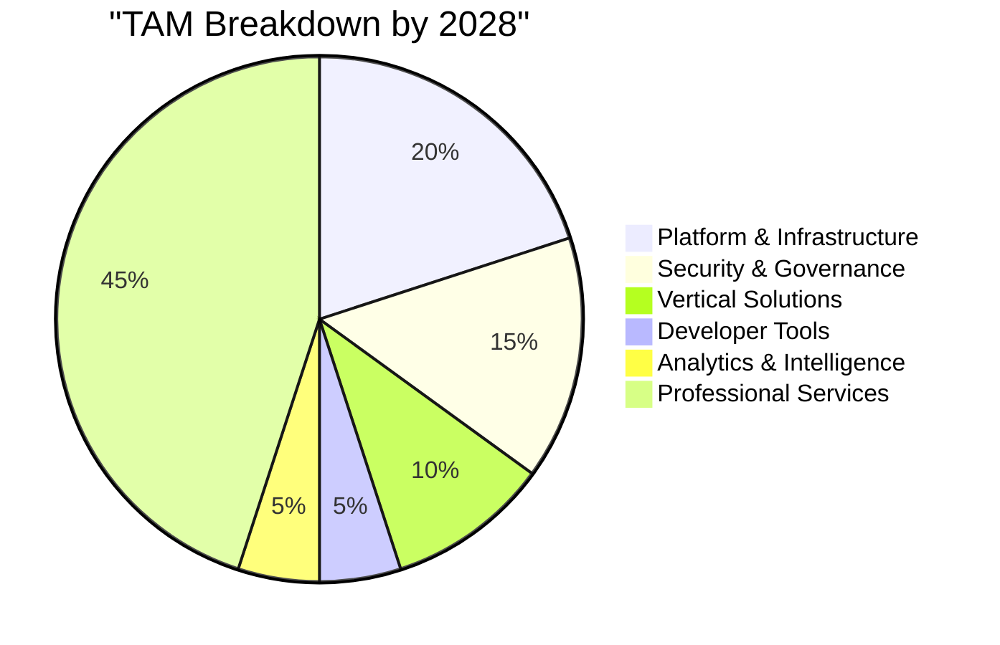

---

## 2. The 7 Strategic Plays: Where to Win

### Play #1: The Platform Foundation ($20B)

**Visão**: Construir o "AWS do MCP" - uma plataforma foundational que todos precisarão.

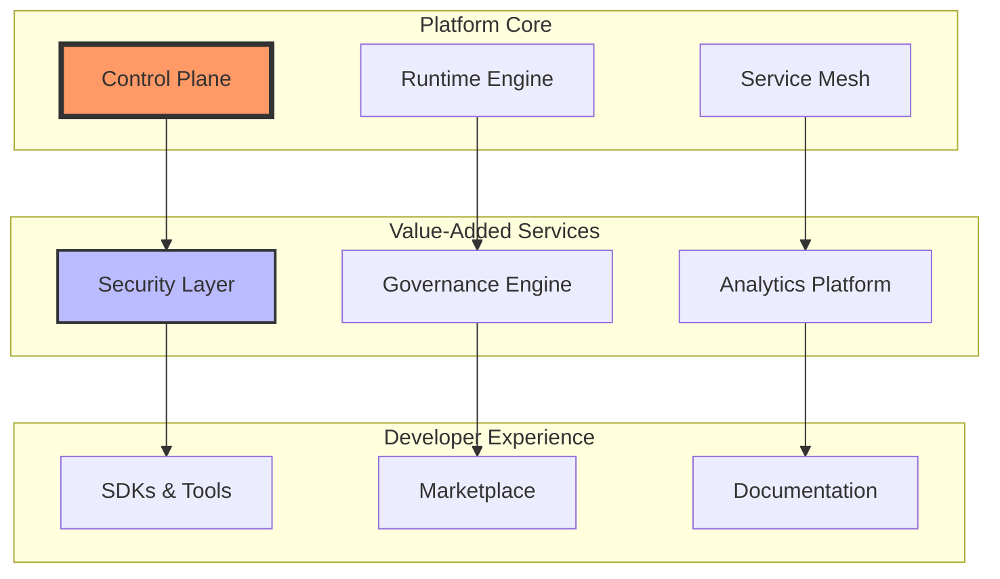

**Estratégia de Execução**:

1. **Q1 2024**: MVP com core runtime
2. **Q2 2024**: Security layer
3. **Q3 2024**: Developer experience
4. **Q4 2024**: Marketplace launch

**Moat Building**:

- Network effects através do marketplace
- Lock-in através de dados e configurações
- Switching costs através de integrações profundas

### Play #2: Security & Compliance Suite ($15B)

**Visão**: Tornar MCP "enterprise-ready" com security-first approach.

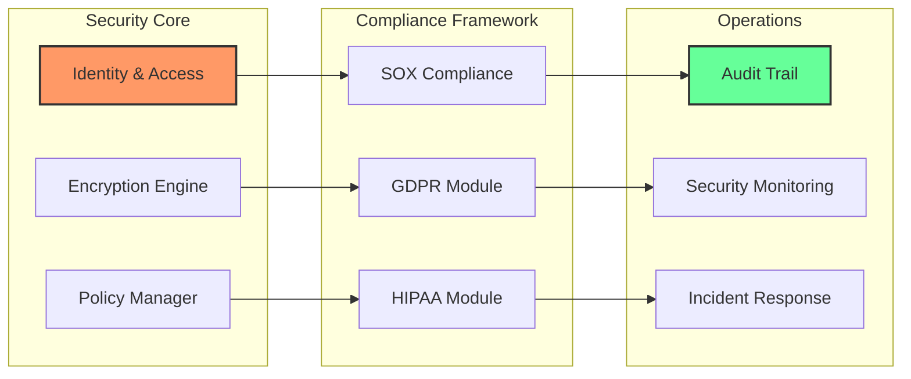

**Diferenciação**:

- Zero Trust architecture nativa
- Compliance-as-code
- AI-powered threat detection
- Automated audit reports

### Play #3: Vertical Industry Solutions ($10B)

**Target Verticals & Use Cases**:

|Vertical|Primary Use Case|TAM|Urgency|
|---|---|---|---|
|**Financial Services**|Risk & Compliance AI|$3B|Critical|
|**Healthcare**|Clinical Decision Support|$2.5B|High|
|**Manufacturing**|Digital Twin Integration|$2B|Medium|
|**Legal**|Contract Intelligence|$1.5B|High|
|**Retail**|Customer 360 AI|$1B|Medium|

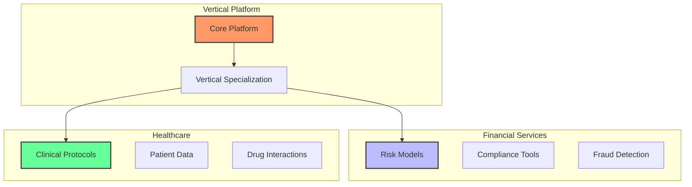

### Play #4: Developer Experience Platform ($5B)

**Componentes Críticos**:

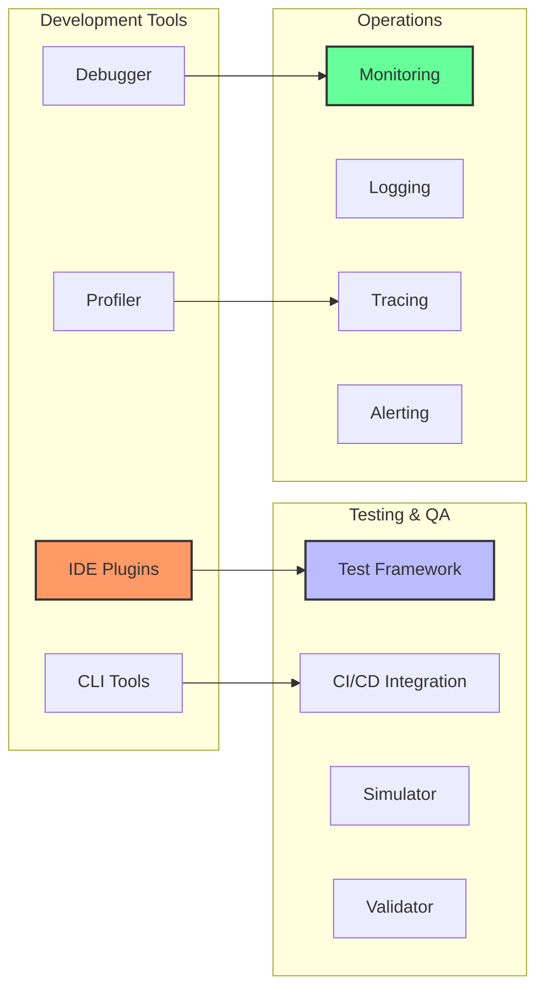

**Developer Journey Optimization**:

1. **Onboarding**: < 5 minutos para "Hello World"
2. **Development**: Visual tools + code generation
3. **Testing**: Automated test generation
4. **Deployment**: One-click deployment
5. **Operations**: Self-healing systems

### Play #5: Analytics & Intelligence Platform ($5B)

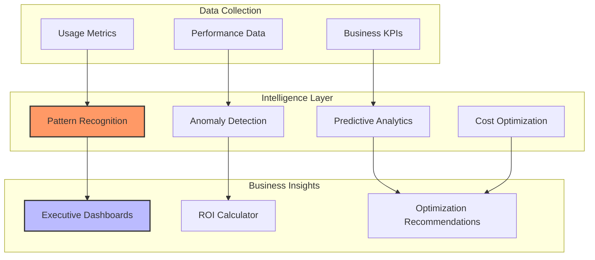

### Play #6: Professional Services Ecosystem ($45B)

**Service Portfolio**:

|Service Type|Description|Revenue Model|Margin|
|---|---|---|---|
|**Implementation**|Platform deployment|Fixed price|40%|
|**Integration**|Custom connectors|Time & materials|50%|
|**Training**|Certification programs|Per seat|70%|
|**Support**|24/7 enterprise support|Subscription|60%|
|**Consulting**|Strategy & architecture|Daily rate|80%|

### Play #7: The Network Effect Maximizer

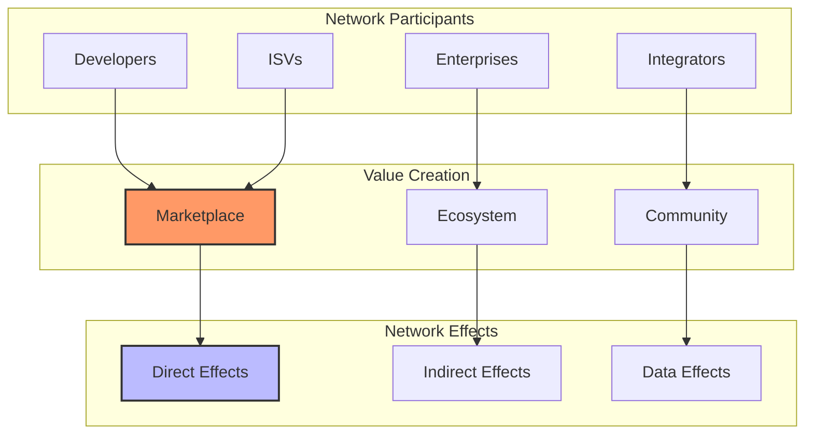

---

## 3. Go-to-Market Strategy: The 18-Month Plan

### 3.1 Market Entry Sequence

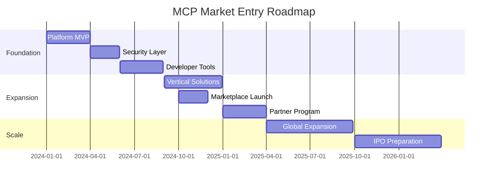

### 3.2 Customer Acquisition Strategy

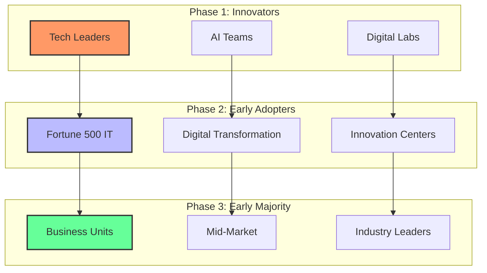

### 3.3 Pricing Strategy

|Tier|Target Customer|Price Point|Features|
|---|---|---|---|
|**Developer**|Individual devs|Free|Core platform, community support|
|**Startup**|Small teams|$499/month|+ Security, basic support|
|**Business**|Mid-market|$4,999/month|+ Compliance, priority support|
|**Enterprise**|Fortune 5000|Custom|+ SLA, dedicated support, custom features|

---

## 4. Building the Moat: Sustainable Competitive Advantage

### 4.1 The Four Moats Strategy

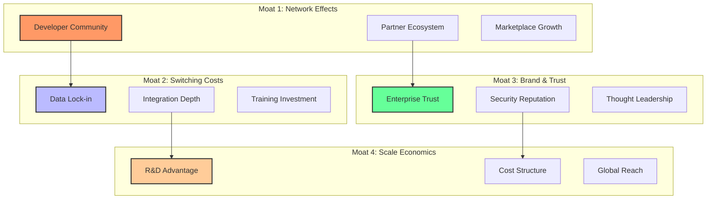

### 4.2 Competitive Response Framework

|Competitor Type|Threat Level|Response Strategy|
|---|---|---|
|**Cloud Giants** (AWS, Azure)|High|Partner for infrastructure, compete on specialization|
|**AI Leaders** (OpenAI, Anthropic)|Medium|Deep integration partnerships|
|**Integration Vendors** (MuleSoft)|Medium|Superior AI capabilities|
|**Startups**|Low|Acquire or out-execute|

---

## 5. Financial Model & Investment Requirements

### 5.1 Revenue Projections

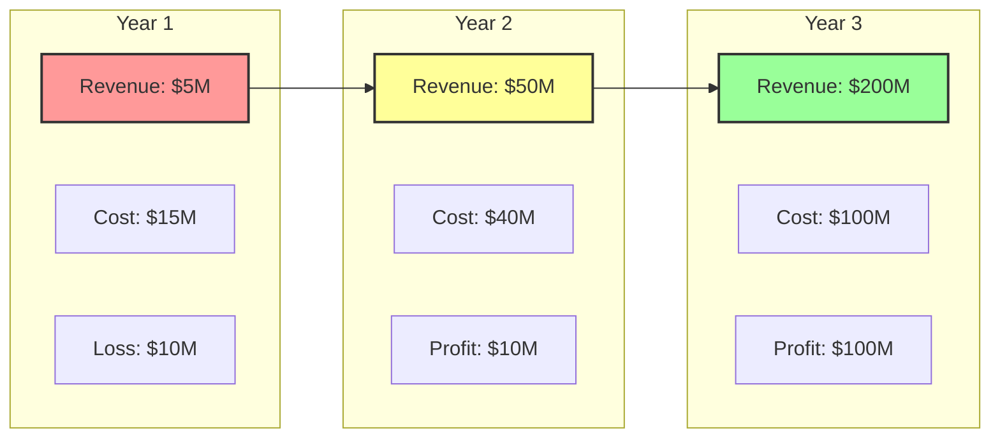

### 5.2 Investment Requirements

|Phase|Amount|Use of Funds|Expected Outcome|
|---|---|---|---|
|**Seed**|$5M|MVP development|Platform launch|
|**Series A**|$25M|Market expansion|1,000 customers|
|**Series B**|$75M|Scale operations|Market leadership|
|**Series C**|$150M|Global expansion|IPO readiness|

### 5.3 Unit Economics

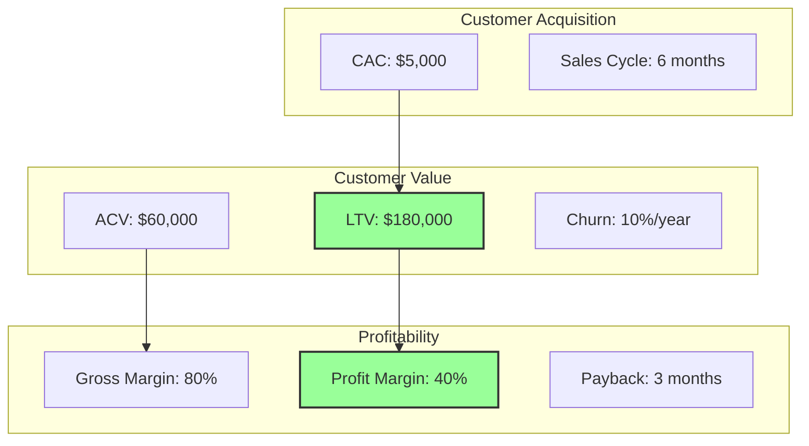

---

## 6. Risk Management & Mitigation

### 6.1 Risk Heat Map

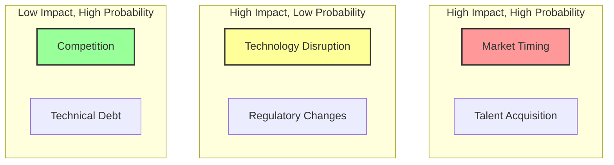

### 6.2 Mitigation Strategies

|Risk Category|Specific Risk|Mitigation Strategy|Owner|
|---|---|---|---|
|**Market**|Adoption slower than expected|Aggressive free tier, education programs|CMO|
|**Technology**|Security vulnerabilities|Bug bounty, security audits, insurance|CISO|
|**Financial**|Burn rate too high|Milestone-based funding, cost controls|CFO|
|**Regulatory**|Compliance requirements|Proactive engagement, compliance team|Legal|
|**Competitive**|Big Tech entry|Partnership strategy, fast execution|CEO|

---

## 7. Implementation Roadmap: The First 100 Days

### Days 1-30: Foundation

- [ ] Establish executive team
- [ ] Secure initial funding
- [ ] Define technical architecture
- [ ] Begin recruiting core team

### Days 31-60: Build

- [ ] Develop MVP platform
- [ ] Create go-to-market strategy
- [ ] Establish key partnerships
- [ ] Launch developer preview

### Days 61-100: Launch

- [ ] Public beta launch
- [ ] First customer acquisitions
- [ ] Gather feedback and iterate
- [ ] Prepare Series A fundraising

---

## 8. Success Metrics & KPIs

### 8.1 North Star Metrics

1. **Platform Adoption**: Active MCP implementations
2. **Developer Velocity**: Time to deploy new integrations
3. **Enterprise Value**: Quantifiable business impact

### 8.2 Operational Dashboard

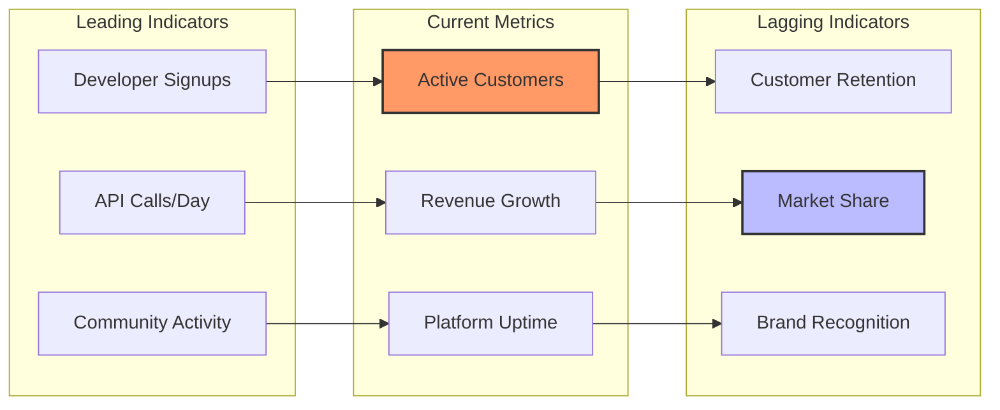

---

## 9. The Vision: MCP-Powered Future

### 9.1 The Autonomous Enterprise (2030)

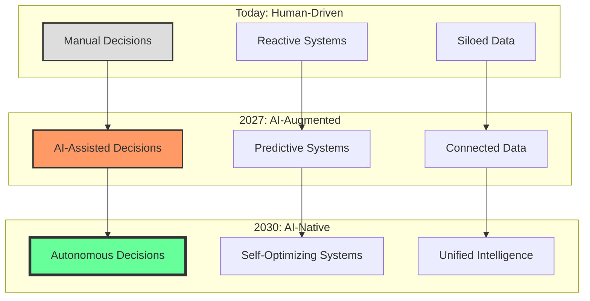

### 9.2 The MCP Ecosystem Vision

> "Em 2030, MCP será o sistema operacional invisível que conecta toda inteligência artificial enterprise, permitindo que organizações operem com a velocidade do pensamento e a precisão da máquina." - Visão de Futuro

---

## 10. Call to Action: O Momento é Agora

### Por que Você Deve Agir Imediatamente

1. **Window of Opportunity**: 12-18 meses antes da consolidação
2. **First Mover Advantage**: Definir padrões do mercado
3. **Talent Availability**: Melhores talentos ainda disponíveis
4. **Investment Climate**: VCs procurando o próximo grande platform play

### Próximos Passos Concretos

#### Semana 1

- [ ] Formar comitê executivo de MCP
- [ ] Avaliar capacidades internas
- [ ] Identificar quick wins

#### Mês 1

- [ ] Desenvolver business case
- [ ] Iniciar POC técnico
- [ ] Engajar stakeholders chave

#### Trimestre 1

- [ ] Lançar piloto em produção
- [ ] Medir resultados iniciais
- [ ] Definir estratégia de scale

### Investimento Necessário

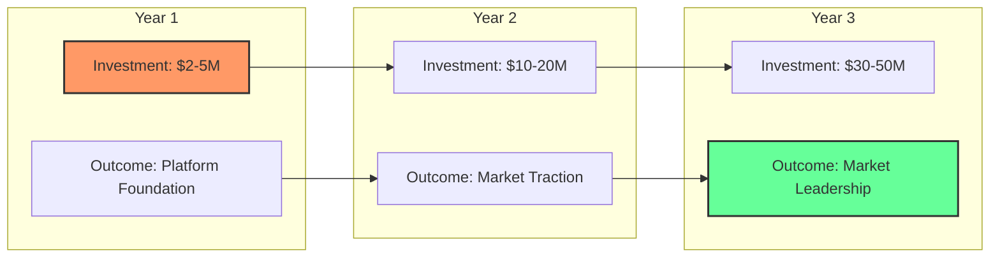

---

## Conclusão: A Escolha Estratégica

Estamos em um momento de inflexão tecnológica comparável ao surgimento da internet ou do mobile. O MCP não é apenas uma tecnologia - é a fundação para a próxima era da computação enterprise.

As organizações enfrentam uma escolha clara:

1. **Liderar**: Investir agora e definir o futuro
2. **Seguir**: Esperar e pagar mais caro depois
3. **Ficar para trás**: Ignorar e tornar-se irrelevante

> "A questão não é SE o MCP transformará seu negócio, mas QUANDO e COMO você aproveitará essa transformação." - Reflexão Final

### O Imperativo da Ação

**Se você só lembrar de três coisas deste documento:**

1. 🏃‍♂️ **Velocidade é tudo** - Os próximos 18 meses definirão os vencedores
2. 🔒 **Security-first** - Enterprises não adotarão sem confiança
3. 🌟 **Think platform, not product** - Network effects definirão o sucesso

**O futuro pertence àqueles que agem agora.**

---
