# Agent Graphs no MCP: A Próxima Fronteira

## O Que São Agent Graphs?

Agent Graphs representam a evolução do MCP de uma arquitetura hierárquica simples (host → client → server) para topologias complexas onde agentes podem se comunicar em padrões arbitrários, formando grafos de colaboração.

## De Onde Viemos Vs Para Onde Vamos

### Arquitetura MCP Atual (Hierárquica)

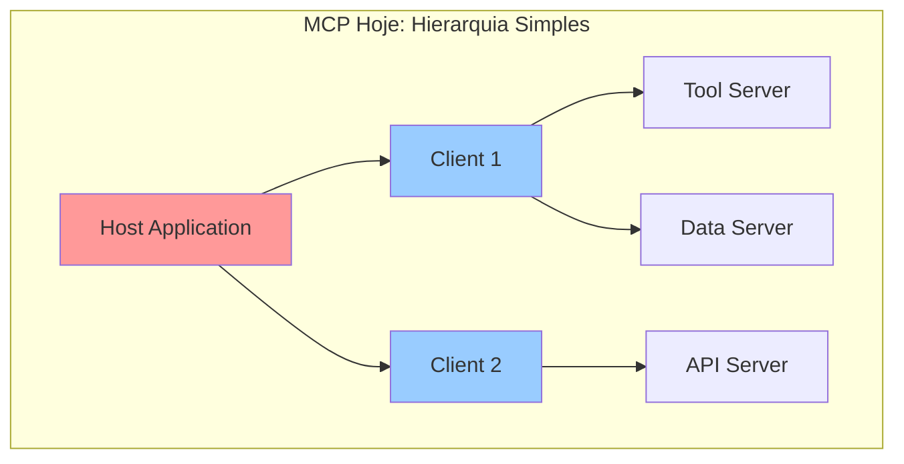

**Limitações atuais:**

- Comunicação apenas host → client → server
- Sem comunicação direta entre clientes
- Sem comunicação entre servidores
- Topologia rígida e hierárquica

### Arquitetura Com Agent Graphs (Grafo Flexível)

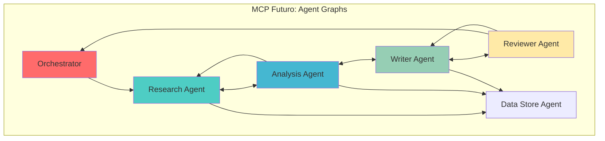

## Problemas Que Agent Graphs Resolvem

### 1. Colaboração Complexa Entre Agentes

**Problema Atual:**

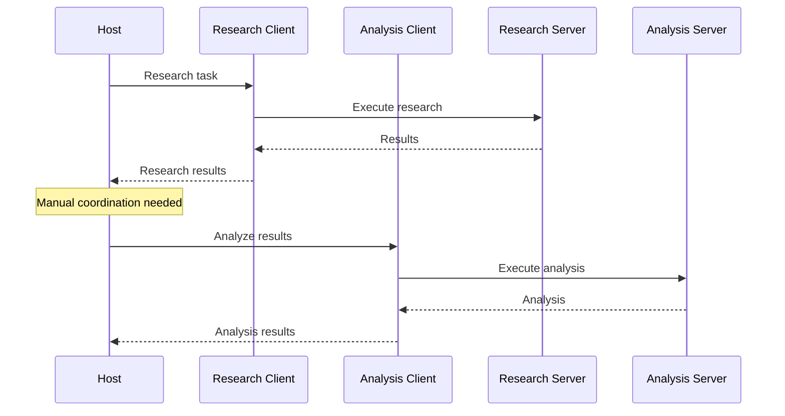

**Solução com Agent Graphs:**

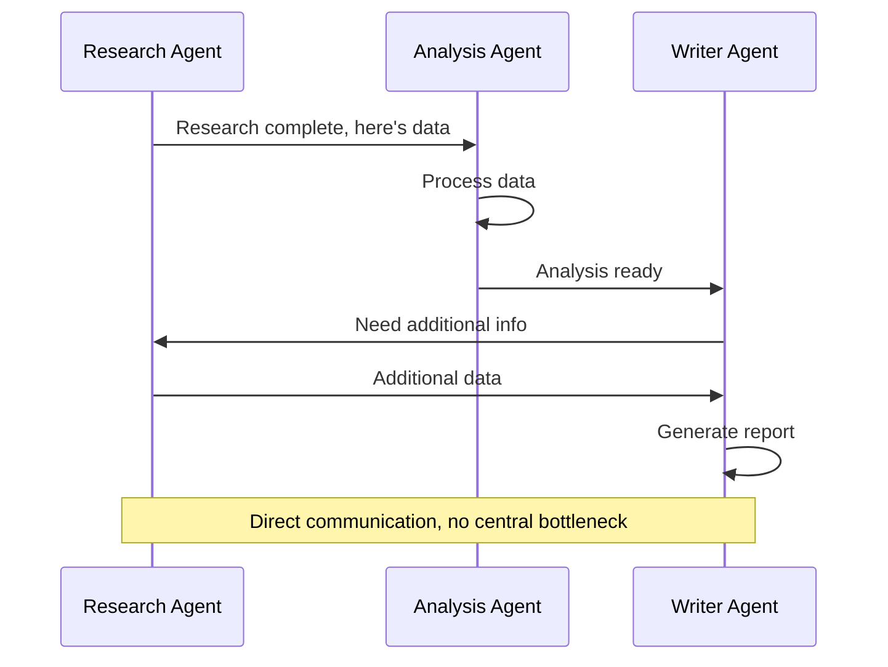

### 2. Workflows Dinâmicos E Adaptativos

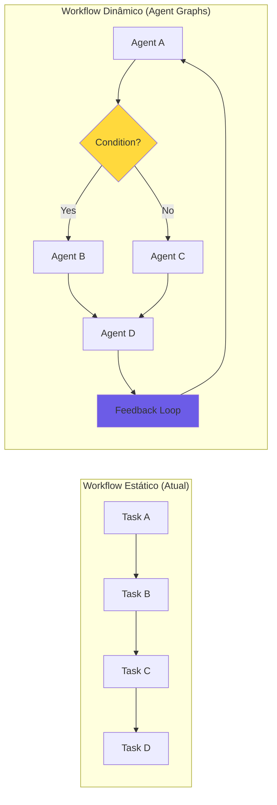

### 3. Padrões De Comunicação Avançados

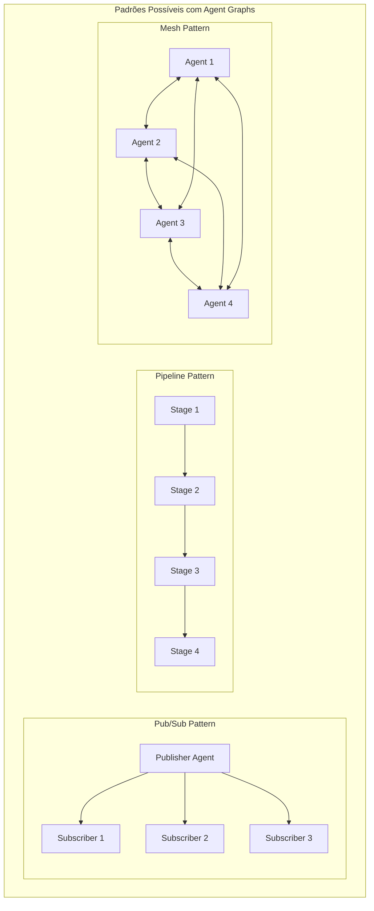

## Casos De Uso Práticos

### 1. Sistema De Pesquisa Colaborativo

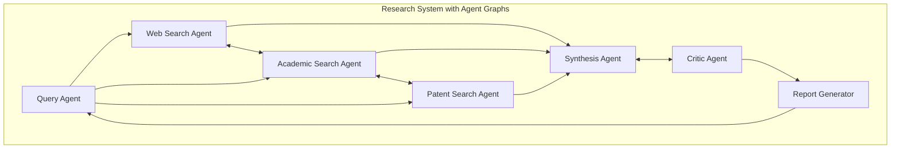

### 2. Sistema De Desenvolvimento De Software

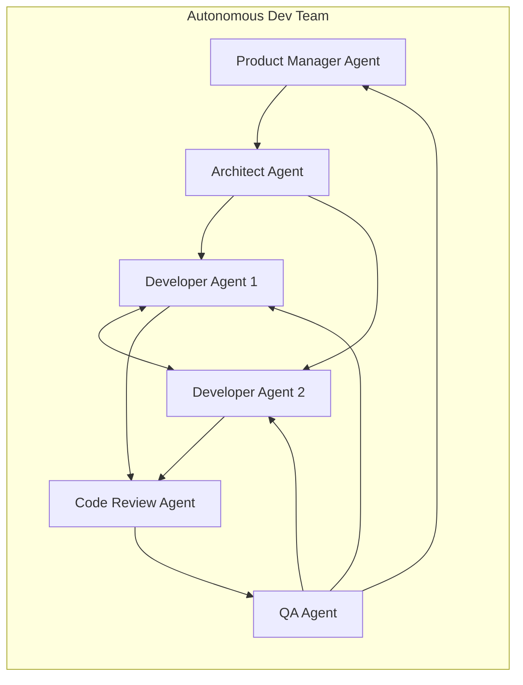

### 3. Sistema De Trading Financeiro

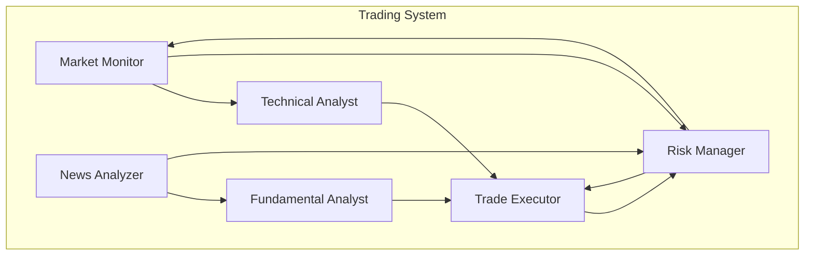

## Recursos Técnicos Dos Agent Graphs

### 1. Roteamento Inteligente De Mensagens

```typescript
interface GraphMessage {
  from: AgentId;
  to: AgentId | AgentId[]; // Unicast ou multicast
  type: 'direct' | 'broadcast' | 'pattern';
  content: any;
  metadata: {
    priority: number;
    ttl: number;
    route?: AgentId[]; // Caminho específico
  };
}

class GraphRouter {
  async route(message: GraphMessage) {
    if (message.type === 'pattern') {
      // Roteamento baseado em padrões
      const matches = this.findMatchingAgents(message.pattern);
      return this.multicast(message, matches);
    }
    
    // Encontra melhor caminho no grafo
    const path = this.findOptimalPath(message.from, message.to);
    return this.routeViaPath(message, path);
  }
}
```

### 2. Descoberta Dinâmica De Agentes

```typescript
interface AgentDiscovery {
  // Encontra agentes por capacidade
  findByCapability(capability: string): AgentId[];
  
  // Encontra agentes por tipo
  findByType(type: AgentType): AgentId[];
  
  // Encontra vizinhos diretos
  getNeighbors(agentId: AgentId): AgentId[];
  
  // Encontra caminhos entre agentes
  findPaths(from: AgentId, to: AgentId): AgentId[][];
}
```

### 3. Coordenação E Consenso

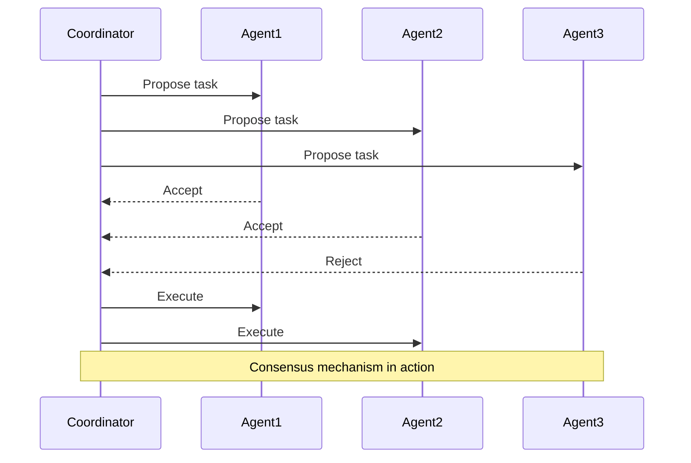

## Desafios De Implementação

### 1. Gerenciamento De Estado Distribuído

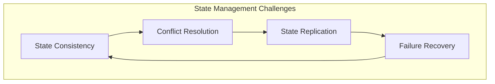

### 2. Ciclos E Deadlocks

```typescript
class DeadlockDetector {
  // Detecta ciclos no grafo de dependências
  detectCycles(graph: AgentGraph): Cycle[] {
    // Algoritmo de detecção de ciclos
  }
  
  // Previne deadlocks
  preventDeadlock(transaction: Transaction): boolean {
    // Verificação de ordenação de recursos
  }
}
```

### 3. Escalonamento E Performance

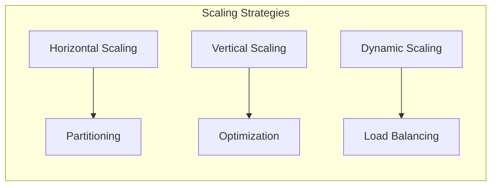

## Comparação: Antes E Depois

|Aspecto|MCP Atual|MCP com Agent Graphs|
|---|---|---|
|Topologia|Hierárquica (árvore)|Grafo arbitrário|
|Comunicação|Host → Client → Server|Any → Any|
|Coordenação|Centralizada no host|Distribuída|
|Workflows|Estáticos|Dinâmicos|
|Descoberta|Manual|Automática|
|Escala|Limitada|Horizontal|
|Complexidade|Baixa|Alta|

## Impacto no Ecossistema

### 1. Novos Padrões De Aplicação

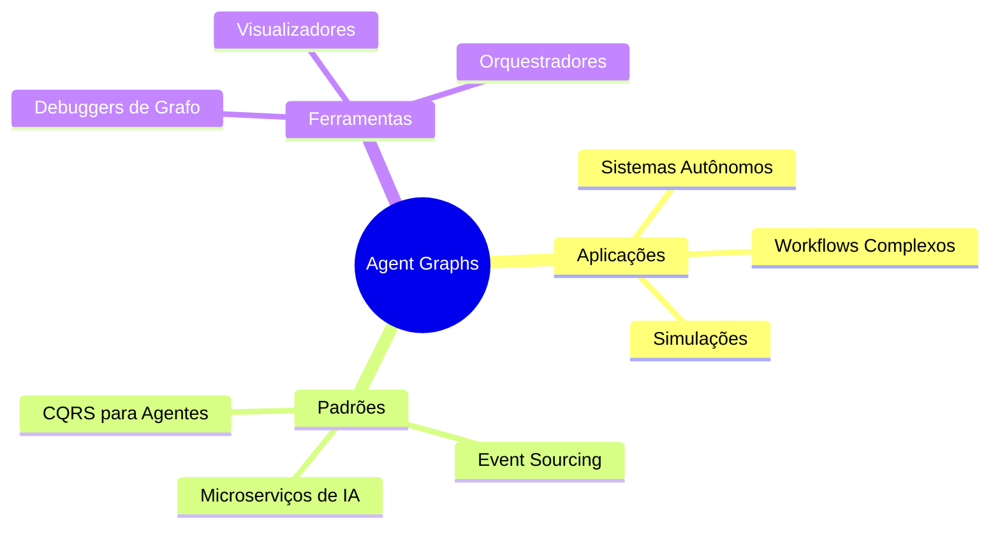

### 2. Convergência Com A2A

Agent Graphs aproximam o MCP do modelo peer-to-peer do A2A:

- Comunicação direta entre agentes
- Descoberta dinâmica
- Protocolos de consenso
- Roteamento distribuído

## Conclusão

Agent Graphs representam uma **mudança fundamental** no MCP:

1. **De ferramenta para plataforma** - MCP evolui de conectar ferramentas para orquestrar sistemas complexos
2. **De hierárquico para distribuído** - Permite arquiteturas mais flexíveis e resilientes
3. **De estático para dinâmico** - Workflows podem se adaptar em tempo real
4. **Convergência natural** - Aproxima MCP de outros protocolos como A2A

Essa evolução posiciona o MCP como uma plataforma completa para sistemas multi-agente, não apenas como um protocolo de integração de ferramentas.