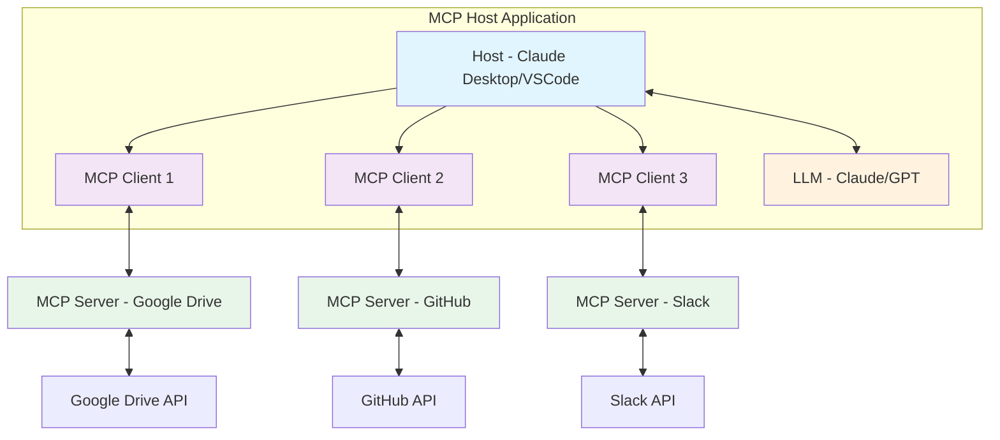
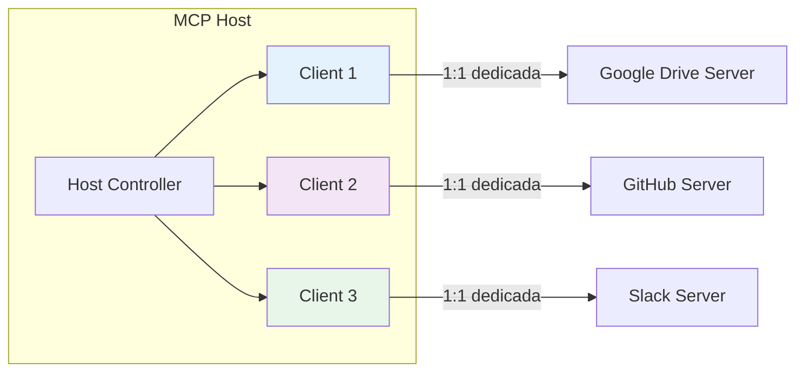
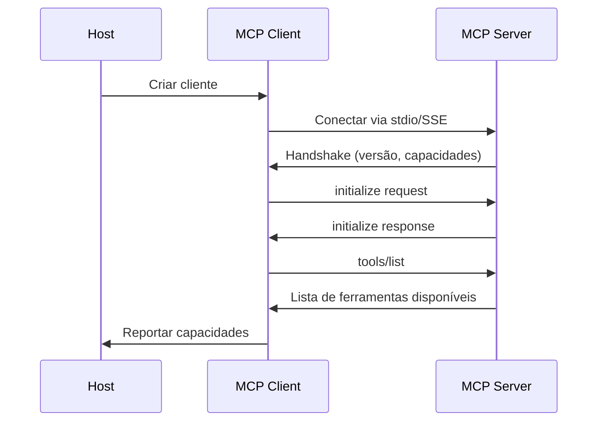
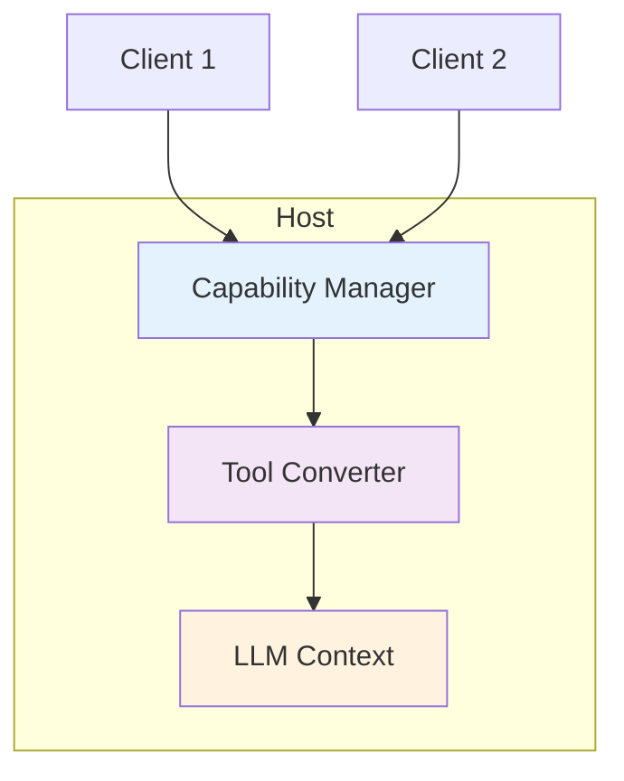
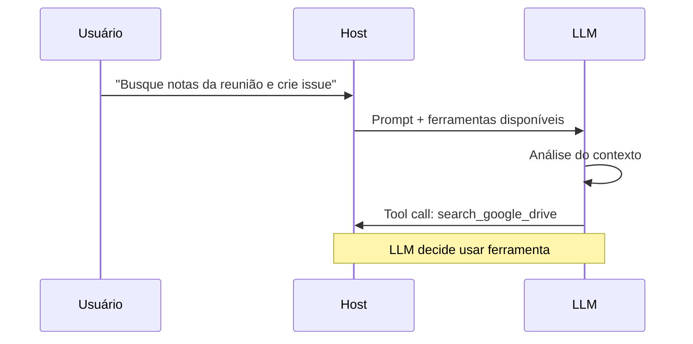
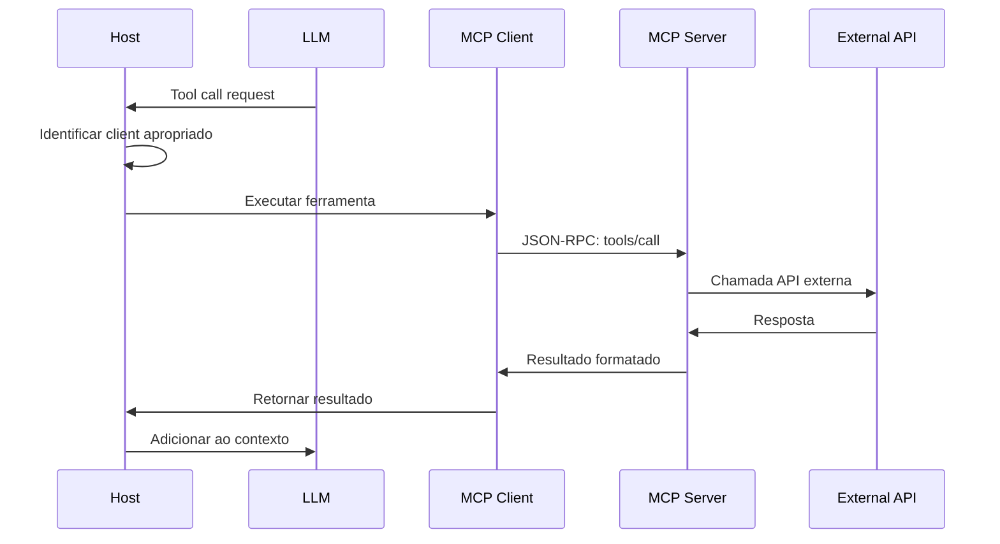
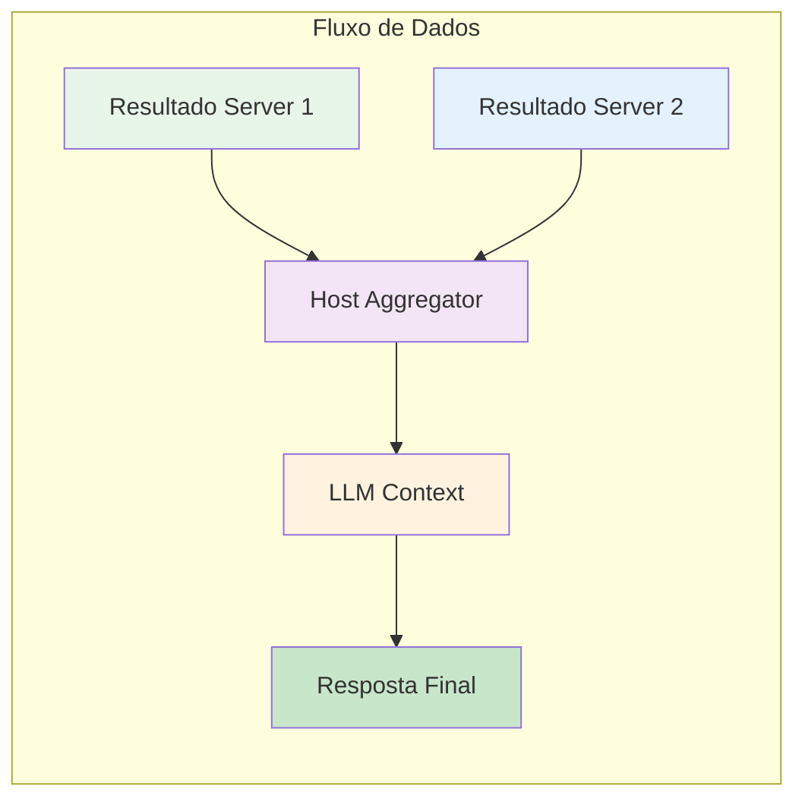
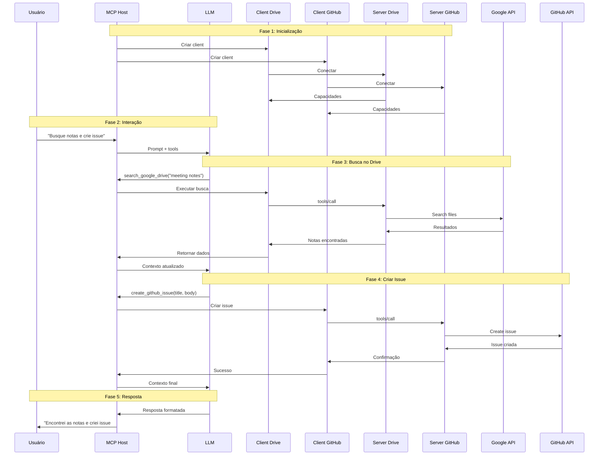
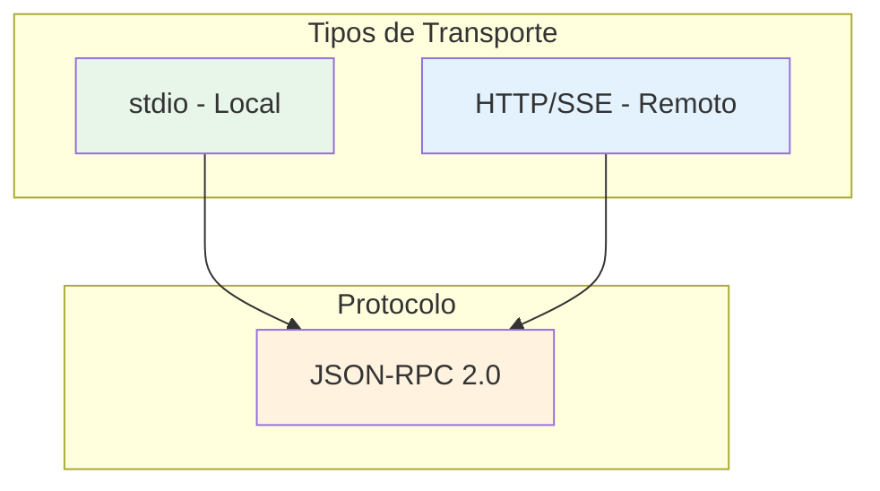
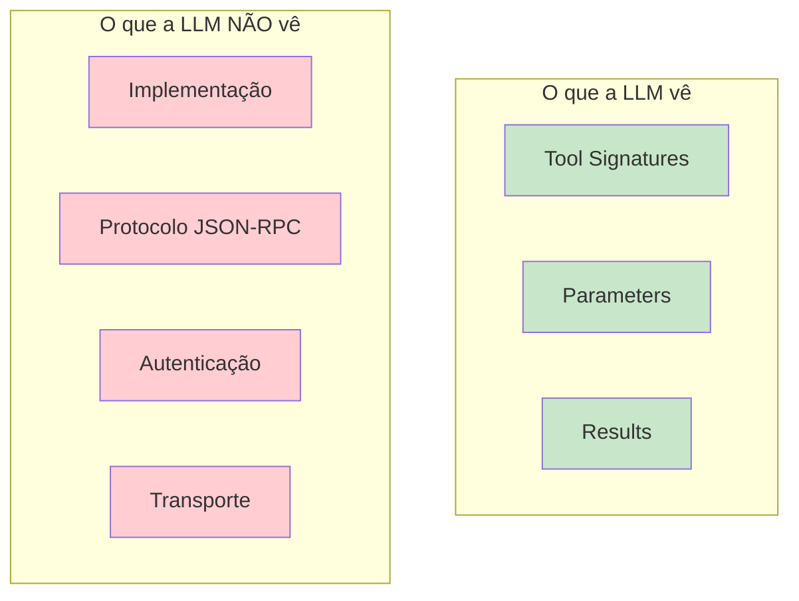

# Passo a passo - do prompt 

## Introdução Ao MCP

O Model Context Protocol (MCP) é um protocolo aberto que padroniza como aplicações de IA se conectam a ferramentas e fontes de dados externas. Funciona como um "USB-C para IA" - um conector universal que permite que modelos de linguagem acessem diferentes sistemas sem necessidade de integrações customizadas.

## Arquitetura MCP - Componentes Principais



### Componentes E Suas Responsabilidades

#### 1. MCP Host

- Aplicação principal que o usuário interage (Claude Desktop, VSCode, Cursor)
- Coordena todo o sistema
- Gerencia interações com a LLM
- Cria e mantém múltiplos MCP Clients

#### 2. MCP Client

- Componente dentro do host
- Mantém conexão 1:1 com um MCP Server específico
- Gerencia protocolo JSON-RPC 2.0
- Descobre capacidades do server
- Roteia requisições e respostas

#### 3. MCP Server

- Programa externo que expõe funcionalidades
- Oferece três tipos de capacidades:
    - **Tools**: Funções executáveis
    - **Resources**: Dados acessíveis
    - **Prompts**: Templates pré-definidos
- Conecta-se a sistemas externos (APIs, bancos de dados, etc.)

## Relação Client-Server (1:1)



Cada MCP Client mantém uma conexão exclusiva com seu MCP Server correspondente, garantindo:

- Isolamento entre conexões
- Segurança e estabilidade
- Gerenciamento de estado independente
- Simplicidade na comunicação

## Fluxo Detalhado De Operação

### Fase 1: Inicialização E Descoberta



1. **Carregamento de Configuração**
    
    ```json
    {
      "mcpServers": {
        "google-drive": {
          "command": "node",
          "args": ["@modelcontextprotocol/server-gdrive"]
        },
        "github": {
          "command": "python",
          "args": ["-m", "mcp_server_github"]
        }
      }
    }
    ```
    
2. **Criação de Clients**
    
    - Para cada server configurado, o host cria um MCP Client
    - Client inicia conexão com seu server
3. **Descoberta de Capacidades**
    
    - Server anuncia suas ferramentas, recursos e prompts
    - Client coleta e reporta ao host

### Fase 2: Preparação Do Ambiente LLM



O host:

1. Coleta todas as capacidades dos servers
2. Converte para formato de ferramentas da LLM
3. Injeta no contexto/instruções de sistema

Exemplo de ferramentas expostas à LLM:

```json
{
  "available_tools": [
    {
      "name": "search_google_drive",
      "description": "Search files in Google Drive",
      "parameters": {
        "query": {
          "type": "string",
          "description": "Search query"
        }
      }
    },
    {
      "name": "create_github_issue",
      "description": "Create a new GitHub issue",
      "parameters": {
        "title": {"type": "string"},
        "body": {"type": "string"},
        "labels": {"type": "array", "items": {"type": "string"}}
      }
    }
  ]
}
```

### Fase 3: Interação Usuário-LLM



### Fase 4: Execução De Ferramentas



Exemplo de mensagem JSON-RPC:

```json
{
  "jsonrpc": "2.0",
  "id": "call_123",
  "method": "tools/call",
  "params": {
    "name": "search_google_drive",
    "arguments": {
      "query": "meeting notes yesterday"
    }
  }
}
```

### Fase 5: Processamento De Resultados



## Fluxo Completo - Exemplo Prático



## Mecanismos De Transporte



### 1. Standard Input/Output (stdio)

- Para servers locais
- Comunicação via streams de entrada/saída
- Ideal para ferramentas CLI
- Baixa latência

### 2. HTTP Com Server-Sent Events (SSE)

- Para servers remotos
- Conexões persistentes
- Suporte a eventos em tempo real
- Escalável para cloud

## Formato De Mensagens

### Requisição De Ferramenta

```json
{
  "jsonrpc": "2.0",
  "id": "req_1",
  "method": "tools/call",
  "params": {
    "name": "search_files",
    "arguments": {
      "query": "project proposal",
      "limit": 10
    }
  }
}
```

### Resposta De Ferramenta

```json
{
  "jsonrpc": "2.0",
  "id": "req_1",
  "result": {
    "files": [
      {
        "id": "file_123",
        "name": "Project Proposal Q2.docx",
        "path": "/documents/proposals/",
        "modified": "2025-05-08T14:30:00Z"
      }
    ]
  }
}
```

## Separação De Responsabilidades



## Benefícios Da Arquitetura MCP

1. **Padronização**: Um protocolo para múltiplos sistemas
2. **Modularidade**: Componentes independentes e reutilizáveis
3. **Escalabilidade**: Fácil adicionar novos servers
4. **Segurança**: Isolamento entre conexões
5. **Flexibilidade**: Suporte a diferentes transportes
6. **Simplicidade**: Interface clara para desenvolvedores

## Conclusão

O MCP resolve o problema de conectar IAs a sistemas externos de forma padronizada. Com sua arquitetura cliente-servidor e relação 1:1 entre clients e servers, oferece uma solução robusta, segura e escalável para integração de ferramentas em aplicações de IA.

A separação clara de responsabilidades entre Host, Client e Server permite que cada componente evolua independentemente, enquanto o protocolo JSON-RPC 2.0 garante comunicação confiável e padronizada.