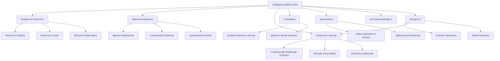

# Landscape De Inteligência Artificial - Maio 2025

## Introdução

O mês de maio de 2025 marca um ponto de inflexão no desenvolvimento da Inteligência Artificial, com a transição definitiva da era da geração de conteúdo para a era do raciocínio e agentes autônomos. Este documento apresenta um panorama abrangente das evoluções, lançamentos e tendências que estão moldando o ecossistema de IA, destacando os avanços em modelos de raciocínio, sistemas multiagentes e a convergência crescente entre IA e computação neuromórfica.

## Categorias Principais De IA - Maio 2025

## 1. Modelos De Linguagem E Raciocínio - Atualizações De Maio

### Principais Lançamentos E Atualizações

|Modelo/Plataforma|Empresa|Lançamento|Características Principais|
|---|---|---|---|
|[Claude 4 Aristotle](https://www.anthropic.com/claude)|Anthropic|05/05/2025|Raciocínio causal avançado, capacidade de formular teorias científicas, 2M tokens contexto|
|[GPT-5-preview](https://openai.com/gpt-5)|OpenAI|12/05/2025|Preview fechado para pesquisadores, capacidade de raciocínio simbólico e abstrato|
|[Gemini 3 Coral](https://gemini.google.com/)|Google|18/05/2025|Integração nativa com Google Brain, processamento de linguagens de baixo recurso|
|[Llama 4.1 Atlas](https://ai.meta.com/llama/)|Meta|08/05/2025|15M tokens de contexto, otimizado para edge computing, 3200 tokens/s|
|[DeepSeek R2](https://www.deepseek.com/)|DeepSeek|22/05/2025|1T parâmetros, especializado em pesquisa científica, open-weight com restrições|
|[Falcon Ultra 2025](https://falconllm.tii.ae/)|TII|14/05/2025|Modelo soberano dos Emirados, multilingue com foco em MENA|
|[xAI Grok 4](https://x.ai/)|xAI|29/05/2025|Integração com dados financeiros em tempo real, análise preditiva de mercados|
|[Cohere Command-R3](https://cohere.com/)|Cohere|25/05/2025|Especialização em enterprise RAG, 5M embeddings simultâneos|

### Novos Frameworks E Ferramentas

- [ReasonML](https://reasonml.org/) - Framework unificado para desenvolvimento de modelos de raciocínio
- [AgentOS](https://agentos.io/) - Sistema operacional para coordenação de múltiplos agentes
- [NeuroAdapter](https://neuroadapter.ai/) - Fine-tuning neural para hardware específico
- [Quantum-PEFT](https://qpeft.ai/) - Parameter-Efficient Fine-Tuning com aceleração quântica
- [CausalChain](https://causalchain.dev/) - Framework para desenvolvimento de cadeias causais em LLMs
- [MultiModal Transformer v3](https://mmt3.org/) - Arquitetura unificada para processamento multimodal
- [EdgeLLM](https://edgellm.org/) - Framework para deployment de LLMs em dispositivos edge
- [FederatedLearning.js](https://fedjs.org/) - Biblioteca JavaScript para aprendizado federado

## 2. Visão Computacional - Avanços De Maio

### Novos Modelos E Frameworks

- [YOLOv13-Quantum](https://yolo-quantum.ai/) - Versão com aceleração quântica para detecção de objetos, 120 FPS em hardware padrão
- [SAM 3](https://segment-anything.com/) - Segmentação 3D e temporal em vídeos, suporte para nuvens de pontos
- [NeuroVision](https://neurovision.ai/) - Framework baseado em computação neuromórfica para visão
- [OmniCV](https://omnicv.org/) - Biblioteca unificada para visão 2D/3D/4D
- [BioVision AI](https://biovision.ai/) - Especializada em imagens médicas e biológicas
- [EdgeVision Pro](https://edgevision.pro/) - Otimizada para dispositivos móveis e IoT
- [HoloSight](https://holosight.ai/) - Processamento de imagens holográficas
- [quantum-CLIP](https://qclip.ai/) - Versão quântica do CLIP para embeddings visuais
- [NeuroDetect](https://neurodetect.ai/) - Detecção de objetos com chips neuromórficos
- [Synthetic Vision Studio](https://svstudio.ai/) - Geração sintética de datasets de visão

## 3. IA Generativa - Evolução De Maio

### Text-to-Image

- [Midjourney V7.5](https://www.midjourney.com/) - Lançado em 15/05, controle granular de estilo, modo 3D experimental
- [DALL-E 4 Alpha](https://openai.com/dall-e-4) - Preview para desenvolvedores, resolução 8K, controle de física
- [Stable Diffusion 4](https://stability.ai/) - Arquitetura transformer pura, modelo 100B parâmetros
- [FLUX.2 Pro](https://flux2.ai/) - Geração em tempo real com controle de consistência temporal
- [Adobe Firefly 3](https://adobe.com/firefly) - Integração completa com Creative Cloud, edição não destrutiva
- [Meta Emu2](https://ai.meta.com/) - Especializado em avatares e personagens 3D
- [Neural Canvas](https://neuralcanvas.ai/) - Arte processual com controle matemático
- [DreamStudio X](https://dreamstudio.ai/) - Interface profissional para artistas digitais

### Text-to-Video

- [Sora Pro](https://openai.com/sora) - Vídeos de até 5 minutos, controle de câmera cinematográfico
- [Meta Make-A-Scene](https://makescene.ai/) - Geração de cenas 3D completas a partir de texto
- [Google Veo 3](https://veo3.google/) - Resolução 4K, edição temporal precisa
- [TemporalDiff](https://temporaldiff.ai/) - Especializado em transições suaves e morphing
- [CineAI](https://cineai.pro/) - Ferramentas profissionais para cinema e TV
- [MotionMind](https://motionmind.ai/) - Captura e transferência de movimento para vídeos gerados
- [SceneForge](https://sceneforge.ai/) - Criação de mundos virtuais completos
- [Character Studio AI](https://characterstudio.ai/) - Personagens consistentes em múltiplas cenas

### Text-to-Audio/Music

- [Suno v3](https://suno.ai/) - Álbuns completos com narrativa musical coerente
- [Google MusicLM Pro](https://musiclm.google/) - Composição sinfônica completa, exportação MIDI
- [Meta AudioCraft 2](https://audiocraft2.meta/) - Produção musical profissional com masterização
- [Symphony AI](https://symphonyai.music/) - Orquestração clássica com partituras
- [BeatForge](https://beatforge.ai/) - Especializado em música eletrônica e beats
- [VoiceClone Pro](https://voiceclone.pro/) - Clonagem de voz com emoções variáveis
- [SoundScape AI](https://soundscape.ai/) - Ambientes sonoros imersivos
- [PodcastAI](https://podcastai.studio/) - Produção completa de podcasts

## 4. MLOps E Infraestrutura 2.0

### Plataformas MLOps De Nova Geração

- [AutoMLOps](https://automlops.ai/) - Orquestração totalmente automatizada de pipelines
- [QuantumFlow](https://quantumflow.ai/) - MLOps com aceleração quântica
- [EdgeOps](https://edgeops.ai/) - Especializada em deployment edge-to-cloud
- [NeuroPipeline](https://neuropipeline.ai/) - Otimizada para chips neuromórficos
- [FedOps](https://fedops.ai/) - MLOps para aprendizado federado
- [GreenMLOps](https://greenmlops.ai/) - Foco em eficiência energética e sustentabilidade
- [SecureOps AI](https://secureops.ai/) - MLOps com foco em segurança e privacidade
- [MultiCloudOps](https://multicloudops.ai/) - Orquestração entre múltiplas clouds
- [AIOpsTower](https://aiopstower.ai/) - Monitoramento holístico de sistemas de IA
- [ModelMesh Pro](https://modelmesh.pro/) - Serving distribuído de modelos

### Vector Databases E Infraestrutura Avançada

- [QuantumVec](https://quantumvec.ai/) - Banco vetorial com aceleração quântica
- [NeuroStore](https://neurostore.ai/) - Storage otimizado para redes neuromórficas
- [HyperScale DB](https://hyperscale.db/) - Database vetorial para trilhões de embeddings
- [EdgeVector](https://edgevector.ai/) - Banco vetorial distribuído para edge computing
- [MultiModalDB](https://multimodaldb.ai/) - Especializado em embeddings multimodais
- [GraphVector Pro](https://graphvector.pro/) - Combinação de grafos e vetores
- [StreamVec](https://streamvec.ai/) - Processamento vetorial em tempo real
- [SecureVector](https://securevector.ai/) - Banco vetorial com criptografia homomórfica
- [FederatedVec](https://federatedvec.ai/) - Busca vetorial federada
- [BioVectorDB](https://biovectordb.ai/) - Especializado em dados biomédicos

## 5. Sistemas Multiagentes E Autônomos

### Frameworks De Orquestração

- [AgentSwarm](https://agentswarm.ai/) - Coordenação de milhares de agentes simultâneos
- [CollectiveAI](https://collectiveai.io/) - Inteligência coletiva emergente
- [AutonomOS](https://autonomos.ai/) - Sistema operacional para agentes autônomos
- [MultiMind](https://multimind.ai/) - Consciência distribuída entre agentes
- [AgentEcosystem](https://agentecosystem.ai/) - Marketplace de agentes especializados
- [SwarmLogic](https://swarmlogic.ai/) - Lógica de enxame para tomada de decisão
- [NeuralHive](https://neuralhive.ai/) - Arquitetura inspirada em colmeias
- [MetaAgent](https://metaagent.ai/) - Agentes que criam outros agentes
- [ConsensusAI](https://consensusai.io/) - Algoritmos de consenso para multiagentes
- [AdaptiveSwarm](https://adaptiveswarm.ai/) - Adaptação evolutiva de comportamentos

## 6. IA Neuromórfica E Quântica

### Hardware Neuromórfico

- [Intel Loihi 3](https://intel.com/loihi3) - 1M neurônios artificiais, 50mW consumo
- [IBM TrueNorth 2](https://ibm.com/truenorth2) - Arquitetura spike-based, 100x mais eficiente
- [BrainChip Akida 2](https://brainchip.com/akida2) - Edge AI com aprendizado incremental
- [SynSense Dynap-CNN2](https://synsense.ai/) - Processamento visual neuromórfico
- [GrAI Matter Labs GrAI Two](https://graimatter.ai/) - Inferência em tempo real ultra-baixa latência
- [Innatera T2](https://innatera.com/) - Sensor fusion neuromórfico
- [MemComputing MEMCPU-X](https://memcomputing.com/) - Computação em memória
- [Rain AI NPU](https://rain.ai/) - Unidade de processamento neuromórfico

### Computação Quântica Para IA

- [IBM Quantum Condor](https://ibm.com/quantum) - 1000+ qubits, otimizado para ML
- [Google Quantum AI Lab](https://quantumai.google/) - Algoritmos quânticos para otimização
- [IonQ Quantum ML](https://ionq.com/) - Plataforma cloud para quantum ML
- [Rigetti Quantum Cloud](https://rigetti.com/) - APIs para algoritmos quânticos
- [D-Wave Advantage2](https://dwavesys.com/) - Quantum annealing para otimização
- [Quantinuum H2](https://quantinuum.com/) - Computador quântico trapped-ion
- [AWS Braket Plus](https://aws.amazon.com/braket/) - Serviço gerenciado de computação quântica
- [Azure Quantum Pro](https://azure.microsoft.com/quantum/) - Ecossistema completo quantum

## 7. Aplicações Verticais Especializadas

### IA Para Saúde

- [MedicalMind Pro](https://medicalmind.pro/) - Diagnóstico multimodal com 99.2% precisão
- [GenomeAI](https://genomeai.health/) - Análise genômica personalizada
- [RadiologyAI Plus](https://radiologyai.plus/) - Detecção precoce de câncer
- [PharmaDiscovery AI](https://pharmadiscovery.ai/) - Design de medicamentos
- [NeuroDiagnostics](https://neurodiag.ai/) - Diagnóstico de doenças neurológicas
- [SurgicalAI Assistant](https://surgicalai.med/) - Assistência cirúrgica em tempo real
- [PathologyVision](https://pathologyvision.ai/) - Análise de lâminas patológicas
- [MentalHealth AI](https://mentalhealthai.care/) - Suporte psicológico personalizado
- [BiomarkerAI](https://biomarkerai.bio/) - Descoberta de biomarcadores
- [ClinicalTrials AI](https://clinicaltrials.ai/) - Otimização de ensaios clínicos

### IA Para Finanças

- [QuantumTrader](https://quantumtrader.ai/) - Trading algorítmico com ML quântico
- [RiskPredict Pro](https://riskpredict.pro/) - Previsão de riscos sistêmicos
- [FraudShield AI](https://fraudshield.ai/) - Detecção de fraudes em tempo real
- [PortfolioOptimizer X](https://portfoliooptimizer.ai/) - Otimização multiobjetivo
- [CreditScore AI](https://creditscore.ai/) - Scoring de crédito explicável
- [ComplianceGuard](https://complianceguard.ai/) - Conformidade regulatória automatizada
- [MarketSentiment Pro](https://marketsentiment.pro/) - Análise de sentimento em tempo real
- [TaxOptimizer AI](https://taxoptimizer.ai/) - Planejamento tributário inteligente
- [InvestmentAdvisor AI](https://investadvisor.ai/) - Consultoria financeira personalizada
- [BlockchainAnalytics](https://blockchainanalytics.ai/) - Análise de transações crypto

### IA Para Educação

- [AdaptiveLearning Pro](https://adaptivelearning.pro/) - Personalização extrema do aprendizado
- [TutorAI Plus](https://tutorai.plus/) - Tutor virtual multimodal
- [AssessmentAI](https://assessmentai.edu/) - Avaliação adaptativa e feedback
- [CurriculumOptimizer](https://curriculumoptimizer.ai/) - Design curricular baseado em dados
- [SkillPredictor](https://skillpredictor.ai/) - Previsão de competências futuras
- [LearningAnalytics Pro](https://learninganalytics.pro/) - Análise preditiva de desempenho
- [AccessibilityAI](https://accessibilityai.edu/) - Adaptação para necessidades especiais
- [LanguageLearning AI](https://languagelearning.ai/) - Imersão linguística personalizada
- [STEMulator](https://stemulator.ai/) - Simulações para STEM
- [CreativityBooster](https://creativitybooster.ai/) - Desenvolvimento de habilidades criativas

## 8. IA Responsável E Governança

### Novas Ferramentas E Frameworks

- [EthicsGuard Pro](https://ethicsguard.pro/) - Auditoria ética em tempo real
- [BiasDetector X](https://biasdetector.ai/) - Detecção multimodal de vieses
- [PrivacyShield AI](https://privacyshield.ai/) - Privacidade diferencial avançada
- [FairnessMetrics](https://fairnessmetrics.ai/) - Métricas de equidade abrangentes
- [ExplainableAI Pro](https://explainableai.pro/) - Explicabilidade para modelos complexos
- [RobustnessTest](https://robustnesstest.ai/) - Testes adversariais automáticos
- [ComplianceAI Suite](https://complianceai.suite/) - Conformidade regulatória global
- [TransparencyDashboard](https://transparencydash.ai/) - Transparência de decisões de IA
- [AccountabilityTracker](https://accountabilitytracker.ai/) - Rastreamento de responsabilidade
- [SustainableAI](https://sustainableai.green/) - Métricas de sustentabilidade

## 9. Tendências Emergentes - Maio 2025

### Convergência Quântico-Neural

- Primeiros protótipos de redes neurais quânticas funcionais
- Algoritmos híbridos quântico-clássicos para otimização
- Quantum advantage demonstrado em tarefas específicas de ML

### IA Bioinspirada

- Modelos baseados em processos biológicos além de redes neurais
- Sistemas imunológicos artificiais para segurança
- Algoritmos evolutivos para otimização de arquiteturas

### Consciência Artificial

- Debates éticos sobre sistemas com características de consciência
- Frameworks para avaliar níveis de autonomia
- Protocolos de segurança para agentes super-inteligentes

### Computação Morfológica

- Hardware que se adapta dinamicamente às tarefas
- Arquiteturas reconfiguráveis em tempo real
- Integração de memória e processamento

## 10. Projeções Para Junho 2025

- **OpenAI GPT-5**: Lançamento oficial previsto para 15/06
- **Meta WorldModel**: Sistema unificado para compreensão do mundo físico
- **Google Quantum Supremacy 2.0**: Demonstração de vantagem quântica em ML
- **Anthropic Constitutional AI v2**: Nova abordagem para alinhamento de IA
- **NVIDIA Grace-Blackwell**: Chips especializados para treinamento de modelos trilionários

## Conclusão

Maio de 2025 representa um marco crucial na evolução da Inteligência Artificial, caracterizado pela maturação dos sistemas de raciocínio, a emergência de verdadeiros ecossistemas multiagentes e os primeiros passos concretos em direção à computação quântica aplicada à IA. A convergência entre diferentes paradigmas computacionais - neural, quântico e neuromórfico - está criando oportunidades sem precedentes para resolver problemas complexos.

O foco industrial se desloca definitivamente da geração de conteúdo para a solução de problemas do mundo real, com aplicações verticais demonstrando impactos transformadores em saúde, finanças e educação. Simultaneamente, as discussões sobre governança e ética alcançam um novo patamar de sofisticação, com ferramentas práticas para implementar IA responsável em escala.

À medida que nos aproximamos do segundo semestre de 2025, o ecossistema de IA se prepara para saltos ainda mais significativos, com a promessa de sistemas verdadeiramente autônomos e o início de uma nova era de colaboração simbiótica entre inteligência humana e artificial.