# Arquitetura AI Ready Enterprise - Governança para o Futuro Digital 🚀

## Visão Estratégica

Em um cenário onde a Inteligência Artificial está transformando radicalmente diversos setores, as grandes corporações precisam estabelecer uma governança de API visionária que as posicione como protagonistas desta revolução. Esta proposta define o alicerce para um ecossistema corporativo onde sistemas inteligentes serão os principais consumidores dos serviços digitais da organização. 💡

Nossa arquitetura AI Ready se fundamenta em cinco pilares estratégicos:

- **APIs MCP Ready**: Design otimizado para consumo inteligente e contextual por modelos de IA
- **Agentes A2A Ready**: Interação segura e padronizada entre agentes autônomos
- **Control Plane Centralizado**: Governança unificada com políticas declarativas e métricas avançadas
- **Segurança AI-Aware**: Proteções específicas contra vetores de ameaças emergentes
- **Ecossistema de Parceiros AI**: Aceleração da inovação e co-criação com agentes externos

O objetivo final não é apenas acompanhar tendências, mas definir o padrão de mercado em um mundo dominado por interações baseadas em IA. 🏆

---

## Arquitetura de Referência

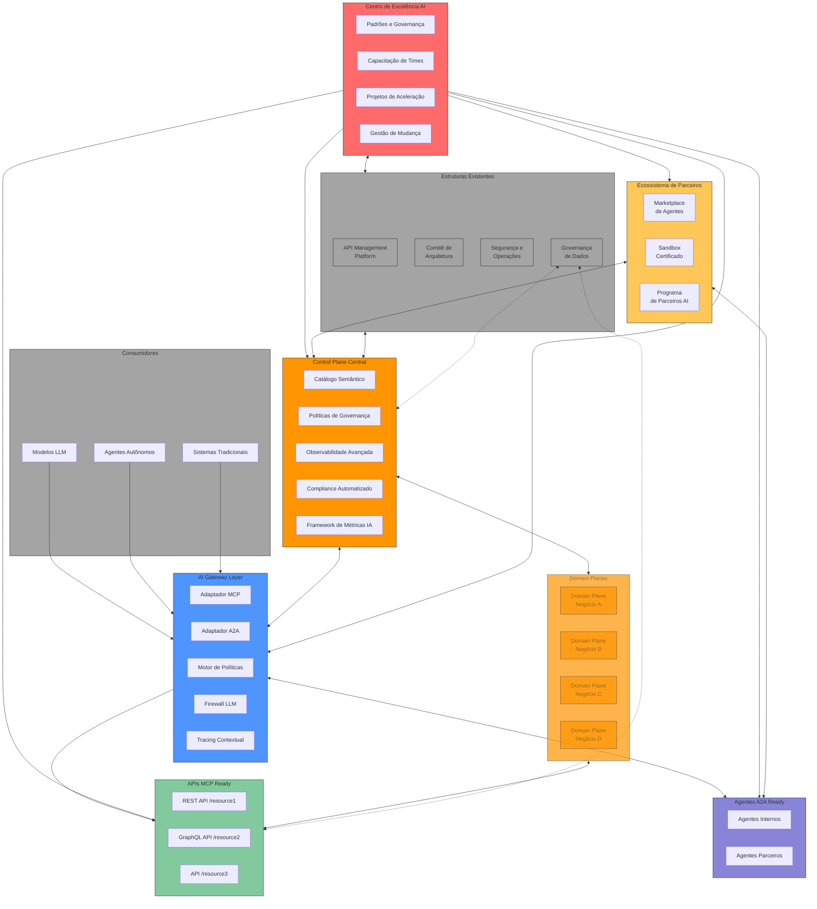

---

## Governança em Escala para Organizações Massivas

Como organização com mais de 100.000 colaboradores, uma grande empresa enfrenta desafios únicos na implementação de qualquer iniciativa transformacional. A governança AI Ready precisa considerar:

### Modelo de Governança Federada Multinível

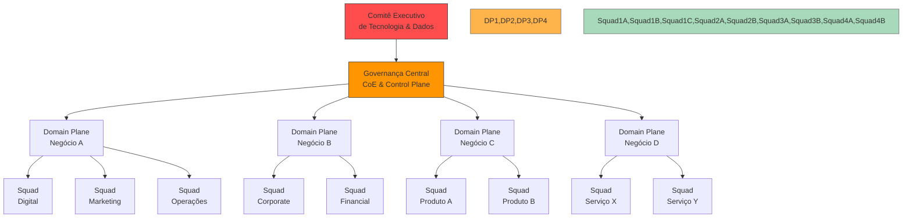

Este modelo contempla múltiplos níveis de governança:

1. **Nível Executivo**: Comitê Executivo de Tecnologia & Dados, com representação C-level
2. **Nível Corporativo**: Centro de Excelência AI e Control Plane Central
3. **Nível de Domínio**: Planes específicos para cada grande área de negócio
4. **Nível Operacional**: Squads e times de produto

**Características essenciais para organizações massivas**:

- **Delegação progressiva**: Decisões são tomadas no nível mais baixo possível com guardrails estabelecidos
- **Consistência sem uniformidade**: Padrões globais com flexibilidade contextual para cada domínio
- **Representação multifuncional em todos os níveis**: TI, negócios, jurídico, segurança, dados
- **Clareza absoluta de papéis**: Definidos para evitar disputas territoriais comuns em organizações grandes

### Matriz de Responsabilidades Corporativa (RACI Expandido)

Uma organização de grande porte exige um modelo de governança mais refinado que o RACI tradicional, contemplando também:

| Papel               | Descrição                          | Exemplo                      |
| ------------------- | ---------------------------------- | ---------------------------- |
| **Responsible (R)** | Executa a atividade                | Times de API                 |
| **Accountable (A)** | Responde pelo resultado final      | Product Owners               |
| **Consulted (C)**   | Fornece inputs necessários         | Especialistas de domínio     |
| **Informed (I)**    | Mantido atualizado sobre progresso | Stakeholders                 |
| **Supporter (S)**   | Provê recursos ou suporte          | Plataformas e Infraestrutura |
| **Verifier (V)**    | Valida conformidade                | Segurança e Compliance       |
| **Endorser (E)**    | Fornece apoio político             | Patrocinadores executivos    |

Esta matriz expandida (RACI-SVE) permite navegar a complexidade organizacional, mapeando claramente todas as interfaces necessárias para o sucesso.

**Exemplo aplicado à Arquitetura AI Ready**:

|Atividade|CoE AI|Times de API|Governança de Dados|Segurança|Compliance|Comitê Executivo|
|---|---|---|---|---|---|---|
|Definição de padrões MCP|R/A|C|C|C|C|E|
|Implementação nas APIs|S|R|C|V|I|I|
|Gestão de metadados|A|R|R/C|I|I|I|
|Certificação de APIs|A|R|S|V|V|I|
|Definição de trust levels|A|C|C|R|C|E|
|Aprovação de agentes externos|A|C|C|V|V|E|

---

## Integração com Governança de Dados em Grande Escala

Uma organização com alta complexidade já possui estruturas estabelecidas para governança de dados. A integração com estas estruturas é crítica para o sucesso da arquitetura AI Ready.

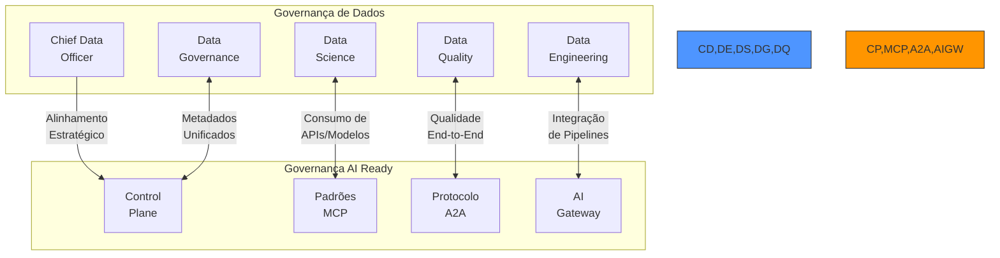

### Sinergia vs. Conflito: Navegando Territórios Organizacionais

Em organizações massivas, a percepção de sobreposição de responsabilidades pode gerar conflitos significativos. Para mitigar:

1. **Princípio de Complementaridade**: Definir claramente como as iniciativas se complementam em vez de competirem:
    
    - **Governança de Dados**: Responsável pela qualidade, consistência e governança dos ativos de dados
    - **Governança AI Ready**: Responsável pela exposição e consumo desses ativos por sistemas inteligentes
2. **Modelo de Colaboração Formal**:
    
    - **Representação Cruzada**: Membros da governança de dados no CoE AI e vice-versa
    - **Revisões Conjuntas**: Processos de aprovação unificados para evitar silos
    - **KPIs Compartilhados**: Métricas que incentivem colaboração e não competição
3. **Framework Unificado de Metadados**:
    

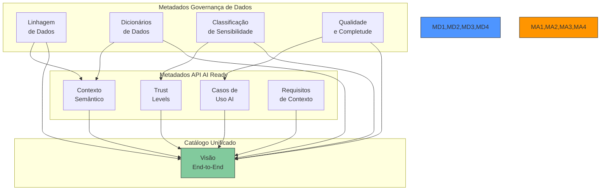

### Projetos de Integração Recomendados

Para organizações de grande porte, recomendamos iniciar com projetos conjuntos específicos:

1. **Catálogo Unificado de Ativos Digitais**:
    
    - Integração entre catálogos de dados, APIs e modelos analíticos
    - Visualização da jornada completa "do dado à experiência"
    - Governança federada com responsabilidades claras
2. **Framework de Observabilidade Integrada**:
    
    - Métricas end-to-end desde qualidade de dados até experiência final
    - Correlação entre performance de modelos e APIs
    - Alertas integrados que identificam impactos em toda a cadeia
3. **Modelo → API → Agente Showcase**:
    
    - Implementação colaborativa de um caso de uso de alto valor
    - Demonstração prática da cadeia de valor integrada
    - Base para definição de padrões e processos conjuntos

---

## Conceitos Fundamentais

### MCP Ready (Model Context Protocol)

O MCP define como as APIs devem ser projetadas para serem naturalmente "compreensíveis" por modelos de IA:

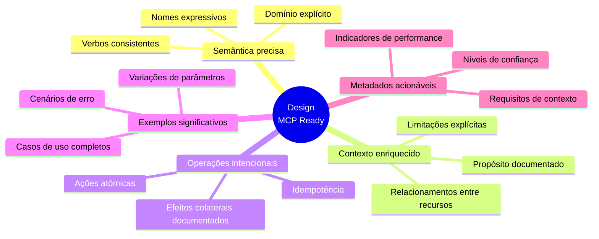

**Alternativas**:

- Abordagem puramente descritiva sem padrão formal
- Extensão de GraphQL com descrições enriquecidas

**Riscos**:

- Sobrecarga de documentação para equipes de desenvolvimento
- Evolução contínua dos padrões de interação com IA

**Recomendação**:

- Extensões OpenAPI 3.1 com validação automática de "AI readiness"
- Biblioteca de exemplos semanticamente ricos por domínio de negócio

### A2A Protocol (Agent-to-Agent)

Framework para comunicação segura e verificável entre agentes autônomos:

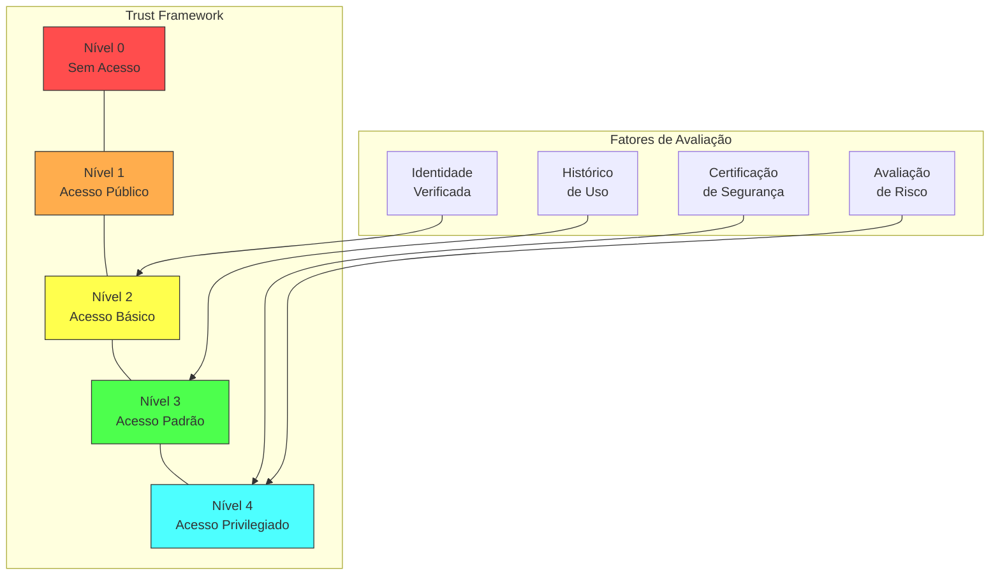

**Alternativas**:

- Sistema binário (confiável/não confiável)
- Protocolo proprietário completo

**Riscos**:

- Imaturidade dos padrões para comunicação entre agentes
- Desafios de segurança em interações agente-a-agente

**Recomendação**:

- Especificação A2A adaptada ao contexto da indústria com Agent Cards verificáveis
- Sandbox seguro para certificação progressiva de agentes

### Control Plane (Plano de Controle)

Centro nervoso do ecossistema AI Ready, responsável por:

- **Catálogo semântico**: Registro em tempo real de APIs e agentes com metadados enriquecidos
- **Governança declarativa**: Políticas como código, versionadas e auditáveis
- **Métricas avançadas**: Framework completo para mensuração de valor e impacto
- **Observabilidade contextual**: Telemetria especializada para interações baseadas em IA

**Alternativas**:

- Control planes distribuídos por domínio de negócio
- Abordagem federada com sincronização periódica

**Riscos**:

- Complexidade operacional
- Potencial gargalo de desempenho em escala

**Recomendação**:

- Implementação como serviço distribuído com componentes especializados
- Arquitetura event-driven para escalabilidade horizontal

---

## Gestão de Mudança em Grande Escala

A implementação de uma iniciativa transformacional em uma organização com mais de 100.000 colaboradores exige estratégias específicas de gestão de mudança:

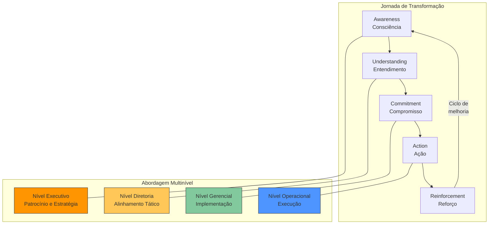

### Abordagem "Mancha de Óleo" para Adoção

Em organizações massivas, a abordagem mais eficaz é a expansão gradual e orgânica:

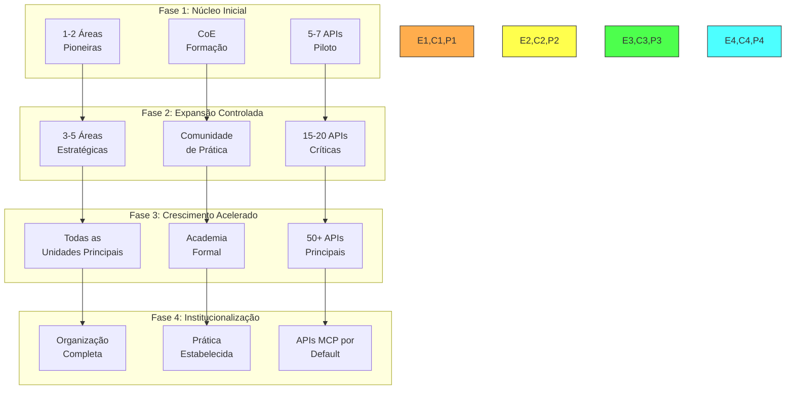

### Estrutura de Champions em Escala

Para uma organização de grande porte, recomendamos uma estrutura de champions em múltiplos níveis:

- **Champions Executivos**: C-level e diretores que fornecem patrocínio e visibilidade
- **Champions de Domínio**: Gerentes seniores que lideram a adoção em suas áreas
- **Champions Técnicos**: Especialistas que apoiam implementação e resolução de problemas
- **Champions de Base**: Multiplicadores nos times que promovem adoção no dia-a-dia

**Recomendação**:

- Programa formal de certificação para champions
- Sistema de reconhecimento e incentivos vinculados a metas de adoção
- Comunidade de prática transversal com encontros regulares

### Gestão de Resistência Organizacional

Em grandes corporações, a resistência à mudança é amplificada por questões de escala, legado e complexidade política.

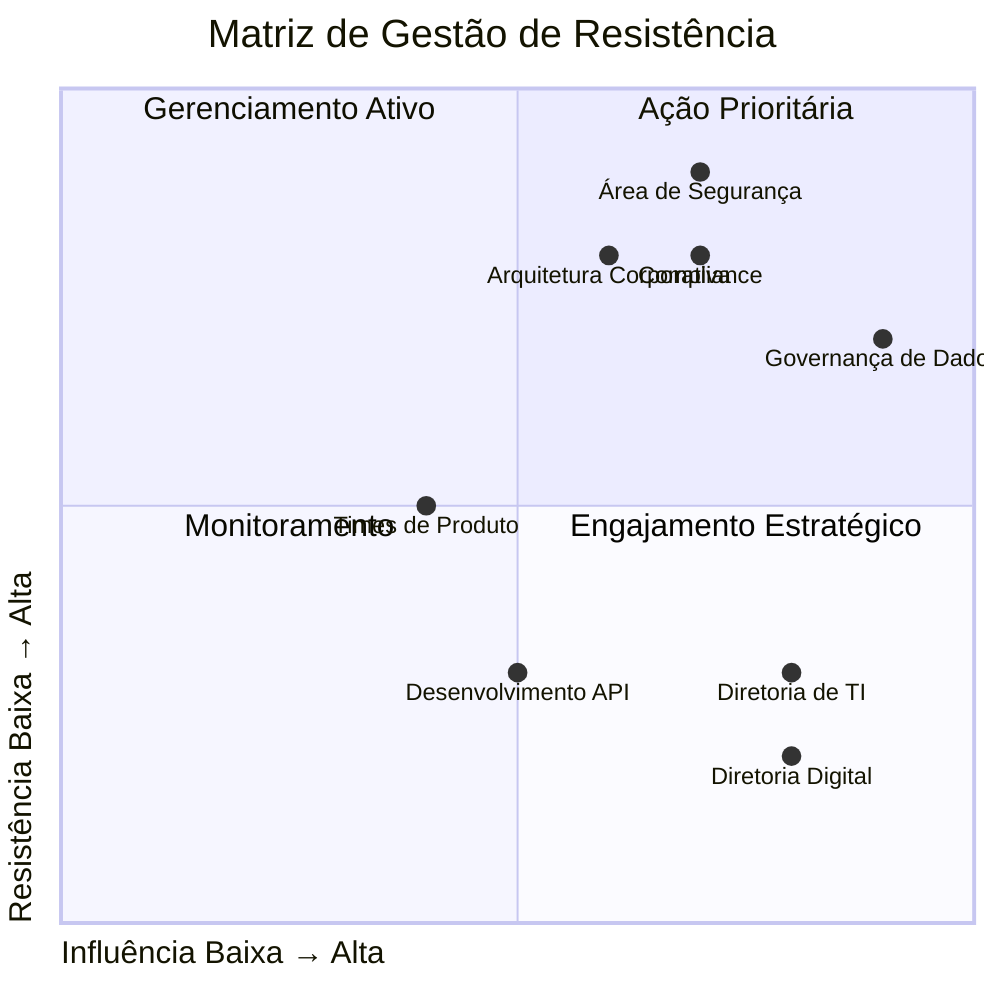

**Táticas específicas para cada quadrante**:

- **Ação Prioritária**: Abordagem personalizada com foco em preocupações específicas e demonstração de valor
- **Gerenciamento Ativo**: Envolvimento frequente na definição de padrões e prioridades
- **Monitoramento**: Comunicação regular e coleta de feedback para identificar mudanças de postura
- **Engajamento Estratégico**: Transformação em parceiros e champions, compartilhando crédito pelo sucesso

---

## Modelo Operacional para Grandes Organizações

Para funcionar efetivamente em uma empresa com mais de 100.000 colaboradores, o modelo operacional deve considerar:

### Processos de Governança em Múltiplos Níveis

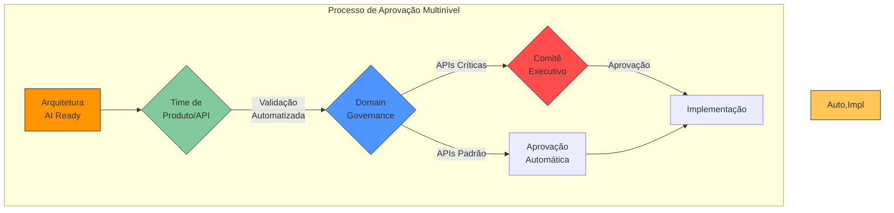

**Características essenciais**:

- **Automação máxima**: Validação automatizada sempre que possível para evitar gargalos
- **Governança proporcional ao risco**: Nível de escrutínio baseado em criticidade e impacto
- **Delegação clara**: Parâmetros explícitos sobre quem pode aprovar o quê
- **Transparência**: Visibilidade do status de aprovações para todos os envolvidos

### Mecanismos de Comunicação em Escala

Para uma organização massiva, recomendamos uma estratégia de comunicação em camadas:

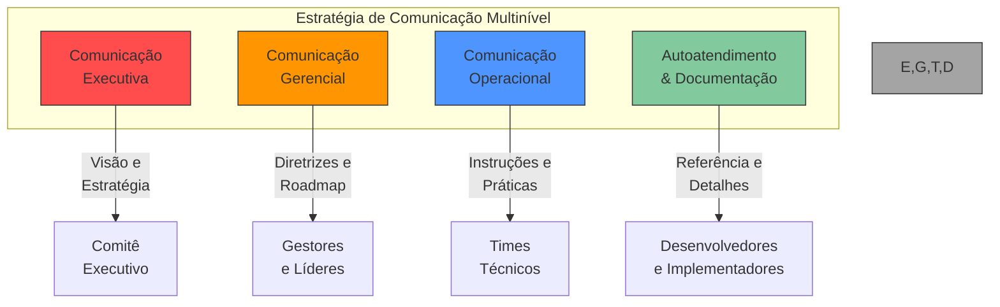

**Elementos críticos**:

- **Portal de conhecimento centralizado**: Single source of truth para toda a organização
- **Dashboards adaptados por função**: Visões específicas para diferentes necessidades
- **Comunidades de prática estruturadas**: Organizadas por domínio e função
- **Rituais definidos**: Eventos regulares para alinhamento em todos os níveis

---

## Framework de Métricas para Governança IA

Um diferencial da nossa proposta é um framework completo para mensurar o impacto real da IA:

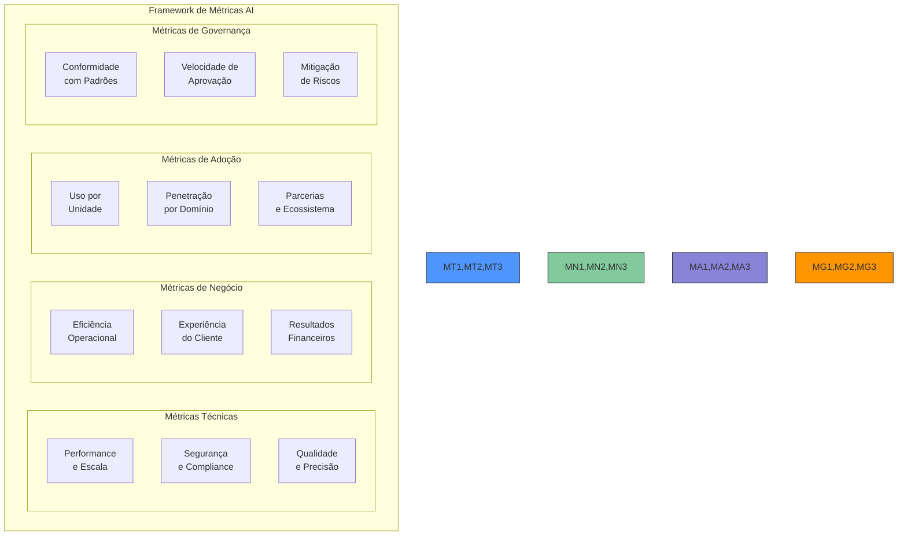

### Sistema de Métricas Multinível

Em organizações massivas, um único conjunto de métricas não atende todas as necessidades. Nossa proposta inclui:

|Nível|Audiência|Foco|Exemplos|
|---|---|---|---|
|**L1**|Conselho e C-Level|Valor estratégico e ROI|IA-NPS, Impacto financeiro, Mitigação de riscos|
|**L2**|Diretores e VPs|Performance por unidade|Adoção por área, Eficiência operacional, Velocidade de resposta|
|**L3**|Gerentes Sênior|Execução e qualidade|Conformidade com padrões, Taxa de sucesso, Incidentes por domínio|
|**L4**|Times operacionais|Implementação e operação|Tempo de resposta API, Qualidade MCP, Taxa de erros|

Este modelo garante que cada nível tenha acesso às métricas mais relevantes para sua função, com capacidade de drill-down quando necessário.

### Dashboard Executivo para Alta Liderança

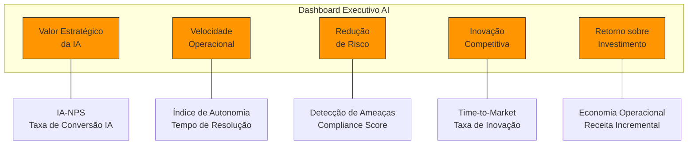

---

## Segurança, Compliance e Aspectos Regulatórios

### Firewall LLM e Proteção Contra Abusos

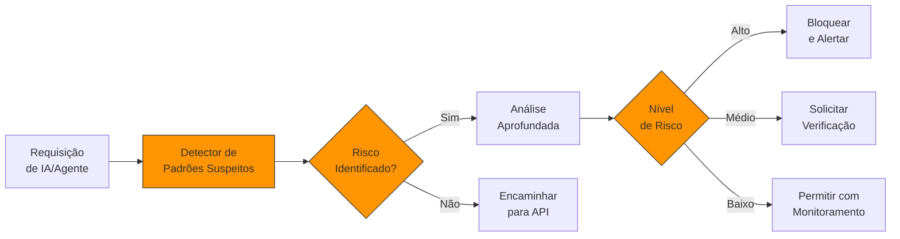

### Governança de Compliance em Grande Escala

Para uma grande organização, a governança de compliance precisa ser automatizada e robusta:

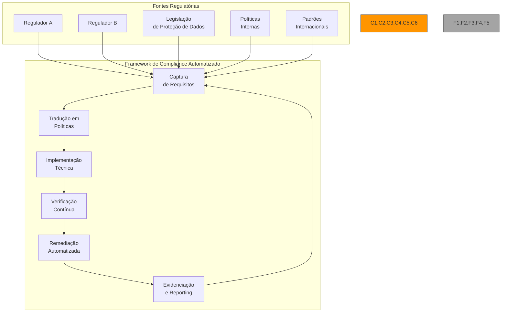

**Componentes críticos para compliance em escala**:

1. **Policy as Code**: Políticas implementadas como código verificável e versionado
2. **Continuous Compliance**: Verificação contínua, não apenas por etapas
3. **Automated Remediation**: Correção automática para violações de baixo risco
4. **Evidence Collection**: Coleta automatizada de evidências para auditoria
5. **Regulatory Change Management**: Processo para incorporar mudanças regulatórias

### Gestão de Riscos Específicos para AI em Grande Escala

O volume e a complexidade de uma organização massiva amplificam os riscos relacionados à IA:

|Categoria de Risco|Impacto|Mitigação|
|---|---|---|
|**Superfície de ataque**|Múltiplos pontos de entrada aumentam riscos de segurança|Arquitetura de segurança em camadas com defesa em profundidade|
|**Consistência**|Difícil garantir padrões uniformes em toda organização|Automação de verificação e enforcment de políticas|
|**Propagação de dados sensíveis**|Maior risco de exposição devido a múltiplos sistemas|Rastreamento de linhagem e classificação automatizada|
|**Responsabilização**|Desafios em atribuir responsabilidade em estruturas complexas|Logging imutável e trilhas de auditoria robustas|
|**Bias em escala**|Perpetuação de preconceitos em múltiplos sistemas|Monitoramento contínuo e verificação proativa|

**Recomendação**:

- Criar um framework formal de avaliação de risco AI específico para o contexto da indústria
- Implementar verificações automatizadas em cada fase do ciclo de vida
- Desenvolver playbooks de resposta a incidentes para cenários específicos de IA

---

## Centro de Excelência AI (CoE) para Organizações Massivas

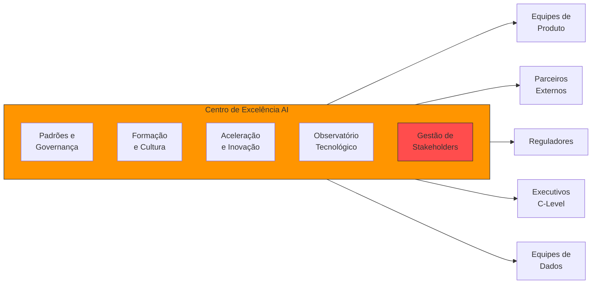

Para uma organização de grande porte, o CoE precisa de algumas características específicas:

### Estrutura do CoE em Escala

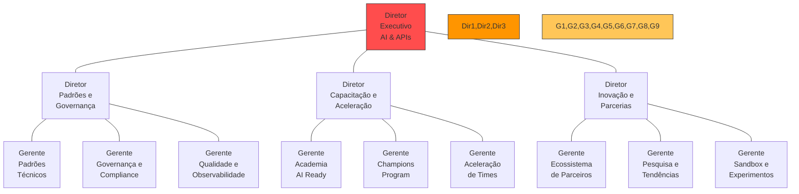

**Características essenciais**:

- **Liderança executiva dedicada**: Reporte direto ao C-level (CTO ou CIO)
- **Estrutura formal**: Para garantir visibilidade e impacto organizacional
- **Delegação clara**: Papéis e responsabilidades bem definidos
- **Equipe multidisciplinar**: Combinando especialistas técnicos e de negócios
- **Modelo hub-and-spoke**: Núcleo central com representantes nas unidades de negócio

### Modelo de Financiamento e Sustentabilidade

Em uma organização de grande porte, é essencial estabelecer um modelo claro de financiamento para a iniciativa:

1. **Investimento Corporativo Inicial**: Orçamento dedicado para estabelecimento do CoE e infraestrutura base
2. **Modelo de Charging Interno**: Rateio de custos entre unidades de negócio baseado em uso
3. **Projetos de Co-investimento**: Financiamento compartilhado para iniciativas estratégicas
4. **Auto-sustentabilidade Progressiva**: Transição gradual para financiamento baseado em valor gerado

**Recomendação**:

- Implementar model de "success fee" baseado em valor comprovado
- Estabelecer KPIs claros para justificar continuidade e expansão
- Criar dashboard de ROI específico para demonstração de valor ao C-level

---

## Ecossistema de Parceiros AI

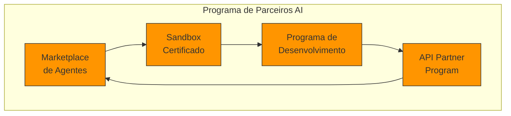

Para uma instituição de grande porte, o ecossistema de parceiros precisa ser gerenciado de forma estruturada:

### Governance de Parceiros em Escala

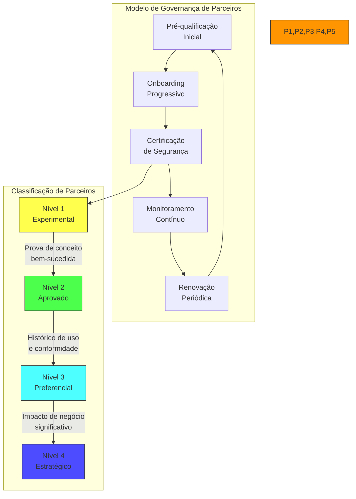

**Componentes críticos para gestão de parceiros em grande escala**:

1. **Due Diligence Automatizado**: Verificações iniciais mais ágeis e consistentes
2. **Portal de Self-service**: Onboarding e gestão simplificados para grande volume de parceiros
3. **Certificação Escalável**: Processo padronizado que viabiliza volume sem sacrificar qualidade
4. **Monitoramento Contínuo**: Verificações automatizadas de conformidade e segurança
5. **SLAs Formais**: Acordos claros de nível de serviço e suporte

**Benefícios específicos para uma organização massiva**:

- Aceleração da capacidade de inovação sem crescimento proporcional da equipe interna
- Diversificação de fontes de inovação além dos limites organizacionais
- Possibilidade de testar novos conceitos antes de investimento interno significativo

---

## APIs Auto-evolutivas

Uma visão avançada para o futuro inclui APIs que se otimizam continuamente:

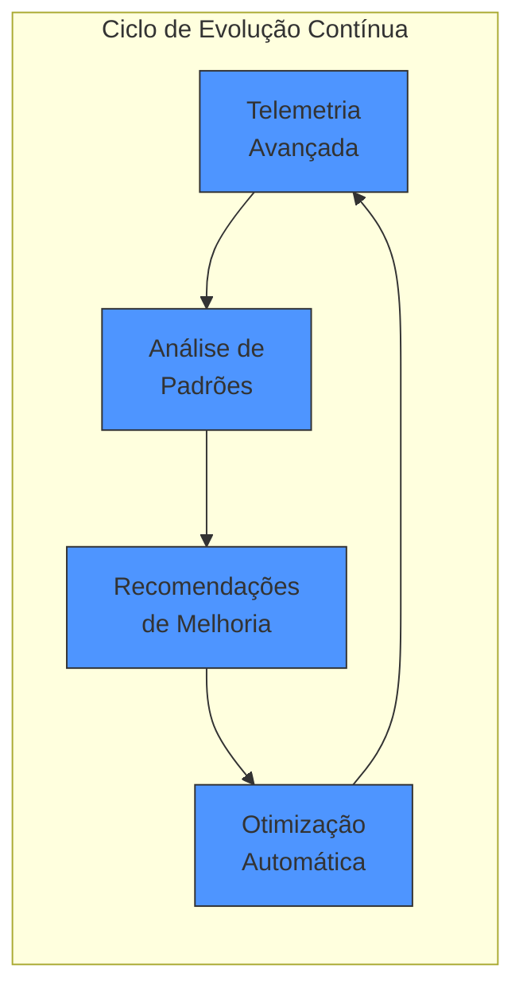

**Aplicação específica para organizações massivas**:

Em um cenário com milhares de APIs, a capacidade de evoluir automaticamente se torna crítica para manter sustentabilidade e performance:

- **Telemetria em escala massiva**: Coleta e análise de bilhões de interações
- **Machine learning para padrões de uso**: Identificação de oportunidades de otimização em padrões complexos
- **Orquestração adaptativa**: Ajuste dinâmico de recursos e políticas baseado em demanda real
- **Sugestões contextuais**: Recomendações específicas para melhorias considerando o domínio de negócio

**Benefícios específicos**:

- Escalabilidade sustentável sem crescimento proporcional das equipes de suporte
- Adaptação contínua a padrões emergentes de uso
- Otimização progressiva sem intervenção manual extensiva

---

## Mitigação de Riscos em Organizações Massivas

### Framework de Avaliação de Riscos

```mermaid
flowchart TD
    subgraph "Framework de Avaliação de Riscos"
        R1[Identificação<br>Sistemática]
        R2[Categorização<br>e Priorização]
        R3[Desenvolvimento<br>de Controles]
        R4[Implementação<br>e Verificação]
        R5[Monitoramento<br>e Evolução]
    end
    
    R1 --> R2 --> R3 --> R4 --> R5 --> R1
    
    subgraph "Categorias de Risco Específicas"
        C1[Riscos<br>Técnicos]
        C2[Riscos<br>Organizacionais]
        C3[Riscos<br>Regulatórios]
        C4[Riscos de<br>Adoção]
        C5[Riscos de<br>Integração]
    end
    
    R1 --> C1
    R1 --> C2
    R1 --> C3
    R1 --> C4
    R1 --> C5
    
    style R1,R2,R3,R4,R5 fill:#ff9500,stroke:#333
    style C1,C2,C3,C4,C5 fill:#a4a4a4,stroke:#333
```

### Riscos Específicos para Organizações Massivas

|Categoria|Risco|Mitigação|
|---|---|---|
|**Escala**|Resistências localizadas bloqueando adoção global|Modelo federado com adaptação contextual por domínio|
|**Complexidade**|Interdependências ocultas entre diferentes áreas|Mapeamento sistemático e testes de integração abrangentes|
|**Legado**|Sistemas existentes incompatíveis com novos padrões|Estratégia de adaptadores e API facades|
|**Stakeholders**|Múltiplos interesses concorrentes e potencialmente conflitantes|Modelo de governança inclusivo com representação adequada|
|**Velocidade**|Tempo excessivo para implementação em toda organização|Abordagem progressiva com demonstrações de valor rápidas|
|**Territorialismo**|Disputas territoriais entre equipes existentes|Definição clara de papéis e reconhecimento compartilhado|
|**Consistência**|Dificuldade em manter padrões uniformes|Automação de validação e capacitação descentralizada|

### Estratégias de Mitigação para Grandes Organizações

1. **Enfoque em Desacoplamento**:
    
    - Minimizar dependências rígidas entre componentes e equipes
    - Permitir adoção assíncrona sem bloquear progresso global
2. **Automação Extensiva**:
    
    - Implementar verificações automatizadas para garantir conformidade
    - Reduzir dependência de processos manuais que não escalam
3. **Governança Adaptativa**:
    
    - Ajustar níveis de controle baseados em risco e maturidade
    - Equilibrar padronização global com adaptação local
4. **Comunicação Estruturada**:
    
    - Estratégia de comunicação em múltiplos níveis
    - Transparência nas decisões e status de implementação
5. **Aprendizado Organizacional**:
    
    - Captura sistemática de lições aprendidas
    - Mecanismos para compartilhar conhecimento através das unidades

---

## Próximos Passos: Uma Abordagem Pragmática para Grandes Organizações

```mermaid
timeline
    title Roadmap para Implementação em Grande Escala
    
    section 0-30 dias: Fundação
        Estabelecer estrutura : Patrocínio executivo
        : Grupo de trabalho inicial
        : Alinhamento com áreas críticas (Dados, Segurança)
    
    section 30-90 dias: Definição e Preparação
        Estabelecer padrões iniciais : Definir governança federada
        : Desenvolver primeiros templates e ferramentas
        : Criar plano de gestão de mudança
    
    section 90-180 dias: Piloto Estratégico
        Implementação controlada : 2-3 APIs estratégicas em MCP
        : Implementar Control Plane MVP
        : Iniciar programa de champions
    
    section 180-365 dias: Expansão Controlada
        Crescimento orgânico : Expansão para áreas estratégicas adicionais
        : Framework de métricas operacional
        : Integração aprofundada com governança de dados
```

### Abordagem "Vitórias Rápidas e Valor Visível"

Em organizações massivas, é essencial demonstrar valor rapidamente para manter momentum:

1. **Sprint 1 (30 dias)**:
    
    - Estabelecer grupo de trabalho multidisciplinar
    - Mapear interdependências organizacionais críticas
    - Identificar APIs de alto valor para prova de conceito
2. **Sprint 2 (60 dias)**:
    
    - Desenvolver especificação MCP v1
    - Implementar validador automatizado básico
    - Criar dashboard executivo inicial
3. **Sprint 3 (90 dias)**:
    
    - Converter 1-2 APIs estratégicas para MCP Ready
    - Implementar Control Plane MVP
    - Demonstração para stakeholders executivos

**Fatores críticos de sucesso**:

- Patrocínio executivo claro e sustentado
- Alinhamento antecipado com áreas de interfaces críticas (especialmente Dados)
- Abordagem que equilibre visão transformacional com pragmatismo de implementação
- Foco constante em valor mensurável e comunicação efetiva

---

## Exemplo de Contrato OpenAPI MCP Ready

```yaml
openapi: 3.1.0
info:
  title: Serviço de Transações
  version: '1.0'
  description: |
    Este serviço permite consultar e iniciar transações.
    É otimizado para uso por assistentes de IA e agentes autônomos.
  x-ai-summary: "API para consultar e criar transações entre contas"
  x-ai-capabilities:
    - "Consulta de histórico de transações"
    - "Iniciação de transferências"
    - "Agendamento para processamento futuro"
  x-ai-context-requirements:
    - "Autenticação do usuário necessária"
    - "Consentimento explícito para transações"
    - "Limite diário aplicável"

paths:
  /transactions:
    get:
      summary: Lista transações da conta
      description: |
        Recupera o histórico de transações de uma conta específica.
        Útil para análise e reconciliação.
      x-ai-use-cases:
        - "Análise de gastos mensais por categoria"
        - "Verificação de pagamentos recebidos"
        - "Busca de transações específicas por descrição ou valor"
      parameters:
        - name: accountId
          in: query
          description: "Identificador único da conta (formato: AC-XXXXX-X)"
          required: true
          schema:
            type: string
      responses:
        '200':
          description: Lista de transações recuperada com sucesso
          content:
            application/json:
              schema:
                type: array
                items:
                  $ref: '#/components/schemas/Transaction'
              examples:
                normalUsage:
                  summary: Exemplo de uso típico
                  value: [
                    {
                      "id": "t-123456",
                      "type": "PAYMENT",
                      "amount": 85.90,
                      "description": "Pagamento mensal",
                      "date": "2025-04-10T14:30:45Z",
                      "category": "BILLS",
                      "status": "COMPLETED"
                    }
                  ]
```

---

## Conclusão

A Arquitetura AI Ready Enterprise representa não apenas uma evolução tecnológica, mas uma transformação estratégica na forma como grandes organizações se posicionam para um futuro dominado pela inteligência artificial.

Para uma organização com mais de 100.000 colaboradores, esta iniciativa requer:

- **Governança federada multinível**: Equilibrando padronização centralizada e autonomia contextual
- **Integração harmônica entre equipes especializadas**: Particularmente com as áreas de Dados e Analytics
- **Gestão de mudança em escala massiva**: Através de abordagem em camadas e programa estruturado de champions
- **Mitigação sistemática de riscos específicos**: Considerando complexidade organizacional e técnica
- **Comunicação estratégica e adaptativa**: Alcançando diferentes níveis e áreas da organização
- **Mensuração de valor granular e consolidada**: Demonstrando impacto de forma relevante para cada audiência

Implementada com sucesso, esta arquitetura não apenas preparará a organização para responder às mudanças do mercado, mas a posicionará como definidora de padrões para a indústria na era da inteligência artificial, consolidando sua liderança tecnológica e de negócios.

A jornada será complexa, mas com abordagem sistemática, patrocínio adequado e foco constante em valor mensurável, empresas de grande porte têm todos os elementos necessários para transformar esta visão em realidade operacional.

---

_Guia de Arquitetura AI Ready para Grandes Organizações - Versão 1.0_