# Arquitetura de Control Plane: Guia Completo para Instituições Financeiras

## Sumário

1. [Introdução aos Conceitos Fundamentais](#introdu%C3%A7%C3%A3o-aos-conceitos-fundamentais)
2. [Arquitetura de Planes](#arquitetura-de-planes)
3. [Control Plane em Profundidade](#control-plane-em-profundidade)
4. [Control Plane Manager](#control-plane-manager)
5. [Integração com Internal Developer Platform (IDP)](#integra%C3%A7%C3%A3o-com-internal-developer-platform-idp)
6. [Implementações e Ferramentas](#implementa%C3%A7%C3%B5es-e-ferramentas)
7. [Considerações para Instituições Financeiras](#considera%C3%A7%C3%B5es-para-institui%C3%A7%C3%B5es-financeiras)
8. [Casos de Uso Práticos](#casos-de-uso-pr%C3%A1ticos)
9. [Melhores Práticas e Recomendações](#melhores-pr%C3%A1ticas-e-recomenda%C3%A7%C3%B5es)
10. [Roadmap de Implementação](#roadmap-de-implementa%C3%A7%C3%A3o)
11. [Recursos Adicionais](#recursos-adicionais)

## Introdução aos Conceitos Fundamentais

### Origem e Evolução do Conceito

A separação entre Control Plane e Data Plane tem suas raízes nas redes de telecomunicações, onde o tráfego de sinalização (controle) era separado do tráfego de voz/dados. Esta abordagem evoluiu através de várias tecnologias:

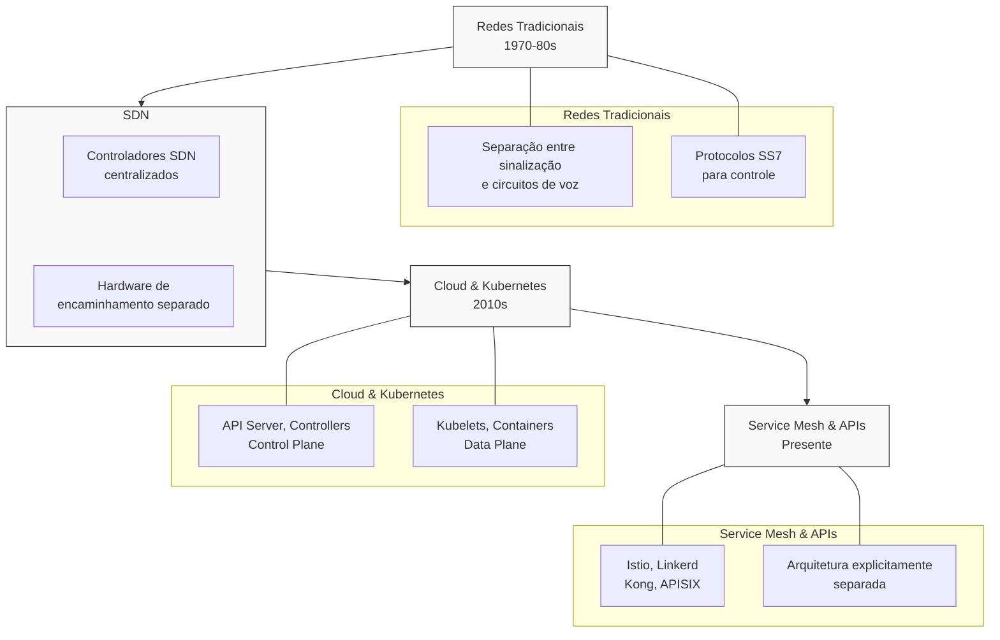

### Definições Fundamentais

**Control Plane** é o "cérebro" do sistema responsável por:

- Tomar decisões sobre como o sistema deve funcionar
- Processar configurações e políticas
- Gerenciar o ciclo de vida dos componentes
- Reagir a mudanças no ambiente

**Data Plane** é o "músculo" do sistema que:

- Executa o trabalho real de processamento
- Processa todo o tráfego de produção
- Aplica as regras definidas pelo Control Plane
- Deve ser otimizado para performance e escala

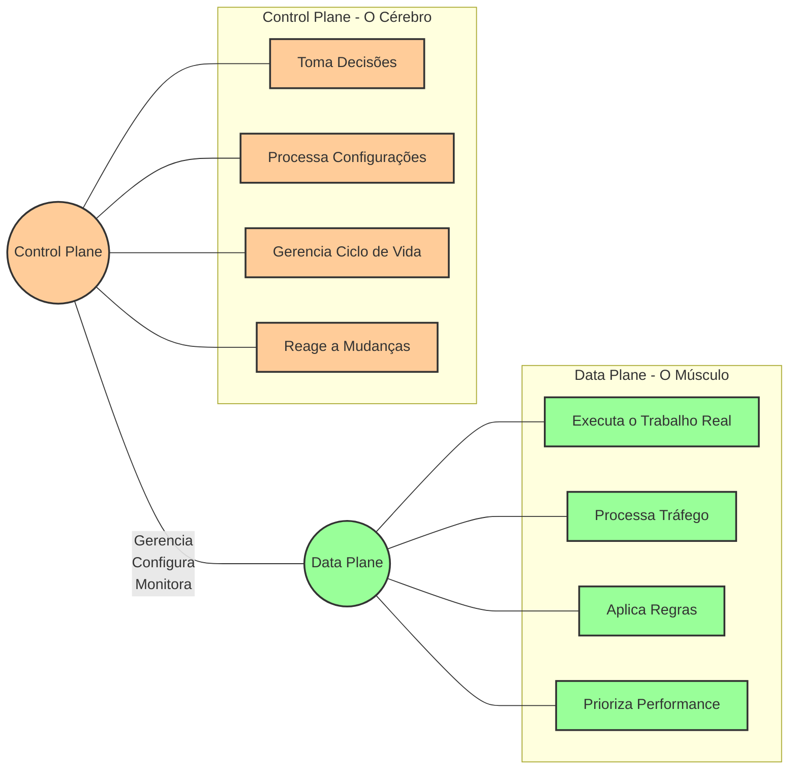

### Benefícios da Separação

Esta separação arquitetural proporciona benefícios significativos:

1. **Escalabilidade independente**: Cada plano pode escalar conforme suas necessidades específicas
2. **Resiliência aprimorada**: O Data Plane pode continuar funcionando mesmo se o Control Plane estiver indisponível
3. **Evolução independente**: Cada parte pode evoluir em ritmos diferentes
4. **Governança centralizada com execução distribuída**: Políticas definidas centralmente, aplicadas localmente
5. **Performance otimizada**: Componentes especializados para suas funções específicas

## Arquitetura de Planes

A arquitetura moderna vai além da divisão binária entre Control Plane e Data Plane, incorporando vários "planes" especializados:

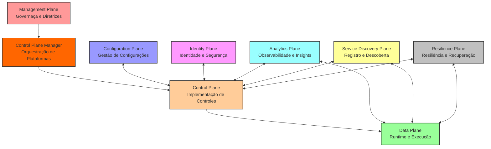

### Management Plane

**Definição**: Camada responsável pela governança estratégica e diretrizes de alto nível.

**Responsabilidades**:

- Definir políticas corporativas e diretrizes
- Estabelecer padrões de arquitetura
- Gerenciar compliance e requisitos regulatórios
- Supervisionar a estratégia tecnológica

**Em uma instituição financeira**:

- Comitês de Arquitetura Corporativa
- Governança de TI
- Compliance e Risco Tecnológico
- Diretorias de Tecnologia (CTO/CIO)

### Control Plane

**Definição**: Camada responsável por traduzir diretrizes em implementações técnicas e tomar decisões operacionais.

**Responsabilidades**:

- Implementar políticas como configurações técnicas
- Gerenciar roteamento, segurança e orquestração
- Processar mudanças na topologia e configuração
- Tomar decisões operacionais baseadas em políticas

**Componentes típicos**:

- API Gateways
- Service Mesh Control Plane
- Orquestradores de containers (Kubernetes control plane)
- Sistemas de gerenciamento de políticas

### Data Plane

**Definição**: Camada responsável pela execução do trabalho real e pelo processamento direto das transações e dados.

**Responsabilidades**:

- Processar requisições de usuários e sistemas
- Executar lógica de negócio
- Aplicar políticas de segurança, roteamento e resilência
- Interagir com sistemas de armazenamento e processamento

**Componentes típicos**:

- Aplicações e microserviços
- API proxies e gateways (componentes de execução)
- Service Mesh proxies (sidecars)
- Workers e processadores de eventos

### Configuration Plane

**Definição**: Camada responsável pelo armazenamento, distribuição e versionamento de configurações.

**Responsabilidades**:

- Manter o estado desejado do sistema
- Gerenciar versões de configurações
- Distribuir configurações para componentes apropriados
- Validar e auditar mudanças de configuração

**Componentes típicos**:

- Repositórios GitOps
- Sistemas de armazenamento de configuração (etcd, Consul)
- Pipelines de CI/CD para configurações
- Ferramentas de IaC (Terraform, CloudFormation)

### Identity Plane

**Definição**: Camada responsável por gerenciar identidades, autenticação e autorização.

**Responsabilidades**:

- Validar identidades de usuários e sistemas
- Emitir e validar credenciais
- Aplicar políticas de autorização
- Gerenciar ciclo de vida de identidades

**Componentes típicos**:

- Sistemas IAM (Identity and Access Management)
- Provedores de identidade (OIDC, SAML)
- Sistemas de gerenciamento de certificados
- Serviços de autorização baseados em atributos

### Analytics/Telemetry Plane

**Definição**: Camada responsável pela coleta, processamento e visualização de dados operacionais.

**Responsabilidades**:

- Coletar métricas, logs e traces
- Processar e analisar dados operacionais
- Detectar anomalias e problemas
- Fornecer insights para operação e negócio

**Componentes típicos**:

- Sistemas de coleta de logs
- Plataformas de métricas
- Sistemas de tracing distribuído
- Dashboards e ferramentas de visualização

### Service Discovery Plane

**Definição**: Camada responsável pelo registro e descoberta de serviços disponíveis.

**Responsabilidades**:

- Manter registro de serviços ativos
- Facilitar a descoberta de endpoints
- Gerenciar health checks e disponibilidade
- Suportar balanceamento de carga e failover

**Componentes típicos**:

- Service registry (Consul, etcd)
- DNS baseado em serviço (CoreDNS)
- Service mesh discovery
- Load balancers dinâmicos

### Resilience Plane

**Definição**: Camada responsável por gerenciar a resiliência e resposta a falhas.

**Responsabilidades**:

- Implementar circuit breakers e bulkheads
- Gerenciar retry policies e timeouts
- Coordenar failover e disaster recovery
- Garantir degradação elegante

**Componentes típicos**:

- Bibliotecas de resiliência (Hystrix, Resilience4j)
- Sistemas de gestão de caos
- Ferramentas de DR e failover
- Componentes de rate limiting e throttling

## Control Plane em Profundidade

### Componentes Essenciais

Um Control Plane robusto é tipicamente composto por:

```mermaid
flowchart TD
    classDef controlComponent fill:#ffcc99,stroke:#333,stroke-width:2px
    
    CP[Control Plane] --> API & STATE & POLICY & ORCH & OBS
    
    subgraph "Componentes do Control Plane"
        API[APIs de Controle]
        STATE[Armazenamento\nde Estado]
        POLICY[Processadores\nde Políticas]
        ORCH[Orquestradores de\nConfiguração]
        OBS[Sistemas de\nObservabilidade]
    end
    
    subgraph "APIs de Controle"
        API1[Endpoints de\nGerenciamento]
        API2[Interfaces\nde Integração]
        API3[Validação\nde Comandos]
        
        API --> API1 & API2 & API3
    end
    
    subgraph "Armazenamento de Estado"
        STATE1[Sistema de\nArmazenamento]
        STATE2[Versionamento\ne Histórico]
        STATE3[Otimização\npara Leitura]
        
        STATE --> STATE1 & STATE2 & STATE3
    end
    
    subgraph "Processadores de Políticas"
        POLICY1[Motores de\nDecisão]
        POLICY2[Validadores\nde Compliance]
        POLICY3[Transformadores\nde Configuração]
        
        POLICY --> POLICY1 & POLICY2 & POLICY3
    end
    
    subgraph "Orquestradores"
        ORCH1[Aplicação de\nMudanças]
        ORCH2[Controle de\nSincronização]
        ORCH3[Gestão de\nDependências]
        
        ORCH --> ORCH1 & ORCH2 & ORCH3
    end
    
    subgraph "Observabilidade"
        OBS1[Coletores de\nTelemetria]
        OBS2[Monitores de\nSaúde]
        OBS3[Alertas e\nNotificações]
        
        OBS --> OBS1 & OBS2 & OBS3
    end
    
    class CP,API,STATE,POLICY,ORCH,OBS,API1,API2,API3,STATE1,STATE2,STATE3,POLICY1,POLICY2,POLICY3,ORCH1,ORCH2,ORCH3,OBS1,OBS2,OBS3 controlComponent
```

1. **APIs de Controle**
    
    - Endpoints para gerenciamento e configuração
    - Interfaces para integração com outras ferramentas
    - Validação e processamento de comandos
2. **Mecanismos de Armazenamento de Estado**
    
    - Sistemas para manter o estado atual e desejado
    - Bancos de dados otimizados para leitura
    - Sistemas de versionamento e histórico
3. **Processadores de Políticas**
    
    - Motores de decisão baseados em regras
    - Validadores de compliance
    - Transformadores de configurações de alto para baixo nível
4. **Orquestradores de Configuração**
    
    - Sistemas para aplicar mudanças coordenadas
    - Controladores de sincronização
    - Gerenciadores de dependências
5. **Sistemas de Observabilidade**
    
    - Coletores de telemetria específicos para o Control Plane
    - Monitores de saúde interna
    - Alertas e notificações

### Padrões Arquiteturais

Os seguintes padrões são comumente encontrados em implementações de Control Plane:

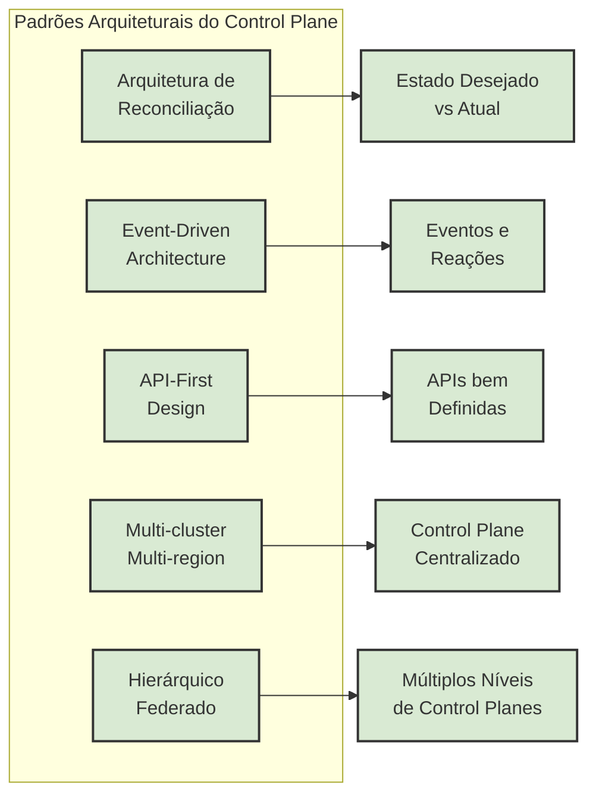

1. **Arquitetura de Reconciliação**
    
    - Modelo baseado em estado desejado vs. atual
    - Loops de controle que aproximam o sistema do estado desejado
    - Exemplo: Kubernetes Controllers
2. **Event-Driven Architecture**
    
    - Sistema baseado em eventos e reações
    - Processamento assíncrono de mudanças
    - Melhor resiliência a picos e falhas
3. **API-First Design**
    
    - Todas as operações expostas via APIs bem definidas
    - Documentação abrangente e versionamento claro
    - Facilita automação e integração
4. **Multi-cluster/Multi-region**
    
    - Control Plane centralizado gerenciando múltiplos Data Planes
    - Federação de configurações entre ambientes
    - Estratégias de sincronização e consistência
5. **Hierárquico/Federado**
    
    - Múltiplos níveis de Control Planes
    - Delegação de controle para subdomínios
    - Herança e override de políticas

## Control Plane Manager

### Definição e Propósito

O Control Plane Manager é uma camada de meta-controle que gerencia os próprios componentes do Control Plane. Seu propósito é:

- Orquestrar múltiplos componentes do Control Plane
- Gerenciar o ciclo de vida dos componentes de plataforma
- Unificar interfaces de gerenciamento
- Implementar políticas de governança em todos os componentes

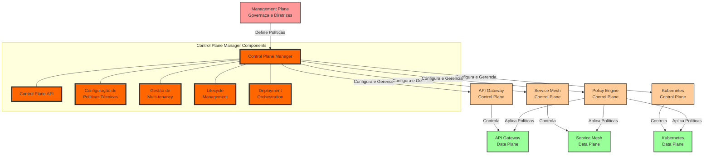

### Posicionamento na Arquitetura

O Control Plane Manager se posiciona:

- Entre o Management Plane e o Control Plane
- Como ponto central de configuração para plataformas
- Como intermediário para simplificar interações complexas
- Como facilitador de abordagens multi-cluster/multi-region

### Responsabilidades Principais

1. **Gestão de Configuração Centralizada**
    
    - Manter configurações de todos os componentes
    - Implementar versionamento e controle de mudanças
    - Garantir consistência entre ambientes
2. **Orquestração de Implantação**
    
    - Coordenar atualizações de componentes interdependentes
    - Gerenciar rollouts e rollbacks
    - Implementar estratégias de migração
3. **Multi-tenancy e Isolamento**
    
    - Gerenciar limites entre equipes e domínios
    - Implementar controles de acesso
    - Manter políticas específicas por contexto
4. **Lifecycle Management**
    
    - Gerenciar versões de componentes
    - Implementar upgrades e manutenção
    - Controlar depreciações e transições
5. **APIs de Gestão Unificadas**
    
    - Fornecer interfaces consistentes
    - Abstrair complexidades específicas
    - Habilitar integrações externas

### Implementações Comuns

- **Custom Operators no Kubernetes**: Operadores específicos para gerenciar componentes de plataforma
- **Ferramentas de Cluster Management**: Como RH Advanced Cluster Management, Rancher
- **Plataformas de Fleet Management**: Para gerenciamento coordenado de múltiplos clusters
- **Sistemas próprios baseados em GitOps**: Com ArgoCD, Flux para sincronização de configurações

## Integração com Internal Developer Platform (IDP)

### Definição e Escopo da IDP

Uma Internal Developer Platform (IDP) é uma camada de abstração que simplifica o uso de infraestrutura e plataformas para desenvolvedores, oferecendo self-service, automação e padronização. Diferente do Control Plane, a IDP foca na experiência do desenvolvedor.

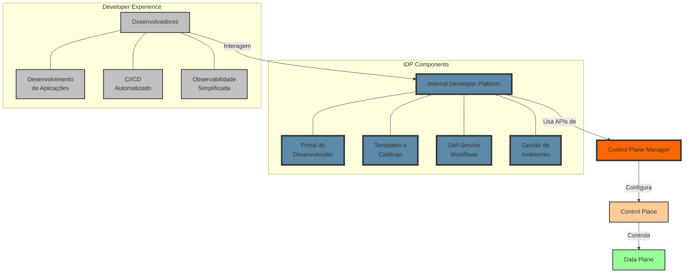

### Relação entre IDP e Control Plane

A IDP e o Control Plane são complementares:

- **IDP** é orientada à produtividade dos desenvolvedores e abstração
- **Control Plane** é orientado à implementação de políticas e orquestração técnica

A IDP tipicamente **consome** serviços do Control Plane através:

- De APIs expostas pelo Control Plane Manager
- De integrações com sistemas de configuração
- De fluxos de trabalho automatizados

### Pontos de Integração

1. **Provisionamento de Recursos**
    
    - IDP requisita recursos através das APIs do Control Plane
    - Control Plane valida, aplica políticas e provisiona
    - IDP recebe feedback sobre o status do provisionamento
2. **Gestão de Ciclo de Vida**
    
    - IDP inicia fluxos de deployment, atualização, escala
    - Control Plane executa as operações conforme políticas
    - IDP monitora progresso e status
3. **Observabilidade**
    
    - Control Plane coleta telemetria detalhada
    - IDP apresenta visualizações simplificadas para desenvolvedores
    - Ambos compartilham dados para diferentes perspectivas
4. **Aplicação de Políticas**
    
    - Management Plane define políticas
    - Control Plane implementa restrições técnicas
    - IDP apresenta guardrails e validações inline para desenvolvedores

### Benefícios da Integração

- **Para desenvolvedores**: Self-service com guardrails
- **Para operações**: Padronização e governança
- **Para segurança**: Aplicação consistente de políticas
- **Para negócio**: Aceleração de desenvolvimento com compliance

## Implementações e Ferramentas

### API Management

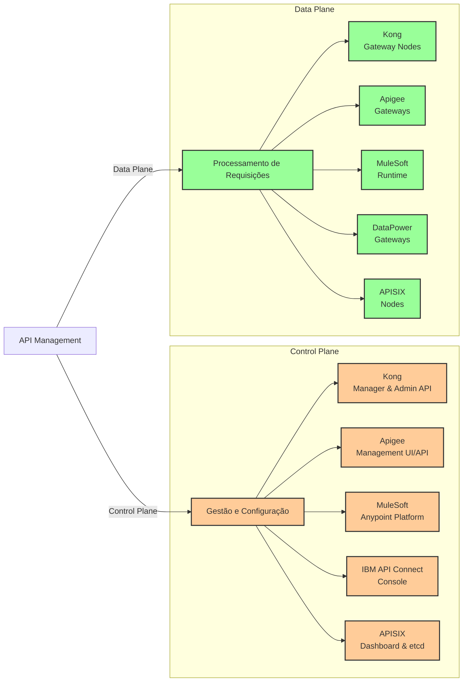

|Solução|Descrição|Control Plane|Data Plane|Vantagens para Instituições Financeiras|
|---|---|---|---|---|
|**Kong Enterprise**|Gateway de API baseado em NGINX|Kong Manager, Admin API|Kong Gateway nodes|Separação clara, alta performance, extensível|
|**Google Apigee**|Plataforma completa de API Management|Apigee Management UI/API|Gateways distribuídos|Analytics avançados, monetização, híbrido|
|**MuleSoft**|Plataforma de integração e API|Anypoint Platform|Runtime nodes|Forte integração com sistemas legados|
|**IBM API Connect**|Solução enterprise focada em segurança|Management console|DataPower Gateways|Certificações financeiras, mainframe|
|**APISIX**|Gateway open-source de alta performance|etcd + Dashboard|APISIX Nodes|Performance extrema, código aberto|

### Service Mesh

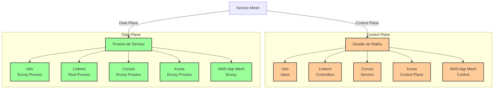

|Solução|Descrição|Control Plane|Data Plane|Vantagens para Instituições Financeiras|
|---|---|---|---|---|
|**Istio**|Service mesh abrangente|istiod|Envoy proxies|Controles granulares, segurança avançada|
|**Linkerd**|Service mesh leve e focado|Controladores Linkerd|Rust proxies|Performance, simplicidade, menor overhead|
|**Consul Connect**|Mesh integrado com service discovery|Consul servers|Envoy proxies|Descoberta de serviço integrada|
|**Kuma/Kong Mesh**|Service mesh multi-cluster|Control Plane global/zonal|Envoy proxies|Federação global, multi-zona|
|**AWS App Mesh**|Mesh nativo AWS|AWS App Mesh control|Envoy proxies|Integração AWS nativa|

### Container Orchestration

|Solução|Descrição|Control Plane|Data Plane|Vantagens para Instituições Financeiras|
|---|---|---|---|---|
|**Kubernetes**|Orquestrador de containers padrão|API Server, Controllers|Kubelets, Containers|Ecossistema vasto, escalabilidade|
|**OpenShift**|Kubernetes enterprise da Red Hat|Extended Control Plane|Kubernetes + add-ons|Segurança, suporte enterprise|
|**EKS/AKS/GKE**|Kubernetes gerenciado em cloud|Managed CP|Worker nodes|Menor overhead operacional|
|**Tanzu**|Plataforma Kubernetes da VMware|vSphere integrated CP|Kubernetes clusters|Integração com ambiente VMware|

### Policy Management

|Solução|Descrição|Abordagem|Integração|Vantagens para Instituições Financeiras|
|---|---|---|---|---|
|**Open Policy Agent**|Motor de políticas flexível|Declarativo/Rego|Kubernetes, Envoy, Kong|Flexibilidade, casos de uso diversos|
|**Kyverno**|Políticas nativas Kubernetes|YAML/JSON|Kubernetes|Simplicidade, sem linguagem nova|
|**Gatekeeper**|OPA para Kubernetes|Constraint Templates|Kubernetes|Controle de admissão robusto|
|**Cloud Custodian**|Políticas multi-cloud|YAML|AWS, Azure, GCP|Cobertura multi-cloud|

### Configuration Management

|Solução|Descrição|Abordagem|Integração|Vantagens para Instituições Financeiras|
|---|---|---|---|---|
|**ArgoCD**|GitOps para Kubernetes|Git como fonte da verdade|Kubernetes|UI visual, multi-cluster|
|**Flux**|GitOps nativo Kubernetes|Git + reconciliação|Kubernetes|Lightweight, GitOps Toolkit|
|**Terraform**|IaC multi-plataforma|Estado declarativo|Múltiplos providers|Ampla cobertura de recursos|
|**Ansible**|Automação baseada em YAML|Procedural|Agentless|Facilidade para sistemas legados|

### Internal Developer Platform (IDP)

|Solução|Descrição|Abordagem|Integração|Vantagens para Instituições Financeiras|
|---|---|---|---|---|
|**Backstage**|Portal de desenvolvedores da Spotify|Plugin-based|APIs extensível|Componentes para compliance|
|**Humanitec**|IDP comercial completa|Score-based|Multi-cloud|Guardrails para governança|
|**Port**|Plataforma de catálogo e automação|Block-based|APIs extensível|Visibilidade ampla|
|**Custom Solution**|IDP própria baseada em necessidades específicas|Adaptada à instituição|Integrações customizadas|Total alinhamento com requisitos bancários|

## Considerações para Instituições Financeiras

### Requisitos Específicos do Setor Financeiro

1. **Compliance e Regulatório**
    
    - Requisitos como PCI DSS, SOX, BACEN
    - Auditabilidade de todas as mudanças
    - Segregação de funções e responsabilidades
    - Relatórios de conformidade automáticos
2. **Segurança Avançada**
    
    - Defesa em profundidade em todos os níveis
    - Criptografia em trânsito e em repouso
    - Isolamento de ambientes críticos
    - Autenticação/autorização granular
3. **Alta Disponibilidade**
    
    - Requisito típico de 99.999% para sistemas críticos
    - Estratégias de failover inter-regional
    - Resiliência multi-zona
    - Capacidade de processamento contínuo mesmo durante falhas
4. **Performance e Escala**
    
    - Processamento de volumes massivos de transações
    - Consistência de latência em horários de pico
    - Capacidade para eventos sazonais (ex: Black Friday)
    - Previsibilidade de performance

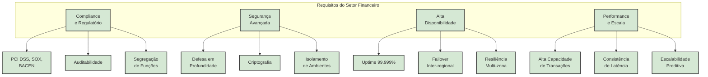

### Estrutura Organizacional

1. **Equipes Especializadas**
    
    - Time dedicado para Control Plane Management
    - Platform Engineering para desenvolvimento da IDP
    - SREs para operação da infraestrutura core
    - Especialistas de segurança integrados
2. **Governança Multi-nível**
    
    - Arquitetura Corporativa definindo diretrizes
    - Control Plane Manager implementando controles
    - Equipes de produtos aplicando em seus domínios
    - Monitoramento centralizado de conformidade
3. **Modelo de Responsabilidade**
    
    - Responsabilidade compartilhada claramente definida
    - Limites entre plataforma e aplicação
    - SLAs internos entre equipes
    - Processos claros para escalonamento

### Considerações de Implementação

1. **Abordagem Incremental**
    
    - Começar com componentes críticos
    - Migração gradual de padrões legados
    - Provas de conceito em domínios específicos
    - Expansão baseada em resultados comprovados
2. **Suporte para Coexistência**
    
    - Ambientes híbridos (legado + moderno)
    - Proxies e adaptadores para sistemas antigos
    - Estratégias de transição bem definidas
    - Regras claras para exceções
3. **Automação Extensiva**
    
    - CI/CD para componentes do Control Plane
    - Testes automáticos de políticas e configurações
    - Verificações de compliance integradas ao pipeline
    - Rollbacks automáticos em caso de anomalias
4. **Documentação e Treinamento**
    
    - Documentação técnica abrangente
    - Guias operacionais detalhados
    - Programas de treinamento para equipes
    - Comunidades internas de prática

## Casos de Uso Práticos

### Caso 1: Nova API de Pagamentos

**Cenário**: Implementação de uma nova API para processamento de pagamentos PIX.

```mermaid
flowchart TD
    classDef managementPlane fill:#ff9999,stroke:#333,stroke-width:2px
    classDef controlManager fill:#ff6600,stroke:#333,stroke-width:4px
    classDef controlPlane fill:#ffcc99,stroke:#333,stroke-width:2px
    classDef dataPlane fill:#99ff99,stroke:#333,stroke-width:2px
    classDef configPlane fill:#9999ff,stroke:#333,stroke-width:2px
    classDef identityPlane fill:#ff99ff,stroke:#333,stroke-width:2px
    classDef analyticsPlane fill:#99ffff,stroke:#333,stroke-width:2px
    classDef idp fill:#5d8aa8,stroke:#333,stroke-width:4px
    
    B([Início: Nova API PIX]) --> M1
    
    subgraph "Management Plane"
        M1[1. Comitê Aprova\nIniciativa de API PIX]
        M2[2. Define SLAs e\nRequisitos de Compliance]
        M3[3. Estabelece Diretrizes\nde Segurança]
        
        M1 --> M2 --> M3
    end
    
    M3 --> CPM1
    
    subgraph "Control Plane Manager"
        CPM1[4. Traduz Requisitos em\nConfigurações Técnicas]
        CPM2[5. Define Templates de\nSegurança e Observabilidade]
        
        CPM1 --> CPM2
    end
    
    CPM2 --> I1
    
    subgraph "Identity Plane"
        I1[6. Configura Políticas\nde Autenticação]
        I2[7. Prepara Certificados\ne Credenciais]
        
        I1 --> I2
    end
    
    CPM2 --> CP1
    I2 --> CP1
    
    subgraph "Control Plane"
        CP1[8. Configura Gateway\nde API]
        CP2[9. Implementa Circuit\nBreakers e Rate Limits]
        CP3[10. Configura Rotas\ne Endpoints]
        
        CP1 --> CP2 --> CP3
    end
    
    CPM2 --> C1
    
    subgraph "Configuration Plane"
        C1[11. Provisiona\nInfraestrutura]
        C2[12. Configura Pipelines\ncom Verificações]
        
        C1 --> C2
    end
    
    CP3 --> IDP1
    C2 --> IDP1
    
    subgraph "Internal Developer Platform"
        IDP1[13. Fornece Templates\nPré-aprovados]
        IDP2[14. Abstrai Complexidade\nde Configuração]
        
        IDP1 --> IDP2
    end
    
    IDP2 --> DP1
    
    subgraph "Data Plane"
        DP1[15. Executa Lógica de\nProcessamento]
        DP2[16. Aplica Políticas\nde Segurança]
        
        DP1 --> DP2
    end
    
    DP2 --> A1
    
    subgraph "Analytics Plane"
        A1[17. Monitora Transações\ne Performance]
        A2[18. Detecta Anomalias\ne Potenciais Fraudes]
        
        A1 --> A2
    end
    
    A2 --> E([API PIX\nDisponibilizada])
    
    %% Aplicando estilos
    class M1,M2,M3 managementPlane
    class CPM1,CPM2 controlManager
    class CP1,CP2,CP3 controlPlane
    class DP1,DP2 dataPlane
    class C1,C2 configPlane
    class I1,I2 identityPlane
    class A1,A2 analyticsPlane
    class IDP1,IDP2 idp
```

**Fluxo pelo Control Plane**:

1. **Management Plane**:
    
    - Define requisitos de segurança e compliance para APIs de pagamento
    - Estabelece SLAs e métricas de performance obrigatórias
2. **Control Plane Manager**:
    
    - Traduz requisitos em configurações técnicas
    - Define templates de segurança e observabilidade
3. **Identity Plane**:
    
    - Configura políticas de autenticação e autorização
    - Prepara certificados e credenciais necessárias
4. **Control Plane**:
    
    - Configura gateways de API com políticas apropriadas
    - Implementa circuit breakers e rate limits
    - Configura rotas e endpoints
5. **Configuration Plane**:
    
    - Provisiona infraestrutura necessária
    - Configura pipelines CI/CD com verificações de segurança
6. **Internal Developer Platform**:
    
    - Fornece templates pré-aprovados para devs
    - Abstrai complexidade da configuração
7. **Data Plane**:
    
    - Executa a lógica de processamento de pagamentos
    - Aplica políticas de segurança em runtime
8. **Analytics Plane**:
    
    - Monitora transações e performance
    - Detecta anomalias e potenciais fraudes

### Caso 2: Multi-tenancy para Diferentes Áreas de Negócio

**Cenário**: Implementar isolamento e controles específicos para diferentes áreas de negócio (cartões, investimentos, contas) numa plataforma compartilhada.

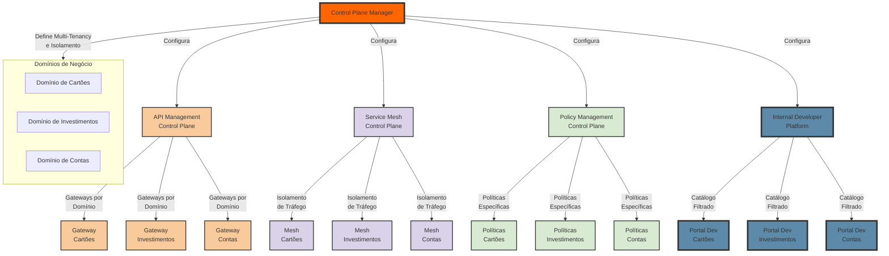

**Abordagem com Control Plane**:

1. **Control Plane Manager**:
    
    - Define fronteiras e namespaces para cada área
    - Configura multi-tenancy em componentes compartilhados
2. **API Management Control Plane**:
    
    - Configura gateways por domínio de negócio
    - Implementa políticas específicas por área
3. **Service Mesh Control Plane**:
    
    - Configura isolamento de tráfego entre áreas
    - Implementa autenticação mTLS para comunicação
4. **Policy Management**:
    
    - Define políticas específicas por domínio
    - Implementa controles de acesso a dados
5. **Internal Developer Platform**:
    
    - Apresenta catálogo filtrado por área de negócio
    - Aplica guardrails específicos do domínio

**Benefícios**:

- Governança centralizada com políticas específicas
- Isolamento de falhas entre áreas críticas
- Capacidade de inovação em ritmos diferentes
- Conformidade com requisitos regulatórios de isolamento

### Caso 3: Migração de API Gateway Legacy

**Cenário**: Migração de um gateway de API legado para uma arquitetura moderna baseada na separação Control Plane/Data Plane.

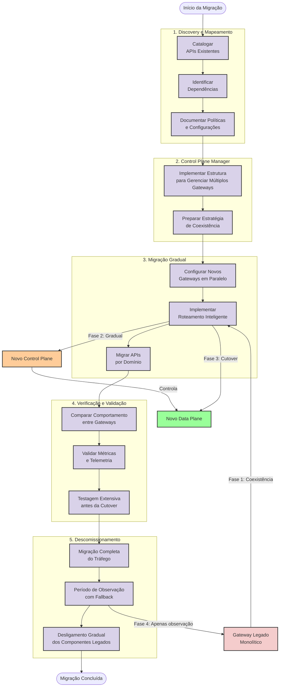

**Estratégia**:

1. **Discovery e Mapeamento**:
    
    - Catalogar todas as APIs existentes
    - Identificar dependências e integações
    - Documentar políticas e configurações atuais
2. **Control Plane Manager**:
    
    - Implementar estrutura para gerenciar múltiplos gateways
    - Preparar estratégia de coexistência e migração gradual
3. **Migração Gradual**:
    
    - Configurar novos gateways em paralelo
    - Implementar roteamento inteligente entre legado e moderno
    - Migrar APIs por domínio, começando com menor risco
4. **Verificação e Validação**:
    
    - Comparar comportamento entre gateways
    - Validar métricas e telemetria
    - Testagem extensiva antes da cutover
5. **Descomissionamento**:
    
    - Migração completa do tráfego
    - Período de observação com fallback disponível
    - Desligamento gradual dos componentes legados

**Benefícios**:

- Migração sem disrupção para clientes
- Validação em cada etapa
- Capacidade de rollback
- Modernização por domínios de negócio

## Melhores Práticas e Recomendações

### Design e Arquitetura

1. **Separação Clara de Responsabilidades**
    
    - Delimitar bem cada "plane" e suas funções
    - Evitar overlap e duplicação de funcionalidades
    - Documentar interfaces entre componentes
2. **API-First para Integração**
    
    - Definir APIs claras entre os diferentes planos
    - Versionar todas as interfaces
    - Documentar completamente os contratos
3. **Resiliência por Design**
    
    - Projetar para falhas parciais
    - Implementar capacidade de operação degradada
    - Data Plane deve funcionar com Control Plane indisponível
4. **Segurança em Camadas**
    
    - Aplicar controles de segurança em cada nível
    - Implementar princípio do menor privilégio
    - Autenticação/autorização em todas as interações

### Operação e Manutenção

1. **Observabilidade Abrangente**
    
    - Telemetria detalhada para todos os componentes
    - Correlação entre eventos nos diferentes planes
    - Alertas inteligentes com contexto
2. **Automação de Operações**
    
    - Procedimentos operacionais automatizados
    - Runbooks digitais para operações complexas
    - Recuperação autônoma quando possível
3. **Gestão de Mudanças**
    
    - Processos claros para atualizações
    - Testes rigorosos antes de mudanças
    - Capacidade de rollback rápido
4. **Simulação de Falhas**
    
    - Testes de caos regulares
    - Simulação de cenários de desastre
    - Validação de estratégias de recuperação

### Escalabilidade e Evolução

1. **Design para Crescimento**
    
    - Arquitetura que suporta expansão horizontal
    - Planejamento de capacidade baseado em tendências
    - Benchmarks regulares para validar limites
2. **Modularidade**
    
    - Componentes independentes e substituíveis
    - Interfaces bem definidas entre módulos
    - Capacidade de atualizar partes isoladamente
3. **Experimentação Segura**
    
    - Ambientes de sandbox para novas tecnologias
    - Mecanismos para testes A/B de novas abordagens
    - Processo estruturado para adoção de inovações
4. **Governança Evolutiva**
    
    - Revisões regulares de políticas e padrões
    - Adaptação a novos requisitos regulatórios
    - Benchmarking contínuo com as melhores práticas da indústria

## Roadmap de Implementação

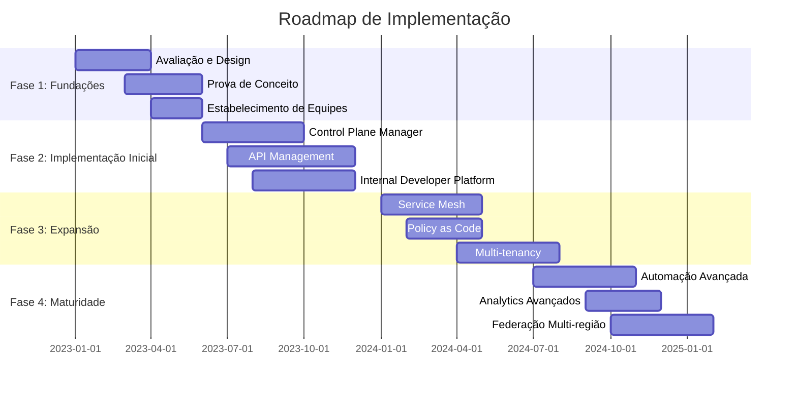

A implementação de uma arquitetura de Control Plane eficaz em uma instituição financeira deve seguir um roadmap gradual:

### Fase 1: Fundações (3-6 meses)

1. **Avaliação e Design**
    
    - Mapeamento do ambiente atual
    - Definição de requisitos e princípios
    - Design da arquitetura alvo
2. **Prova de Conceito**
    
    - Implementação em escala reduzida
    - Validação de componentes core
    - Testes de integração e performance
3. **Estabelecimento de Equipes**
    
    - Formação do time de Platform Engineering
    - Definição de responsabilidades
    - Treinamento inicial

### Fase 2: Implementação Inicial (6-12 meses)

1. **Control Plane Manager**
    
    - Implementação da camada de orquestração
    - Integração com sistemas existentes
    - Automação de fluxos básicos
2. **API Management**
    
    - Implementação do novo gateway de APIs
    - Migração de APIs piloto
    - Configuração de políticas core
3. **Internal Developer Platform**
    
    - Desenvolvimento de portal inicial
    - Integração com pipelines CI/CD
    - Onboarding das primeiras equipes

### Fase 3: Expansão (12-18 meses)

1. **Service Mesh**
    
    - Implementação para microserviços críticos
    - Configuração de políticas de segurança
    - Integração com observabilidade
2. **Policy as Code**
    
    - Implementação de OPA ou solução similar
    - Codificação de políticas de compliance
    - Integração com gateways e pipelines
3. **Multi-tenancy**
    
    - Expansão para mais áreas de negócio
    - Implementação de isolamento avançado
    - Templates específicos por domínio

### Fase 4: Maturidade (18-24 meses)

1. **Automação Avançada**
    
    - Self-healing e recuperação automática
    - Escalabilidade dinâmica baseada em demanda
    - Otimização contínua de recursos
2. **Analytics Avançados**
    
    - Business insights baseados em tráfego de API
    - Detecção avançada de anomalias
    - Previsão de tendências e capacidade
3. **Federação Multi-região**
    
    - Expansão para múltiplas regiões
    - Estratégias de DR avançadas
    - Gestão global com controle local

## Recursos Adicionais

### Referências Técnicas

1. **Livros**
    
    - "Kubernetes Patterns" por Bilgin Ibryam e Roland Huß
    - "Production Kubernetes" por Josh Rosso, Rich Lander, e John Harris
    - "Platform Engineering on Kubernetes" por Mauricio Salatino
    - "Implementing Service Level Objectives" por Alex Hidalgo
2. **Artigos e Whitepapers**
    
    - "Building Internal Developer Platforms" (Humanitec)
    - "Control Plane vs. Data Plane in Cloud Native Applications" (CNCF)
    - "API Gateway Pattern and Architecture" (Kong)
    - "Multi-cluster Kubernetes and Service Mesh" (Istio)

### Comunidades e Fóruns

1. **Grupos e Comunidades**
    
    - Cloud Native Computing Foundation (CNCF)
    - Platform Engineering Community
    - API Specifications Conference
    - Gartner Technical Professional Forum
2. **Eventos e Conferências**
    
    - KubeCon + CloudNativeCon
    - Platform Engineering Summit
    - API World
    - DevOps Enterprise Summit

### Ferramentas e Recursos Open Source

1. **Repositórios GitHub**
    
    - Backstage (Spotify)
    - Open Policy Agent
    - Kyverno
    - Crossplane
2. **Exemplos e Templates**
    
    - Referência de arquitetura do CNCF
    - Padrões GitOps da Weaveworks
    - Templates de Backstage da comunidade
    - Biblioteca de políticas OPA

---

_Este documento foi criado para servir como um guia abrangente sobre arquitetura de Control Plane para instituições financeiras. As recomendações devem ser adaptadas às necessidades específicas de cada organização._