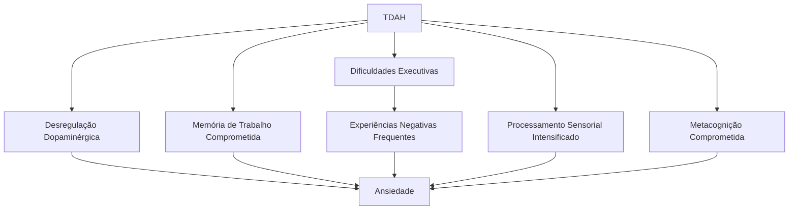

# Ansiedade E TDAH: Entendendo a Tempestade Perfeita Na Mente Do Seu Filho

_Tão conectados quanto café e insônia, TDAH e ansiedade andam de mãos dadas em muitas de nossas crianças. Este não é "mais um problema" - é uma parte integrante da experiência que precisamos entender para ajudar de verdade._

## A Dupla Que Ninguém Pediu: Entendendo Por Que Acontece

Cerca de 30% das crianças com TDAH também apresentam algum transtorno de ansiedade – não é coincidência, é neurobiologia. Vamos entender esse relacionamento complicado?

> "Meu filho de 9 anos não consegue dormir há semanas porque fica remoendo todas as coisas que podem dar errado no passeio escolar do próximo mês. O mesmo menino que esquece o material escolar todos os dias consegue lembrar e antecipar 47 cenários catastróficos diferentes para um evento futuro. Como isso faz sentido?" — Mãe de um menino com TDAH e ansiedade

### O Que a Ciência Diz Sobre Isso? 🔬

A ansiedade em crianças com TDAH não é "apenas preocupação" ou "nervosismo" – é um fenômeno neurobiológico com várias explicações científicas:

1. **Desregulação Dopaminérgica**: O mesmo sistema de neurotransmissores que causa desatenção e impulsividade também pode provocar hipervigilância a ameaças potenciais.
    
2. **Memória de Trabalho Comprometida**: Quando seu filho não confia na própria capacidade de lembrar ou gerenciar situações (com razão, já que a memória de trabalho é afetada pelo TDAH), a ansiedade surge como resposta compensatória.
    
3. **Dificuldades Executivas = Experiências Negativas**: A criança com TDAH acumula mais "fracassos" e situações desagradáveis devido às dificuldades executivas, criando um terreno fértil para a ansiedade antecipatória.
    
4. **Processamento Sensorial Intensificado**: Muitas crianças com TDAH processam estímulos sensoriais de forma amplificada, o que pode resultar em sobrecarga e, consequentemente, ansiedade.
    
5. **Metacognição Comprometida**: Dificuldade em avaliar realisticamente o tamanho de um problema ou o tempo que uma emoção desagradável vai durar.
    

## Como a Ansiedade Se Manifesta Diferente Em Crianças Com TDAH

A expressão da ansiedade em crianças neurodivergentes pode ser confundida com "comportamento difícil" ou "falta de esforço". É essencial reconhecer estes sinais para responder adequadamente:

### Sinais Comuns (Mas Frequentemente Mal Interpretados)

- **Procrastinação Extrema**: Não é preguiça! É paralisia por análise e medo de falhar.
- **Irritabilidade Súbita**: Muitas vezes confundida com "mau comportamento", pode ser uma resposta ao estresse interno.
- **Perfeccionismo Seletivo**: Fazer e refazer a mesma tarefa ou evitar começar se não puder fazer "perfeito".
- **Recusa Escolar**: Não é "preguiça" ou "manipulação" - pode ser ansiedade avassaladora.
- **Queixas Físicas Recorrentes**: Dores de barriga, cabeça ou outros sintomas sem causa médica aparente.
- **Busca Excessiva por Reasseguramento**: Perguntar repetidamente se está tudo bem, se vai dar certo, se você está bravo.
- **Comportamento Regredido**: Voltar a comportamentos de idades anteriores sob estresse.
- **Hiperfoco em Detalhes Negativos**: Capacidade impressionante de detectar e amplificar possibilidades negativas.

### Cenário Comum E Como Lidar: A Lição De Casa Impossível

**O que acontece:** João, 10 anos, tem uma redação para entregar. Ele se senta, olha para o papel em branco, levanta, pega água, volta, rabisca algo, apaga furiosamente, joga o lápis, diz que "é burro", que "nunca vai conseguir", começa a chorar ou fica irritado quando você sugere ajuda.

**O que está realmente acontecendo no cérebro dele:**

1. A memória de trabalho limitada faz com que seja difícil manter o tema e a estrutura do texto "na cabeça".
2. Experiências anteriores de frustração criaram uma expectativa de falha.
3. A ansiedade de desempenho dispara o sistema de luta-fuga-congelamento.
4. O córtex pré-frontal, já comprometido pelo TDAH, fica ainda mais prejudicado pelo estado ansioso.
5. A autorregulação emocional, já difícil no TDAH, colapsa sob a pressão.

**Abordagem que não funciona:** "Não é para tanto! É só uma redação! Senta aí e termina logo, você consegue se quiser."

**Por que não funciona:** Esta abordagem ignora a real dificuldade neurobiológica, invalidando o sofrimento genuíno e intensificando a ansiedade e a vergonha.

**Abordagem eficaz (ancorada na ciência):**

1. **Reconheça e valide**: "Vejo que está difícil começar. Muitas crianças com TDAH sentem isso - não é preguiça, é o cérebro pedindo mais estrutura e segurança."
    
2. **Desdramatize com fatos**: "Vamos dividir em partes pequenas. Nosso cérebro processa melhor assim, especialmente quando estamos ansiosos."
    
3. **Ofereça scaffolding** (suporte estruturado que será removido gradualmente):
    
    - Mapa mental ou estrutura visual da redação
    - Timer para pequenos blocos de trabalho (7-10 minutos) com pausas
    - Gravação de ideias em áudio antes de escrever
    - Escrita colaborativa inicial
4. **Valorize o processo, não apenas o resultado**: "Estou orgulhoso de como você persistiu mesmo quando ficou difícil. Isso é desenvolver resiliência!"
    
5. **Faça revisão preventiva para o futuro**: "O que aprendemos hoje que podemos usar na próxima vez que aparecer uma tarefa assim?"
    

## Estratégias Práticas Baseadas Em Neurociência

### 1. Regra Dos 3C Para Momentos De Crise Ansiosa

Quando seu filho estiver em plena crise de ansiedade, use esta abordagem sequencial:

**Calma** (primeiro você, depois ele)

- Respire fundo e lentamente
- Use voz calma e movimentos tranquilos
- Espere o pico de estresse passar (3-5 minutos) antes de tentar intervenções verbais complexas

**Conexão** (antes da correção)

- Ofereça contato físico se bem recebido (abraço, toque suave)
- Use frases simples de validação: "Sei que está difícil agora"
- Permanença silenciosa, apenas estando presente

**Colaboração** (não imposição)

- "O que você precisa agora?"
- "Como posso ajudar?"
- Ofereça opções simples e concretas

> **Por que isso funciona?** A amígdala (centro de processamento do medo) precisa ser acalmada antes que o córtex pré-frontal (pensamento racional) possa ser reengajado. A conexão segura libera oxitocina, que neutraliza parcialmente os efeitos do cortisol (hormônio do estresse).

### 2. Técnicas De Ancoragem Sensorial

Crianças com TDAH frequentemente respondem bem a intervenções sensoriais que ajudam a "reancorá-las" no momento presente:

|Técnica|Implementação Prática|Princípio Científico|
|---|---|---|
|5-4-3-2-1|Nomeie 5 coisas que vê, 4 que toca, 3 que ouve, 2 que cheira, 1 que degusta|Reengaja o córtex pré-frontal através de tarefas cognitivas simples, diminuindo a atividade da amígdala|
|Contrapeso|Objetos pesados (cobertor, bola) ou pressão profunda|Ativa sistema proprioceptivo, que tem efeito calmante no SNC|
|Respiração Quadrada|Inspire por 4, segure por 4, expire por 4, pause por 4|Ativa o sistema nervoso parassimpático, contrapondo a resposta de estresse|
|Movimento Rítmico|Balanço, caminhada, batida de pés|Regula o sistema vestibular e fornece input sensorial organizador|

### 3. Reestruturação Cognitiva Adaptada Para TDAH

A abordagem cognitivo-comportamental tradicional pode precisar de adaptações para funcionar com cérebros de TDAH:

**Versão Tradicional:** "Identifique pensamentos negativos, questione-os logicamente, substitua-os por pensamentos mais realistas."

**Versão Adaptada para TDAH:**

- Use representações **visuais** dos pensamentos (desenhos, mapas, escalas)
- Incorpore **movimento** durante a reflexão (andar enquanto conversa, usar bola de exercício)
- Faça **analogias concretas** ("Seu cérebro é como um alarme muito sensível")
- Use **histórias e personagens** ("O que o Detetive da Verdade descobriria?")
- Crie **âncoras físicas** para novos pensamentos (pulseiras, cartões de bolso)

### Exemplo Prático Detalhado: O Calendário De Preocupações

**Contexto:** Muitas crianças com TDAH e ansiedade trazem preocupações em momentos inoportunos (hora de dormir, durante tarefas de foco) e parecem incapazes de "deixar para depois".

**A ferramenta:** Um sistema visual e tátil para externalizar, categorizar e agendar preocupações.

**O que você precisa:**

- Um quadro ou calendário visual
- Post-its ou cartões coloridos
- Uma "caixa de preocupações" (pode ser qualquer recipiente)
- Canetas coloridas

**Como implementar:**

1. **Apresente o conceito**: "Seu cérebro está tentando te proteger lembrando de preocupações. É um trabalho importante! Mas podemos ajudá-lo a fazer isso nos momentos certos."
    
2. **Crie categorias e códigos visuais**:
    
    - Preocupações que precisam de ação nossa (verde)
    - Preocupações que não têm solução ou são muito futuras (azul)
    - Preocupações que provavelmente não vão acontecer (amarelo)
3. **Ritual diário**: Reserve 10-15 minutos por dia (não próximo à hora de dormir) como "Hora Oficial da Preocupação", quando vocês revisam os cartões juntos.
    
4. **Durante crises**: Quando surgirem preocupações fora da hora agendada, valide o sentimento e ofereça o cartão: "Vamos guardar isso para a Hora da Preocupação, quando poderemos dar atenção total a isso."
    

**Por que funciona:** Esta técnica externaliza o conteúdo da preocupação, reduzindo a carga na memória de trabalho já sobrecarregada. Também dá previsibilidade, essencial para crianças com TDAH, e cria uma sensação de controle sem invalidar os sentimentos.

## Autocuidado Parental: Não É Luxo, É Necessidade

A ansiedade é contagiosa – especialmente entre pais e filhos. Pesquisas mostram que filhos de pais com altos níveis de estresse apresentam piora nos sintomas de TDAH e ansiedade. Não é culpa, é biologia!

### Dica De Ouro (Acionável Imediatamente) ✨

Institua seu "Plano de Emergência de Oxigênio" – 3 níveis de autocuidado:

**Nível 1 - Micromomentos (1-5 minutos)**

- 10 respirações profundas com olhos fechados
- Lavar o rosto com água fria
- Alongar o pescoço e ombros
- Ouvir uma música favorita

**Nível 2 - Mini-pausas (15-30 minutos)**

- Caminhada rápida ao redor do quarteirão
- Ligação para um amigo que entende sua realidade
- Meditação guiada curta
- Café ou chá apreciado em silêncio total

**Nível 3 - Momentos Estruturais (programados)**

- Encontros mensais com grupo de pais de crianças neurodivergentes
- Terapia regular
- Atividade física consistente
- Hobby que não envolva as crianças

> 💡 **Sabedoria essencial**: Sua criança está constantemente "lendo" seu estado emocional para calibrar o próprio. Quando você cuida de sua regulação emocional, está ativamente tratando a ansiedade dela.

## Ansiedade Em Diferentes Fases Do Desenvolvimento

A ansiedade se manifesta de formas distintas ao longo do desenvolvimento da criança com TDAH. Reconhecer estas diferenças é crucial para uma intervenção efetiva:

### Pré-escolares (3-5 anos)

**Como se manifesta:**

- Apego excessivo ao cuidador principal
- Reações intensas a mudanças na rotina
- Medos específicos muito intensos (escuro, monstros)
- Comportamentos regressivos (voltar a fazer xixi na cama, fala infantilizada)
- Birras explosivas quando confrontados com situações novas

**Estratégias específicas:**

- Histórias sociais ilustradas antecipando mudanças
- Objeto transicional (paninho, ursinho) permitido em todos os ambientes
- Rotinas visuais altamente previsíveis
- Tempo de adaptação extra para novas situações

> **Caso prático:** Pedro, 4 anos, com TDAH, tinha crises intensas ao chegar na escola. Implementamos um "ritual de chegada" com 5 passos visuais sempre na mesma ordem, incluindo um abraço especial de despedida. Em duas semanas, as crises diminuíram significativamente. A previsibilidade diminuiu a carga sobre seu sistema executivo já sobrecarregado.

### Crianças Em Idade Escolar (6-12 anos)

**Como se manifesta:**

- Preocupações acadêmicas frequentes
- Queixas somáticas em dias de avaliação
- Medo de falhar ou parecer "burro"
- Evitação de situações de desempenho
- Comparação constante com colegas

**Estratégias específicas:**

- "Plano B" para momentos de sobrecarga (cartão para sair da sala)
- Técnicas de visualização adaptadas ("meu lugar seguro")
- Lista de conquistas visível no quarto/área de estudo
- Prática gradual de situações desafiadoras com muito suporte

### Adolescentes (13-18 anos)

**Como se manifesta:**

- Irritabilidade como máscara da ansiedade
- Respostas do tipo "tanto faz" escondendo medo de falhar
- Ansiedade social intensificada
- Procrastinação extrema
- Preocupação elevada com o futuro e transições

**Estratégias específicas:**

- Linguagem que separa a pessoa dos sintomas ("você está sentindo ansiedade" vs. "você é ansioso")
- Envolvimento ativo nas escolhas de tratamento
- Uso de tecnologia (apps) como suporte
- Ênfase em habilidades de autoadvocacia
- Diálogo aberto sobre como o TDAH afeta diferentes áreas da vida

> **Dica prática:** Para adolescentes, a abordagem direta de "vamos tratar sua ansiedade" frequentemente encontra resistência. Enquadre como "ferramentas para a vida" ou "hacks para o cérebro" tem melhor aceitação. O framing é tudo!

## A Relação Complexa Entre Medicação E Ansiedade

A questão da medicação para TDAH quando há ansiedade comórbida é complexa e individualizada:

### O Que a Ciência Diz Sobre Isso? 🔬

- **Efeitos paradoxais**: Alguns psicoestimulantes podem diminuir a ansiedade em certos casos de TDAH ao melhorar o funcionamento executivo e reduzir a sensação de sobrecarga.
    
- **Potenciais complicações**: Em outros casos, podem aumentar temporariamente sintomas ansiosos, especialmente durante ajustes de dose ou no início/fim do efeito.
    
- **Abordagem combinada**: Pesquisas indicam que a combinação de medicação adequada com terapia cognitivo-comportamental costuma ter resultados superiores ao uso de apenas uma intervenção.
    

### Considerações Importantes

|Classe de Medicamento|Considerações com Ansiedade|Observações Práticas|
|---|---|---|
|Estimulantes (metilfenidato, anfetaminas)|Podem intensificar ou reduzir ansiedade, dependendo da origem dos sintomas ansiosos|Monitoramento cuidadoso no início, especial atenção a doses e timing|
|Não-estimulantes (atomoxetina)|Menos propensos a exacerbar ansiedade, podem ajudar com sintomas ansiosos|Efeito mais lento, requer paciência para avaliar benefícios|
|Antidepressivos|Podem tratar tanto TDAH quanto ansiedade em alguns casos|Frequentemente usados em casos de comorbidade significativa|
|Ansiolíticos|Geralmente não tratam o TDAH, mas podem ser necessários temporariamente|Cautela quanto ao potencial de dependência|

> **Observação crucial:** A decisão sobre medicação é altamente individualizada e deve ser feita com orientação médica especializada, preferencialmente com um psiquiatra experiente em TDAH e comorbidades. Não existe abordagem "tamanho único"!

## Ansiedade Social E TDAH: Uma Vulnerabilidade Específica

Cerca de 30-40% das crianças e adolescentes com TDAH também experimentam ansiedade social significativa, muitas vezes negligenciada no tratamento. Entender esta intersecção é fundamental:

### Por Que Acontece?

1. **Déficits nas habilidades sociais**: Dificuldades em captar sinais sociais sutis e responder apropriadamente devido à desatenção.
    
2. **Rejeição acumulada**: Histórico de experiências sociais negativas devido à impulsividade ou comportamentos "fora da curva".
    
3. **Autoconsciência amplificada**: Consciência das próprias diferenças sem ferramentas para gerenciá-las.
    
4. **Reatividade emocional**: Respostas emocionais intensas a pequenas rejeições percebidas.
    
5. **Processamento pós-evento**: Tendência a ruminar sobre interações sociais, amplificando aspectos negativos.
    

### Cenário Comum E Como Lidar: A Festa De Aniversário

**O que acontece:** Mariana, 11 anos, é convidada para uma festa. Inicialmente empolgada, começa a criar desculpas para não ir conforme o dia se aproxima. No dia, tem dor de barriga, choro e implora para não ir. Quando questionada, diz "todo mundo vai me achar estranha" e "ninguém vai querer brincar comigo".

**Abordagem ineficaz:** "Você vai se divertir quando chegar lá! Todo mundo fica nervoso em festas."

**Por que não funciona:** Para crianças com TDAH e ansiedade social, não é apenas "nervosismo" - é uma experiência avassaladora baseada em falhas sociais anteriores reais e déficits específicos.

**Abordagem eficaz (baseada em evidências):**

1. **Valide sem reforçar**: "Entendo que festas podem ser complicadas para você. Tem muita coisa acontecendo ao mesmo tempo e às vezes é difícil saber como agir."
    
2. **Prepare previamente**:
    
    - Visite o local antes, se possível
    - Crie um "mapa social" visual da festa (quem estará lá, atividades previstas)
    - Estabeleça sinais discretos entre vocês para pedir ajuda
    - Pratique 2-3 abordagens para iniciar conversas
3. **Planeje pausas**: "Combinamos que você pode tirar 5 minutos de pausa no banheiro ou outro lugar tranquilo se ficar sobrecarregada."
    
4. **Defina expectativas realistas**: "Não precisamos ficar a festa toda. Vamos por 1 hora e reavaliamos como você está se sentindo."
    
5. **Reconheça o esforço**: "Você foi muito corajosa ao enfrentar algo difícil. Isso é desenvolvimento de habilidades reais!"
    

> **Lembrete crucial**: Na ansiedade social com TDAH, é importante balancear a exposição gradual (para desenvolver confiança) com o suporte real para déficits sociais existentes. Não é apenas "superar o medo" - é também ensinar habilidades sociais concretas.

## Quando Buscar Ajuda Profissional

A ansiedade precisa de atenção profissional quando:

- Interfere significativamente na qualidade de vida ou funcionamento diário
- Causa sofrimento desproporcional ao contexto
- Envolve comportamentos repetitivos ou rituais rígidos
- Resulta em evitação constante de situações comuns
- Causa problemas somáticos recorrentes (dores, problemas gastrointestinais)
- Afeta o sono consistentemente
- Não responde a estratégias básicas de manejo após tentativas consistentes

### Tipos De Profissionais a Considerar

|Profissional|Foco|Quando Procurar|
|---|---|---|
|Psiquiatra Infantil|Avaliação, diagnóstico diferencial, medicação quando necessária|Sintomas graves, comorbidades complexas, necessidade de avaliação farmacológica|
|Psicólogo (TCC)|Terapia cognitivo-comportamental adaptada para TDAH|Padrões de pensamento negativos persistentes, comportamentos de evitação|
|Terapeuta Ocupacional|Integração sensorial, estratégias práticas para a vida diária|Dificuldades sensoriais significativas, problemas com atividades da vida diária|
|Neuropsicólogo|Avaliação detalhada do perfil cognitivo|Necessidade de entender forças e desafios específicos para intervenções personalizadas|

## Lidando Com a Ansiedade Dos Pais: Quando Nós Também Sofremos

Um aspecto frequentemente negligenciado é como a parentalidade neurodivergente afeta nossa própria saúde mental. Dados mostram que pais de crianças com TDAH têm taxas significativamente mais altas de ansiedade e estresse - e isso não é fraqueza, é uma resposta natural a desafios reais.

### Por Que Acontece Com Tanta Frequência?

1. **Estresse crônico e imprevisibilidade**: O cérebro com TDAH traz um nível de imprevisibilidade que mantém o sistema nervoso parental em constante alerta.
    
2. **Preocupação amplificada com o futuro**: Questionamentos constantes sobre como seu filho se adaptará ao mundo.
    
3. **Culpa e questionamentos internos**: "Será que estou fazendo o suficiente?", "Deveria ter buscado ajuda antes?", "É minha culpa?"
    
4. **Traumatização secundária**: Acompanhar o sofrimento do seu filho e as dificuldades dele pode ser traumático para você também.
    
5. **Isolamento social**: Menos oportunidades de socialização e recarregamento emocional.
    

### Estratégias De Autocuidado (Além Do Básico)

**Construa sua rede de apoio neurodivergente:**

- Grupos presenciais ou online de pais (muitos no WhatsApp/Facebook)
- Amizades com outros pais que "entendem sem explicações"
- Relações com adultos com TDAH que superaram desafios

**Redefina o significado de "sucesso parental":**

- Crie seu próprio "manual de métricas" baseado na realidade do seu filho
- Celebre microvitórias que outros não entendem
- Documente progressos com fotos/vídeos para os dias difíceis

**Pratique autocompaixão estratégica:**

- Meditação específica de autocompaixão (5 minutos diários)
- Frase-âncora para momentos de culpa: "Estou fazendo o melhor com o que sei agora"
- "E se fosse meu amigo?" - técnica de perspectiva para autoavaliações duras

> **Nota pessoal de uma mãe**: "Percebi que estava tão focada em 'consertar' meu filho que esqueci de cuidar de mim. O dia que entendi que minha ansiedade alimentava a dele foi um divisor de águas. Comecei terapia, exercícios e a prática diária de gratidão. Não é egoísmo - é oxigênio para toda a família."

## Recursos Tecnológicos: Ferramentas Digitais Que Realmente Ajudam

A tecnologia pode ser uma grande aliada no gerenciamento da ansiedade. Aqui estão recursos digitais especialmente úteis para crianças com TDAH:

|Tipo|Nome|Como Ajuda|Melhor Para|
|---|---|---|---|
|Apps de Meditação|Mindfulness para Crianças; Smiling Mind|Meditações curtas (3-5 min) com feedback visual|Crianças 7+ que precisam de pausas regulatórias|
|Organizadores Visuais|Microsoft To-Do; Todoist|Externalizam e organizam preocupações|Crianças 10+ com ansiedade antecipatória|
|Gerenciadores de Tempo|Forest; Time Timer|Tornam o tempo "visível"; gamificam a gestão temporal|Crianças com ansiedade relacionada a prazos/tempo|
|Apps de Relaxamento|Calm; Respirar|Técnicas de respiração e visualização|Momentos de desregulação aguda|
|Diários Emocionais|Daylio; Mood Meter|Rastreiam padrões emocionais e gatilhos|Adolescentes; reconhecimento de padrões|

**Dica de implementação:** Comece com apenas UMA ferramenta. Avalie por duas semanas antes de decidir se funciona. Lembre-se: a tecnologia é suporte, não substituto para conexão humana!

## Mensagem Final: Você Não Está Sozinho Nesta Jornada

A intersecção entre TDAH e ansiedade é complexa, mas não é um caminho que você precisa percorrer sem mapa ou companhia.

Lembre-se: você não causou a ansiedade do seu filho. A neurobiologia é real. Mas você pode ser o fator decisivo que transforma a experiência dele, oferecendo as ferramentas, a compreensão e o ambiente que permitem que ele floresça - com todas as suas maravilhosas peculiaridades neurológicas.

Como diz um velho provérbio africano que uso como mantra: "Se quer ir rápido, vá sozinho. Se quer ir longe, vá em grupo." Na jornada da parentalidade neurodivergente, precisamos ir longe - muito longe. E você não precisa (nem deve) fazer isso sozinho.

### Perguntas Para Reflexão Dos Pais 🤔

1. Quais sinais de ansiedade meu filho demonstra que eu posso estar interpretando apenas como "comportamento difícil"?
    
2. Como minhas próprias experiências com ansiedade (passadas ou presentes) influenciam minha resposta à ansiedade do meu filho?
    
3. Quais são os gatilhos específicos de ansiedade que observo no dia a dia do meu filho?
    
4. Que tipo de linguagem uso quando meu filho está ansioso? Ela valida ou minimiza?
    
5. Quais estratégias de regulação emocional estou modelando para meu filho regularmente?
    
6. Quando foi a última vez que priorizei meu próprio bem-estar sem sentir culpa por isso?
    

---

**Links Internos Relevantes:**

- [[Regulação Emocional e TDAH]]
- [[Funções Executivas: Guia Completo]]
- [[Estabelecendo Rotinas que Funcionam]]
- [[Comunicação Não-Violenta com Crianças Neurodivergentes]]
- [[Terapias Baseadas em Evidências para TDAH]]
- [[Autocuidado Parental: Além das Dicas Básicas]]
- [[TDAH na Adolescência: Navegando a Transição]]

**Referências Científicas (Acessíveis):**

- Associação Brasileira do Déficit de Atenção (ABDA): abda.org.br
- Barkley, R. A. (2020). Taking Charge of ADHD: The Complete, Authoritative Guide for Parents.
- ADDitude Magazine (additudemag.com) - Fonte confiável sobre TDAH e comorbidades
- CHADD (chadd.org) - Children and Adults with Attention-Deficit/Hyperactivity Disorder
- Mautone, J. A., Lefler, E. K., & Power, T. J. (2021). Promoting Family and School Success for Children With ADHD: Strengthening Relationships While Building Skills. _Clinical Child and Family Psychology Review_.