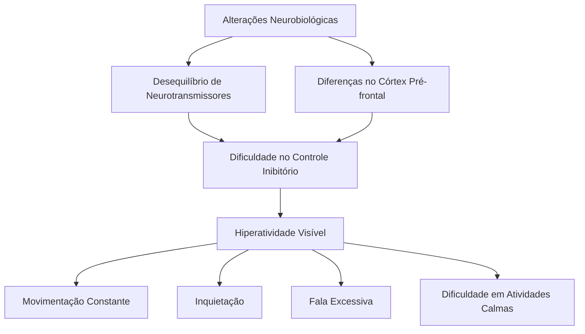
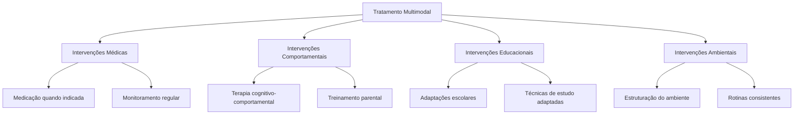
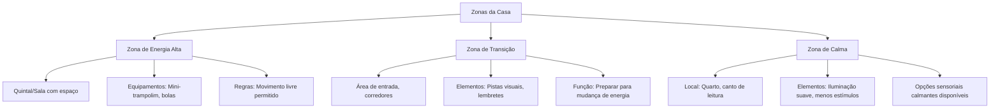

# Entendendo a Hiperatividade no TDAH: Um Guia Para Pais

_Por que parece que meu filho tem um motor ligado o tempo todo? Como posso ajudá-lo a canalizar toda essa energia?_

**Um guia completo e compassivo para navegar pelos desafios - e descobrir os potenciais - da hiperatividade infantil**

Se você já se fez essas perguntas, não está sozinho. A hiperatividade é um dos aspectos mais visíveis e desafiadores do TDAH, e também um dos mais incompreendidos. Hoje vamos mergulhar nesse mundo agitado, entender o que realmente acontece no cérebro da criança e, mais importante, descobrir estratégias práticas que funcionam no dia a dia.

> 💡 **Dica rápida**: Hiperatividade não é falta de educação ou preguiça. É uma característica neurobiológica real que precisa de compreensão e estratégias específicas.

> 🗣️ **Da perspectiva da criança**: "É como se dentro de mim tivesse uma máquina que não para nunca. Mesmo quando eu quero ficar quieto, meu corpo precisa se mexer. Não é que eu não esteja tentando... é que é muito, muito difícil. E às vezes as pessoas ficam bravas comigo por causa disso, como se eu estivesse fazendo de propósito." - Miguel, 9 anos

## O Que É (Realmente) a Hiperatividade no TDAH?

A hiperatividade vai muito além da agitação típica de qualquer criança. Ela é um sintoma central do TDAH (especialmente no tipo predominantemente hiperativo-impulsivo e no tipo combinado) e se manifesta como uma inquietação constante e muitas vezes incontrolável.

Aquelas pernas que balançam sob a mesa, a necessidade de mexer em algo o tempo todo, a dificuldade para ficar sentado durante uma refeição, a tendência de falar sem parar... tudo isso são manifestações da hiperatividade. É como se houvesse um motor interno que não desliga.

### O Que a Ciência Diz Sobre Isso? 🔬

A hiperatividade tem raízes neurobiológicas bem estabelecidas. Não é "falta de limite" nem "excesso de açúcar" (embora esse último possa piorar os sintomas em algumas crianças).

Os estudos de neuroimagem mostram que o cérebro com TDAH tem:

- **Alterações nos circuitos da dopamina e noradrenalina** - os neurotransmissores envolvidos no controle do movimento, atenção e sistema de recompensa
- **Funcionamento diferente no córtex pré-frontal** - a área responsável pelo controle inibitório (a capacidade de "frear" comportamentos)
- **Ativação reduzida em áreas cerebrais ligadas à autorregulação** - o que dificulta "desacelerar" mesmo quando a situação pede

Ou seja, a criança com hiperatividade não está sendo "mal-educada" quando não consegue ficar parada. Ela literalmente não tem o mesmo nível de controle sobre seu corpo que outras crianças têm. É como dirigir um carro com freios menos eficientes - mesmo que você queira parar, precisa de mais esforço e distância para conseguir.

## Como a Hiperatividade Impacta a Vida Da Criança E Da Família

A hiperatividade não é apenas um desafio para os pais - é extremamente difícil para a própria criança. Imagine sentir constantemente que seu corpo precisa se mover, mesmo quando você quer ficar quieto. É exaustivo!

### Para a Criança

- **Desgaste físico e mental** - é cansativo estar sempre em movimento
- **Rejeição social** - colegas podem achar "irritante" ou "cansativo"
- **Dificuldades acadêmicas** - a inquietação dificulta seguir aulas tradicionais
- **Baixa autoestima** - após ouvir repetidamente para "ficar quieto" ou "se comportar"
- **Acidentes mais frequentes** - devido à impulsividade associada

### Para a Família

- **Exaustão parental** - cuidar de uma criança hiperativa é fisicamente cansativo
- **Tensão nos relacionamentos** - entre os pais, com outros filhos
- **Julgamentos externos** - parentes, professores e estranhos que não entendem
- **Desafios logísticos** - fazer tarefas simples como ir ao supermercado pode virar uma aventura

## Cenário Comum E Como Lidar

### O Jantar Em Família 🍽️

**Situação:** Família sentada para jantar. João (8 anos, TDAH) não consegue ficar sentado à mesa. Levanta a cada dois minutos, balança na cadeira, derruba o suco, interrompe todas as conversas.

**O que geralmente acontece:** Pais ficam frustrados, repetem "senta direito!" várias vezes, a tensão aumenta, João fica ansioso (o que piora a hiperatividade), o jantar vira um campo de batalha.

**Por que isso acontece?** O cérebro de João está buscando estimulação. Ficar sentado, parado, em uma atividade de baixa estimulação (do ponto de vista dopaminérgico) é um verdadeiro desafio neurobiológico para ele.

**Abordagem mais efetiva:**

1. **Aceitar a realidade neurobiológica**: João não está fazendo isso para irritar ninguém
2. **Adaptar o ambiente**:
    - Permitir uma almofada de equilíbrio na cadeira (que permite movimento sem sair do lugar)
    - Ter objetos pequenos para manipular durante o jantar (uma bolinha anti-stress discreta)
    - Estabelecer "pausas para movimento" - "João, depois de comer o arroz, você pode levantar e dar uma volta rápida pela sala"
3. **Comunicar expectativas claras**: "Precisamos que você fique à mesa por 15 minutos. Temos este timer aqui. Depois você pode ter 5 minutos de pausa"
4. **Reforçar positivamente**: "Notei como você conseguiu ficar sentado durante quase todo o jantar hoje! Isso mostra muito autocontrole!"

**O que João aprende:** Que suas necessidades são respeitadas, mas que também há momentos em que precisa se esforçar para se regular. Ele desenvolve estratégias adaptativas em vez de apenas sentir-se constantemente errado.

### Exemplo Prático Detalhado: A Lição De Casa

Maria, 9 anos, TDAH tipo combinado. Precisa fazer a lição de matemática, mas não consegue ficar sentada por mais de 3 minutos. Levanta, pega outros objetos, olha pela janela, pede água, vai ao banheiro...

**O que NÃO funciona:**

- Brigar e forçá-la a sentar (aumenta a ansiedade e, consequentemente, a hiperatividade)
- Fazer a lição por ela (ela não aprende nem conteúdo nem autorregulação)
- Deixar para depois indefinidamente (reforça que ela "não consegue")

**O que FUNCIONA - Estratégia detalhada:**

1. **Preparação do ambiente:**
    
    - Criar uma estação de trabalho com menos distrações visuais
    - Ter à disposição: timer visual, fones de ouvido (opcional, para alguns ajuda), bola anti-stress, garrafa d'água
2. **Quebrar a tarefa em partes menores:**
    
    - Em vez de "fazer toda a lição", dividir: "vamos fazer 5 contas, depois uma pausa"
    - Usar um checklist visual: ✅ ✅ ✅ ✅ ✅ 🎮 (pausa)
3. **Incorporar movimento na própria atividade:**
    
    - "Vamos resolver estas contas em pé na lousa/quadro"
    - "A cada conta certa, você pode dar uma volta pulando ao redor da mesa"
    - "Vamos jogar as respostas com uma bolinha na cesta"
4. **Sistema de pausas planejadas:**
    
    - Timer visual mostrando quanto tempo até a próxima pausa
    - Pausas ativas: 3-5 minutos para pular, dançar, correr no quintal
    - Retorno claro: "Quando o timer tocar, voltamos para mais 10 minutos de lição"
5. **Comunicação empática e clara:**
    
    - "Eu sei que é difícil ficar parado. Seu cérebro precisa de movimento. Vamos encontrar formas de você se movimentar E fazer a lição"
    - "Estou vendo como está sendo difícil para você hoje. Quer tentar fazer de pé ou sentado na bola de pilates?"

**Resultado:** Maria ainda tem hiperatividade (isso não desaparece), mas aprende que:

1. Suas necessidades de movimento são válidas
2. Existem formas de conciliar movimento e tarefas
3. Ela é capaz de completar atividades com as adaptações certas

> 🤔 **Reflexão para os pais:** Quais tarefas do dia a dia poderiam ser adaptadas para incorporar mais movimento sem perder o objetivo principal?

## Estratégias Práticas Por Ambientes

### Em Casa

|Desafio|Estratégia Adaptativa|Por que funciona|
|---|---|---|
|Refeições|Permitir objetos de manipulação discretos; timer visual; pausas planejadas|Fornece a estimulação sensorial necessária enquanto mantém o objetivo principal|
|Lição de Casa|Quebrar em partes menores; incorporar movimento; estações de trabalho alternativas (em pé, bola de pilates)|Atende à necessidade de movimento enquanto mantém o foco na tarefa|
|Hora de dormir|Rotina de "desaceleração" com atividades físicas ANTES (pular, correr); depois transição para atividades mais calmas; peso no cobertor (se apropriado)|Gasta energia acumulada antes de pedir calma; pesos podem ajudar na propriocepção|
|Espera (médico, fila)|Kit de espera (pequenos brinquedos manipulativos); contagem regressiva visual; revezamento planejado (um adulto fica na fila enquanto outro caminha com a criança)|Fornece estimulação apropriada durante momentos inevitáveis de espera|

### Na Escola

- **Adaptações na sala de aula:**
    
    - Posição da carteira (mais próxima do professor, longe de distrações)
    - Permissão para ficar em pé no fundo da sala quando necessário
    - Objetos de manipulação discreta (massinha terapêutica, elásticos na cadeira)
    - Funções que permitam movimento legítimo (entregar papéis, apagar lousa)
- **Comunicação com professores:**
    
    - Compartilhar estratégias que funcionam em casa
    - Solicitar feedback frequente (o que está funcionando/não funcionando)
    - Desenvolver sinais discretos entre professor e aluno para momentos críticos

**Script de comunicação com a escola:**

"Professora Maria, o João tem TDAH e a hiperatividade é um dos seus principais desafios. Isso não é comportamento deliberado – é uma necessidade neurobiológica de movimento. Em casa, temos percebido que quando permitimos pequenos movimentos controlados, como usar essa bolinha anti-estresse, ele consegue prestar muito mais atenção. Seria possível experimentarmos algumas adaptações simples para ajudá-lo a se concentrar melhor sem perturbar a aula?"

## Dica De Ouro (Acionável Imediatamente) 💫

**Crie uma "Caixa de Movimento" em casa com:**

- Corda para pular
- Bolas de diferentes tamanhos e texturas
- Bolsas de peso leves (podem ser feitas com meias e arroz)
- Faixas elásticas de resistência
- Mini-trampolim (se possível)
- Jogos que exigem movimento controlado (tipo Twister, arremesso em alvo)

Quando notar a hiperatividade aumentando, em vez de pedir para "ficar quieto", direcione para a caixa: "Parece que seu corpo precisa se movimentar! Vamos usar algo da caixa de movimento por 5 minutos e depois voltar para o que estávamos fazendo."

🧠 **Por que funciona:** Fornece a liberação de dopamina e a entrada sensorial que o cérebro está buscando, de forma construtiva e controlada, em vez de reprimir a necessidade.

## Desmistificando Ideias Comuns

### ❌ Mito: "Ele É Agitado Porque come Muito açúcar."

✅ **Realidade:** Embora o açúcar possa afetar temporariamente o comportamento de algumas crianças, não é a causa da hiperatividade no TDAH. Estudos científicos não encontraram relação direta e consistente entre consumo de açúcar e TDAH. A agitação tem base neurobiológica relacionada aos neurotransmissores e ao desenvolvimento cerebral.

### ❌ Mito: "Se Ela Praticasse Mais Esportes, Ficaria Menos agitada."

✅ **Realidade:** Atividade física é extremamente benéfica e pode ajudar a regular os níveis de energia, mas não "cura" a hiperatividade. Crianças com TDAH podem fazer muito exercício e ainda assim apresentar inquietação. O exercício é uma ferramenta de manejo, não uma solução definitiva.

### ❌ Mito: "É Só Falta De Disciplina. Se Os Pais Fossem Mais firmes..."

✅ **Realidade:** A hiperatividade não resulta de falha parental. É uma característica neurobiológica documentada em exames de neuroimagem. Mesmo as crianças com TDAH mais bem disciplinadas ainda enfrentam desafios significativos com autorregulação.

## Autocuidado Parental - Porque Você Também Importa

Ser pai/mãe de uma criança hiperativa é fisicamente e emocionalmente exaustivo. Não é fraqueza admitir isso - é realismo.

**Por que o autocuidado não é opcional:** Quando você está esgotado, sua capacidade de implementar estratégias, manter a calma e oferecer o apoio que seu filho precisa fica seriamente comprometida. O autocuidado não é egoísmo - é manutenção da sua ferramenta mais importante (você) para ajudar seu filho.

**Mini-check de esgotamento:**

- Você sente raiva desproporcional com pequenos incidentes?
- Tem chorado com mais frequência?
- Está dormindo mal, mesmo quando tem oportunidade?
- Perdeu interesse em coisas que costumava gostar?
- Sente que está sempre no "modo sobrevivência"?

Se você respondeu sim a várias dessas perguntas, é hora de priorizar seu bem-estar.

### Estratégias Práticas De Autocuidado Para Pais De Crianças Hiperativas

1. **Sistema de revezamento:** Crie um cronograma com seu parceiro/parceira ou outro adulto de confiança onde cada um tenha tempo garantido "fora de serviço"
2. **Micro-pausas:** 5 minutos de respiração profunda no banheiro é melhor que nada
3. **Grupo de apoio:** Conecte-se com outros pais que "entendem de verdade" (presencial ou online)
4. **Baixe suas expectativas:** A casa perfeita e jantares elaborados podem não ser realistas agora, e tudo bem
5. **Terapia:** Se possível, um espaço só seu para processar emoções é inestimável

> 🙏 **Lembre-se:** Seu filho não precisa de um super-herói perfeito. Ele precisa de um pai/mãe presente, que se cuida para poder cuidar dele por toda essa jornada.

## Perguntas Para Reflexão Dos Pais 🤔

1. Quais momentos do dia são mais desafiadores para meu filho em termos de hiperatividade?
2. Como posso adaptar esses momentos para incluir movimento de forma construtiva?
3. Quais sinais percebo quando a hiperatividade do meu filho está aumentando?
4. Que atividades parecem ajudá-lo a regular melhor sua energia?
5. Como estou cuidando da minha própria energia e bem-estar para lidar com esses desafios?
6. De que formas posso explicar para outras pessoas (familiares, amigos) como a hiperatividade funciona para meu filho?

## Ferramenta De Autoavaliação Parental: Como Estamos Lidando?

Antes de prosseguir, reserve um momento para refletir sobre sua própria jornada como pai/mãe de uma criança com hiperatividade. Esta ferramenta não serve para julgar, mas para ajudar a identificar áreas onde você está indo bem e onde pode precisar de mais apoio.

### Checklist De Reflexão Parental

Marque mentalmente as afirmações com as quais você se identifica:

**Conhecimento e Compreensão:**

- [ ] Compreendo que a hiperatividade tem base neurobiológica
- [ ] Consigo distinguir comportamentos do TDAH de comportamentos deliberados
- [ ] Conheço os gatilhos específicos que aumentam a hiperatividade do meu filho
- [ ] Entendo como a hiperatividade afeta áreas específicas da vida dele

**Abordagens e Estratégias:**

- [ ] Utilizo estratégias preventivas, não apenas reativas
- [ ] Adapto o ambiente para acomodar necessidades de movimento
- [ ] Tenho planos específicos para situações desafiadoras (restaurantes, compras)
- [ ] Comunico expectativas claras, visuais e divididas em passos gerenciáveis
- [ ] Ofereço elogios específicos para esforços de autorregulação

**Autocuidado e Bem-estar:**

- [ ] Tenho momentos regulares de pausa e recuperação
- [ ] Consigo manter a calma na maioria das situações desafiadoras
- [ ] Tenho ao menos uma pessoa com quem posso desabafar abertamente
- [ ] Reconheço e gerencio meus próprios gatilhos de estresse
- [ ] Sei separar minha identidade de meu papel como pai/mãe

**Comunicação e Relacionamentos:**

- [ ] Mantenho comunicação eficaz com a escola/professores
- [ ] Meu filho sabe que o amo incondicionalmente, apesar dos desafios
- [ ] Consigo falar sobre TDAH de forma positiva e livre de estigma
- [ ] Tenho uma rede de apoio (profissionais, outros pais, recursos)

### Interpretando Sua Reflexão

- **Áreas com muitas marcações:** Seus pontos fortes! Continue investindo nelas.
- **Áreas com poucas marcações:** Oportunidades de crescimento - escolha 1-2 itens para focar nas próximas semanas.

> 💪 **Lembre-se:** Parentalidade é uma jornada, não um destino. Todos nós temos dias bons e ruins. O importante é a direção geral em que estamos indo, não a perfeição diária.

## Hiperatividade Através Das Idades: Como Se Manifesta E O Que Fazer

A hiperatividade se apresenta de maneiras diferentes conforme a criança cresce. Reconhecer essas mudanças ajuda a adaptar as estratégias ao longo do tempo:

### Primeira Infância (2-5 anos)

**Como se manifesta:**

- Movimento constante, mesmo durante o sono
- Corre em vez de andar em praticamente todos os ambientes
- Sobe em móveis, pula de lugares altos
- Dificuldade em atividades que exigem ficar sentado (histórias, refeições)
- Fala excessiva e interrupções frequentes

**Estratégias eficazes:**

- Muito movimento estruturado (parquinhos, circuitos motores em casa)
- Alternância frequente entre atividades (15 minutos no máximo por atividade)
- Rotina previsível com pistas visuais
- Opções de movimento mesmo durante atividades "calmas" (ex: balançar enquanto ouve história)

### Idade Escolar (6-11 anos)

**Como se manifesta:**

- Inquietação na cadeira (balança, levanta parcialmente)
- Mexe constantemente em objetos, roupas, cabelo
- Fala sem parar e tem dificuldade em esperar sua vez
- Desafios significativos na sala de aula tradicional
- Impaciência em filas, salas de espera

**Estratégias eficazes:**

- Adaptações escolares (permissão para movimento, pausas ativas)
- Ferramentas de apoio (almofadas de equilíbrio, elásticos nas cadeiras)
- Atividades físicas regulares e intensas após a escola
- Técnicas de auto-monitoramento (escala visual de energia)
- Divisão de tarefas complexas em partes menores

### Adolescência (12-17 anos)

**Como se manifesta:**

- Inquietação interna ("mente acelerada") substitui parte da hiperatividade física
- Sensação descrita como "agitação interior", "motor interno"
- Comportamentos de risco por busca de sensações fortes
- Pode substituir a agitação por falar excessivamente
- Dificuldade em relaxar, desligar e dormir

**Estratégias eficazes:**

- Esportes desafiadores (de preferência com elemento de adrenalina controlada)
- Responsabilidades que envolvam movimento (trabalhos, tarefas)
- Ensinar técnicas de mindfulness adaptadas para TDAH
- Tecnologia assistiva (aplicativos de organização, lembretes)
- Diálogo aberto sobre comportamentos de risco e alternativas seguras
- Participação em decisões sobre seu próprio tratamento

> 💡 **Dica importante:** A hiperatividade não desaparece na adolescência - ela geralmente se internaliza. Quando a criança para de "pular pelas paredes", não significa que o TDAH passou, mas que a manifestação mudou.

## O Lado Positivo Da Hiperatividade: Encontrando Os Superpoderes

Muito se fala sobre os desafios da hiperatividade, mas e quanto aos benefícios? Sim, quando bem canalizada, essa energia extraordinária pode se transformar em vantagens significativas:

### Potenciais Forças Associadas à Hiperatividade

|Característica|Como se Manifesta Positivamente|Como Potencializar|
|---|---|---|
|Energia abundante|Capacidade de realizar mais atividades, persistência física|Esportes de resistência, projetos que exigem vigor físico|
|Dinamismo|Animação, entusiasmo contagiante, carisma|Liderança, apresentações, artes performáticas|
|Pensamento rápido|Criatividade, conexões incomuns entre ideias, resposta rápida|Brainstorming, improvisação, resolução criativa de problemas|
|Capacidade de ação|Iniciativa, menos procrastinação em tarefas interessantes|Empreendedorismo, profissões com variedade de tarefas|
|Multitarefas naturais|Habilidade de alternar rapidamente entre diferentes focos|Ambientes de trabalho dinâmicos, gestão de crises|

### Mini-Histórias Inspiradoras

**Michael Phelps**, o nadador mais condecorado da história olímpica, canalizou seu TDAH para uma dedicação extraordinária à natação. Seus treinadores e pais reconheceram que a piscina era onde ele podia usar toda sua energia de forma construtiva.

**Simone Biles**, ginasta multi-campeã, também tem TDAH. Sua tremenda energia e foco intenso (quando engajada em algo que ama) a levaram a redefinir o que é possível na ginástica.

**Richard Branson**, fundador do Grupo Virgin, atribui parte de seu sucesso empresarial à sua mente inquieta e energia inesgotável.

**História de João (Hipotética):**  
João era o "furacãozinho" da escola. Aos 8 anos, não conseguia ficar sentado por mais de 5 minutos. Seus pais, em vez de apenas tentar "contê-lo", inscreveram-no em natação, teatro e percussão. Hoje, aos 25, João é professor de educação física, usa sua energia para inspirar outras crianças e compreende profundamente aquelas que são como ele era.

> 🧠 **O que a ciência diz:** Pesquisas mostram que indivíduos com TDAH frequentemente têm níveis mais altos de criatividade, pensamento divergente (capacidade de gerar múltiplas soluções) e perseverança em áreas de interesse - características extremamente valiosas em diversos campos profissionais.

## Estudo De Caso: A Transformação Da Rotina Matinal

Para ilustrar como a teoria se transforma em prática, vamos acompanhar a história da família Silva e sua jornada para transformar o momento mais caótico do dia: a rotina matinal.

### Antes: Caos E Frustração

**Cenário:** Toda manhã na casa dos Silva era uma batalha. Pedro (7 anos, TDAH) não conseguia se concentrar para se vestir - começava a colocar a camiseta e no meio do caminho já estava pulando na cama, brincando com o cachorro ou desmontando um brinquedo. Escovar os dentes era quase impossível sem supervisão constante.

A mãe, Ana, gritava repetidamente: "Anda logo, vai se atrasar!" O pai, Carlos, frustrado, acabava fazendo tudo por ele (vestindo-o, escovando seus dentes) para não perder a hora. Pedro chegava na escola agitado, desorganizado, frequentemente sem tomar café da manhã adequadamente, e já começava o dia sendo repreendido.

Ana e Carlos se sentiam exaustos às 8h da manhã, culpados por gritar, e frustrados com o que interpretavam como "preguiça" ou "desobediência" do filho.

### O Processo De Mudança

1. **Compreensão:** A família buscou informações sobre TDAH e entendeu que Pedro não estava sendo desobediente - seu cérebro realmente processava as instruções e sequências de forma diferente.
    
2. **Observação:** Notaram que Pedro tinha muito mais facilidade em seguir rotinas quando havia movimento envolvido, e que o tempo ocioso entre tarefas era quando o "caos" acontecia.
    
3. **Planejamento conjunto:** Sentaram com Pedro (em um momento calmo) e perguntaram: "O que tornaria as manhãs mais fáceis para você? O que é mais difícil?"
    

### Depois: Estrutura Com Flexibilidade

**Nova abordagem:**

1. **Preparação na noite anterior:**
    
    - Escolha de roupas com Pedro (dispostas em formato de "boneco" no chão)
    - Mochila já pronta e checada
    - Timer visual carregado
2. **Rotina visual e gamificada:**
    
    - Criaram um "Percurso do Guerreiro Matinal" - um caminho desenhado com fita adesiva no chão que passa por todas as "estações" da rotina matinal
    - Cada estação tem um ícone visual do que deve ser feito
    - Timer visual mostrando quanto tempo para cada etapa
    - Sistema de pontos para completar etapas no tempo (que podem ser trocados por privilégios especiais)
3. **Incorporação do movimento:**
    
    - Entre cada estação, há um "desafio físico" (5 polichinelos, pular em um pé só até o banheiro)
    - Música energética tocando com volume regredindo conforme a hora de sair se aproxima
    - "Escova de dentes dançante" - escovar enquanto dança uma coreografia simples
4. **Comunicação transformada:**
    
    - Em vez de "Anda logo!", frases como: "Vejo que você já conquistou 3 estações, faltam apenas 2!"
    - Contagem regressiva visual (não apenas verbal)
    - Elogios específicos: "Você colocou as meias sozinho hoje e muito rápido!"

**Resultado:** As manhãs ainda são movimentadas (Pedro continua tendo TDAH!), mas o nível de estresse caiu drasticamente. Pedro agora completa a maioria das tarefas sozinho, chega na escola menos agitado e inicia o dia com uma experiência de sucesso. Ana e Carlos se sentem mais competentes como pais e entendem melhor como o filho funciona.

**Aprendizados chave:**

1. A estrutura ajuda - mas precisa ser uma estrutura adaptada ao cérebro com TDAH
2. O movimento é um aliado, não inimigo
3. A preparação prévia elimina grande parte do atrito
4. A compreensão muda a interpretação do comportamento e, consequentemente, a resposta emocional dos pais

## Hiperatividade Em Meninas: Um Desafio Frequentemente Ignorado

A hiperatividade em meninas muitas vezes passa despercebida ou é mal interpretada, levando a diagnósticos tardios e intervenções atrasadas. Vamos entender por quê:

### Como a Hiperatividade Se Manifesta Diferentemente Em Meninas

|Manifestação Típica em Meninos|Manifestação Comum em Meninas|
|---|---|
|Hiperatividade física óbvia (correr, subir em móveis)|Hiperatividade mais sutil (fala excessiva, inquietação contida)|
|Comportamento disruptivo em sala de aula|Sonhar acordada, parecer "no mundo da lua"|
|Impulsividade externada (interromper, agir sem pensar)|Impulsividade internalizada (decisões impulsivas, relacionamentos)|
|Agressão física quando frustrado|Agressão relacional ou verbal, crises emocionais|
|Dificuldades acadêmicas evidentes|Compensação através de esforço extremo, "boas alunas" com muita luta interna|

🔬 **O que a ciência diz:** Estudos mostram que as meninas são diagnosticadas em média 5 anos mais tarde que os meninos. Isso ocorre porque:

- As manifestações mais internalizadas chamam menos atenção
- As expectativas sociais de comportamento são diferentes para meninas
- Muitos profissionais ainda têm a imagem do "menino hiperativo" como modelo
- Meninas desenvolvem mecanismos compensatórios mais cedo

### Sinais De Alerta Específicos Em Meninas

- Falar excessivamente e muito rápido, muitas vezes mudando de assunto
- Tendência a hiperfoco em relacionamentos sociais
- Esforço académico desproporcional com alto nível de autocrítica
- Desorganização persistente apesar das tentativas de organização
- Caligrafia desorganizada ou extremamente meticulosa (compensação)
- Oscilações emocionais intensas, especialmente com frustração
- Baixa autoestima apesar de aparente competência

### Estratégias Específicas Para Meninas

- Valorizar suas qualidades (criatividade, empatia, energia social)
- Criar espaço para movimento de formas socialmente aceitas (dança, teatro)
- Abordar diretamente a tendência à "camuflagem" (mascaramento de sintomas)
- Fortalecer autoestima baseada em qualidades internas, não apenas comportamento
- Grupos de apoio específicos para meninas com TDAH
- Modelos femininos positivos com TDAH

> 👧 **Relato:** "Sempre me chamavam de 'sonhadora', 'distraída', 'desorganizada'. Ninguém percebia que eu estava lutando para me concentrar. Como tirava boas notas com muito esforço e não incomodava na sala, achavam que estava tudo bem. Só fui diagnosticada aos 22 anos, depois de anos me sentindo 'quebrada' por dentro." - Júlia, 26 anos

## Hiperatividade E Tecnologia: Aliadas Ou Inimigas?

As telas são frequentemente a única coisa que parece "acalmar" crianças com hiperatividade, o que gera muitas dúvidas e culpa nos pais. Vamos entender essa relação complexa:

### Por Que as Telas "acalmam" a Criança Hiperativa?

🔬 **O que a ciência diz:** Jogos, vídeos e aplicativos oferecem:

- Estimulação visual e auditiva constante
- Feedback imediato (recompensa dopaminérgica)
- Novidade contínua que mantém o sistema de recompensa ativado
- Narrativa estruturada que ajuda a organizar o pensamento

Isso combina perfeitamente com as necessidades do cérebro com TDAH, criando um estado de "hiperfoco" - quando a criança finalmente encontra estimulação suficiente para seu cérebro.

### Os Riscos Reais

- **Desregulação do sistema de recompensa:** A estimulação intensa das telas pode fazer outras atividades parecerem ainda mais "chatas"
- **Substituição de habilidades fundamentais:** Tempo de tela pode substituir desenvolvimento de habilidades sociais, motoras e autorregulação
- **Problemas de sono:** A luz azul e a estimulação prejudicam a qualidade do sono, piorando os sintomas do TDAH
- **Dificuldade de transição:** Sair do estado de hiperfoco é especialmente difícil para crianças com TDAH, gerando crises na hora de desligar

### Abordagem Equilibrada - Como Usar a Tecnologia a favor

1. **Tecnologia com propósito:**
    
    - Aplicativos educativos alinhados aos interesses específicos da criança
    - Ferramentas de organização (lembretes visuais, timers)
    - Jogos que desenvolvem funções executivas (memória de trabalho, controle inibitório)
2. **Estrutura clara:**
    
    - Tempos definidos com timer visual
    - Regras claras sobre o que pode ser acessado
    - Transições planejadas (aviso de 5 minutos, atividade interessante para seguir)
3. **Balanceamento:**
    
    - Para cada hora de tela, garantir tempo equivalente em atividades físicas
    - Usar tecnologia como recompensa após completar outras atividades
    - Dias ou momentos completamente livres de telas

**Aplicativos recomendados para crianças com TDAH:**

- **Organizadores visuais:** Todoist, MyHomework
- **Desenvolvimento de funções executivas:** Lumosity, CogniFit
- **Regulação emocional:** Calm, Breathe Think Do with Sesame
- **Foco e concentração:** Forest, Focus@Will

> 💡 **Dica prática:** Estabeleça "zonas livres de tecnologia" em casa (quartos, mesa de jantar) e horários protegidos (1 hora antes de dormir, refeições). Isso ajuda a criar limites saudáveis sem demonizar a tecnologia.

## Tratamento Multimodal: A Abordagem Mais Eficaz

A pesquisa científica tem demonstrado consistentemente que a abordagem mais eficaz para o TDAH é o tratamento multimodal - combinando diferentes tipos de intervenções de forma coordenada. Vamos entender esse conceito:

O tratamento multimodal reconhece que a hiperatividade e o TDAH afetam múltiplas áreas da vida e, portanto, precisam ser abordados em múltiplas frentes. Não existe uma solução única e mágica - é a combinação coordenada de intervenções que traz os melhores resultados.

### Montando Uma Equipe De Apoio

Uma abordagem verdadeiramente eficaz geralmente envolve uma equipe de pessoas trabalhando juntas:

**Profissionais que podem ajudar:**

- **Neurologista/Psiquiatra** - Diagnóstico, avaliação de comorbidades, prescrição e monitoramento de medicação
- **Psicólogo** - Terapia cognitivo-comportamental, treinamento de habilidades sociais
- **Psicopedagogo** - Estratégias de aprendizagem específicas, mediação escolar
- **Terapeuta Ocupacional** - Questões sensoriais, habilidades motoras, adaptações funcionais
- **Professor** - Adaptações em sala de aula, feedback sobre progresso acadêmico

**Perguntas importantes para fazer aos profissionais:**

- "Qual sua experiência específica com TDAH e hiperatividade?"
- "Como você personaliza a abordagem para cada criança?"
- "Como podemos coordenar os esforços entre casa, escola e consultório?"
- "Quais resultados realistas podemos esperar e em quanto tempo?"
- "Como mediremos o progresso além do comportamento (qualidade de vida, autoestima)?"

## Perguntas Frequentes Dos Pais

### "Meu Filho Realmente Precisa De Medicação Para a hiperatividade?"

Esta é uma decisão pessoal e médica que deve ser tomada em conjunto com profissionais especializados. A medicação é uma ferramenta eficaz para muitas crianças com TDAH, especialmente aquelas com hiperatividade significativa que impacta múltiplas áreas da vida. Estudos mostram que, quando adequadamente prescrita e monitorada, a medicação pode:

- Reduzir significativamente os sintomas de hiperatividade
- Melhorar a capacidade de autorregulação
- Facilitar o aprendizado de habilidades sociais e acadêmicas

Porém, medicação não é "tudo ou nada" - ela funciona melhor quando combinada com estratégias comportamentais, ambientais e educacionais. Pense na medicação como óculos para quem tem miopia - não muda quem a criança é, apenas ajuda seu cérebro a processar informações de forma mais eficiente.

### "A Hiperatividade Vai Passar Com O tempo?"

A hiperatividade geralmente muda sua manifestação ao longo do desenvolvimento. Em muitos casos, os sintomas físicos mais evidentes (correr, pular, não conseguir ficar sentado) diminuem na adolescência, mas são substituídos por inquietação interna, agitação mental e comportamentos mais sutis (tamborilar dedos, balançar pernas).

Aproximadamente 60-70% das crianças com TDAH continuarão apresentando sintomas significativos na idade adulta, embora aprendam estratégias de adaptação. O objetivo não é "curar" a hiperatividade, mas ajudar a criança a desenvolver ferramentas para canalizá-la construtivamente e minimizar os impactos negativos.

### "Estou Preocupado Que Meu Filho Vá Sofrer Bullying Por Ser 'o agitado'."

Esta é uma preocupação válida e comum. O risco de rejeição social é real, mas algumas estratégias podem ajudar:

1. **Desenvolva os pontos fortes** - Ajude seu filho a brilhar em áreas onde sua energia é uma vantagem
2. **Promova autoconsciência** (sem vergonha) - Ensine sobre o TDAH de forma positiva
3. **Trabalhe com a escola** - Sensibilize professores sobre como evitar exposição negativa
4. **Desenvolva habilidades sociais explicitamente** - Crianças com TDAH geralmente precisam de instrução direta
5. **Encontre pares que aceitem** - Atividades como esportes, teatro ou artes marciais onde energia é valorizada

### "Quanto Tempo Essas Estratégias Levam Para funcionar?"

Embora algumas adaptações ambientais mostrem resultados imediatos, o desenvolvimento de autorregulação é um processo gradual. Geralmente, os pais notam:

- **Primeiras semanas:** Redução nos conflitos, pois os pais respondem diferentemente
- **1-3 meses:** A criança começa a usar algumas ferramentas quando lembrada
- **6 meses ou mais:** Internalização de estratégias e uso mais independente

Lembre-se que haverá dias melhores e piores. O progresso raramente é linear - espere altos e baixos, mas observe a tendência geral ao longo do tempo.

## Hiperatividade E Comorbidades: Entendendo as Interações

A hiperatividade raramente aparece sozinha. Entre 60-80% das crianças com TDAH têm pelo menos uma condição adicional, o que pode complicar o diagnóstico e exigir abordagens específicas. Vamos entender essas interações:

### Comorbidades Comuns E Como Afetam a Hiperatividade

|Comorbidade|Como Interage com a Hiperatividade|Considerações Especiais|
|---|---|---|
|**Ansiedade**|Pode intensificar a inquietação; movimento como forma de aliviar ansiedade|Abordar a ansiedade pode reduzir parte da hiperatividade; distinguir "agitação ansiosa" de "hiperatividade pura"|
|**TOD** (Transtorno Opositivo Desafiador)|Recusa em seguir orientações pode parecer "hiperatividade intencional"|Separar comportamentos de oposição dos neurobiológicos; estratégias de escolha controlada|
|**Transtornos Sensoriais**|Movimento como forma de regular input sensorial; busca ou evitação sensorial|Avaliação sensorial com TO; adaptações sensoriais específicas|
|**Transtornos de Aprendizagem**|Agitação aumenta com frustração acadêmica|Suporte acadêmico adequado reduz hiperatividade em contextos de aprendizagem|
|**Distúrbios do Sono**|Privação de sono aumenta significativamente a hiperatividade|Priorizar higiene do sono como parte essencial do tratamento|

🔬 **O que a ciência diz:** Estudos de neuroimagem mostram que os padrões cerebrais variam dependendo de quais comorbidades estão presentes. Por exemplo, TDAH + ansiedade apresenta padrões diferentes de ativação cerebral comparado a TDAH sem ansiedade, o que explica por que algumas estratégias funcionam melhor em certos casos.

### Sinais De Alerta Para Comorbidades Que Precisam De Atenção

- **Ansiedade:** Preocupações excessivas, perguntas repetitivas, comportamentos ritualísticos
- **TOD:** Padrão persistente de hostilidade, argumentação e vingança
- **Problemas Sensoriais:** Reações extremas a texturas, sons, movimento ou luzes
- **Distúrbios do Humor:** Irritabilidade persistente, tristeza, alterações no sono/apetite
- **Dificuldades de Aprendizagem:** Discrepância entre capacidade intelectual e desempenho

> ⚠️ **Importante:** Se notar sinais persistentes de comorbidades, busque avaliação especializada. O tratamento adequado de ambas as condições geralmente leva a melhores resultados do que tratar apenas o TDAH.

## Comunicação Não-Verbal E Hiperatividade

Uma ferramenta frequentemente negligenciada no manejo da hiperatividade é a comunicação não-verbal - tanto a leitura dos sinais da criança quanto o uso intencional de sinais por parte dos adultos.

### Aprendendo a Ler Os Sinais Da Criança

As crianças com hiperatividade muitas vezes mostram sinais físicos de escalada antes que o comportamento se torne difícil de gerenciar:

- Aumento na velocidade dos movimentos
- Mudança no volume da voz (geralmente mais alto)
- Rubor no rosto ou pescoço
- Movimentos mais abruptos ou menos coordenados
- Transições rápidas entre atividades sem completá-las
- Resposta exagerada a estímulos (sons, toques)

Aprender a reconhecer esses sinais permite intervenção precoce, antes que a criança perca completamente o controle.

### Técnicas De Comunicação Não-Verbal Para Pais

|Técnica|Como Funciona|Exemplo de Uso|
|---|---|---|
|Contato visual no nível da criança|Ajuda a "ancorar" a atenção sem palavras|Agachar-se e fazer contato visual gentil antes de dar instruções|
|Sinais discretos pré-combinados|Permite redirecionamento sem exposição pública|Tocar o ouvido como sinal para "volume da voz" em locais públicos|
|Toque de ancoragem|Contato físico leve que ajuda na regulação|Mão no ombro enquanto dá instruções|
|Modelagem da respiração|Demonstrar fisicamente respiração mais lenta|Exagerar respiração profunda quando nota agitação aumentando|
|Expressões faciais conscientes|Evitar expressões que comunicam frustração/raiva|Manter expressão neutra ou curiosa mesmo quando há comportamentos desafiadores|

**Script para criar sinal não-verbal com seu filho:** "Pedro, às vezes percebo que você está ficando muito agitado antes mesmo de você perceber. Que tal criarmos um sinal secreto entre nós? Quando eu fizer [este gesto], significa que estou notando que sua energia está aumentando e talvez seja hora de usar alguma estratégia para se regular. Não é uma bronca, apenas um lembrete amigável. Que sinal você acha que poderíamos usar?"

## Organizando O Ambiente Para O Sucesso

O ambiente físico tem impacto direto na manifestação da hiperatividade. Pequenas modificações podem fazer grande diferença:

### Em Casa

### Dicas Específicas Para Cada Cômodo

**Quarto:**

- Organização com código de cores e imagens
- Cama com peso adicional (cobertor pesado, se adequado)
- Área designada para movimento (até mesmo um pequeno espaço com tapete antiderrapante)
- Redução de estímulos visuais próximo à cama
- Iluminação ajustável (mais brilhante para atividades, suave para acalmar)

**Sala de estar:**

- Espaço designado para movimento (não perto de objetos quebráveis)
- Alternativas de assento (bola de pilates, cadeira de balanço)
- Caixas organizadoras por tipo de atividade
- Timer visual em local visível
- "Estação de regulação" com ferramentas sensoriais acessíveis

**Área de estudo:**

- Minimamente estimulante visualmente (apenas o necessário)
- Opções para estudar em pé
- Ferramentas manipulativas permitidas durante o estudo
- Sistema visual de organização de materiais
- Fones de ouvido disponíveis (com ou sem música, dependendo da criança)

**Banheiro:**

- Rotina visual à altura dos olhos
- Timer visual para dentista/banho
- Itens interessantes mas calmos (espuma de banho colorida, escovas de dente musicais)
- Minimizar estímulos que causam sobrecarga sensorial

> 🧠 **Base científica:** Estudos mostram que o cérebro com TDAH tem maior dificuldade em filtrar estímulos irrelevantes e regular a resposta a estímulos ambientais. Organizar o ambiente reduz a sobrecarga cognitiva e sensorial, liberando recursos mentais para outras funções.

## Recursos Úteis Para Aprofundar

### Livros Em Português

- "Mentes Inquietas" - Ana Beatriz Barbosa Silva
- "No Mundo da Lua" - Paulo Mattos
- "TDAH: Transtorno do Déficit de Atenção com Hiperatividade" - Luís Augusto Rohde e Paulo Mattos
- "O Cérebro da Criança" - Daniel J. Siegel e Tina Payne Bryson
- "Destrampando o TDAH" - Gustavo Teixeira

### Sites E Associações Confiáveis

- ABDA (Associação Brasileira do Déficit de Atenção) - [www.tdah.org.br](http://www.tdah.org.br/)
- ADDitude (possui artigos traduzidos) - [www.additudemag.com](http://www.additudemag.com/)
- CHADD - [www.chadd.org](http://www.chadd.org/) (em inglês, mas com recursos valiosos)
- Instituto Neurosaber - [www.institutoneurosaber.com.br](http://www.institutoneurosaber.com.br/)
- Canal TDAH - [www.canaltdah.com.br](http://www.canaltdah.com.br/)

### Aplicativos Úteis

- Mind the Time (timer visual)
- Habitica (gamifica tarefas)
- Focus@Will (música que pode ajudar na concentração)
- Pomodoro Timer (para quebrar tarefas em intervalos gerenciáveis)
- Calm ou Headspace (meditação adaptada para crianças)
- ChoreMonster (transforma tarefas em jogos)

### Materiais Sensoriais Recomendados

- Almofadas de equilíbrio
- Massinha terapêutica de diferentes resistências
- Cobertores com peso (sob orientação profissional)
- Fidgets variados (tangles, cubos, anéis)
- Mini-trampolins para uso interno
- Fones de ouvido com cancelamento de ruído

### Comunidades De Apoio

- Grupos de pais no Facebook (busque por "Pais de Crianças com TDAH")
- Encontros da ABDA em diversas cidades
- Projeto Desatentos e Agitados (encontros e materiais)

---

Lembre-se: A hiperatividade é apenas uma das características do seu filho - não é quem ele é por completo. Com compreensão, estratégias adequadas e muito amor, vocês encontrarão formas de transformar essa energia toda em uma força positiva na vida dele.

E nos dias difíceis, quando nada parece funcionar, respire fundo e saiba que amanhã é outro dia. Você está fazendo o melhor que pode - e isso é suficiente. 💪❤️

[[Como Adaptar o Ambiente Escolar para Crianças com TDAH]] [[Estratégias para Momentos de Desregulação Emocional]] [[Medicação para TDAH: O Que os Pais Precisam Saber]] [[Hiperatividade vs. Alta Energia: Entendendo a Diferença]] [[Alimentação e TDAH: Mitos e Fatos]]