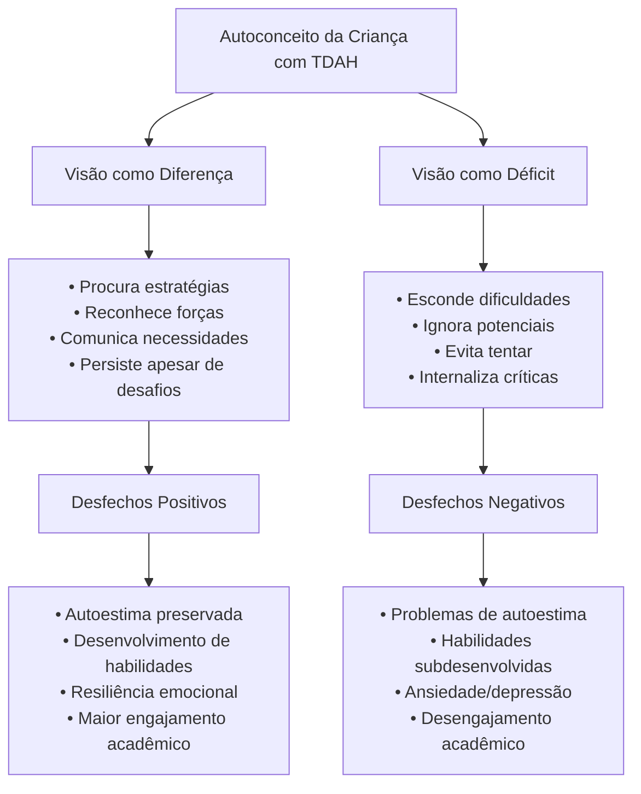
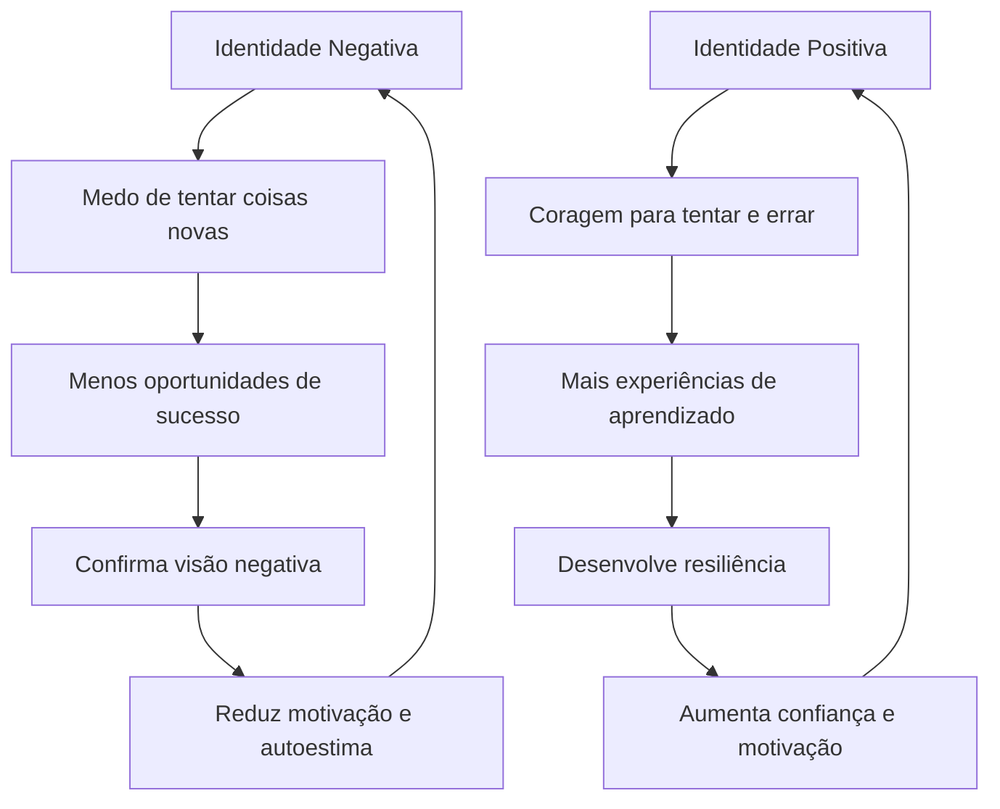
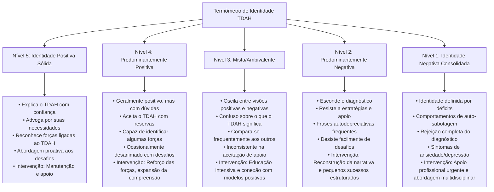
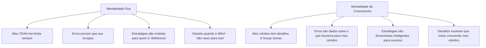
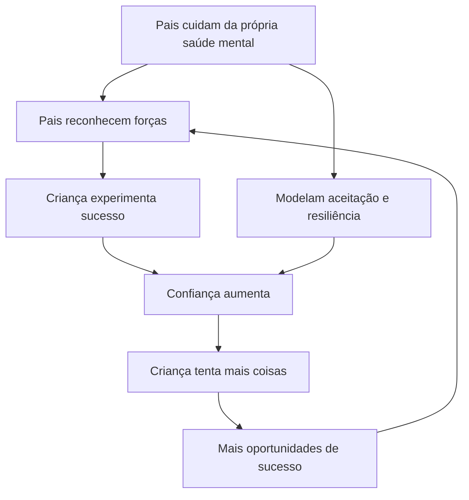

```mermaid
graph TB
    Gabriel[Gabriel - Explorador de Mundos] --- Hiperfoco
    Gabriel --- Criatividade
    Gabriel --- Empatia
    Gabriel --- Energia
    Gabriel --- Percepção
    
    Hiperfoco --- HF1[Passou 3h montando sistema solar perfeito]
    Hiperfoco --- HF2[Sabe tudo sobre dinossauros]
    Hiperfoco --- HF3[Pode ajudar em projetos profundos]
    
    Criatividade --- CR1[Inventou história complexa para jogo]
    Criatividade --- CR2[Resolveu quebra-cabeça de forma inusitada]
    Criatividade --- CR3[Pode encontrar soluções que ninguém pensa]
    
    Empatia --- EM1[Consolou amigo quando todos ignoraram]
    Empatia --- EM2[Percebe quando mamãe está triste]
    Empatia --- EM3[Pode ser um grande amigo e líder]
    
    Energia --- EN1[Tem disposição para atividades longas]
    Energia --- EN2[Sempre animado para aventuras]
    Energia --- EN3[Pode realizar mais que a maioria quando focado]
    
    Percepção --- PE1[Nota detalhes que ninguém vê]
    Percepção --- PE2[Identifica mudanças no ambiente]
    Percepção --- PE3[Pode ser excelente em reconhecer padrões]
```

# Desenvolvimento De Identidade Positiva: Como Ajudar Seu Filho a Entender Sua Neurodiversidade Como Diferença, Não Déficit

tags: #TDAH #IdentidadePositiva #Neurodiversidade #Parentalidade #AutonomiaInfantil #AutoadvocaciaTDAH

## Sumário Interativo

- [[#Introdução: A Jornada da Autoimagem]]
- [[#Por Que a Identidade Importa Tanto? A Ciência Responde]]
- [[#Sinais de Alerta: Quando a Identidade Está se Tornando Negativa]]
- [[#Estratégias Práticas para Construir uma Identidade Positiva]]
    - [[#1. Use a Linguagem com Propósito: A Ferramenta Mais Poderosa]]
    - [[#2. Mapeie as Ilhas de Competência]]
    - [[#3. Ensine sobre o Cérebro TDAH de Forma Concreta]]
    - [[#4. Promova Conexões com Modelos Positivos]]
- [[#Cenários Comuns para Praticar: Respostas que Constroem Identidade]]
- [[#Faixa Etária: Abordagens Específicas]]
- [[#O Papel das Escolas e a Autoadvocacia]]
- [[#Quando o Mundo Não Entende: Lidando com o Estigma e Preconceito]]
- [[#Comorbidades: Construindo Identidade em Cérebros Complexos]]
- [[#A Medicação na Narrativa da Identidade]]
- [[#Kit de Ferramentas para Construção de Identidade Positiva]]
- [[#Desenvolvendo Resiliência]]
- [[#Considerações sobre o Contexto Brasileiro]]
- [[#Recursos Recomendados]]
- [[#Ferramentas Interativas para Download]]
- [[#Palavras Finais: Uma Carta para Seu Coração de Pai/Mãe]]

> "O TDAH não define quem seu filho é, mas é parte da sua forma única de experimentar o mundo."

## Introdução: A Jornada Da Autoimagem

Quando meu filho de 9 anos chegou da escola com os ombros caídos e sussurrou "Mãe, acho que tem algo errado comigo", senti aquela pontada familiar no peito. Depois de uma reunião escolar onde foi destacado - de novo - por não conseguir parar quieto, ele estava internalizando aquela mensagem terrível que muitas crianças com TDAH acabam absorvendo: _há algo **errado** comigo_.

A gente sabe que não é verdade. E caramba, como a gente precisa que eles também saibam! 🧠💪

Nesta nota, vamos explorar juntos como podemos ajudar nossos filhos neurodivergentes a desenvolverem uma identidade positiva – entendendo seu TDAH não como um déficit que os diminui, mas como uma diferença neurológica que traz desafios, sim, mas também forças extraordinárias.

### Por Que a Identidade Importa Tanto? Um Guia Visual

É surpreendente como algo aparentemente abstrato – a forma como uma criança entende seu próprio cérebro – pode ter impactos tão concretos em toda sua trajetória de vida. É por isso que a construção de uma identidade neurodivergente positiva não é um "extra" ou um "luxo" na jornada do TDAH – é a fundação sobre a qual todo o resto se constrói.

## Por Que a Identidade Importa Tanto? 🔬 A Ciência Responde

O autoconceito (como a criança se vê) e a autoestima (como ela se valoriza) são fundamentais para o desenvolvimento emocional saudável. Pesquisas mostram que crianças com TDAH frequentemente desenvolvem uma autoimagem negativa já a partir dos 7-8 anos de idade, muito antes que consigam entender completamente o que significa ter TDAH.

> [!info] O Que a Ciência Diz Estudos de neuroimagem mostram que experiências repetidas de crítica e repreensão ativam circuitos cerebrais associados à ameaça e reduzem a atividade no córtex pré-frontal, exatamente a região já comprometida no TDAH. Em outras palavras, quando a criança internaliza uma visão negativa de si, isso literalmente prejudica ainda mais as funções executivas já desafiadas pelo TDAH.

Pesquisadores como Dr. Russell Barkley enfatizam que o impacto psicológico do TDAH pode ser mais prejudicial que os sintomas primários. Crianças com TDAH recebem em média **30.000 mensagens negativas adicionais** até os 12 anos de idade quando comparadas a crianças neurotípicas. Essa tempestade de negatividade molda profundamente como elas se enxergam.

### O Efeito Cascata Da Identidade Negativa vs. Positiva

**Exemplo Real - Os Dois Caminhos**:

Conheci dois garotos com TDAH praticamente idêntico em termos de sintomas: Pedro e Miguel, ambos de 10 anos.

**Pedro** cresceu ouvindo: "Se esforça mais," "Por que não consegue ser como seu irmão?", "Você é inteligente, só não se aplica." Resultado: aos 10 anos, ele já se recusava a tentar atividades novas, dizendo automaticamente "não vou conseguir" ou "sou burro para isso." O cérebro dele estava literalmente programado para esperar o fracasso.

**Miguel** cresceu ouvindo: "Seu cérebro funciona de um jeito especial", "Vamos descobrir como você aprende melhor", "Todo mundo tem desafios, este é o seu." Resultado: embora enfrentasse as mesmas dificuldades de Pedro, Miguel via os problemas como desafios, não como confirmação de inadequação. Quando ele diz "não consigo", costuma completar com "...ainda" ou "...desse jeito, vamos tentar de outra forma."

Estudos longitudinais do Dr. Stephen Hinshaw da UC Berkeley demonstram que a trajetória de desenvolvimento de crianças com TDAH é altamente influenciada por essa construção de identidade precoce. As intervenções focadas apenas em comportamento, sem abordar a autoimagem, têm eficácia limitada a longo prazo.

> [!success] A boa notícia A neuroplasticidade cerebral significa que mesmo crianças que já internalizaram uma visão negativa podem reconstruir gradualmente uma identidade mais positiva e realista com o apoio adequado. O cérebro pode literalmente reconectar circuitos associados à autoavaliação e expectativa!

## Sinais De Alerta: Quando a Identidade Está Se Tornando Negativa

Fique atento a estes sinais que podem indicar que seu filho está desenvolvendo uma identidade negativa relacionada ao TDAH:

- Frases autodepreciativas: "Eu sou burro", "Nunca faço nada certo"
- Relutância em tentar coisas novas: "Vai dar errado mesmo"
- Esconder trabalhos escolares ou mentir sobre tarefas
- Reagir com defensividade excessiva à crítica leve
- Comparar-se negativamente aos colegas
- Atribuir sucessos à "sorte" e fracassos a "ser ruim mesmo"
- Desistir facilmente: "Não consigo mesmo"
- Evitar falar sobre o TDAH ou reagir com raiva quando o assunto surge
- Usar linguagem determinista: "Sempre vou ser assim"
- Expressar desespero sobre o futuro: "Nunca vou conseguir um emprego/terminar a escola"
- Resistência a estratégias de apoio: "Não quero ser tratado como diferente"
- Busca excessiva por validação externa: "Fiz certo? Tá bom?"
- Sintomas físicos antes de desafios: dores de cabeça, dores de barriga
- Auto-sabotagem: estragar algo que estava indo bem
- Comportamento de "palhaço da turma" para desviar atenção dos desafios

### O Termômetro De Identidade: Uma Ferramenta De Avaliação

Este termômetro ajuda a identificar onde seu filho está no espectro da autoimagem relacionada ao TDAH, e quais intervenções são mais urgentes:

> [!warning] Quando Buscar Ajuda Profissional Se seu filho está no Nível 1 ou 2 do termômetro por mais de algumas semanas, ou apresenta sinais como isolamento significativo, perda de interesse em atividades antes prazerosas, expressões de desesperança ou mudanças drásticas no comportamento, é importante considerar apoio terapêutico. Um terapeuta especializado em TDAH e autoestima infantil pode fazer uma enorme diferença.

**Abordagens Terapêuticas Eficazes:**

- Terapia Cognitivo-Comportamental adaptada para TDAH
- Grupos de habilidades sociais com outras crianças neurodivergentes
- Terapia de Arte/Jogo para processar emoções
- Mindfulness adaptado para TDAH (versões curtas, com movimento)
- Coaching de TDAH para adolescentes

## Estratégias Práticas Para Construir Uma Identidade Positiva

### 1. Use a Linguagem Com Propósito: A Ferramenta Mais Poderosa

A linguagem que usamos molda a percepção. Pequenas mudanças fazem uma diferença ENORME na construção da identidade do seu filho. Não é exagero dizer que as palavras que escolhemos podem mudar literalmente o desenvolvimento cerebral de uma criança com TDAH!

|Em vez de...|Experimente...|Por quê?|
|---|---|---|
|"Você é hiperativo"|"Você tem muita energia e entusiasmo"|Separa o comportamento da identidade|
|"Você é desorganizado"|"Organização é um desafio para você agora"|Implica possibilidade de mudança|
|"Falta de atenção"|"Seu foco funciona de forma diferente"|Reconhece diferença, não déficit|
|"Seu remédio vai consertar seu comportamento"|"O remédio ajuda seu cérebro a focar quando você precisa"|Medicação como ferramenta, não "conserto"|
|"Tente ser normal"|"Vamos encontrar o que funciona para você"|Celebra individualidade vs. conformidade|
|"Você nunca termina nada"|"Você tem interesse intenso em muitas coisas"|Reconhece amplitude de interesses como força|
|"Você não se controla"|"Estamos trabalhando juntos na regulação emocional"|Enfatiza parceria e habilidade em desenvolvimento|
|"Você está sendo preguiçoso"|"Vejo que está difícil iniciar essa tarefa. Como posso ajudar?"|Reconhece dificuldade de iniciação como sintoma, não caráter|

#### Técnica "Captura E Reformula" Para Pais

Desenvolvi essa técnica simples com famílias que atendo, e fez uma diferença incrível na comunicação com crianças com TDAH:

1. **Captura**: Preste atenção quando você se pegar usando linguagem baseada em déficit
2. **Pausa**: Respire fundo
3. **Reformula**: Corrija para linguagem baseada em diferença/força
4. **Explique**: "Deixa eu dizer isso melhor..."

**Exemplo na prática**:

**Original**: "Caramba, Pedro! Você é tão desatento. Já falei três vezes para guardar o material!"

**Reformulado**: "Ops, deixa eu dizer isso melhor... Pedro, seu cérebro está focado em outra coisa agora, e estou precisando da sua atenção para guardar o material. Pode me ajudar com isso?"

**Depoimento real** - Márcia, mãe de Lucas (11): "No começo me sentia meio boba 'corrigindo' minha própria fala na frente do meu filho. Mas depois de algumas semanas, percebi que ele estava começando a usar a mesma linguagem para falar de si mesmo! Um dia o ouvi dizer para o primo: 'Não é que eu seja burro, é que meu cérebro processa matemática de um jeito diferente.' Quase chorei!"

#### Por Que Essa Mudança De Linguagem É Tão Poderosa?

O cérebro com TDAH já tem desafios com o diálogo interno (aquela "voz dentro da cabeça" que nos guia). Estudos mostram que crianças com TDAH têm desenvolvimento atrasado dessa capacidade, e dependem mais do ambiente externo para construir seu diálogo interno.

Quando reformulamos nossa linguagem, estamos literalmente "emprestando" nosso córtex pré-frontal para a criança, modelando o tipo de pensamento que queremos que ela desenvolva sobre si mesma. Com o tempo, ela internaliza essa linguagem e começa a usá-la em seu próprio diálogo interno!

### 2. Mapeie as Ilhas De Competência 🏝️ - Transformando Pontos Fortes Em Identidade

Cada criança com TDAH tem áreas onde brilha intensamente - o Dr. Edward Hallowell, uma das maiores autoridades em TDAH e ele próprio diagnosticado, chama isso de "ilhas de competência". Essas áreas são absolutamente fundamentais para construir uma identidade positiva.

**Dica de Ouro**: Crie um "Mapa de Superpoderes" visual:

1. Em uma cartolina grande, desenhe uma ilha central com o nome do seu filho
2. Para cada força ou interesse, adicione uma ilha conectada
3. Em cada ilha, anote:
    - Nome do superpoder (ex: "Criatividade Explosiva")
    - Exemplos concretos de quando foi demonstrado
    - Como esse superpoder pode ajudar na vida
4. Mantenha o mapa visível e atualize-o regularmente com novas "descobertas"

**O Porquê Neurológico**: O cérebro com TDAH responde intensamente à recompensa e ao reconhecimento. Quando destacamos repetidamente as forças, ativamos o circuito de recompensa dopaminérgico (já comprometido no TDAH), fortalecendo a motivação e a autoimagem.

#### Mapa De Ilhas De Competência: Exemplo Detalhado

Aqui está um exemplo do mapa que criamos para Gabriel, 9 anos:

#### 5 Estratégias Para Descobrir E Potencializar as Ilhas

1. **Observação Intencional**: Reserve 15 minutos por dia para simplesmente observar seu filho quando ele está envolvido em algo que gosta. Anote o que vê: "Ele manteve foco total por 45 minutos construindo com Lego", "Ela explicou regras complexas do jogo para o primo mais novo com paciência impressionante".
    
2. **Entrevistas com Aliados**: Pergunte a outras pessoas que amam seu filho: "O que você mais admira nele/nela?", "Quando você vê ele/ela mais animado(a) e competente?". As respostas frequentemente revelam forças que você pode não ter notado.
    
3. **Momentos de Captura**: Tenha um caderno ou app de notas específico para registrar momentos em que seu filho demonstrou uma força. Data, breve descrição, e qual característica do TDAH pode estar contribuindo positivamente para aquele momento.
    
4. **Sessão de Detective das Forças**: Uma vez por mês, sente com seu filho e revisem juntos "evidências" de suas forças. "Olha só quantas vezes esse mês você usou sua super criatividade para resolver problemas!", "Notei que sua capacidade de hiperfoco te ajudou muito naquele projeto de ciências."
    
5. **Conexão Força-Desafio**: Explicitamente conecte como a mesma característica pode ser força e desafio. "Sabia que sua energia incrível que às vezes te deixa inquieto na aula é a mesma energia que te fez aguentar 2 horas de treino de futebol quando todos estavam cansados?"
    

**História Real**: Lucas, 8 anos, estava frustrado com sua "falha" em ficar quieto na roda de conversa da escola. Criamos seu mapa de ilhas e descobrimos que a mesma energia que causava problemas na roda era uma força incrível nos esportes. Começamos a chamar essa característica de "Energia de Campeão" e falávamos sobre como usá-la nos momentos certos. Em 3 meses, Lucas não só aprendeu estratégias para regular melhor essa energia, mas também começou a se ver como alguém com um "superpoder especial" - não como alguém "com problema". O olhar dele ao falar sobre si mesmo mudou completamente!

### 3. Ensine Sobre O Cérebro TDAH De Forma Concreta 🧠: Conhecimento É Poder

Crianças precisam entender seu TDAH de forma concreta e apropriada à idade. O conhecimento não é apenas informação – é uma ferramenta de empoderamento que transforma "tem algo errado comigo" em "meu cérebro funciona de maneira diferente, e isso é OK!"

#### Abordagens Por Faixa Etária: Adaptando a Explicação

**Para 4-7 anos**: Use metáforas simples e visuais

- "Seu cérebro é como um carro de corrida com freios de bicicleta" (potente, mas precisa de ajuda com o controle)
- "Sua mente é como um canal de TV que muda sozinho às vezes" (muitas ideias e observações ao mesmo tempo)
- "Seu cérebro tem um motor superpoderoso, mas o volante às vezes precisa de ajuda" (energia vs. direção)
- "Pense no seu cérebro como um cachorrinho filhote - cheio de energia e curiosidade, ainda aprendendo quando ficar quietinho"

**Atividade Prática**: Crie um "pote da agitação" com uma garrafinha transparente, água, glitter e cola glitter. Quando agitado, o glitter fica em suspensão (como a mente agitada/distraída). Quando acalma, o glitter assenta (como a mente em estado de atenção focada). Mostre como as estratégias e, se aplicável, os medicamentos ajudam o glitter a assentar mais rápido quando necessário.

**Para 8-12 anos**: Introduza biologia básica de forma engajante

- Explore livros ilustrados sobre o cérebro com TDAH
- Assistam juntos vídeos animados sobre neurotransmissores (existem ótimos no YouTube)
- Criem modelos de massa de modelar do cérebro, destacando o córtex pré-frontal
- Façam juntos um "Jornal do Cérebro TDAH" - um zine simples onde vocês coletam descobertas interessantes sobre como o cérebro TDAH funciona

**Atividade Prática**: O "Jogo do Córtex Pré-Frontal" - Faça uma lista com 20 tarefas simples (pular 3 vezes, bater palmas, etc.). A criança deve fazer cada tarefa, mas depois de cada uma, você acrescenta uma regra (ex: "agora você precisa girar antes de cada tarefa", "agora precisa contar até 3 entre tarefas"). Isso demonstra como é para o cérebro TDAH gerenciar múltiplas regras e funções executivas ao mesmo tempo. Depois, discutam estratégias que tornariam o jogo mais fácil (como escrever as regras, ter lembretes visuais) - exatamente como as estratégias que ajudam no dia a dia.

**Para adolescentes**: Aprofunde o entendimento e construa autoadvocacia

- Forneça artigos e vídeos científicos apropriados à idade
- Discutam como o TDAH afeta áreas específicas da vida que importam para eles (estudo, relações, hobbies)
- Explorem o conceito de neurodiversidade e o movimento por direitos dos neurodivergentes
- Introduzam adolescentes a comunidades online seguras de jovens com TDAH
- Incentivem a leitura de memórias/biografias de adultos bem-sucedidos com TDAH

**Atividade Prática**: "Projeto Perfil de Cérebro" - O adolescente cria um perfil detalhado do seu próprio cérebro, identificando:

- Quando seu cérebro funciona melhor (manhã/tarde/noite)
- Em que ambientes se concentra melhor
- Quais estratégias ajudam com diferentes desafios
- Quais são seus maiores pontos fortes cognitivos
- Como ele pode explicar suas necessidades para professores/amigos

#### Explicações Baseadas Em Neurociência Simplificada

**O Modelo dos Três Circuitos (simplificado)**:

1. **Circuito do "Freio"** (Controle Inibitório)
    
    - Função: Ajuda a "parar e pensar" antes de agir
    - No TDAH: Funciona mais lentamente ou inconsistentemente
    - Estratégias: Lembretes visuais, rotinas claras, tempo extra para transições
2. **Circuito do "Combustível"** (Dopamina/Motivação)
    
    - Função: Fornece energia e interesse para tarefas
    - No TDAH: Precisa de mais estimulação para ativar
    - Estratégias: Tornar tarefas mais interessantes, quebrar em pedaços menores com recompensas
3. **Circuito da "Memória de Trabalho"**
    
    - Função: Mantém informações "na ponta da língua"
    - No TDAH: Menor capacidade = mais esquecimentos
    - Estratégias: Listas, lembretes visuais, rotinas consistentes

**Script para Explicar o TDAH a uma Criança de 9 anos**:

"Vou te contar um segredo sobre o seu cérebro. Ele é diferente - não melhor ou pior, só diferente. Todos os cérebros têm partes que ajudam a pessoa a prestar atenção, esperar sua vez e organizar as coisas. No cérebro com TDAH, essas partes funcionam de um jeito especial.

Pensa no cérebro como um time de futebol. No time do seu cérebro, o jogador responsável por ficar parado quando precisa e o jogador que ajuda a se concentrar em coisas chatas às vezes tiram uma sonequinha durante o jogo! Não é culpa deles - nasceram assim.

Mas o seu time tem outros jogadores INCRÍVEIS! O jogador da criatividade, o da energia e o da paixão por coisas interessantes são verdadeiras estrelas - muito mais fortes que nos outros times!

Isso significa que às vezes você vai ter dificuldades com coisas que parecem fáceis para os outros, como ficar sentado muito tempo ou lembrar de organizar a mochila. Mas também significa que você tem habilidades especiais que a maioria não tem, como pensar 'fora da caixa' e se dedicar intensamente ao que ama.

Nossa missão é ajudar os jogadores que dormem a ficarem mais acordados (com estratégias legais e, às vezes, remédios) e deixar seus jogadores estrelas brilharem ainda mais!"

#### História Real: A Transformação Do Miguel

Miguel, 11 anos, chegou ao meu consultório se autodescrevendo como "o burro da sala". Após três meses usando estas técnicas de explicação do cérebro TDAH, algo incrível aconteceu. Durante uma reunião escolar, a professora mencionou que ele estava "disperso" na aula. Miguel, com uma confiança que me deixou de queixo caído, respondeu:

"Na verdade, professora, não é que eu esteja disperso. Meu cérebro tem níveis baixos de dopamina, e isso faz com que eu precise de mais estimulação para manter o foco. Quando a aula tem movimento, cores ou desafios, meu cérebro produz dopamina suficiente e consigo prestar atenção super bem. A senhora reparou como fiquei concentrado naquele projeto de ciências em grupo? É porque tinha movimento e era interessante. Podemos pensar em formas de tornar as outras aulas mais dinâmicas também?"

A professora ficou impressionada. Miguel ganhou não apenas estratégias adaptadas, mas também vocabulário e confiança para explicar seu próprio cérebro. Isso é autoadvocacia em ação! E começou com explicações adaptadas à idade sobre como funciona o cérebro com TDAH.

### 4. Promova Conexões Com Modelos Positivos

Crianças com TDAH precisam ver exemplos de pessoas como elas que foram bem-sucedidas - não apesar do TDAH, mas frequentemente por causa das forças associadas a ele.

**Dica de Ouro (Acionável Imediatamente)**:

1. Crie uma "Galeria de Inspiração" com figuras que têm/tinham TDAH:
    - Simone Biles (ginasta olímpica)
    - Michael Phelps (nadador olímpico)
    - Gustavo Borges (nadador brasileiro)
    - Emma Watson (atriz)
    - Rodrigo Santoro (ator brasileiro)
    - Bill Gates (empresário)
    - Walt Disney (criador)
    - Albert Einstein (cientista)
2. Para cada pessoa, destaque:
    - Uma história de desafio que superaram
    - Como as características do TDAH os ajudaram
    - Uma frase inspiradora daquela pessoa

**O Porquê Neurológico**: O cérebro com TDAH aprende melhor através de narrativas emocionalmente significativas. Histórias de superação ativam regiões cerebrais associadas à motivação e à formação de identidade.

#### Técnica Do "Mentor Neurodivergente Secreto"

Uma abordagem que desenvolvemos para adolescentes com TDAH é conectá-los com um "mentor neurodivergente" - um adulto bem-sucedido com TDAH que pode compartilhar experiências e estratégias. Mesmo apenas algumas conversas podem ter um impacto profundo na forma como o adolescente enxerga seu futuro.

> [!tip] Como Encontrar um Mentor
>
> - Pergunte em grupos de apoio a pais se há adultos dispostos a compartilhar suas experiências
> - Consulte associações de TDAH que frequentemente têm programas de mentoria
> - Se houver alguém na família estendida com TDAH, considere estabelecer essa conexão
> - Verifique se há profissionais em campos de interesse do seu filho que abertamente falam sobre seu TDAH

**História Real**: Fernanda, 15 anos, estava desanimada com seu futuro acadêmico devido aos desafios do TDAH. Conseguimos conectá-la com Daniela, uma arquiteta de 35 anos com TDAH. Após apenas três conversas por vídeo, Fernanda mudou completamente sua perspectiva. Ouvir como Daniela havia encontrado estratégias para transformar sua criatividade "caótica" em um diferencial profissional foi transformador. "Se ela conseguiu, por que eu não conseguiria?" foi a nova frase de Fernanda.

## Cenários Comuns Para Praticar: Respostas Que Constroem Identidade

### Cenário 1: O Trabalho Escolar Difícil - Transformando Frustrações Em Estratégias

**O Cenário**: Seu filho de 10 anos joga o caderno no chão após tentar começar um trabalho de casa complexo, gritando "Eu não consigo, meu cérebro é quebrado!"

**Como Lidar (Passo a Passo)**:

1. **Mantenha a calma e valide**: "Vejo que você está muito frustrado com esse trabalho. Parece mesmo difícil."
    
2. **Normalize sem minimizar**: "Essa sensação de travar diante de um trabalho grande é super comum para pessoas com TDAH. Não é porque você não é capaz - é porque seu cérebro processa tarefas grandes de um jeito diferente."
    
3. **Explique de forma concreta**: "O TDAH afeta a memória de trabalho, que é como um quadro mental. O seu quadro é um pouco menor, então quando tentamos colocar um problemão nele, fica tudo embolado e confuso. Não é culpa sua."
    
4. **Ofereça uma estratégia específica**:
    
    - "Vamos tentar uma técnica chamada 'fatiamento de elefante'. Imagina que esse trabalho é um elefante - ninguém consegue comer um elefante inteiro! Mas se cortarmos em pedacinhos tiny, aí dá pra lidar."
    - "Vamos colocar um timer e trabalhar só por 10 minutos, depois fazer uma pausa ativa. O cérebro com TDAH adora desafios curtos com prazos."
5. **Destaque o superforte relevante**: "Lembra quando você montou aquele modelo complicado de Lego? Você tem uma capacidade incrível de resolver problemas quando eles estão divididos em partes menores. Vamos usar essa sua força agora."
    

**Diálogo Real**:

**Filho**: (_jogando o caderno_) Eu ODEIO matemática! Não consigo fazer isso! Meu cérebro é quebrado!

**Mãe**: (_respira fundo, se aproxima devagar_) Nossa, filho, tô vendo que você tá bem frustrado mesmo. Essa lista de problemas parece bem complicada, né?

**Filho**: (_ainda irritado_) É muita coisa! Não sei nem por onde começar...

**Mãe**: Sabe, essa sensação de olhar pra um trabalho grande e sentir o cérebro "travar" é super comum pra quem tem TDAH. Não é que você não saiba matemática - o problema é que seu cérebro tem um jeito próprio de processar informações grandes.

**Filho**: (_menos irritado, mais atento_) Como assim?

**Mãe**: É como se seu cérebro tivesse um quadro branco menor que o da maioria das pessoas. Quando a professora passa muitos problemas de uma vez, é como tentar escrever um texto enorme nesse quadro pequeno - não cabe tudo e fica uma confusão. Mas isso não significa que você não consegue fazer matemática!

**Filho**: Então o que eu faço?

**Mãe**: A gente pode usar uma estratégia que funciona super bem pros cérebros TDAH. Chama "técnica do tomate" ou Pomodoro. Vamos fazer assim: escolhe SÓ UM problema pra começar. Aí a gente coloca esse timer por 10 minutos. Você só precisa focar nesses 10 minutos, depois a gente faz uma pausa divertida de 5. O que acha?

**Filho**: (_pegando o caderno_) Tá, vamos tentar... mas só 10 minutos mesmo, hein?

**Mãe**: Exato! E sabe, essa sua capacidade de mergulhar intensamente em algo por períodos curtos é um superpoder do TDAH. Vamos usar isso a seu favor agora.

**O Porquê Neurológico**: Momentos de frustração são cruciais para a formação de identidade. O cérebro com TDAH tem resposta emocional amplificada (especialmente à frustração) devido à diferença na regulação do sistema límbico. Quando respondemos com calma e estratégias concretas, ajudamos a fortalecer as conexões entre o córtex pré-frontal (pensamento racional) e o sistema límbico (emoções). A repetição dessa experiência literalmente "treina" o cérebro a responder de forma mais adaptativa no futuro.

### Cenário 2: O Comentário Na Festa De Família - Protegendo a Identidade

**O Cenário**: Durante um almoço de família, seu tio comenta alto: "Esse menino não para quieto nunca? Falta de disciplina isso aí!" Seu filho de 8 anos ouve e abaixa a cabeça, envergonhado.

**Estratégia Ação-Reação-Recuperação**:

**1. Ação Imediata** (proteger e redirecionar):

- Posicione-se fisicamente perto do seu filho
- Responda calmamente: "Na verdade, tio José, Miguel tem muita energia porque tem um cérebro superativo. É uma característica neurológica, não falta de disciplina."
- Redirecione: "Miguel, que tal mostrar para a prima Júlia aquele truque legal que você aprendeu?"

**2. Reação Privada** (processamento emocional): Mais tarde, em um momento privado:

- Valide os sentimentos: "Fiquei pensando se você ficou chateado com o comentário do tio José hoje. Como você se sentiu?"
- Explique sem criticar: "Algumas pessoas mais velhas não entendem muito sobre como o cérebro funciona. Não é culpa deles, mas também não é verdade o que dizem."
- Reafirme a identidade positiva: "Sua energia e movimento são parte de quem você é - e são coisas ótimas! Lembra como essa energia te ajudou a ganhar a corrida na escola semana passada?"

**3. Recuperação Proativa** (preparação para o futuro):

- Desenvolva uma "frase-escudo" que a criança pode usar: "Meu cérebro funciona de um jeito diferente, isso chama TDAH."
- Crie um sinal secreto entre vocês para quando ela precisar de apoio em situações sociais
- Pratique com role-play outras possíveis situações
- Leia juntos histórias de pessoas famosas com TDAH que enfrentaram críticas

**Diálogo Real (na etapa de Reação Privada)**:

**Mãe**: Filho, notei que você ficou quietinho depois que o tio José fez aquele comentário no almoço. O que passou pela sua cabeça?

**Filho**: (_olhando para baixo_) Ele acha que eu sou mal-educado...

**Mãe**: Entendo que você tenha sentido isso. Sabe, o tio José cresceu numa época em que ninguém sabia sobre TDAH e cérebros diferentes. Ele não está sendo maldoso, só não entende mesmo.

**Filho**: Mas e se os outros também pensam isso de mim?

**Mãe**: É uma preocupação válida. Algumas pessoas podem não entender logo de cara, mas as pessoas que importam - que te conhecem de verdade - sabem que você é incrível. E sabe o que mais? Sua energia é um presente! Você lembra como conseguiu ficar duas horas inteiras trabalhando no seu projeto de ciências? Ou como foi o primeiro a chegar no pique-esconde porque corre super rápido? Essas são coisas ótimas que vêm junto com seu cérebro ativo.

**Filho**: (_um pouco mais animado_) É verdade...

**Mãe**: Que tal a gente pensar em algo que você possa dizer quando alguém não entende? Como uma frase mágica que explica de um jeito simples.

**Filho**: Tipo o quê?

**Mãe**: Que tal algo como: "Meu cérebro tem TDAH, então tenho muita energia e ideias. Não é falta de educação, é só como eu funciono"?

**Filho**: (_pensando_) Hmm, pode ser... ou posso dizer que sou como um carro de corrida - vou mais rápido e preciso de mais combustível!

**Mãe**: (_sorrindo_) Adorei essa! Vamos praticar essa resposta para você se sentir confiante?

**O Porquê Neurológico**: Comentários negativos de adultos significativos ativam circuitos de ameaça social no cérebro que são particularmente sensíveis durante a infância. Ao intervir efetivamente, interrompemos a formação de associações negativas e prevenimos a internalização do estigma como parte da identidade da criança.

## Faixa Etária: Abordagens Específicas

O desenvolvimento da identidade ocorre de formas diferentes em cada fase. Aqui estão estratégias específicas para cada idade:

### Para Bebês E Crianças Pequenas (0-3 anos)

Embora o diagnóstico formal de TDAH raramente ocorra antes dos 4-5 anos, alguns bebês e crianças pequenas já mostram sinais precoces de temperamento que podem evoluir para TDAH.

**Estratégias Preventivas:**

- Celebre a intensidade: "Uau, você tem tanta energia!"
- Evite rótulos negativos como "difícil", "teimoso" ou "problemático"
- Crie ambientes que acomodem a necessidade de movimento
- Use narração positiva: "Você está explorando tudo ao seu redor!"
- Estabeleça rotinas previsíveis (o cérebro pré-TDAH prospera com estrutura)

**Não é TDAH, é seu filho!** Nessa idade, foque em conhecer e aceitar o temperamento único da criança, não em preocupações com diagnósticos futuros.

### Para Crianças Pequenas (4-7 anos)

- **Foco**: Sentimentos e aceitação básica
- **Estratégias**:
    - Histórias personalizadas onde os personagens têm características semelhantes às do seu filho
    - Jogos que celebram energia e criatividade
    - Linguagem simples e positiva sobre diferenças
    - Celebração explícita de pequenas conquistas
    - Teatro de fantoches para explorar situações sociais desafiadoras
    - Canções e rimas que reforçam qualidades positivas

**Técnica do "Espelho Mágico"**: Todas as noites, faça seu filho olhar num espelho especial e diga 3 coisas incríveis sobre ele. Exemplo: "Nesse espelho eu vejo um menino com ideias brilhantes, um coração amoroso e muita coragem para tentar coisas novas!"

### Para Crianças Em Idade Escolar (8-12 anos)

- **Foco**: Compreensão e autogestão
- **Estratégias**:
    - Livros sobre TDAH apropriados à idade
    - Grupos de habilidades sociais com outras crianças neurodivergentes
    - Ensinar a criança a se autoexplicar quando necessário
    - Explorar juntos acomodações úteis
    - Mapa visual de forças e desafios
    - "Diário de Detetive do Cérebro" para registrar descobertas sobre como seu cérebro funciona melhor
    - Projetos práticos sobre o cérebro (construir modelos, fazer cartazes)

**Técnica dos "Cientistas do Cérebro"**: Transforme a criança em cientista de seu próprio cérebro. Faça experimentos simples: "Vamos ver se ouvir música enquanto faz lição ajuda ou atrapalha seu foco?" Registre resultados e ajude-a a elaborar sua própria "manual do usuário do meu cérebro".

### Para Adolescentes (13-18 anos)

- **Foco**: Autodefinição e autoadvocacia
- **Estratégias**:
    - Apoiar conexões com comunidades neurodivergentes
    - Coaching para autodefesa educacional
    - Explorar carreiras que aproveitam seus pontos fortes
    - Transferir gradualmente o controle das estratégias de manejo
    - Incentivar leitura e pesquisa autônoma sobre TDAH
    - Discutir abertamente sobre identidade neurodivergente
    - Considerar mentoria de adultos bem-sucedidos com TDAH

**Projeto "Meu Cérebro, Minhas Regras"**: Ajude o adolescente a criar seu próprio plano de sucesso, documentando:

- "Manual do meu cérebro" - como funciona, quando funciona melhor
- "Minha caixa de ferramentas" - estratégias eficazes para diferentes situações
- "Meu script" - como explicar o TDAH para amigos, professores, empregadores
- "Minha jornada" - objetivos e planos para o futuro que incorporam suas forças neurodivergentes

### Para Jovens Adultos Com Diagnóstico Tardio

> [!note] Um grupo especial Muitas pessoas recebem diagnóstico de TDAH apenas na vida adulta, após anos de desafios inexplicados. Esse grupo enfrenta a tarefa de reconstruir sua identidade e ressignificar seu passado.

**Estratégias específicas:**

- Processo de luto pela "vida que poderia ter sido" com diagnóstico precoce
- Revisão de experiências passadas através da lente do TDAH (reinterpretação positiva)
- Conexão com comunidades de adultos com TDAH
- Exploração gradual de estratégias de acomodação e tratamento
- Desenvolvimento de narrativa coerente de "antes e depois" do diagnóstico
- Trabalho com terapeutas especializados em diagnóstico tardio

## O Papel Das Escolas E a Autoadvocacia 🏫

Ambientes escolares podem construir ou destruir a identidade positiva. Como pais, precisamos ser pontes entre o mundo escolar (frequentemente estruturado para cérebros neurotípicos) e as necessidades únicas do nosso filho.

### Guia Completo Para Parcerias Escola-Família Bem-Sucedidas

**Antes de Qualquer Reunião Escolar**:

1. **Prepare um "Perfil de Aprendizagem" do seu filho** - Um documento de 1 página contendo:
    
    - 3-5 maiores forças (seja específico: "Pensamento criativo para resolução de problemas", não apenas "criativo")
    - 3-5 desafios principais (em termos neutros: "Dificuldade em iniciar tarefas não estruturadas", não "preguiçoso")
    - Estratégias que funcionam em casa (detalhadas e acionáveis)
    - Gatilhos comuns para sobrecarga/desregulação
    - Interesses especiais que podem ser incorporados na aprendizagem
2. **Crie uma "Pasta de Sucesso"** contendo:
    
    - Exemplos de trabalhos bem-sucedidos do seu filho
    - Fotos dele engajado em atividades de aprendizagem positivas
    - Cartas/e-mails positivos de professores anteriores
    - Qualquer avaliação que destaque suas forças
    
    Esta pasta serve dois propósitos: (1) lembrar novos professores que seu filho É capaz de sucesso e (2) dar a ele evidências concretas de suas capacidades quando a autoestima estiver baixa.
    

### Checklist Para Reuniões Escolares Produtivas

- [ ] Compartilhe o Perfil de Aprendizagem com antecedência
- [ ] Prepare seu filho antecipadamente sobre o propósito da reunião
- [ ] Chegue com mentalidade colaborativa, não adversarial
- [ ] Use linguagem de "diferença, não déficit" ao falar com professores
- [ ] Foque primeiro nas forças da criança antes de discutir desafios
- [ ] Peça exemplos concretos de comportamentos, não rótulos
- [ ] Sugira acomodações específicas que funcionaram em casa
- [ ] Inclua seu filho (quando apropriado) para promover autoadvocacia
- [ ] Estabeleça um sistema de comunicação regular para feedback positivo
- [ ] Agradeça os esforços dos professores para entender seu filho
- [ ] Documente acordos e planos de ação por e-mail após a reunião

### Acomodações Que Preservam a Dignidade

A forma como as acomodações são implementadas é tão importante quanto as próprias acomodações. Adaptações que destacam a criança como "diferente" de forma negativa podem prejudicar a identidade.

**Exemplos de Acomodações que Preservam a Dignidade**:

|Necessidade|Acomodação Estigmatizante|Acomodação Digna|
|---|---|---|
|Movimento|"João pode sair da sala quando estiver agitado"|"Temos várias opções de lugares para sentar na sala - cadeiras giratórias, almofadas, bancos mais altos - todos podem escolher o que funciona melhor"|
|Tempo extra|"Maria tem mais 15 minutos para a prova por causa do seu problema"|"Algumas pessoas preferem mais tempo para revisar o trabalho. Se você terminar, pode escolher entre entregar ou usar o tempo extra para revisão"|
|Organização|"O professor vai verificar a mochila do Pedro todos os dias"|"Temos um sistema de parceiros de organização em que os alunos se ajudam mutuamente no fim do dia"|
|Instruções|"Ana precisa de instruções especiais simplificadas"|"Vou fornecer as instruções de múltiplas formas - faladas, escritas e visuais - para atender a diferentes estilos de aprendizagem"|

### Ensinando Autoadvocacia: Um Processo Gradual Para a Independência

A meta final é que nossos filhos possam explicar suas necessidades e pedir apoio quando necessário - uma habilidade que os servirá por toda a vida.

**Estágios de Desenvolvimento da Autoadvocacia (por idade)**:

**5-7 anos**: Consciência Inicial

- Ajude a criança a nomear suas necessidades: "Estou com a cabeça muito cheia"
- Ensine a pedir ajuda específica: "Preciso de um tempo quieto"
- Modele comunicação com professores enquanto a criança observa

**8-10 anos**: Parceria na Advocacia

- Prepare roteiros simples juntos para situações comuns
- Pratique com role-play antes das situações reais
- Permita que a criança lidere partes de reuniões com você como apoio
- Desenvolva um "sinal de socorro" discreto com professores

**11-13 anos**: Advocacia Supervisionada

- A criança lidera mais interações, com seu apoio de fundo
- Ajude-a a preparar e-mails para professores (que você revisa)
- Incentive a participar ativamente de reuniões escolares
- Ensine como documentar o que funciona/não funciona para ela

**14+ anos**: Transição para Independência

- Adolescente assume liderança nas comunicações com professores
- Você atua como consultor, não como porta-voz
- Desenvolva habilidades para eventual autodivulgação em ambientes universitários/de trabalho
- Pratique explicar acomodações necessárias em novos contextos

**Exemplo Prático Detalhado**: Preparando uma criança de 11 anos para pedir ajuda ao professor:

1. **Pratique com role-play em casa**:
    
    **Você como Professor**: "João, por que você não terminou a tarefa de ontem?"
    
    **Ensine seu filho a responder**: "Professor, eu tenho TDAH e às vezes tenho dificuldade em terminar tudo no tempo da aula. Aprendo melhor quando posso [estratégia específica]. Posso ter um pouco mais de tempo para entregar?"
    
2. **Crie cartões de script**:
    
    Pequenos cartões que a criança pode levar com frases úteis:
    
    - "Preciso de uma pausa curta para me reorganizar."
    - "Aprendo melhor quando posso movimentar algo nas mãos."
    - "Me ajuda a entender melhor quando as instruções são visuais."
3. **Estabeleça um sinal privado** entre professor e aluno para quando precisar de apoio sem chamar atenção.
    
4. **Ensaio Mental Positivo**:
    
    Antes de situações desafiadoras, guie seu filho em um ensaio mental:
    
    - "Vamos imaginar você pedindo aquela acomodação que praticamos..."
    - "Como você se sentiria se desse certo? Visualize isso por um momento."
    - "E se o professor esquecer? O que você poderia dizer ou fazer?"

**O Porquê Neurológico**: A autoadvocacia fortalece o córtex pré-frontal através da prática de funções executivas como planejamento e autorregulação. Também reduz o estresse, permitindo melhor funcionamento do cérebro TDAH. Cada pequeno sucesso em autodeterminação fortalece o circuito de recompensa, criando um ciclo positivo de autoeficácia.

**História de Sucesso**: Mariana, 12 anos, passou de esconder suas dificuldades com matemática para abertamente conversar com a professora sobre suas necessidades. Usando a técnica de cartões de script, ela conseguiu articular: "Quando tem muitos números na página, meu cérebro fica sobrecarregado. Posso resolver os problemas em uma folha com menos questões por página?" A professora não apenas concordou, mas adotou a abordagem como opção para toda a turma. Esse pequeno sucesso foi transformador para a confiança de Mariana, mostrando que suas necessidades eram válidas e que sua voz importava.

## Quando O Mundo Não Entende: Lidando Com O Estigma E Preconceito

Infelizmente, nossos filhos enfrentarão pessoas que não entendem o TDAH ou carregam visões estigmatizantes. No Brasil, onde o conhecimento sobre neurodiversidade ainda está em desenvolvimento, isso pode ser particularmente desafiador. Precisamos prepará-los para enfrentar esse estigma sem internalizá-lo ou desenvolver amargura.

### Entendendo a Dimensão Do Estigma

O estigma em torno do TDAH geralmente vem em várias formas:

1. **Negação da condição**: "TDAH é invenção de médico/indústria farmacêutica"
2. **Moralização**: "É só falta de disciplina/educação"
3. **Minimização**: "Todo mundo é um pouco desatento, para de drama"
4. **Generalização**: "Pessoas com TDAH são problemáticas/irresponsáveis"
5. **Mitos de preguiça**: "Só precisa se esforçar mais"

Pesquisas mostram que a exposição contínua ao estigma pode ser tão prejudicial quanto os próprios sintomas do TDAH, levando a:

- Queda na autoestima
- Aumento de ansiedade e depressão
- "Efeito nocebo" (piora dos sintomas por acreditar nas expectativas negativas)
- Relutância em buscar tratamento adequado
- Internalização do estigma como "verdade" sobre si mesmo

### Estratégias Anti-Estigma: Ferramentas Para Fortalecer Seu Filho

**Cenário Comum**: Seu filho ouve um colega ou familiar dizer "TDAH é preguiça" ou "é só falta de educação".

**Como Preparar seu Filho (Estratégia ESCUDO)**:

**E - Eduque preventivamente** Antes que encontrem estigma, forneça informação científica sólida adaptada à idade:

- "Algumas pessoas não entendem como o TDAH funciona, e isso é porque elas não estudaram sobre o cérebro como nós."
- Use dados: "Estudos de neuroimagem mostram diferenças claras nos cérebros com TDAH, não é opinião, é ciência."

**S - Scripts prontos** Pratique respostas curtas e eficazes:

- "TDAH é uma condição neurológica real, reconhecida pela ciência."
- "Meu cérebro funciona diferente, não pior."
- "Todos temos desafios diferentes, esse é um dos meus."
- "Eu não escolheria ter TDAH, assim como alguém não escolheria ser míope."
- "Se você tiver interesse em aprender mais sobre TDAH, posso recomendar alguns recursos."

**C - Comunidade de apoio** Conecte seu filho com outras crianças neurodivergentes:

- Grupos presenciais ou online (supervisionados)
- Acampamentos de verão para crianças com TDAH
- Eventos da ABDA (Associação Brasileira do Déficit de Atenção)

**U - Utilizar o humor** (quando apropriado) Humor leve pode ser uma ferramenta poderosa:

- "Meu cérebro é como um navegador com 37 abas abertas ao mesmo tempo!"
- "Eu não tenho déficit de atenção - tenho atenção para TUDO ao mesmo tempo!"

**D - Discernimento** Ensine quando responder e quando se afastar:

- "Algumas pessoas não estão prontas para aprender. Tudo bem proteger sua paz."
- Desenvolva um "sistema de classificação" para comentários: os que merecem resposta educativa vs. os que é melhor ignorar

**O - Observar e processar** Reforce após incidentes:

- "As palavras daquela pessoa mostram falta de informação, não verdades sobre você."
- Crie um "ritual de descompressão" após encontros estigmatizantes (ex: escrever o comentário em um papel e simbolicamente jogá-lo fora)

### Além Do Preparo: Modelando Autoaceitação Radical

Uma das ferramentas mais poderosas contra o estigma é a forma como nós, pais, falamos sobre o TDAH:

**Em Casa**:

- Fale do TDAH abertamente, sem sussurros ou vergonha
- Use humor leve sobre desafios: "Lá vai nossa família TDAH de novo, esquecendo as chaves!"
- Discuta figuras públicas com TDAH com admiração, não pena
- Corrija outros adultos (gentilmente) quando usam linguagem estigmatizante
- Celebre a comunidade neurodivergente como grupo diverso e valioso

**Na Comunidade**:

- Considere ser abertamente "fora do armário" sobre o TDAH na família
- Participe de eventos de conscientização sobre neurodiversidade
- Compartilhe recursos educativos com família, escola, comunidade
- Defenda políticas inclusivas nas escolas e espaços comunitários

**Exemplo Prático**: Carlos, 12 anos, criou com a ajuda dos pais um pequeno "cartão informativo" sobre TDAH que ele ocasionalmente oferece quando alguém faz um comentário desinformado. O cartão tem dados científicos básicos e o QR code de um site confiável. Ele diz: "Isso explica melhor do que eu poderia. Se você tiver interesse em entender, este é um bom começo." Esta abordagem transfere a responsabilidade da educação para o recurso, não para a criança, e dá a ela uma ferramenta concreta que evita confrontos.

## Comorbidades: Construindo Identidade Em Cérebros Complexos

> [!important] Cérebros Complexos, Identidades Ricas Mais de 60% das crianças com TDAH têm pelo menos uma condição adicional, como ansiedade, depressão, dislexia ou TEA. Construir uma identidade positiva quando há múltiplas condições requer abordagens específicas.

### TDAH + Ansiedade

A combinação de TDAH e ansiedade cria desafios únicos - a impulsividade do TDAH encontra o excesso de cautela da ansiedade, frequentemente resultando em paralisia e autoexigência extrema.

**Estratégias Específicas:**

- Enfatize que ansiedade + TDAH não é "dupla falha", mas um cérebro complexo com diferentes necessidades
- Explique como as duas condições interagem: "Seu TDAH quer correr, sua ansiedade quer parar - isso causa uma sensação confusa"
- Trabalhe com metáforas visuais: "Seu cérebro tem um acelerador potente (TDAH) e um freio muito sensível (ansiedade)"
- Ensine técnicas de regulação que abordem ambas as condições: movimento consciente em vez de apenas meditação parada
- Valide o esforço extra: "Gerenciar duas condições é como aprender a dirigir dois tipos de veículos - é mais difícil e exige mais habilidade!"

**Exemplo Prático:** Para Clara, 10 anos, criamos um "Painel de Controle" visual onde ela podia identificar qual "sistema" estava dominante no momento - o "Motor TDAH" (impulsividade, agitação) ou o "Sistema de Alarme" (ansiedade, preocupação). Dependendo de qual estava ativo, tínhamos estratégias diferentes. Esse modelo ajudou Clara a desenvolver metacognição sobre suas experiências e a não se identificar completamente com nenhum dos estados.

### TDAH + Dificuldades De Aprendizagem

Crianças com TDAH e dificuldades específicas de aprendizagem (dislexia, discalculia, etc.) frequentemente internalizam uma visão de si como "burras" ou incapazes, mesmo tendo inteligência normal ou acima da média.

**Estratégias Específicas:**

- Explique o conceito de "perfil irregular de habilidades" - áreas de desafio ao lado de áreas de força excepcional
- Use exemplos concretos de pessoas bem-sucedidas com múltiplas condições
- Crie uma narrativa de "detetive de aprendizagem" - a criança como investigadora de como seu cérebro aprende melhor
- Destaque explicitamente as forças que frequentemente acompanham essas condições combinadas (pensamento visual, criatividade, resolução de problemas não-linear)
- Ensine sobre neurodiversidade como espectro natural, não como patologia

**Técnica da "Tabela de Rotas de Aprendizagem":** Em uma tabela visual, mapeie diferentes habilidades acadêmicas e múltiplos caminhos para dominá-las. Por exemplo, para compreensão textual, mostre rotas alternativas: leitura tradicional, audiolivros, mapas conceituais e discussão oral. Enfatize que cérebros diferentes percorrem rotas diferentes para o mesmo destino.

### TDAH + TEA (Dupla Excepcionalidade)

A combinação de TDAH com Transtorno do Espectro Autista cria um perfil único, frequentemente com forças excepcionais em áreas específicas junto com desafios significativos em outras.

**Estratégias Específicas:**

- Ajude a criança a entender como cada condição influencia sua experiência
- Crie sistemas visuais que abordem tanto a necessidade de estrutura (TEA) quanto a necessidade de novidade e engajamento (TDAH)
- Enfatize como muitas inovações no mundo vieram de mentes "duplamente neurodivergentes"
- Desenvolva estratégias para navegação social que considerem ambas as condições
- Encontre comunidades e modelos específicos para esta combinação única

**História Real:** Paulo, 13 anos, com TDAH+TEA, estava lutando com sua identidade até encontrarmos um mentor adulto com o mesmo perfil. O mentor compartilhou como sua mente "híbrida" combinava hiperfoco intenso (comum em ambas as condições) com pensamento divergente (mais comum no TDAH) para criar soluções inovadoras em seu campo. Esse modelo deu a Paulo uma nova narrativa para entender sua experiência.

## A Medicação Na Narrativa Da Identidade

> [!note] Medicação: Uma Ferramenta, Não Uma Solução Mágica Como falamos sobre medicação para TDAH afeta profundamente como crianças entendem seu cérebro e identidade. Uma abordagem cuidadosa é essencial.

### Como Falar Sobre Medicação Sem Reforçar O "Déficit"

A linguagem que usamos sobre medicação pode reforçar ou desafiar a narrativa de "conserto" para algo "quebrado".

**Linguagem a Evitar:**

- "Remédio para consertar seu comportamento"
- "Agora você vai ser normal/bom"
- "Tomou o remédio? Então vai conseguir se comportar, né?"
- "Isso vai te deixar igual às outras crianças"

**Linguagem Recomendada:**

- "É uma ferramenta que ajuda seu cérebro a focar quando você precisa"
- "Isso ajuda a diminuir o 'ruído' mental para você conseguir ouvir seus próprios pensamentos"
- "Como óculos para a mente - não muda quem você é, só ajuda em tarefas específicas"
- "Muitas pessoas usam ferramentas para ajudar seus corpos ou mentes a funcionarem do jeito que precisam"

### Explicando Medicação Para Diferentes Idades

**4-7 anos:**

- Use metáforas concretas: "Como uma ponte que ajuda as ideias a atravessarem o rio no seu cérebro"
- Enfatize: "O remédio ajuda em algumas coisas, mas todas as partes incríveis de você continuam iguais"
- Foque na função, não no "problema": "Isso ajuda seu cérebro a dizer 'espere' quando precisa"

**8-12 anos:**

- Explique a base neurológica simplificada: "Ajuda certos químicos no cérebro a ficarem equilibrados"
- Use analogias de ferramentas: "É como um par de óculos para o cérebro, ou fones de cancelamento de ruído"
- Discuta os prós e contras honestamente: "Pode ajudar com a escola, mas também pode causar [efeitos colaterais]"
- Dê autonomia: "Você é um membro importante da equipe que decide se a medicação está ajudando"

**13+ anos:**

- Compartilhe informações mais complexas sobre neurotransmissores e funcionamento cerebral
- Discuta abertamente a relação entre medicação e identidade: "Isso muda como você se sente sobre você mesmo?"
- Incentive participação ativa nas decisões: "Quais benefícios você nota? Quais efeitos colaterais te incomodam?"
- Explore mitos e estigmas: "Algumas pessoas não entendem medicação para o cérebro - o que você acha disso?"

### Lidando Com O Estigma Da Medicação

Crianças frequentemente enfrentam comentários como "você é viciado em remédios" ou "isso é só uma muleta".

**Estratégias para pais:**

- Normalizer comparando com outras ferramentas médicas: "Algumas pessoas precisam de óculos, outras de insulina, outras de medicação para o cérebro"
- Ofereça scripts simples para a criança: "Meu médico e meus pais me ajudam a cuidar da minha saúde"
- Discuta figuras públicas que falam abertamente sobre uso de medicação para TDAH
- Ensine sobre privacidade médica: "Você não precisa contar a todos sobre seu remédio, assim como não precisaria contar sobre outros medicamentos"

**Exemplo Real:** Quando Mateus, 11 anos, enfrentou bullying sobre tomar "remédio para loucos", trabalhamos em uma resposta: "Na verdade, é medicação para TDAH. Muitas pessoas usam - inclusive alguns atletas olímpicos e cientistas famosos. Me ajuda a focar meu cérebro superpoderoso. Mas ei, não precisamos falar disso se te deixa desconfortável." Esta resposta combina informação, normalização e uma saída gentil da conversa.

## Kit De Ferramentas Para Construção De Identidade Positiva

Conforme seu filho cresce, as estratégias para apoiar uma identidade neurodivergente positiva também evoluem. Este kit fornece ferramentas práticas organizadas por etapas de desenvolvimento:

### Ferramentas Para Momentos Críticos

**1. Técnica S.T.O.P. para Comentários Autodepreciativos:**

- **S**intonize com o sentimento (valide a emoção)
- **T**ransforme a linguagem (reformule a autodepreciação)
- **O**fereça evidência contrária (lembre de sucessos passados)
- **P**roponha uma estratégia (foque em soluções, não no problema)

**Exemplo Prático**: Quando seu filho diz "Sou burro, nunca vou conseguir", aplique:

- "Entendo que você esteja frustrado agora" (Sintonize)
- "Não é que você seja burro, é que este tipo de tarefa desafia seu cérebro" (Transforme)
- "Lembra como você conseguiu resolver aquele problema complexo de ciências?" (Ofereça evidência)
- "Vamos dividir isto em partes menores e usar cores para organizar" (Proponha)

**2. Kit de Primeiros Socorros para Crises de Identidade:**

Crie um kit físico ou digital contendo:

- Lista de "Provas de Competência" (realizações passadas)
- Cartas/mensagens de apoio de pessoas que amam seu filho
- Fotos de momentos de sucesso e alegria
- Lista de estratégias que funcionaram em crises anteriores
- Lembretes visuais dos pontos fortes do TDAH
- Uma carta de você para seu filho reafirmando seu valor

**3. Técnica de "Jornalismo Investigativo" para Desafiar Crenças Negativas:**

Quando seu filho expressa uma crença limitante sobre si ("Ninguém gosta de mim", "Nunca vou conseguir ter amigos", etc.):

1. Aja como um repórter investigativo: "Essa é uma afirmação importante. Vamos investigar se é realmente verdade?"
2. Colete evidências: "Que provas temos contra essa afirmação? E a favor?"
3. Entreviste "especialistas": "O que a professora Ana disse sobre você na última reunião? O que seu amigo Gabriel disse quando você o ajudou?"
4. Escreva uma "manchete" mais precisa juntos: "Baseado nas evidências, qual seria um título de jornal mais preciso sobre você nessa situação?"

### Ferramentas Para Desenvolver Consciência Das Forças

**1. O Diário das Vitórias Diárias:**

Crie um hábito de registrar 3 pequenos sucessos DIARIAMENTE, especialmente aqueles relacionados a desafios típicos do TDAH:

- "Hoje eu me lembrei de guardar minha lancheira sem ninguém precisar me lembrar"
- "Hoje eu consegui me acalmar quando fiquei frustrado no jogo"
- "Hoje eu tive uma ideia super criativa para o projeto de artes"

Dica: Para crianças pequenas, use adesivos ou desenhos. Para adolescentes, considere um app no celular.

**2. Tabela de Tradução "TDAH → Superpoder":**

|Desafio TDAH|Reinterpretação como Força|Contexto onde é Vantagem|
|---|---|---|
|Distrai-se facilmente|Percepção ampliada do ambiente|Artes, segurança, inovação|
|Hiperfoco intenso|Capacidade de imersão total|Projetos criativos, esportes, pesquisa|
|Fala muito/interrompe|Entusiasmo comunicativo|Apresentações, vendas, debates|
|Impulsividade|Espontaneidade e autenticidade|Artes, liderança em crises, humor|
|Dificuldade com rotinas|Adaptabilidade a mudanças|Empreendedorismo, criação, emergências|
|Procrastinação|Trabalho excelente sob pressão|Prazos apertados, situações de crise|
|Mente "acelerada"|Pensamento associativo rico|Resolução criativa de problemas, humor|
|Sensibilidade emocional|Empatia profunda|Relacionamentos, cuidado com outros|

**3. Calendário Visual de "Evidências de Grandeza":**

Crie um calendário mensal onde seu filho cola uma "evidência" diária de algo bem feito:

- Um adesivo
- Uma foto
- Um pequeno texto
- Um símbolo que represente a conquista

No fim do mês, revisem juntos: "Olha quanta coisa incrível você fez este mês! Vê como seu cérebro te ajuda a fazer coisas especiais?"

## Desenvolvendo Resiliência: Como Transformar Desafios Em Oportunidades

Uma parte fundamental da identidade positiva é a resiliência - a capacidade de enfrentar desafios e se recuperar de contratempos. Crianças com TDAH enfrentam mais tentativas e erros do que seus pares neurotípicos, tornando a resiliência ainda mais crucial.

### A Mentalidade De Crescimento Para O Cérebro TDAH

A psicóloga Carol Dweck revolucionou nossa compreensão sobre resiliência com seu conceito de "mentalidade de crescimento" - a crença de que habilidades podem ser desenvolvidas com esforço. Para crianças com TDAH, adaptar esse conceito é poderoso:

**Mentalidade Fixa vs. Mentalidade de Crescimento no TDAH:**

**Como Cultivar a Mentalidade de Crescimento TDAH:**

1. **Use o Poder do "Ainda"** - Quando seu filho diz "Não consigo fazer isso", adicione gentilmente: "...ainda. Não consegue fazer isso, ainda."
    
2. **Celebre o Processo, não só o Resultado** - "Adorei ver como você persistiu mesmo quando ficou difícil" em vez de apenas "Parabéns pela nota!"
    
3. **Normalize Erros como Dados** - "Ótimo! Agora sabemos que essa estratégia não funciona para o seu cérebro. Vamos tentar outra abordagem."
    
4. **Compartilhe suas Próprias Histórias de Persistência** - Crianças com TDAH precisam de modelos reais de superação.
    
5. **Torne o Esforço Visível** - Crie um "Mural da Persistência" com fotos mostrando o processo de dominar habilidades desafiadoras.
    

### O Desafio Dos 5 Rs: Resposta Resiliente Para Crianças Com TDAH

Ensine seu filho este processo para transformar desafios em crescimento:

1. **Reconhecer** - Identificar quando está enfrentando um desafio relacionado ao TDAH
2. **Respirar** - Usar técnicas de autorregulação para acalmar o sistema nervoso
3. **Reformular** - Transformar "fracasso" em "informação útil"
4. **Recursos** - Identificar ferramentas e pessoas que podem ajudar
5. **Recomeçar** - Tentar uma nova abordagem com conhecimento adicional

**Exemplo Concreto**: Lucas, 10 anos, esqueceu repetidamente de entregar trabalhos. Usamos os 5 Rs:

**Reconhecer**: "Esquecer coisas é um desafio comum do meu TDAH"  
**Respirar**: Usa técnica de respiração de 5 segundos para reduzir frustração  
**Reformular**: "Isso não significa que sou irresponsável, só que preciso de um sistema melhor"  
**Recursos**: Criamos um sistema de checklist colorido e alarmes no celular  
**Recomeçar**: Implementou o novo sistema com apoio inicial dos pais

Após 3 semanas, Lucas não apenas melhorou sua entrega de trabalhos, mas começou a aplicar os 5 Rs a outros desafios por conta própria!

## Considerações Sobre O Contexto Brasileiro

> [!tip] Navegando o TDAH no Brasil A realidade do TDAH no Brasil tem características únicas que impactam a construção de identidade positiva das crianças.

### Desafios Do Sistema Educacional Brasileiro

O sistema educacional brasileiro apresenta desafios específicos para crianças com TDAH:

- Salas de aula frequentemente superlotadas (30-40 alunos)
- Formação limitada de professores sobre neurodiversidade
- Poucos recursos para implementar acomodações
- Cultura escolar ainda muito focada em "ficar quieto" e memorização
- Implementação irregular da legislação sobre inclusão

**Estratégias para Contexto Brasileiro:**

- Prepare um "kit informativo" simplificado para professores
- Ofereça-se para fazer uma breve apresentação sobre TDAH em reunião de pais
- Busque parcerias com profissionais dispostos a dialogar com a escola
- Conheça seus direitos educacionais (Lei Brasileira de Inclusão)
- Proponha adaptações de baixo custo/esforço para professores ocupados

**Exemplo Prático:** Uma mãe em São Paulo criou um "Mini-Manual do TDAH para Professores Ocupados" - um documento de 2 páginas com informações essenciais e 5 estratégias simples. Ela oferecia este material no início do ano letivo, junto com uma caixa de bombons e um cartão de agradecimento antecipado. Esta abordagem respeitosa e prática abria portas para uma parceria construtiva.

### Acesso a Diagnóstico E Tratamento

No Brasil, o acesso a diagnóstico e tratamento para TDAH varia enormemente:

**Sistema Público (SUS):**

- Longos tempos de espera para especialistas
- Acesso limitado a equipes multidisciplinares
- Cobertura desigual de medicação pelos programas governamentais
- Variação significativa na qualidade de atendimento entre regiões

**Sistema Privado:**

- Custos elevados para avaliações completas
- Variação na cobertura por planos de saúde
- Concentração de especialistas em grandes centros urbanos
- Abordagens de tratamento variáveis

**Estratégias para Navegação:**

- Familiarize-se com os direitos no SUS (Lei 10.216 - saúde mental)
- Busque associações como a ABDA para orientação
- Considere telemedicina para acesso a especialistas
- Explore recursos online e grupos de apoio
- Documente cuidadosamente o histórico escolar e de desenvolvimento

### Particularidades Culturais Brasileiras

Alguns aspectos culturais brasileiros afetam como o TDAH é compreendido e gerenciado:

- Forte tradição de medicina popular e remédios naturais
- Estigma cultural significativo em torno de transtornos mentais/neurológicos
- Valores familiares que podem ver comportamentos de TDAH como "falta de respeito"
- Expressões típicas como "menino levado é normal" que normalizam sem entender
- Grande variação no conhecimento sobre TDAH entre diferentes regiões e classes sociais

**Como Abordar:**

- Respeite crenças familiares enquanto introduz informação científica
- Reconheça o valor de abordagens holísticas quando complementares ao tratamento baseado em evidências
- Use linguagem e analogias culturalmente relevantes
- Prepare explicações simples para familiares menos informados
- Destaque figuras brasileiras bem-sucedidas com TDAH quando disponível

## Recursos Recomendados 📚

### Livros Em Português

- "Mentes Inquietas" - Ana Beatriz Barbosa Silva
- "No Mundo da Lua" - Paulo Mattos
- "O TDAH não é um Presente, mas Pode Ser um Talento" (traduzido) - Lara Honos-Webb
- "Desbloqueando o TDAH" - Guilherme Polanczyk, Elaine Domingues (leitura técnica mas acessível)
- "Meu Cérebro Precisa de Óculos" - Carmen Petitcollin (para crianças)

### Canais no YouTube

- "TDAH e Eu" - Canal brasileiro sobre vivências com TDAH
- "How to ADHD" - Canal em inglês com legendas em português
- "TDAH para Pais" - Canal com dicas para famílias (em português)
- "Hoje TV" (vídeos sobre neurodiversidade em português)

### Sites Confiáveis

- ABDA (Associação Brasileira do Déficit de Atenção) - abda.org.br
- CHADD (Children and Adults with ADHD) - chadd.org (com tradutor de navegador)
- ADDitude Magazine - additudemag.com (com tradutor de navegador)
- Instituto Neurosaber - neurosaber.com.br
- Entendendo TDAH - entendendotdah.com

### Grupos De Apoio

- Grupos de pais de crianças neurodivergentes em sua cidade
- Comunidades online moderadas por profissionais
- Grupos no Facebook: "Pais e Mães de Crianças com TDAH Brasil"
- Encontros organizados pela ABDA (presenciais e online)

### Aplicativos Úteis

- "Todoist" - Para organização visual de tarefas
- "Mind Meister" - Para mapas mentais que auxiliam no planejamento
- "Forest" - Para ajudar com foco e gestão de tempo
- "Habitica" - Transforma tarefas em jogo (ótimo para crianças e adolescentes)
- "Loop Habit Tracker" - Para construção de rotinas

### Filmes E Documentários Para Assistir Em Família

- "Como Estrelas na Terra" (retrata uma criança com dificuldades de aprendizagem)
- "Percy Jackson" (o protagonista tem TDAH e dislexia)
- "O Extraordinário" (sobre diferenças e inclusão)
- "Meu Amigo Enzo" (personagem com características neurodivergentes)
- "Cérebro TDAH" (documentário em português)

## Ferramentas Interativas Para Download

> [!note] Estes materiais estão disponíveis para download e impressão. Acesse: [[Ferramentas TDAH - Downloads]]

### Passaporte De Forças TDAH

Um livreto personalizável que seu filho pode preencher para documentar:

- Suas forças especiais relacionadas ao TDAH
- Estratégias que funcionam especificamente para ele
- Pessoas que o apoiam e acreditam nele
- Conquistas importantes (pequenas e grandes)
- Objetivos e sonhos para o futuro

### Calendário De "Desafios De Identidade Positiva"

Um calendário de 30 dias com atividades diárias breves (5-10 minutos) para construir gradualmente uma identidade neurodivergente positiva:

- Entrevistas com membros da família sobre forças
- Pequenos experimentos com estratégias diferentes
- Atividades de arte e escrita reflexiva
- Pesquisa sobre pessoas inspiradoras com TDAH
- Exercícios de mindfulness adaptados

### Template Para "Manual Do Meu Cérebro"

Um documento personalizável onde crianças mais velhas e adolescentes podem criar seu próprio guia de como seu cérebro funciona melhor:

- Seção "Meu Cérebro 101" - Explicação básica do TDAH
- Seção "Quando Funciono Melhor" - Ambientes, horários, condições
- Seção "Sinais de Alerta" - Como identificar sobrecarga ou dificuldades
- Seção "Minhas Estratégias" - Ferramentas e técnicas personalizadas
- Seção "Como me Apoiar" - Guia para pais, professores e amigos

## Palavras Finais: Uma Carta Para Seu Coração De Pai/Mãe

Querido pai, querida mãe,

Esta jornada não é fácil. Haverá dias em que você se sentirá sobrecarregado, em que questionará se está fazendo o suficiente ou fazendo certo. Dias em que o mundo parecerá não entender a beleza única do cérebro do seu filho.

Mas saiba isto: ao ajudar seu filho a ver sua neurodiversidade como uma diferença valiosa, não um déficit limitante, você está dando a ele um dos presentes mais poderosos possíveis - a fundação para uma vida de autoconhecimento, autoaceitação e realização.

Lembro de Camila, uma mãe que conheci anos atrás, exausta e desanimada após mais uma reunião escolar difícil. Seis anos depois, seu filho Lucas, agora adolescente, sentou-se à mesa em uma nova reunião escolar e disse com confiança: "Meu cérebro com TDAH me dá desafios em organização, mas também me dá criatividade excepcional. Preciso de algumas adaptações, mas também tenho muito a contribuir."

Camila me contou depois, com lágrimas nos olhos: "Cada conversa difícil, cada noite explicando pela milésima vez, cada momento validando seus sentimentos... valeu a pena. Ele se conhece, se aceita e usa seus pontos fortes. O que mais eu poderia querer?"

Seu filho não precisa de perfeição. Ele precisa de você - imperfeito, tentando, aprendendo, às vezes errando, mas sempre, sempre voltando com amor.

O cérebro TDAH do seu filho é como um jardim selvagem - diferente de um jardim formal, com desafios únicos de manutenção, mas capaz de produzir flores extraordinárias que jardins convencionais jamais conseguiriam.

Você está cultivando algo belo. E isso importa profundamente.

Com carinho e admiração por sua jornada,

Um(a) companheiro(a) na trilha da parentalidade neurodivergente

---

**Links Internos Relacionados:**

- [[Estratégias de Comunicação Eficaz com Crianças TDAH]]
- [[Funções Executivas: O Que São e Como Apoiá-las]]
- [[Regulação Emocional no TDAH]]
- [[Mitos e Verdades sobre TDAH]]
- [[Trabalhando em Parceria com a Escola]]
- [[Ferramentas TDAH - Downloads]]
- [[Medicação para TDAH - Guia Completo]]
- [[TDAH e Comorbidades - Navegando Cérebros Complexos]]
- [[Autoadvocacia - Ensinando seu Filho a se Expressar]]# Desenvolvimento de Identidade Positiva: Como Ajudar Seu Filho a Entender sua Neurodiversidade como Diferença, não Déficit

> "O TDAH não define quem seu filho é, mas é parte da sua forma única de experimentar o mundo."

## Introdução: A Jornada Da Autoimagem

Quando meu filho de 9 anos chegou da escola com os ombros caídos e sussurrou "Mãe, acho que tem algo errado comigo", senti aquela pontada familiar no peito. Depois de uma reunião escolar onde foi destacado - de novo - por não conseguir parar quieto, ele estava internalizando aquela mensagem terrível que muitas crianças com TDAH acabam absorvendo: _há algo **errado** comigo_.

A gente sabe que não é verdade. E caramba, como a gente precisa que eles também saibam! 🧠💪

Nesta nota, vamos explorar juntos como podemos ajudar nossos filhos neurodivergentes a desenvolverem uma identidade positiva – entendendo seu TDAH não como um déficit que os diminui, mas como uma diferença neurológica que traz desafios, sim, mas também forças extraordinárias.

### Por Que a Identidade Importa Tanto? Um Guia Visual

É surpreendente como algo aparentemente abstrato – a forma como uma criança entende seu próprio cérebro – pode ter impactos tão concretos em toda sua trajetória de vida. É por isso que a construção de uma identidade neurodivergente positiva não é um "extra" ou um "luxo" na jornada do TDAH – é a fundação sobre a qual todo o resto se constrói.

## Por Que a Identidade Importa Tanto? 🔬 A Ciência Responde

O autoconceito (como a criança se vê) e a autoestima (como ela se valoriza) são fundamentais para o desenvolvimento emocional saudável. Pesquisas mostram que crianças com TDAH frequentemente desenvolvem uma autoimagem negativa já a partir dos 7-8 anos de idade, muito antes que consigam entender completamente o que significa ter TDAH.

> **O Que a Ciência Diz**: Estudos de neuroimagem mostram que experiências repetidas de crítica e repreensão ativam circuitos cerebrais associados à ameaça e reduzem a atividade no córtex pré-frontal, exatamente a região já comprometida no TDAH. Em outras palavras, quando a criança internaliza uma visão negativa de si, isso literalmente prejudica ainda mais as funções executivas já desafiadas pelo TDAH.

Pesquisadores como Dr. Russell Barkley enfatizam que o impacto psicológico do TDAH pode ser mais prejudicial que os sintomas primários. Crianças com TDAH recebem em média **30.000 mensagens negativas adicionais** até os 12 anos de idade quando comparadas a crianças neurotípicas. Essa tempestade de negatividade molda profundamente como elas se enxergam.

### O Efeito Cascata Da Identidade Negativa vs. Positiva

**Exemplo Real - Os Dois Caminhos**:

Conheci dois garotos com TDAH praticamente idêntico em termos de sintomas: Pedro e Miguel, ambos de 10 anos.

**Pedro** cresceu ouvindo: "Se esforça mais," "Por que não consegue ser como seu irmão?", "Você é inteligente, só não se aplica." Resultado: aos 10 anos, ele já se recusava a tentar atividades novas, dizendo automaticamente "não vou conseguir" ou "sou burro para isso." O cérebro dele estava literalmente programado para esperar o fracasso.

**Miguel** cresceu ouvindo: "Seu cérebro funciona de um jeito especial", "Vamos descobrir como você aprende melhor", "Todo mundo tem desafios, este é o seu." Resultado: embora enfrentasse as mesmas dificuldades de Pedro, Miguel via os problemas como desafios, não como confirmação de inadequação. Quando ele diz "não consigo", costuma completar com "...ainda" ou "...desse jeito, vamos tentar de outra forma."

Estudos longitudinais do Dr. Stephen Hinshaw da UC Berkeley demonstram que a trajetória de desenvolvimento de crianças com TDAH é altamente influenciada por essa construção de identidade precoce. As intervenções focadas apenas em comportamento, sem abordar a autoimagem, têm eficácia limitada a longo prazo.

**A boa notícia**: A neuroplasticidade cerebral significa que mesmo crianças que já internalizaram uma visão negativa podem reconstruir gradualmente uma identidade mais positiva e realista com o apoio adequado. O cérebro pode literalmente reconectar circuitos associados à autoavaliação e expectativa!

### Sinais De Alerta: Quando a Identidade Está Se Tornando Negativa

Fique atento a estes sinais que podem indicar que seu filho está desenvolvendo uma identidade negativa relacionada ao TDAH:

- Frases autodepreciativas: "Eu sou burro", "Nunca faço nada certo"
- Relutância em tentar coisas novas: "Vai dar errado mesmo"
- Esconder trabalhos escolares ou mentir sobre tarefas
- Reagir com defensividade excessiva à crítica leve
- Comparar-se negativamente aos colegas
- Atribuir sucessos à "sorte" e fracassos a "ser ruim mesmo"
- Desistir facilmente: "Não consigo mesmo"
- Evitar falar sobre o TDAH ou reagir com raiva quando o assunto surge
- Usar linguagem determinista: "Sempre vou ser assim"
- Expressar desespero sobre o futuro: "Nunca vou conseguir um emprego/terminar a escola"
- Resistência a estratégias de apoio: "Não quero ser tratado como diferente"
- Busca excessiva por validação externa: "Fiz certo? Tá bom?"
- Sintomas físicos antes de desafios: dores de cabeça, dores de barriga
- Auto-sabotagem: estragar algo que estava indo bem
- Comportamento de "palhaço da turma" para desviar atenção dos desafios

### O Termômetro De Identidade: Uma Ferramenta De Avaliação

Este termômetro ajuda a identificar onde seu filho está no espectro da autoimagem relacionada ao TDAH, e quais intervenções são mais urgentes:

**Quando Buscar Ajuda Profissional:** Se seu filho está no Nível 1 ou 2 do termômetro por mais de algumas semanas, ou apresenta sinais como isolamento significativo, perda de interesse em atividades antes prazerosas, expressões de desesperança ou mudanças drásticas no comportamento, é importante considerar apoio terapêutico. Um terapeuta especializado em TDAH e autoestima infantil pode fazer uma enorme diferença.

**Abordagens Terapêuticas Eficazes:**

- Terapia Cognitivo-Comportamental adaptada para TDAH
- Grupos de habilidades sociais com outras crianças neurodivergentes
- Terapia de Arte/Jogo para processar emoções
- Mindfulness adaptado para TDAH (versões curtas, com movimento)
- Coaching de TDAH para adolescentes

## Cenário Comum E Como Lidar: A Reunião Escolar

**O Cenário**: Após uma reunião na escola onde seu filho foi descrito como "desatento", "desorganizado" e "abaixo do esperado", ele volta para casa cabisbaixo e diz que "é burro" e "nunca vai conseguir".

**A Análise**: Este é um momento crucial. A resposta que damos pode reforçar a identidade negativa ou começar a construir uma visão mais positiva e realista.

**Como Não Lidar**:

- ❌ "Não fala assim, você não é burro!" (invalidação sem explicação)
- ❌ "É só se esforçar mais!" (implica que falta esforço, não que o cérebro funciona diferente)
- ❌ "Todo mundo tem dificuldades" (minimiza a experiência específica do TDAH)

**Como Lidar (Passo a Passo)**:

1. **Valide o sentimento, não a interpretação**: "Entendo que você esteja se sentindo mal depois da reunião. É difícil ouvir comentários sobre coisas que não estão indo bem."
    
2. **Separe pessoa de comportamento**: "As dificuldades que você tem na escola são parte do seu TDAH, não significam que você é menos inteligente ou capaz. São desafios em áreas específicas."
    
3. **Explique de forma concreta**: "Seu cérebro é como um carro potente com freios diferentes. Tem uma aceleração incrível (criatividade, energia), mas os freios (controle de impulsos, foco) funcionam de um jeito único. Não é pior, é diferente."
    
4. **Identifique forças reais**: "Já reparei como você pensa em soluções criativas que ninguém mais enxerga? Como quando você inventou aquele sistema para não esquecer a garrafinha d'água? Isso é uma superpotência do seu cérebro TDAH."
    
5. **Crie um plano concreto**: "Vamos pensar juntos em como usar suas forças para lidar com os desafios da escola. O que você acha de tentarmos um alarme colorido no celular para ajudar com a organização?"
    

### Exemplo De Conversa Real

**Filho**: Eu sou burro mesmo, mãe. A professora disse que não presto atenção.

**Mãe**: (_sentando ao lado e mantendo contato visual_) Filho, tô vendo que você tá chateado com o que aconteceu na reunião. Deve ser difícil ouvir essas coisas. Mas olha só, ter dificuldade para prestar atenção não significa ser burro, tá? É como ser daltônico - a pessoa não vê cores de um jeito, mas não significa que enxerga pior.

**Filho**: Mas os outros conseguem prestar atenção e eu não...

**Mãe**: Pois é, essa é uma das coisas que fazem parte do seu TDAH. Seu cérebro é tipo um radar superpoderoso que capta TUDO ao redor - sons, movimentos, ideias. Isso te dá muitas vantagens, como quando você percebeu aquele detalhe no jogo que ninguém tinha notado. Mas também significa que é mais difícil focar em uma coisa só, principalmente se não for super interessante. Não é sua culpa e nem significa que você seja menos inteligente.

**Filho**: (_ainda cético_) Não sei...

**Mãe**: Lembra quando você montou aquele quebra-cabeça complicado? Ou quando você me explicou todo o universo daquele jogo? Seu cérebro é incrível! E a gente pode encontrar jeitos de usar essa força para lidar com os desafios também. O que você acha de criarmos juntos algumas estratégias legais para ajudar com a atenção na escola?

## Estratégias Práticas Para Construir Uma Identidade Positiva

### 1. Use a Linguagem Com Propósito: A Ferramenta Mais Poderosa

A linguagem que usamos molda a percepção. Pequenas mudanças fazem uma diferença ENORME na construção da identidade do seu filho. Não é exagero dizer que as palavras que escolhemos podem mudar literalmente o desenvolvimento cerebral de uma criança com TDAH!

|Em vez de...|Experimente...|Por quê?|
|---|---|---|
|"Você é hiperativo"|"Você tem muita energia e entusiasmo"|Separa o comportamento da identidade|
|"Você é desorganizado"|"Organização é um desafio para você agora"|Implica possibilidade de mudança|
|"Falta de atenção"|"Seu foco funciona de forma diferente"|Reconhece diferença, não déficit|
|"Seu remédio vai consertar seu comportamento"|"O remédio ajuda seu cérebro a focar quando você precisa"|Medicação como ferramenta, não "conserto"|
|"Tente ser normal"|"Vamos encontrar o que funciona para você"|Celebra individualidade vs. conformidade|
|"Você nunca termina nada"|"Você tem interesse intenso em muitas coisas"|Reconhece amplitude de interesses como força|
|"Você não se controla"|"Estamos trabalhando juntos na regulação emocional"|Enfatiza parceria e habilidade em desenvolvimento|
|"Você está sendo preguiçoso"|"Vejo que está difícil iniciar essa tarefa. Como posso ajudar?"|Reconhece dificuldade de iniciação como sintoma, não caráter|

#### Técnica "Captura E Reformula" Para Pais

Desenvolvi essa técnica simples com famílias que atendo, e fez uma diferença incrível na comunicação com crianças com TDAH:

1. **Captura**: Preste atenção quando você se pegar usando linguagem baseada em déficit
2. **Pausa**: Respire fundo
3. **Reformula**: Corrija para linguagem baseada em diferença/força
4. **Explique**: "Deixa eu dizer isso melhor..."

**Exemplo na prática**:

**Original**: "Caramba, Pedro! Você é tão desatento. Já falei três vezes para guardar o material!"

**Reformulado**: "Ops, deixa eu dizer isso melhor... Pedro, seu cérebro está focado em outra coisa agora, e estou precisando da sua atenção para guardar o material. Pode me ajudar com isso?"

**Depoimento real** - Márcia, mãe de Lucas (11): "No começo me sentia meio boba 'corrigindo' minha própria fala na frente do meu filho. Mas depois de algumas semanas, percebi que ele estava começando a usar a mesma linguagem para falar de si mesmo! Um dia o ouvi dizer para o primo: 'Não é que eu seja burro, é que meu cérebro processa matemática de um jeito diferente.' Quase chorei!"

#### Por Que Essa Mudança De Linguagem É Tão Poderosa?

O cérebro com TDAH já tem desafios com o diálogo interno (aquela "voz dentro da cabeça" que nos guia). Estudos mostram que crianças com TDAH têm desenvolvimento atrasado dessa capacidade, e dependem mais do ambiente externo para construir seu diálogo interno.

Quando reformulamos nossa linguagem, estamos literalmente "emprestando" nosso córtex pré-frontal para a criança, modelando o tipo de pensamento que queremos que ela desenvolva sobre si mesma. Com o tempo, ela internaliza essa linguagem e começa a usá-la em seu próprio diálogo interno!

### 2. Mapeie as Ilhas De Competência 🏝️ - Transformando Pontos Fortes Em Identidade

Cada criança com TDAH tem áreas onde brilha intensamente - o Dr. Edward Hallowell, uma das maiores autoridades em TDAH e ele próprio diagnosticado, chama isso de "ilhas de competência". Essas áreas são absolutamente fundamentais para construir uma identidade positiva.

**Dica de Ouro**: Crie um "Mapa de Superpoderes" visual:

1. Em uma cartolina grande, desenhe uma ilha central com o nome do seu filho
2. Para cada força ou interesse, adicione uma ilha conectada
3. Em cada ilha, anote:
    - Nome do superpoder (ex: "Criatividade Explosiva")
    - Exemplos concretos de quando foi demonstrado
    - Como esse superpoder pode ajudar na vida
4. Mantenha o mapa visível e atualize-o regularmente com novas "descobertas"

**O Porquê Neurológico**: O cérebro com TDAH responde intensamente à recompensa e ao reconhecimento. Quando destacamos repetidamente as forças, ativamos o circuito de recompensa dopaminérgico (já comprometido no TDAH), fortalecendo a motivação e a autoimagem.

#### Mapa De Ilhas De Competência: Exemplo Detalhado

Aqui está um exemplo do mapa que criamos para Gabriel, 9 anos:

#### 5 Estratégias Para Descobrir E Potencializar as Ilhas

1. **Observação Intencional**: Reserve 15 minutos por dia para simplesmente observar seu filho quando ele está envolvido em algo que gosta. Anote o que vê: "Ele manteve foco total por 45 minutos construindo com Lego", "Ela explicou regras complexas do jogo para o primo mais novo com paciência impressionante".
    
2. **Entrevistas com Aliados**: Pergunte a outras pessoas que amam seu filho: "O que você mais admira nele/nela?", "Quando você vê ele/ela mais animado(a) e competente?". As respostas frequentemente revelam forças que você pode não ter notado.
    
3. **Momentos de Captura**: Tenha um caderno ou app de notas específico para registrar momentos em que seu filho demonstrou uma força. Data, breve descrição, e qual característica do TDAH pode estar contribuindo positivamente para aquele momento.
    
4. **Sessão de Detective das Forças**: Uma vez por mês, sente com seu filho e revisem juntos "evidências" de suas forças. "Olha só quantas vezes esse mês você usou sua super criatividade para resolver problemas!", "Notei que sua capacidade de hiperfoco te ajudou muito naquele projeto de ciências."
    
5. **Conexão Força-Desafio**: Explicitamente conecte como a mesma característica pode ser força e desafio. "Sabia que sua energia incrível que às vezes te deixa inquieto na aula é a mesma energia que te fez aguentar 2 horas de treino de futebol quando todos estavam cansados?"
    

**História Real**: Lucas, 8 anos, estava frustrado com sua "falha" em ficar quieto na roda de conversa da escola. Criamos seu mapa de ilhas e descobrimos que a mesma energia que causava problemas na roda era uma força incrível nos esportes. Começamos a chamar essa característica de "Energia de Campeão" e falávamos sobre como usá-la nos momentos certos. Em 3 meses, Lucas não só aprendeu estratégias para regular melhor essa energia, mas também começou a se ver como alguém com um "superpoder especial" - não como alguém "com problema". O olhar dele ao falar sobre si mesmo mudou completamente!

### 3. Ensine Sobre O Cérebro TDAH De Forma Concreta 🧠: Conhecimento É Poder

Crianças precisam entender seu TDAH de forma concreta e apropriada à idade. O conhecimento não é apenas informação – é uma ferramenta de empoderamento que transforma "tem algo errado comigo" em "meu cérebro funciona de maneira diferente, e isso é OK!"

#### Abordagens Por Faixa Etária: Adaptando a Explicação

**Para 4-7 anos**: Use metáforas simples e visuais

- "Seu cérebro é como um carro de corrida com freios de bicicleta" (potente, mas precisa de ajuda com o controle)
- "Sua mente é como um canal de TV que muda sozinho às vezes" (muitas ideias e observações ao mesmo tempo)
- "Seu cérebro tem um motor superpoderoso, mas o volante às vezes precisa de ajuda" (energia vs. direção)
- "Pense no seu cérebro como um cachorrinho filhote - cheio de energia e curiosidade, ainda aprendendo quando ficar quietinho"

**Atividade Prática**: Crie um "pote da agitação" com uma garrafinha transparente, água, glitter e cola glitter. Quando agitado, o glitter fica em suspensão (como a mente agitada/distraída). Quando acalma, o glitter assenta (como a mente em estado de atenção focada). Mostre como as estratégias e, se aplicável, os medicamentos ajudam o glitter a assentar mais rápido quando necessário.

**Para 8-12 anos**: Introduza biologia básica de forma engajante

- Explore livros ilustrados sobre o cérebro com TDAH
- Assistam juntos vídeos animados sobre neurotransmissores (existem ótimos no YouTube)
- Criem modelos de massa de modelar do cérebro, destacando o córtex pré-frontal
- Façam juntos um "Jornal do Cérebro TDAH" - um zine simples onde vocês coletam descobertas interessantes sobre como o cérebro TDAH funciona

**Atividade Prática**: O "Jogo do Córtex Pré-Frontal" - Faça uma lista com 20 tarefas simples (pular 3 vezes, bater palmas, etc.). A criança deve fazer cada tarefa, mas depois de cada uma, você acrescenta uma regra (ex: "agora você precisa girar antes de cada tarefa", "agora precisa contar até 3 entre tarefas"). Isso demonstra como é para o cérebro TDAH gerenciar múltiplas regras e funções executivas ao mesmo tempo. Depois, discutam estratégias que tornariam o jogo mais fácil (como escrever as regras, ter lembretes visuais) - exatamente como as estratégias que ajudam no dia a dia.

**Para adolescentes**: Aprofunde o entendimento e construa autoadvocacia

- Forneça artigos e vídeos científicos apropriados à idade
- Discutam como o TDAH afeta áreas específicas da vida que importam para eles (estudo, relações, hobbies)
- Explorem o conceito de neurodiversidade e o movimento por direitos dos neurodivergentes
- Introduzam adolescentes a comunidades online seguras de jovens com TDAH
- Incentivem a leitura de memórias/biografias de adultos bem-sucedidos com TDAH

**Atividade Prática**: "Projeto Perfil de Cérebro" - O adolescente cria um perfil detalhado do seu próprio cérebro, identificando:

- Quando seu cérebro funciona melhor (manhã/tarde/noite)
- Em que ambientes se concentra melhor
- Quais estratégias ajudam com diferentes desafios
- Quais são seus maiores pontos fortes cognitivos
- Como ele pode explicar suas necessidades para professores/amigos

#### Explicações Baseadas Em Neurociência Simplificada

**O Modelo dos Três Circuitos (simplificado)**:

1. **Circuito do "Freio"** (Controle Inibitório)
    
    - Função: Ajuda a "parar e pensar" antes de agir
    - No TDAH: Funciona mais lentamente ou inconsistentemente
    - Estratégias: Lembretes visuais, rotinas claras, tempo extra para transições
2. **Circuito do "Combustível"** (Dopamina/Motivação)
    
    - Função: Fornece energia e interesse para tarefas
    - No TDAH: Precisa de mais estimulação para ativar
    - Estratégias: Tornar tarefas mais interessantes, quebrar em pedaços menores com recompensas
3. **Circuito da "Memória de Trabalho"**
    
    - Função: Mantém informações "na ponta da língua"
    - No TDAH: Menor capacidade = mais esquecimentos
    - Estratégias: Listas, lembretes visuais, rotinas consistentes

**Script para Explicar o TDAH a uma Criança de 9 anos**:

"Vou te contar um segredo sobre o seu cérebro. Ele é diferente - não melhor ou pior, só diferente. Todos os cérebros têm partes que ajudam a pessoa a prestar atenção, esperar sua vez e organizar as coisas. No cérebro com TDAH, essas partes funcionam de um jeito especial.

Pensa no cérebro como um time de futebol. No time do seu cérebro, o jogador responsável por ficar parado quando precisa e o jogador que ajuda a se concentrar em coisas chatas às vezes tiram uma sonequinha durante o jogo! Não é culpa deles - nasceram assim.

Mas o seu time tem outros jogadores INCRÍVEIS! O jogador da criatividade, o da energia e o da paixão por coisas interessantes são verdadeiras estrelas - muito mais fortes que nos outros times!

Isso significa que às vezes você vai ter dificuldades com coisas que parecem fáceis para os outros, como ficar sentado muito tempo ou lembrar de organizar a mochila. Mas também significa que você tem habilidades especiais que a maioria não tem, como pensar 'fora da caixa' e se dedicar intensamente ao que ama.

Nossa missão é ajudar os jogadores que dormem a ficarem mais acordados (com estratégias legais e, às vezes, remédios) e deixar seus jogadores estrelas brilharem ainda mais!"

#### História Real: A Transformação Do Miguel

Miguel, 11 anos, chegou ao meu consultório se autodescrevendo como "o burro da sala". Após três meses usando estas técnicas de explicação do cérebro TDAH, algo incrível aconteceu. Durante uma reunião escolar, a professora mencionou que ele estava "disperso" na aula. Miguel, com uma confiança que me deixou de queixo caído, respondeu:

"Na verdade, professora, não é que eu esteja disperso. Meu cérebro tem níveis baixos de dopamina, e isso faz com que eu precise de mais estimulação para manter o foco. Quando a aula tem movimento, cores ou desafios, meu cérebro produz dopamina suficiente e consigo prestar atenção super bem. A senhora reparou como fiquei concentrado naquele projeto de ciências em grupo? É porque tinha movimento e era interessante. Podemos pensar em formas de tornar as outras aulas mais dinâmicas também?"

A professora ficou impressionada. Miguel ganhou não apenas estratégias adaptadas, mas também vocabulário e confiança para explicar seu próprio cérebro. Isso é autoadvocacia em ação! E começou com explicações adaptadas à idade sobre como funciona o cérebro com TDAH.

### 4. Promova Conexões Com Modelos Positivos

Crianças com TDAH precisam ver exemplos de pessoas como elas que foram bem-sucedidas - não apesar do TDAH, mas frequentemente por causa das forças associadas a ele.

**Dica de Ouro (Acionável Imediatamente)**:

1. Crie uma "Galeria de Inspiração" com figuras que têm/tinham TDAH:
    - Simone Biles (ginasta olímpica)
    - Michael Phelps (nadador olímpico)
    - Gustavo Borges (nadador brasileiro)
    - Emma Watson (atriz)
    - Rodrigo Santoro (ator brasileiro)
    - Bill Gates (empresário)
    - Walt Disney (criador)
    - Albert Einstein (cientista)
2. Para cada pessoa, destaque:
    - Uma história de desafio que superaram
    - Como as características do TDAH os ajudaram
    - Uma frase inspiradora daquela pessoa

**O Porquê Neurológico**: O cérebro com TDAH aprende melhor através de narrativas emocionalmente significativas. Histórias de superação ativam regiões cerebrais associadas à motivação e à formação de identidade.

## Faixa Etária: Abordagens Específicas

O desenvolvimento da identidade ocorre de formas diferentes em cada fase. Aqui estão estratégias específicas para cada idade:

### Para Crianças Pequenas (4-7 anos)

- **Foco**: Sentimentos e aceitação básica
- **Estratégias**:
    - Histórias personalizadas onde os personagens têm TDAH
    - Jogos que celebram energia e criatividade
    - Linguagem simples e positiva sobre diferenças
    - Celebração explícita de pequenas conquistas

### Para Crianças Em Idade Escolar (8-12 anos)

- **Foco**: Compreensão e autogestão
- **Estratégias**:
    - Livros sobre TDAH apropriados à idade
    - Grupos de habilidades sociais com outras crianças neurodivergentes
    - Ensinar a criança a se autoexplicar quando necessário
    - Explorar juntos acomodações úteis

### Para Adolescentes (13-18 anos)

- **Foco**: Autodefinição e autoadvocacia
- **Estratégias**:
    - Apoiar conexões com comunidades neurodivergentes
    - Coaching para autodefesa educacional
    - Explorar carreiras que aproveitam seus pontos fortes
    - Transferir gradualmente o controle das estratégias de manejo

## Cenários Comuns Para Praticar: Respostas Que Constroem Identidade

### Cenário 1: O Trabalho Escolar Difícil - Transformando Frustrações Em Estratégias

**O Cenário**: Seu filho de 10 anos joga o caderno no chão após tentar começar um trabalho de casa complexo, gritando "Eu não consigo, meu cérebro é quebrado!"

**Como Lidar (Passo a Passo)**:

1. **Mantenha a calma e valide**: "Vejo que você está muito frustrado com esse trabalho. Parece mesmo difícil."
    
2. **Normalize sem minimizar**: "Essa sensação de travar diante de um trabalho grande é super comum para pessoas com TDAH. Não é porque você não é capaz - é porque seu cérebro processa tarefas grandes de um jeito diferente."
    
3. **Explique de forma concreta**: "O TDAH afeta a memória de trabalho, que é como um quadro mental. O seu quadro é um pouco menor, então quando tentamos colocar um problemão nele, fica tudo embolado e confuso. Não é culpa sua."
    
4. **Ofereça uma estratégia específica**:
    
    - "Vamos tentar uma técnica chamada 'fatiamento de elefante'. Imagina que esse trabalho é um elefante - ninguém consegue comer um elefante inteiro! Mas se cortarmos em pedacinhos tiny, aí dá pra lidar."
    - "Vamos colocar um timer e trabalhar só por 10 minutos, depois fazer uma pausa ativa. O cérebro com TDAH adora desafios curtos com prazos."
5. **Destaque o superforte relevante**: "Lembra quando você montou aquele modelo complicado de Lego? Você tem uma capacidade incrível de resolver problemas quando eles estão divididos em partes menores. Vamos usar essa sua força agora."
    

**Diálogo Real**:

**Filho**: (_jogando o caderno_) Eu ODEIO matemática! Não consigo fazer isso! Meu cérebro é quebrado!

**Mãe**: (_respira fundo, se aproxima devagar_) Nossa, filho, tô vendo que você tá bem frustrado mesmo. Essa lista de problemas parece bem complicada, né?

**Filho**: (_ainda irritado_) É muita coisa! Não sei nem por onde começar...

**Mãe**: Sabe, essa sensação de olhar pra um trabalho grande e sentir o cérebro "travar" é super comum pra quem tem TDAH. Não é que você não saiba matemática - o problema é que seu cérebro tem um jeito próprio de processar informações grandes.

**Filho**: (_menos irritado, mais atento_) Como assim?

**Mãe**: É como se seu cérebro tivesse um quadro branco menor que o da maioria das pessoas. Quando a professora passa muitos problemas de uma vez, é como tentar escrever um texto enorme nesse quadro pequeno - não cabe tudo e fica uma confusão. Mas isso não significa que você não consegue fazer matemática!

**Filho**: Então o que eu faço?

**Mãe**: A gente pode usar uma estratégia que funciona super bem pros cérebros TDAH. Chama "técnica do tomate" ou Pomodoro. Vamos fazer assim: escolhe SÓ UM problema pra começar. Aí a gente coloca esse timer por 10 minutos. Você só precisa focar nesses 10 minutos, depois a gente faz uma pausa divertida de 5. O que acha?

**Filho**: (_pegando o caderno_) Tá, vamos tentar... mas só 10 minutos mesmo, hein?

**Mãe**: Exato! E sabe, essa sua capacidade de mergulhar intensamente em algo por períodos curtos é um superpoder do TDAH. Vamos usar isso a seu favor agora.

**O Porquê Neurológico**: Momentos de frustração são cruciais para a formação de identidade. O cérebro com TDAH tem resposta emocional amplificada (especialmente à frustração) devido à diferença na regulação do sistema límbico. Quando respondemos com calma e estratégias concretas, ajudamos a fortalecer as conexões entre o córtex pré-frontal (pensamento racional) e o sistema límbico (emoções). A repetição dessa experiência literalmente "treina" o cérebro a responder de forma mais adaptativa no futuro.

### Cenário 2: O Comentário Na Festa De Família - Protegendo a Identidade

**O Cenário**: Durante um almoço de família, seu tio comenta alto: "Esse menino não para quieto nunca? Falta de disciplina isso aí!" Seu filho de 8 anos ouve e abaixa a cabeça, envergonhado.

**Estratégia Ação-Reação-Recuperação**:

**1. Ação Imediata** (proteger e redirecionar):

- Posicione-se fisicamente perto do seu filho
- Responda calmamente: "Na verdade, tio José, Miguel tem muita energia porque tem um cérebro superativo. É uma característica neurológica, não falta de disciplina."
- Redirecione: "Miguel, que tal mostrar para a prima Júlia aquele truque legal que você aprendeu?"

**2. Reação Privada** (processamento emocional): Mais tarde, em um momento privado:

- Valide os sentimentos: "Fiquei pensando se você ficou chateado com o comentário do tio José hoje. Como você se sentiu?"
- Explique sem criticar: "Algumas pessoas mais velhas não entendem muito sobre como o cérebro funciona. Não é culpa deles, mas também não é verdade o que dizem."
- Reafirme a identidade positiva: "Sua energia e movimento são parte de quem você é - e são coisas ótimas! Lembra como essa energia te ajudou a ganhar a corrida na escola semana passada?"

**3. Recuperação Proativa** (preparação para o futuro):

- Desenvolva uma "frase-escudo" que a criança pode usar: "Meu cérebro funciona de um jeito diferente, isso chama TDAH."
- Crie um sinal secreto entre vocês para quando ela precisar de apoio em situações sociais
- Pratique com role-play outras possíveis situações
- Leia juntos histórias de pessoas famosas com TDAH que enfrentaram críticas

**Diálogo Real (na etapa de Reação Privada)**:

**Mãe**: Filho, notei que você ficou quietinho depois que o tio José fez aquele comentário no almoço. O que passou pela sua cabeça?

**Filho**: (_olhando para baixo_) Ele acha que eu sou mal-educado...

**Mãe**: Entendo que você tenha sentido isso. Sabe, o tio José cresceu numa época em que ninguém sabia sobre TDAH e cérebros diferentes. Ele não está sendo maldoso, só não entende mesmo.

**Filho**: Mas e se os outros também pensam isso de mim?

**Mãe**: É uma preocupação válida. Algumas pessoas podem não entender logo de cara, mas as pessoas que importam - que te conhecem de verdade - sabem que você é incrível. E sabe o que mais? Sua energia é um presente! Você lembra como conseguiu ficar duas horas inteiras trabalhando no seu projeto de ciências? Ou como foi o primeiro a chegar no pique-esconde porque corre super rápido? Essas são coisas ótimas que vêm junto com seu cérebro ativo.

**Filho**: (_um pouco mais animado_) É verdade...

**Mãe**: Que tal a gente pensar em algo que você possa dizer quando alguém não entende? Como uma frase mágica que explica de um jeito simples.

**Filho**: Tipo o quê?

**Mãe**: Que tal algo como: "Meu cérebro tem TDAH, então tenho muita energia e ideias. Não é falta de educação, é só como eu funciono"?

**Filho**: (_pensando_) Hmm, pode ser... ou posso dizer que sou como um carro de corrida - vou mais rápido e preciso de mais combustível!

**Mãe**: (_sorrindo_) Adorei essa! Vamos praticar essa resposta para você se sentir confiante?

**O Porquê Neurológico**: Comentários negativos de adultos significativos ativam circuitos de ameaça social no cérebro que são particularmente sensíveis durante a infância. Ao intervir efetivamente, interrompemos a formação de associações negativas e prevenimos a internalização do estigma como parte da identidade da criança.

## O Papel Das Escolas E a Autoadvocacia 🏫

Ambientes escolares podem construir ou destruir a identidade positiva. Como pais, precisamos ser pontes entre o mundo escolar (frequentemente estruturado para cérebros neurotípicos) e as necessidades únicas do nosso filho.

### Guia Completo Para Parcerias Escola-Família Bem-Sucedidas

**Antes de Qualquer Reunião Escolar**:

1. **Prepare um "Perfil de Aprendizagem" do seu filho** - Um documento de 1 página contendo:
    
    - 3-5 maiores forças (seja específico: "Pensamento criativo para resolução de problemas", não apenas "criativo")
    - 3-5 desafios principais (em termos neutros: "Dificuldade em iniciar tarefas não estruturadas", não "preguiçoso")
    - Estratégias que funcionam em casa (detalhadas e acionáveis)
    - Gatilhos comuns para sobrecarga/desregulação
    - Interesses especiais que podem ser incorporados na aprendizagem
2. **Crie uma "Pasta de Sucesso"** contendo:
    
    - Exemplos de trabalhos bem-sucedidos do seu filho
    - Fotos dele engajado em atividades de aprendizagem positivas
    - Cartas/e-mails positivos de professores anteriores
    - Qualquer avaliação que destaque suas forças
    
    Esta pasta serve dois propósitos: (1) lembrar novos professores que seu filho É capaz de sucesso e (2) dar a ele evidências concretas de suas capacidades quando a autoestima estiver baixa.
    

### Checklist Para Reuniões Escolares Produtivas

- [ ] Compartilhe o Perfil de Aprendizagem com antecedência
- [ ] Prepare seu filho antecipadamente sobre o propósito da reunião
- [ ] Chegue com mentalidade colaborativa, não adversarial
- [ ] Use linguagem de "diferença, não déficit" ao falar com professores
- [ ] Foque primeiro nas forças da criança antes de discutir desafios
- [ ] Peça exemplos concretos de comportamentos, não rótulos
- [ ] Sugira acomodações específicas que funcionaram em casa
- [ ] Inclua seu filho (quando apropriado) para promover autoadvocacia
- [ ] Estabeleça um sistema de comunicação regular para feedback positivo
- [ ] Agradeça os esforços dos professores para entender seu filho
- [ ] Documente acordos e planos de ação por e-mail após a reunião

### Acomodações Que Preservam a Dignidade

A forma como as acomodações são implementadas é tão importante quanto as próprias acomodações. Adaptações que destacam a criança como "diferente" de forma negativa podem prejudicar a identidade.

**Exemplos de Acomodações que Preservam a Dignidade**:

|Necessidade|Acomodação Estigmatizante|Acomodação Digna|
|---|---|---|
|Movimento|"João pode sair da sala quando estiver agitado"|"Temos várias opções de lugares para sentar na sala - cadeiras giratórias, almofadas, bancos mais altos - todos podem escolher o que funciona melhor"|
|Tempo extra|"Maria tem mais 15 minutos para a prova por causa do seu problema"|"Algumas pessoas preferem mais tempo para revisar o trabalho. Se você terminar, pode escolher entre entregar ou usar o tempo extra para revisão"|
|Organização|"O professor vai verificar a mochila do Pedro todos os dias"|"Temos um sistema de parceiros de organização em que os alunos se ajudam mutuamente no fim do dia"|
|Instruções|"Ana precisa de instruções especiais simplificadas"|"Vou fornecer as instruções de múltiplas formas - faladas, escritas e visuais - para atender a diferentes estilos de aprendizagem"|

### Ensinando Autoadvocacia: Um Processo Gradual Para a Independência

A meta final é que nossos filhos possam explicar suas necessidades e pedir apoio quando necessário - uma habilidade que os servirá por toda a vida.

**Estágios de Desenvolvimento da Autoadvocacia (por idade)**:

**5-7 anos**: Consciência Inicial

- Ajude a criança a nomear suas necessidades: "Estou com a cabeça muito cheia"
- Ensine a pedir ajuda específica: "Preciso de um tempo quieto"
- Modele comunicação com professores enquanto a criança observa

**8-10 anos**: Parceria na Advocacia

- Prepare roteiros simples juntos para situações comuns
- Pratique com role-play antes das situações reais
- Permita que a criança lidere partes de reuniões com você como apoio
- Desenvolva um "sinal de socorro" discreto com professores

**11-13 anos**: Advocacia Supervisionada

- A criança lidera mais interações, com seu apoio de fundo
- Ajude-a a preparar e-mails para professores (que você revisa)
- Incentive a participar ativamente de reuniões escolares
- Ensine como documentar o que funciona/não funciona para ela

**14+ anos**: Transição para Independência

- Adolescente assume liderança nas comunicações com professores
- Você atua como consultor, não como porta-voz
- Desenvolva habilidades para eventual autodivulgação em ambientes universitários/de trabalho
- Pratique explicar acomodações necessárias em novos contextos

**Exemplo Prático Detalhado**: Preparando uma criança de 11 anos para pedir ajuda ao professor:

1. **Pratique com role-play em casa**:
    
    **Você como Professor**: "João, por que você não terminou a tarefa de ontem?"
    
    **Ensine seu filho a responder**: "Professor, eu tenho TDAH e às vezes tenho dificuldade em terminar tudo no tempo da aula. Aprendo melhor quando posso [estratégia específica]. Posso ter um pouco mais de tempo para entregar?"
    
2. **Crie cartões de script**:
    
    Pequenos cartões que a criança pode levar com frases úteis:
    
    - "Preciso de uma pausa curta para me reorganizar."
    - "Aprendo melhor quando posso movimentar algo nas mãos."
    - "Me ajuda a entender melhor quando as instruções são visuais."
3. **Estabeleça um sinal privado** entre professor e aluno para quando precisar de apoio sem chamar atenção.
    
4. **Ensaio Mental Positivo**:
    
    Antes de situações desafiadoras, guie seu filho em um ensaio mental:
    
    - "Vamos imaginar você pedindo aquela acomodação que praticamos..."
    - "Como você se sentiria se desse certo? Visualize isso por um momento."
    - "E se o professor esquecer? O que você poderia dizer ou fazer?"

**O Porquê Neurológico**: A autoadvocacia fortalece o córtex pré-frontal através da prática de funções executivas como planejamento e autorregulação. Também reduz o estresse, permitindo melhor funcionamento do cérebro TDAH. Cada pequeno sucesso em autodeterminação fortalece o circuito de recompensa, criando um ciclo positivo de autoeficácia.

**História de Sucesso**: Mariana, 12 anos, passou de esconder suas dificuldades com matemática para abertamente conversar com a professora sobre suas necessidades. Usando a técnica de cartões de script, ela conseguiu articular: "Quando tem muitos números na página, meu cérebro fica sobrecarregado. Posso resolver os problemas em uma folha com menos questões por página?" A professora não apenas concordou, mas adotou a abordagem como opção para toda a turma. Esse pequeno sucesso foi transformador para a confiança de Mariana, mostrando que suas necessidades eram válidas e que sua voz importava.

## Quando O Mundo Não Entende: Lidando Com O Estigma E Preconceito

Infelizmente, nossos filhos enfrentarão pessoas que não entendem o TDAH ou carregam visões estigmatizantes. No Brasil, onde o conhecimento sobre neurodiversidade ainda está em desenvolvimento, isso pode ser particularmente desafiador. Precisamos prepará-los para enfrentar esse estigma sem internalizá-lo ou desenvolver amargura.

### Entendendo a Dimensão Do Estigma

O estigma em torno do TDAH geralmente vem em várias formas:

1. **Negação da condição**: "TDAH é invenção de médico/indústria farmacêutica"
2. **Moralização**: "É só falta de disciplina/educação"
3. **Minimização**: "Todo mundo é um pouco desatento, para de drama"
4. **Generalização**: "Pessoas com TDAH são problemáticas/irresponsáveis"
5. **Mitos de preguiça**: "Só precisa se esforçar mais"

Pesquisas mostram que a exposição contínua ao estigma pode ser tão prejudicial quanto os próprios sintomas do TDAH, levando a:

- Queda na autoestima
- Aumento de ansiedade e depressão
- "Efeito nocebo" (piora dos sintomas por acreditar nas expectativas negativas)
- Relutância em buscar tratamento adequado
- Internalização do estigma como "verdade" sobre si mesmo

### Estratégias Anti-Estigma: Ferramentas Para Fortalecer Seu Filho

**Cenário Comum**: Seu filho ouve um colega ou familiar dizer "TDAH é preguiça" ou "é só falta de educação".

**Como Preparar seu Filho (Estratégia ESCUDO)**:

**E - Eduque preventivamente** Antes que encontrem estigma, forneça informação científica sólida adaptada à idade:

- "Algumas pessoas não entendem como o TDAH funciona, e isso é porque elas não estudaram sobre o cérebro como nós."
- Use dados: "Estudos de neuroimagem mostram diferenças claras nos cérebros com TDAH, não é opinião, é ciência."

**S - Scripts prontos** Pratique respostas curtas e eficazes:

- "TDAH é uma condição neurológica real, reconhecida pela ciência."
- "Meu cérebro funciona diferente, não pior."
- "Todos temos desafios diferentes, esse é um dos meus."
- "Eu não escolheria ter TDAH, assim como alguém não escolheria ser míope."
- "Se você tiver interesse em aprender mais sobre TDAH, posso recomendar alguns recursos."

**C - Comunidade de apoio** Conecte seu filho com outras crianças neurodivergentes:

- Grupos presenciais ou online (supervisionados)
- Acampamentos de verão para crianças com TDAH
- Eventos da ABDA (Associação Brasileira do Déficit de Atenção)

**U - Utilizar o humor** (quando apropriado) Humor leve pode ser uma ferramenta poderosa:

- "Meu cérebro é como um navegador com 37 abas abertas ao mesmo tempo!"
- "Eu não tenho déficit de atenção - tenho atenção para TUDO ao mesmo tempo!"

**D - Discernimento** Ensine quando responder e quando se afastar:

- "Algumas pessoas não estão prontas para aprender. Tudo bem proteger sua paz."
- Desenvolva um "sistema de classificação" para comentários: os que merecem resposta educativa vs. os que é melhor ignorar

**O - Observar e processar** Reforce após incidentes:

- "As palavras daquela pessoa mostram falta de informação, não verdades sobre você."
- Crie um "ritual de descompressão" após encontros estigmatizantes (ex: escrever o comentário em um papel e simbolicamente jogá-lo fora)

### Além Do Preparo: Modelando Autoaceitação Radical

Uma das ferramentas mais poderosas contra o estigma é a forma como nós, pais, falamos sobre o TDAH:

**Em Casa**:

- Fale do TDAH abertamente, sem sussurros ou vergonha
- Use humor leve sobre desafios: "Lá vai nossa família TDAH de novo, esquecendo as chaves!"
- Discuta figuras públicas com TDAH com admiração, não pena
- Corrija outros adultos (gentilmente) quando usam linguagem estigmatizante
- Celebre a comunidade neurodivergente como grupo diverso e valioso

**Na Comunidade**:

- Considere ser abertamente "fora do armário" sobre o TDAH na família
- Participe de eventos de conscientização sobre neurodiversidade
- Compartilhe recursos educativos com família, escola, comunidade
- Defenda políticas inclusivas nas escolas e espaços comunitários

**Exemplo Prático**: Carlos, 12 anos, criou com a ajuda dos pais um pequeno "cartão informativo" sobre TDAH que ele ocasionalmente oferece quando alguém faz um comentário desinformado. O cartão tem dados científicos básicos e o QR code de um site confiável. Ele diz: "Isso explica melhor do que eu poderia. Se você tiver interesse em entender, este é um bom começo." Esta abordagem transfere a responsabilidade da educação para o recurso, não para a criança, e dá a ela uma ferramenta concreta que evita confrontos.

## Autocuidado Parental: Você Também Importa ❤️

Construir uma identidade positiva para seu filho também exige que você, como pai ou mãe, mantenha sua própria saúde emocional.

**Por Que Isso É Crucial para Seu Filho**: Estudos mostram que o estresse parental é diretamente transmitido às crianças, especialmente aquelas com TDAH, que são mais sensíveis a mudanças emocionais no ambiente. Quando cuidamos de nós mesmos, modelamos autorregulação e autocuidado.

### Perguntas Para Reflexão Dos Pais

- Como eu descrevo o TDAH do meu filho para outras pessoas?
- Quais mensagens sutis posso estar enviando através de suspiros, olhares ou tom de voz?
- Estou buscando momentos para celebrar as forças únicas do meu filho?
- Tenho uma comunidade de apoio que entende nossa jornada?
- Como estou cuidando da minha própria saúde mental?

### Mermaid: Ciclo De Identidade Positiva

## Kit De Ferramentas Para Construção De Identidade Positiva

Conforme seu filho cresce, as estratégias para apoiar uma identidade neurodivergente positiva também evoluem. Este kit fornece ferramentas práticas organizadas por etapas de desenvolvimento:

### Ferramentas Para Momentos Críticos

**1. Técnica S.T.O.P. para Comentários Autodepreciativos:**

- **S**intonize com o sentimento (valide a emoção)
- **T**ransforme a linguagem (reformule a autodepreciação)
- **O**fereça evidência contrária (lembre de sucessos passados)
- **P**roponha uma estratégia (foque em soluções, não no problema)

**Exemplo Prático**: Quando seu filho diz "Sou burro, nunca vou conseguir", aplique:

- "Entendo que você esteja frustrado agora" (Sintonize)
- "Não é que você seja burro, é que este tipo de tarefa desafia seu cérebro" (Transforme)
- "Lembra como você conseguiu resolver aquele problema complexo de ciências?" (Ofereça evidência)
- "Vamos dividir isto em partes menores e usar cores para organizar" (Proponha)

**2. Kit de Primeiros Socorros para Crises de Identidade:**

Crie um kit físico ou digital contendo:

- Lista de "Provas de Competência" (realizações passadas)
- Cartas/mensagens de apoio de pessoas que amam seu filho
- Fotos de momentos de sucesso e alegria
- Lista de estratégias que funcionaram em crises anteriores
- Lembretes visuais dos pontos fortes do TDAH
- Uma carta de você para seu filho reafirmando seu valor

**3. Técnica de "Jornalismo Investigativo" para Desafiar Crenças Negativas:**

Quando seu filho expressa uma crença limitante sobre si ("Ninguém gosta de mim", "Nunca vou conseguir ter amigos", etc.):

1. Aja como um repórter investigativo: "Essa é uma afirmação importante. Vamos investigar se é realmente verdade?"
2. Colete evidências: "Que provas temos contra essa afirmação? E a favor?"
3. Entreviste "especialistas": "O que a professora Ana disse sobre você na última reunião? O que seu amigo Gabriel disse quando você o ajudou?"
4. Escreva uma "manchete" mais precisa juntos: "Baseado nas evidências, qual seria um título de jornal mais preciso sobre você nessa situação?"

### Ferramentas Para Desenvolver Consciência Das Forças

**1. O Diário das Vitórias Diárias:**

Crie um hábito de registrar 3 pequenos sucessos DIARIAMENTE, especialmente aqueles relacionados a desafios típicos do TDAH:

- "Hoje eu me lembrei de guardar minha lancheira sem ninguém precisar me lembrar"
- "Hoje eu consegui me acalmar quando fiquei frustrado no jogo"
- "Hoje eu tive uma ideia super criativa para o projeto de artes"

Dica: Para crianças pequenas, use adesivos ou desenhos. Para adolescentes, considere um app no celular.

**2. Tabela de Tradução "TDAH → Superpoder":**

|Desafio TDAH|Reinterpretação como Força|Contexto onde é Vantagem|
|---|---|---|
|Distrai-se facilmente|Percepção ampliada do ambiente|Artes, segurança, inovação|
|Hiperfoco intenso|Capacidade de imersão total|Projetos criativos, esportes, pesquisa|
|Fala muito/interrompe|Entusiasmo comunicativo|Apresentações, vendas, debates|
|Impulsividade|Espontaneidade e autenticidade|Artes, liderança em crises, humor|
|Dificuldade com rotinas|Adaptabilidade a mudanças|Empreendedorismo, criação, emergências|
|Procrastinação|Trabalho excelente sob pressão|Prazos apertados, situações de crise|
|Mente "acelerada"|Pensamento associativo rico|Resolução criativa de problemas, humor|
|Sensibilidade emocional|Empatia profunda|Relacionamentos, cuidado com outros|

**3. Calendário Visual de "Evidências de Grandeza":**

Crie um calendário mensal onde seu filho cola uma "evidência" diária de algo bem feito:

- Um adesivo
- Uma foto
- Um pequeno texto
- Um símbolo que represente a conquista

No fim do mês, revisem juntos: "Olha quanta coisa incrível você fez este mês! Vê como seu cérebro te ajuda a fazer coisas especiais?"

## Recursos Recomendados 📚

### Livros Em Português

- "Mentes Inquietas" - Ana Beatriz Barbosa Silva
- "No Mundo da Lua" - Paulo Mattos
- "O TDAH não é um Presente, mas Pode Ser um Talento" (traduzido) - Lara Honos-Webb
- "Desbloqueando o TDAH" - Guilherme Polanczyk, Elaine Domingues (leitura técnica mas acessível)
- "Meu Cérebro Precisa de Óculos" - Carmen Petitcollin (para crianças)

### Canais no YouTube

- "TDAH e Eu" - Canal brasileiro sobre vivências com TDAH
- "How to ADHD" - Canal em inglês com legendas em português
- "TDAH para Pais" - Canal com dicas para famílias (em português)
- "Hoje TV" (vídeos sobre neurodiversidade em português)

### Sites Confiáveis

- ABDA (Associação Brasileira do Déficit de Atenção) - abda.org.br
- CHADD (Children and Adults with ADHD) - chadd.org (com tradutor de navegador)
- ADDitude Magazine - additudemag.com (com tradutor de navegador)
- Instituto Neurosaber - neurosaber.com.br
- Entendendo TDAH - entendendotdah.com

### Grupos De Apoio

- Grupos de pais de crianças neurodivergentes em sua cidade
- Comunidades online moderadas por profissionais
- Grupos no Facebook: "Pais e Mães de Crianças com TDAH Brasil"
- Encontros organizados pela ABDA (presenciais e online)

### Aplicativos Úteis

- "Todoist" - Para organização visual de tarefas
- "Mind Meister" - Para mapas mentais que auxiliam no planejamento
- "Forest" - Para ajudar com foco e gestão de tempo
- "Habitica" - Transforma tarefas em jogo (ótimo para crianças e adolescentes)
- "Loop Habit Tracker" - Para construção de rotinas

### Filmes E Documentários Para Assistir Em Família

- "Como Estrelas na Terra" (retrata uma criança com dificuldades de aprendizagem)
- "Percy Jackson" (o protagonista tem TDAH e dislexia)
- "O Extraordinário" (sobre diferenças e inclusão)
- "Meu Amigo Enzo" (personagem com características neurodivergentes)
- "Cérebro TDAH" (documentário em português)

## Desenvolvendo Resiliência: Como Transformar Desafios Em Oportunidades

Uma parte fundamental da identidade positiva é a resiliência - a capacidade de enfrentar desafios e se recuperar de contratempos. Crianças com TDAH enfrentam mais tentativas e erros do que seus pares neurotípicos, tornando a resiliência ainda mais crucial.

### A Mentalidade De Crescimento Para O Cérebro TDAH

A psicóloga Carol Dweck revolucionou nossa compreensão sobre resiliência com seu conceito de "mentalidade de crescimento" - a crença de que habilidades podem ser desenvolvidas com esforço. Para crianças com TDAH, adaptar esse conceito é poderoso:

**Mentalidade Fixa vs. Mentalidade de Crescimento no TDAH:**

**Como Cultivar a Mentalidade de Crescimento TDAH:**

1. **Use o Poder do "Ainda"** - Quando seu filho diz "Não consigo fazer isso", adicione gentilmente: "...ainda. Não consegue fazer isso, ainda."
    
2. **Celebre o Processo, não só o Resultado** - "Adorei ver como você persistiu mesmo quando ficou difícil" em vez de apenas "Parabéns pela nota!"
    
3. **Normalize Erros como Dados** - "Ótimo! Agora sabemos que essa estratégia não funciona para o seu cérebro. Vamos tentar outra abordagem."
    
4. **Compartilhe suas Próprias Histórias de Persistência** - Crianças com TDAH precisam de modelos reais de superação.
    
5. **Torne o Esforço Visível** - Crie um "Mural da Persistência" com fotos mostrando o processo de dominar habilidades desafiadoras.
    

### O Desafio Dos 5 Rs: Resposta Resiliente Para Crianças Com TDAH

Ensine seu filho este processo para transformar desafios em crescimento:

1. **Reconhecer** - Identificar quando está enfrentando um desafio relacionado ao TDAH
2. **Respirar** - Usar técnicas de autorregulação para acalmar o sistema nervoso
3. **Reformular** - Transformar "fracasso" em "informação útil"
4. **Recursos** - Identificar ferramentas e pessoas que podem ajudar
5. **Recomeçar** - Tentar uma nova abordagem com conhecimento adicional

**Exemplo Concreto**: Lucas, 10 anos, esqueceu repetidamente de entregar trabalhos. Usamos os 5 Rs:

**Reconhecer**: "Esquecer coisas é um desafio comum do meu TDAH"  
**Respirar**: Usa técnica de respiração de 5 segundos para reduzir frustração  
**Reformular**: "Isso não significa que sou irresponsável, só que preciso de um sistema melhor"  
**Recursos**: Criamos um sistema de checklist colorido e alarmes no celular  
**Recomeçar**: Implementou o novo sistema com apoio inicial dos pais

Após 3 semanas, Lucas não apenas melhorou sua entrega de trabalhos, mas começou a aplicar os 5 Rs a outros desafios por conta própria!

## Palavras Finais: Uma Carta Para Seu Coração De Pai/Mãe

Querido pai, querida mãe,

Esta jornada não é fácil. Haverá dias em que você se sentirá sobrecarregado, em que questionará se está fazendo o suficiente ou fazendo certo. Dias em que o mundo parecerá não entender a beleza única do cérebro do seu filho.

Mas saiba isto: ao ajudar seu filho a ver sua neurodiversidade como uma diferença valiosa, não um déficit limitante, você está dando a ele um dos presentes mais poderosos possíveis - a fundação para uma vida de autoconhecimento, autoaceitação e realização.

Lembro de Camila, uma mãe que conheci anos atrás, exausta e desanimada após mais uma reunião escolar difícil. Seis anos depois, seu filho Lucas, agora adolescente, sentou-se à mesa em uma nova reunião escolar e disse com confiança: "Meu cérebro com TDAH me dá desafios em organização, mas também me dá criatividade excepcional. Preciso de algumas adaptações, mas também tenho muito a contribuir."

Camila me contou depois, com lágrimas nos olhos: "Cada conversa difícil, cada noite explicando pela milésima vez, cada momento validando seus sentimentos... valeu a pena. Ele se conhece, se aceita e usa seus pontos fortes. O que mais eu poderia querer?"

Seu filho não precisa de perfeição. Ele precisa de você - imperfeito, tentando, aprendendo, às vezes errando, mas sempre, sempre voltando com amor.

O cérebro TDAH do seu filho é como um jardim selvagem - diferente de um jardim formal, com desafios únicos de manutenção, mas capaz de produzir flores extraordinárias que jardins convencionais jamais conseguiriam.

Você está cultivando algo belo. E isso importa profundamente.

Com carinho e admiração por sua jornada,

Um(a) companheiro(a) na trilha da parentalidade neurodivergente

---

**Links Internos Relacionados:**

- [[Estratégias de Comunicação Eficaz com Crianças TDAH]]
- [[Funções Executivas: O Que São e Como Apoiá-las]]
- [[Regulação Emocional no TDAH]]
- [[Mitos e Verdades sobre TDAH]]
- [[Trabalhando em Parceria com a Escola]]