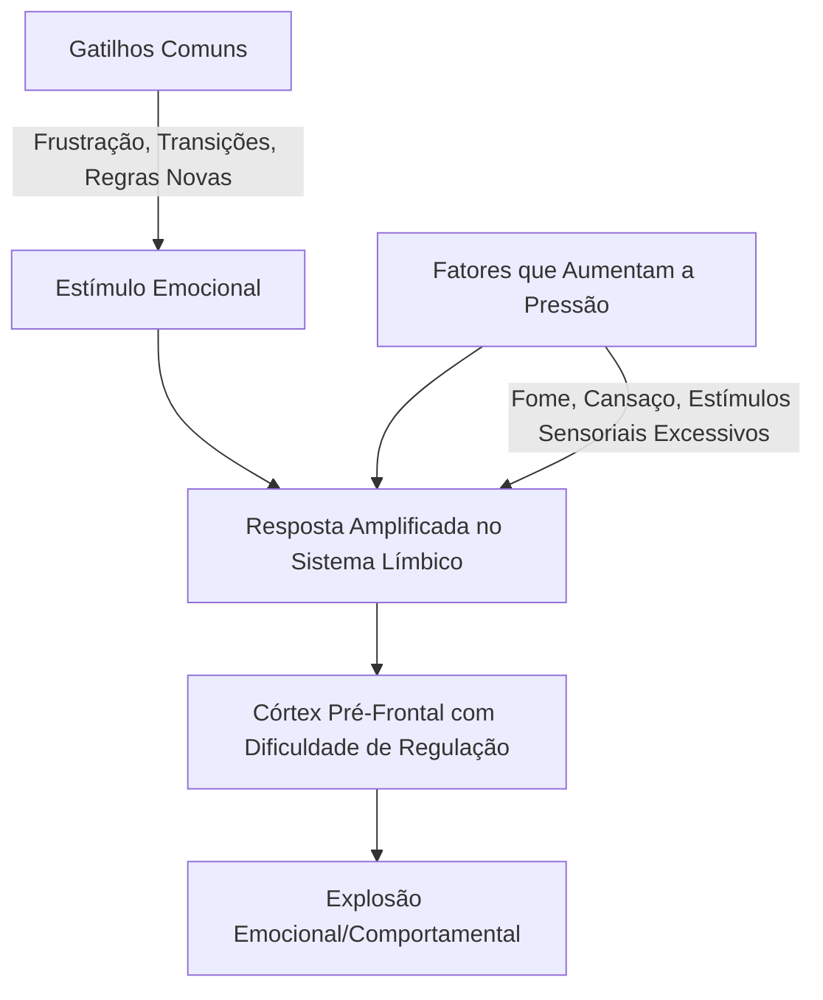
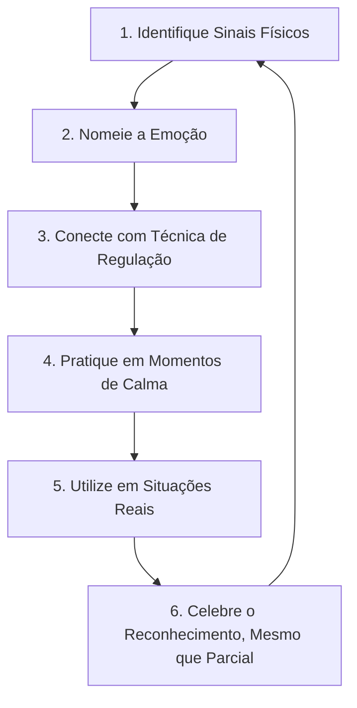
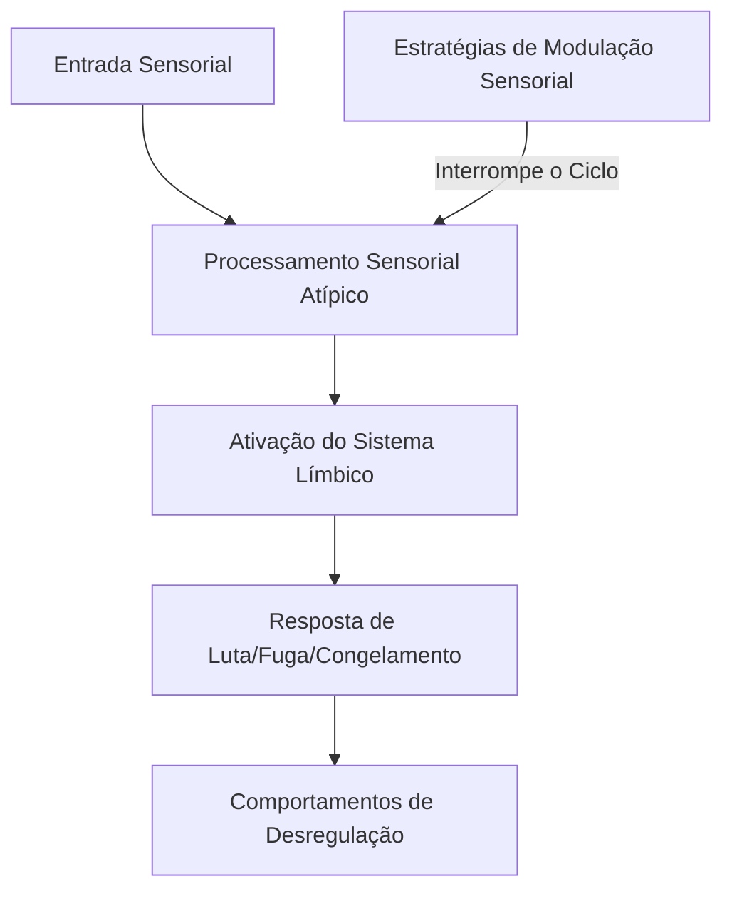

# Regulação Emocional Avançada no TDAH

#tdah #regulacaoemocional #parentalidade #neurodiversidade #estrategias-avancadas

> "Entender que a desregulação emocional no TDAH não é falta de caráter, mas uma característica neurobiológica real, foi o primeiro passo para eu conseguir realmente ajudar meu filho." — Mãe de Mateus, 9 anos

## 🧠 Guia Prático: Navegando O Oceano Emocional Do TDAH

Este guia completo oferece estratégias avançadas, baseadas em neurociência, para ajudar crianças e adolescentes com TDAH a desenvolverem habilidades de regulação emocional. Vai muito além do "respire fundo" – traz técnicas específicas para o funcionamento único do cérebro com TDAH, exemplos reais, e roteiros práticos para situações desafiadoras do dia a dia.

### Para Quem É Este Guia?

- Pais e cuidadores que buscam abordagens mais sofisticadas além do básico
- Famílias que enfrentam explosões emocionais frequentes ou intensas
- Aqueles que desejam entender o "porquê" neurobiológico por trás dos comportamentos
- Quem quer técnicas práticas e acionáveis, não apenas teoria

### O Que Você Vai Encontrar

- 📋 Roteiros de comunicação para momentos de crise
- 🔄 Técnicas específicas para diferentes idades e situações
- 🧩 Estratégias baseadas na neurociência do TDAH
- 📝 Estudos de caso detalhados com resultados reais
- 💪 Ferramentas para seu autocuidado como pai/mãe

## O Que Realmente Acontece No Cérebro Durante a "Explosão Emocional"

Vamos começar com uma verdade libertadora: aquela explosão de emoção que parece "vir do nada" no seu filho com TDAH tem uma explicação neurobiológica **real**. Não é "manha", não é "manipulação" e, definitivamente, não é porque você "estragou" seu filho.

### O Vulcão Emocional: Entendendo O Porquê 🌋

A melhor forma de visualizar o que acontece no cérebro com TDAH durante uma sobrecarga emocional é imaginar um vulcão:

Pra gente entender isso de forma simples e prática:

1. O **sistema límbico** (nosso centro emocional) funciona em intensidade máxima nas pessoas com TDAH – é como se todos os sentimentos estivessem no volume 11 de 10.
    
2. O **córtex pré-frontal**, responsável por "segurar" e regular essas emoções intensas, tem menos ativação e conexões mais fracas nas pessoas com TDAH.
    
3. Resultado: quando a emoção surge, ela "engolfa" rapidamente o cérebro antes que o sistema de freios (funções executivas) consiga agir.
    

Um estudo da Universidade de São Paulo mostrou que crianças com TDAH ativam áreas relacionadas à regulação emocional com 30-40% menos intensidade do que crianças neurotípicas quando expostas a situações frustrantes. Não é sobre "não querer se controlar" – é sobre literalmente não conseguir acessar esse controle no momento.

### O Que a Ciência Diz Sobre Isso? 🔬

A desregulação emocional é agora reconhecida como um **componente central** do TDAH, não apenas um "efeito colateral". O Dr. Russell Barkley, referência mundial em TDAH, afirma que a dificuldade em regular emoções deveria ser considerada tão parte do transtorno quanto a desatenção e a hiperatividade.

> **Fato científico:** Até 70% das crianças com TDAH apresentam dificuldades significativas com regulação emocional, principalmente com emoções como frustração, raiva e empolgação excessiva.

O cérebro com TDAH tem:

- Menor volume e atividade nas regiões que controlam a regulação emocional
- Alterações nos neurotransmissores que modulam respostas emocionais
- Dificuldade em alocar recursos cognitivos para processar e "frear" emoções intensas
- Menor capacidade de usar a linguagem interna para acalmar-se durante a emoção forte

Como disse a Dra. Melissa Orlov em uma palestra recente: "A criança com TDAH não está _escolhendo_ ter uma resposta emocional intensa. O que ela pode aprender, com apoio, é como gerenciar essa intensidade que já está lá."

## Técnicas Avançadas De Regulação Emocional (Além Do "Respire Fundo")

Vamos ao que realmente funciona – e por quê. Não apenas aquele básico "respire fundo" que todo mundo já sabe (e que raramente funciona sozinho). Técnicas que levam em conta o funcionamento cerebral único do TDAH.

### 1. Regulação Ascendente: Técnicas Corporais Fisiológicas

Quando a criança está em sobrecarga, começar pelo corpo (não pela mente) é o caminho neurológico mais eficaz.

#### Técnica Da Âncora Sensorial

**O que é:** Intervenções sensoriais intensas que "quebram" o ciclo de desregulação.

**Como fazer:**

1. Identifique antecipadamente 2-3 sensações que acalmam seu filho (pressão profunda, frio intenso, cheiro forte)
2. No início da desregulação, ofereça essa sensação
3. Espere 60-90 segundos antes de qualquer tentativa de conversa

**Exemplo real:** Para o Lucas (7 anos), descobrimos que segurar um cubo de gelo na mão ou pressionar uma bolsa de gel gelado contra o rosto funciona como um "reset" imediato durante explosões de raiva. Sua mãe carrega sempre uma pequena bolsa térmica na mochila. Em casa, têm uma caixinha no freezer identificada como "cubo da calma".

**Porquê funciona:** Sensações físicas intensas ativam o sistema nervoso parassimpático e redirecionam a atenção do sistema límbico hiperativado, dando chance ao córtex pré-frontal de "voltar online".

#### Movimentos Cruzados Rítmicos

**O que é:** Exercícios que atravessam a linha média do corpo, sincronizando os hemisférios cerebrais.

**Como fazer (exemplo prático):**

1. Em momento de calma, ensine e pratique estes movimentos simples com seu filho:
    - Tocar o joelho direito com a mão esquerda, depois o joelho esquerdo com a mão direita
    - Repetir em ritmo constante por 1-2 minutos
2. Quando perceber os primeiros sinais de agitação, sugerir: "Vamos fazer aquela dança maluca que a gente treinou?"

**Porquê funciona:** Movimentos cruzados aumentam a comunicação entre os hemisférios cerebrais através do corpo caloso, melhorando a integração da experiência emocional e a capacidade de autorregulação. Pesquisas com neuroimagem mostram aumento de atividade no córtex pré-frontal após esse tipo de exercício.

### 2. Regulação Descendente: Técnicas Cognitivas Adaptadas Para O TDAH

#### A Técnica Do Zoom-Out (Perspectiva Expandida)

Esta é particularmente eficaz para crianças com TDAH mais velhas (9+ anos) que já conseguem ter alguma metacognição.

**Como fazer:**

1. Em momento de calma, ensine seu filho a imaginar que existe um controle de câmera mental que pode "afastar a cena" (como zoom-out)
2. Pratique regularmente com situações hipotéticas leves
3. Durante situações reais, use uma deixa verbal curta: "Controle de zoom?"

|Perspectiva|O que a criança é incentivada a pensar|
|---|---|
|Agora|"Estou muito bravo porque perdi no jogo"|
|Hoje|"Isso é apenas um jogo de 15 minutos numa tarde de sábado"|
|Semana|"Vou jogar novamente várias vezes esta semana"|
|Mês|"Em um mês, nem vou lembrar desse momento específico"|

**Por que funciona:** A técnica ativa intencionalmente o córtex pré-frontal, área deficitária no TDAH. O "zoom-out" reduz a intensidade emocional ao mudar o foco atencional (altamente influenciável no TDAH) para uma perspectiva mais ampla. Pesquisas do Dr. Xavier Castellanos mostram que essa prática regular fortalece as conexões neurais envolvidas na regulação emocional.

#### Técnica Da Narrativa Alternativa (para Crianças De 7+ anos)

**Como funciona:** Ensine seu filho a questionar a história automática que seu cérebro está contando.

**Exemplo Prático Detalhado:**

Situação: Felipe (10 anos) arremessa o controle quando perde no videogame e grita: "É impossível! Esse jogo é injusto!"

**Passo a passo da técnica:**

1. **Validação empática:** "Nossa, você está mesmo frustrado. Parece que esse jogo está realmente difícil hoje."
2. **Pergunta-ponte** (quando mais calmo): "Qual é a história que seu cérebro está contando sobre o que aconteceu?"
3. **Identificação da narrativa automática:** "O jogo é injusto e impossível de ganhar"
4. **Questionamento suave:** "Será que existem outras possibilidades? Vamos pensar em 3 histórias diferentes que também poderiam explicar o que aconteceu?"
5. **Criação de narrativas alternativas:**
    - "Talvez eu precise praticar mais esse nível"
    - "Outros jogadores conseguem, então deve ser possível"
    - "Estou cansado hoje, o que está afetando meu desempenho"

**Dica:** Crie um pequeno caderno de "Detetive de Pensamentos" onde seu filho possa desenhar ou escrever narrativas alternativas para situações desafiadoras. Isso concretiza um processo cognitivo que pode ser difícil para crianças com TDAH.

**Por que funciona:** A técnica fortaleça a flexibilidade cognitiva (uma função executiva frequentemente comprometida no TDAH) e desativa o padrão de pensamento rígido que frequentemente alimenta a escalada emocional. Estudos mostram que esta habilidade pode ser aprendida mesmo com as limitações executivas do TDAH, desde que praticada regularmente.

### 3. Técnicas Mistas: Abordagens Corporais-Cognitivas

#### Mapeamento Corporal Das Emoções

Essa técnica é especialmente útil para crianças que têm dificuldade em identificar emoções antes que elas "explodam".

**Como fazer:**

1. Em momento de calma, desenhe junto com seu filho um contorno do corpo
2. Peça que ele identifique e pinte onde sente diferentes emoções (raiva, ansiedade, empolgação)
3. Crie "alertas antecipados" personalizados: "Parece que você está sentindo aquela pressão no peito que desenhamos? O que precisamos fazer agora?"

**Porquê funciona:** Crianças com TDAH frequentemente têm uma conexão corpo-mente menos desenvolvida (interoceptividade) e "pulam" os estágios iniciais de excitação emocional, percebendo apenas quando já estão em nível avançado. Esta técnica cria uma consciência corporal que serve como sistema de alerta precoce.

#### Técnica Da Régua Emocional

**Como fazer:**

1. Crie uma régua visual de 1-10 com cores e expressões
2. Ensine seu filho a monitorar seu "número emocional" ao longo do dia
3. Defina estratégias específicas para cada nível:
    - Nível 1-3: Estratégias preventivas
    - Nível 4-6: Técnicas de acalmamento
    - Nível 7-10: Intervenções de crise

**Exemplo realista:** Marina (8 anos) tinha explosões frequentes nos momentos de transição na escola. Criamos com ela uma régua emocional que ela mantém numa tag plastificada na mochila. Quando sente que está chegando no nível 6 (zona laranja), ela mostra disfarçadamente para a professora, que permite que ela tome água e faça 10 saltos do lado de fora da sala antes de mudar de atividade. As explosões reduziram em 80% em três semanas.

**Por que funciona:** A técnica utiliza a visualização (processamento que geralmente é ponto forte no TDAH visual-espacial) para compensar a dificuldade em automonitorar estados emocionais. A régua concretiza um processo interno abstrato, tornando-o mais acessível ao cérebro com TDAH.

## Cenários Comuns E Como Lidar: Guias De Ação

### Cenário 1: A Explosão De Raiva Durante O Dever De Casa

**O que geralmente acontece:** Sua filha está fazendo o dever de matemática. Uma questão mais difícil aparece. Ela tenta, erra, e de repente está gritando, rasgando o caderno e dizendo que é "burra" e "nunca vai conseguir".

**O que está acontecendo no cérebro:** A frustração ativa intensamente o sistema límbico. O córtex pré-frontal, que já trabalha com menos eficiência no TDAH (especialmente em tarefas que exigem esforço mental), não consegue inibir essa resposta emocional. A sobrecarga emocional "sequestra" as funções cognitivas necessárias para resolver o problema, criando um ciclo negativo.

**Abordagem passo-a-passo:**

1. **Fase de Crise (Amígdala no controle):**
    
    - Mantenha-se calmo e use frases curtas: "Vejo que está difícil agora."
    - Ofereça a âncora sensorial pré-combinada: "Quer a bolinha antistress?"
    - Crie espaço: "Vou estar na cozinha quando você quiser tentar de novo."
2. **Fase de Recuperação (Transição para o córtex):**
    
    - Valide sem reforçar a narrativa negativa: "Matemática pode ser muito frustrante mesmo."
    - Ofereça uma escolha limitada: "Podemos tentar de novo depois do lanche ou pedir ajuda com um vídeo explicativo. O que acha melhor?"
3. **Fase de Resolução (Córtex retoma o controle):**
    
    - Fragmentar a tarefa: "Vamos resolver apenas o primeiro passo agora."
    - Utilizar recursos visuais complementares
    - Celebrar o retorno ao equilíbrio: "Você conseguiu se acalmar, isso mostra quanto seu cérebro está aprendendo a se regular."

**Dica de Ouro:** Identifique o padrão de quando as explosões durante o dever de casa acontecem (horário? tipo de matéria? nível de cansaço?) e ajuste a rotina preventivamente. Para muitas crianças, fazer a lição logo após a escola é neurobiologicamente inviável – o córtex pré-frontal já está exausto de sustentar atenção o dia todo.

### Estudo De Caso Detalhado: A Transformação De Ana

**Situação inicial:** Ana, 8 anos, recém-diagnosticada com TDAH predominantemente desatento. Historicamente, suas explosões emocionais durante tarefas acadêmicas eram interpretadas como "birra" ou "preguiça". Seus pais, Carlos e Denise, relatavam episódios diários de choro intenso, comportamentos autodestrutivos ("sou burra", rasgar cadernos) e recusa em tentar tarefas percebidas como difíceis. A tensão em casa era constante, especialmente no período de lição.

**Abordagem implementada (ao longo de 3 meses):**

|Semana|Intervenção|Observação|
|---|---|---|
|1-2|Avaliação dos padrões de desregulação|Identificados principais gatilhos: tarefas matemáticas, transições, sobrecarga sensorial (barulho)|
|3-4|Introdução da técnica do "Tempo de Respiração do Cérebro"|Resistência inicial, aceitação gradual|
|5-6|Implementação de âncora sensorial (massinha de apertar com aroma de lavanda)|Adoção entusiástica por Ana|
|7-8|Treinamento dos pais em validação emocional|Redução significativa na duração das explosões|
|9-10|Introdução do mapeamento corporal de emoções|Ana começa a identificar sinais precoces|
|11-12|Regime consistente e generalização|Ana começa a solicitar sua âncora sensorial por conta própria|

**Evolução e aprendizados:**

1. **Mudança crítica de perspectiva:** A família passou a ver as explosões como "falhas do sistema" e não como comportamentos intencionais.
    
2. **Padrão inesperado descoberto:** As explosões eram significativamente piores nos dias em que Ana tinha educação física antes de matemática – a combinação de demanda física e cognitiva sobrecarregava seu sistema executivo.
    
3. **Estratégia game-changer:** O uso de um timer visual durante tarefas de matemática, com a regra "apenas 2 problemas por vez, depois uma pausa de movimento de 3 minutos", reduziu as explosões em 90%.
    
4. **Ajuste familiar importante:** Os pais perceberam que seu próprio estresse e expectativas perfecionistas estavam contribuindo para a tensão. Implementaram "tempo de recuperação" para eles mesmos quando percebiam seus sinais de estresse.
    
5. **Resultado após 3 meses:** De explosões diárias a 1-2 episódios leves por semana, com recuperação muito mais rápida. Ana desenvolveu confiança na sua capacidade de se acalmar e linguagem para expressar suas dificuldades ("meu cérebro está muito cheio agora").
    

**Principais lições do caso:**

1. Consistência é mais importante que perfeição
2. As estratégias precisam ser personalizadas para cada criança
3. A compreensão neurobiológica pelos pais reduz significativamente a escalada de conflitos
4. A autorregulação parental impacta diretamente a capacidade da criança de aprender regulação

### Cenário 2: O Meltdown no Supermercado

**O que normalmente acontece:** No meio do supermercado, seu filho de 6 anos começa a pedir um brinquedo/doce. Ao ouvir "não", joga-se no chão, grita, e parece incapaz de se acalmar, mesmo com promessas ou ameaças.

**Script para Gerenciar a Situação:**

1. **Fala interna para você mesmo** (fundamental!): "Isso é o TDAH, não é manipulação. Seu cérebro está sobrecarregado agora. Meu trabalho é ser o córtex pré-frontal externo dele neste momento."
    
2. **O que dizer à criança:**
    
    - Momento inicial: "Vejo que você está muito chateado agora. Vamos nos acalmar primeiro, depois conversamos." (tom neutro, palavras simples)
    - Durante a regulação: "Vamos contar juntos as cores que vemos?" (redirecionamento sensorial)
    - Após acalmamento: "Seu cérebro teve dificuldade de lidar com o 'não' hoje. Isso acontece. Vamos tentar de novo outro dia."
3. **O que dizer a pessoas ao redor** (se necessário): "Ele está tendo um momento difícil de regulação. Já já passa, obrigada pela compreensão."
    

**Por que funciona:** O redirecionamento atencional (contar cores) utiliza a capacidade do TDAH de hiperfoco em novos estímulos para interromper o ciclo de desregulação. A simplificação da linguagem é crucial porque durante a sobrecarga emocional, o processamento verbal está significativamente reduzido.

### Perguntas Para Reflexão Dos Pais 🤔

1. Quais são os padrões de desregulação emocional que observo no meu filho? (Horários, contextos, tipo de emoção)
    
2. Quais técnicas corporais-fisiológicas fazem mais sentido para o perfil sensorial específico do meu filho?
    
3. Como minha própria regulação emocional influencia a capacidade do meu filho de desenvolver esta habilidade?
    
4. Que histórias ou narrativas estou contando a mim mesmo sobre os episódios de desregulação emocional do meu filho? Como isso afeta minha resposta?
    
5. Que pequenos sinais de progresso na regulação emocional (mesmo que sutis) posso identificar e celebrar?
    

## Entendendo a Perspectiva Da Criança: O Mundo De Dentro

Para realmente ajudar nossos filhos, precisamos tentar entender como eles experimentam o mundo. Aqui vai uma tentativa de traduzir a experiência interna de uma criança com TDAH durante a desregulação emocional:

> **"Na voz de Mateus, 9 anos (reconstrução baseada em relatos de crianças com TDAH):**
>
> É tipo quando eu tô jogando videogame e de repente a tela congela, sabe? Mas dá pra ver que o jogo continua rodando por trás. Eu consigo ver que todo mundo tá falando comigo, que a mamãe tá tentando me acalmar, mas é como se tivesse um vidro grosso entre a gente.
>
> A raiva vem tão rápido! É tipo um tsunami dentro de mim. Uma hora tá tudo bem, daí alguém diz 'não' ou eu erro uma conta, e BOOM! É como se alguém apertasse um botão e eu não conseguisse desligar.
>
> O pior é que uma parte de mim, bem pequenininha, tá vendo tudo isso acontecer. Essa partezinha tá gritando 'para com isso, você tá fazendo besteira!', mas a parte grande e barulhenta não consegue ouvir.
>
> Depois eu me sinto péssimo. Todo mundo olha pra mim tipo 'lá vai ele de novo'... aí vem aquela voz na minha cabeça: 'você é um bebê chorão', 'ninguém gosta de criança que faz escândalo'... e eu queria tanto conseguir ser diferente.
>
> Os dias que eu consigo me controlar, mesmo que só um pouquinho, são os melhores. Quando a mamãe nota e fala 'vi como você respirou fundo em vez de gritar', é como se eu tivesse ganhado uma medalha por dentro."

Este relato nos lembra da importância de ter empatia pela experiência interna da criança. A desregulação não é escolha – é uma experiência assustadora e confusa para eles também.

## Modelando Regulação: A Ferramenta Parental Mais Poderosa

A gente precisa ser honestos aqui: criar uma criança com TDAH é INTENSO. Tem dias que a gente também fica no limite – e tudo bem reconhecer isso.

A ciência é clara: as habilidades de regulação emocional são aprendidas principalmente por observação. O problema? Pais de crianças com TDAH frequentemente têm níveis mais altos de estresse e, muitas vezes, também têm TDAH não diagnosticado (50% de probabilidade de pelo menos um dos pais ter).

### O Que Fazer Quando Você Também "Explode"

**Cenário real:** Você teve um dia exaustivo. Seu filho com TDAH derramou leite pela terceira vez na semana, e você gritou mais alto do que gostaria. E agora?

1. **Reparo imediato** (não deixar para depois): "Me desculpe por ter gritado. Mamãe/Papai também está aprendendo a regular as emoções. Não foi certo eu gritar, e vou tentar fazer diferente da próxima vez."
    
2. **Modelagem metacognitiva transparente:** "Sabe o que aconteceu com meu cérebro agora? A minha amígdala ficou no comando porque estou cansado. Meu trabalho é treinar meu córtex pré-frontal para ficar forte, assim como você está treinando o seu."
    
3. **Estratégia conjunta:** "O que poderíamos fazer juntos da próxima vez para nos acalmarmos? Que tal criarmos um 'cantinho da calma' que podemos usar juntos quando precisarmos?"
    

**Por que funciona:** Esta abordagem transparente ensina que:

- Regular emoções é um processo de aprendizado ao longo da vida
- Erros acontecem e podem ser reparados
- Habilidades emocionais podem ser desenvolvidas com prática

### Técnicas De Regulação Emocional Para Pais (Sim, Para VOCÊ!)

Como pais, precisamos de nossas próprias ferramentas de regulação. Pais regulados = ambiente mais seguro para crianças desenvolverem sua regulação.

**Técnica de micro-intervenção S.T.O.P**

- **S**TOPS = Pare (fisicamente, se possível)
- **T**AKE = Respire (3 respirações profundas)
- **O**BSERVE = Observe (sensações no corpo, pensamentos)
- **P**ROCEED = Prossiga (com intenção renovada)

Esta técnica leva apenas 30 segundos e pode ser usada discretamente, mesmo com sua criança presente. É particularmente eficaz quando você sente os primeiros sinais de irritação crescente.

**Técnica dos 90 segundos de regulação intensiva:** Quando sentir que está prestes a "explodir", diga à criança: "Mamãe/Papai precisa de um tempinho para o cérebro se reorganizar. Vou voltar em 90 segundos muito mais calmo." Então:

1. Vá para outro ambiente (mesmo que seja o banheiro)
2. Aplique uma sensação física intensa (água gelada no rosto, apertar gelo, esticar elástico no pulso)
3. Faça 5-7 respirações profundas em ciclos de 4-7-8 (inspira em 4, segura em 7, expira em 8)
4. Repita uma frase de ancoragem ("Isto é apenas um momento", "Estou modelando regulação agora")
5. Retorne e reengage com calma

### Checklist De Autocuidado Parental (Fundamental!)

✅ **Para hoje:**

- [ ] 5 minutos de respiração consciente (mesmo que trancado no banheiro!)
- [ ] Mensagem para um amigo que entende sua jornada
- [ ] Uma pausa sensorial (café quente, música, splash de água no rosto)

✅ **Para esta semana:**

- [ ] Identificar uma atividade que recarregue sua energia
- [ ] Ter uma conversa honesta com alguém sobre as dificuldades
- [ ] Celebrar uma pequena vitória na regulação emocional (sua ou do seu filho)

✅ **Para este mês:**

- [ ] Buscar conexão com outros pais que entendem o TDAH
- [ ] Aprender uma nova técnica de regulação emocional para você mesmo
- [ ] Avaliar o que está funcionando e o que precisa ser ajustado

> "Colocar sua própria máscara de oxigênio primeiro não é egoísmo – é a única forma de continuar presente para seu filho a longo prazo." — Dr. Russell Barkley

## O Papel Do Perfil Sensorial Na Regulação Emocional

Uma área frequentemente negligenciada, mas crucial: o processamento sensorial e seu impacto direto na regulação emocional de pessoas com TDAH.

### Entenda O Perfil Sensorial Da Sua Criança

Crianças com TDAH frequentemente apresentam particularidades sensoriais que podem desencadear desregulação emocional. A neurociência mostra que o processamento atípico de estímulos sensoriais tem uma via direta para o sistema límbico (emocional).

#### Identificando Padrões Sensoriais

**Mini-avaliação para pais**: Observe seu filho em diferentes ambientes e note reações a:

- **Sons**: Cobre os ouvidos com barulhos comuns? Fica agitado em ambientes ruidosos?
- **Toque**: Incomoda-se com etiquetas, costuras, certos tecidos? Ou busca pressão profunda?
- **Movimento**: Precisa estar sempre em movimento ou evita atividades que exijam equilíbrio?
- **Visual**: Distrai-se com ambientes visualmente carregados? Incomoda-se com luzes brilhantes?
- **Olfato/Paladar**: É seletivo com alimentos baseado em texturas? Reage fortemente a cheiros?

**Exemplo prático:** Fernanda, 7 anos, tinha explosões diárias na hora do jantar. Seus pais inicialmente interpretavam como comportamento desafiador. Uma avaliação sensorial revelou hipersensibilidade tátil oral (desconforto com certas texturas) e auditiva (sobrecarga com os sons de talheres e conversas). Soluções simples como fones abafadores de ruído durante o jantar e adaptações nas texturas dos alimentos reduziram as explosões em 70%.

#### Estratégias Sensoriais Personalizadas Para Regulação

|Perfil Sensorial|Sinais de Alerta|Estratégias Regulatórias|
|---|---|---|
|Hipersensível Auditivo|Cobre ouvidos, irritabilidade em ambientes barulhentos|Fones abafadores, música com fone, "intervalos silenciosos"|
|Hipersensível Tátil|Evita certas texturas, recusa abraços|Oferecer toque com pressão em vez de leve, roupas sem etiquetas|
|Hiposensível Proprioceptivo|Busca constantemente movimento, colide com objetos|Atividades com resistência muscular antes de tarefas sentadas|
|Hipersensível Visual|Distração em ambientes visualmente carregados|Espaços de estudo minimalistas, redução de estímulos visuais|

**Por que funciona:** Ao abordar as necessidades sensoriais específicas, você reduz significativamente a carga sobre o sistema nervoso, liberando recursos cognitivos para a regulação emocional. Pesquisas mostram que intervenções sensoriais podem reduzir comportamentos de desregulação em 40-60%.

## TDAH Com Comorbidades: Estratégias Adaptadas

Mais de 60% das crianças com TDAH têm pelo menos uma condição coexistente, o que exige adaptações nas estratégias de regulação emocional.

### TDAH + Ansiedade

A combinação TDAH+Ansiedade cria desafios únicos: a impulsividade do TDAH pode fazer com que medos da ansiedade sejam expressos como irritabilidade ou agressividade, não como preocupação típica.

**Sinais para observar:**

- Perfeccionismo que leva a explosões quando as coisas não saem "perfeitas"
- Preocupações excessivas disfarçadas de oposição ("Não vou fazer isso" pode ser "Estou com medo de falhar")
- Dificuldade para dormir devido a pensamentos acelerados
- Queixas somáticas (dor de barriga, dor de cabeça) antes de situações desafiadoras

**Estratégias específicas:**

1. **Técnica do "Pensamento Científico"** - Transforme medos em hipóteses a serem testadas:
    
    - Identifique o pensamento ansioso ("Ninguém vai querer brincar comigo")
    - Transforme em questão investigativa ("Quais evidências tenho disso?")
    - Proponha um "experimento" para testar a hipótese
2. **Regulação Dual Sequenciada:**
    
    - Primeiro: Intervenção física/sensorial para acalmar o sistema nervoso simpático
    - Depois: Abordagem cognitiva para processar preocupações

**Exemplo prático detalhado:** Pedro, 10 anos, TDAH+Ansiedade, tinha explosões antes de provas escolares. O protocolo desenvolvido:

1. 5 minutos de atividade de pressão profunda antes de estudar (pular, abraços de urso)
2. Divisão do conteúdo em cartões coloridos de "já sei bem" e "preciso revisar"
3. Uso da técnica "E se...?" para confrontar o pior cenário possível
4. Plano de ação concreto para cada cenário temido

### TDAH + Transtorno Desafiador Opositivo (TOD)

Crianças com TDAH+TOD apresentam padrões de comportamento resistente e desafiador que vão além da impulsividade típica do TDAH, tornando a regulação emocional ainda mais complexa.

**Abordagem integrada:**

1. **Foco preventivo em escolhas e autonomia** - Ofereça opções dentro de limites seguros
2. **Método de resolução colaborativa de problemas** (Ross Greene):
    - Identifique primeiramente as habilidades deficitárias, não os comportamentos
    - Estabeleça prioridades claras (quais batalhas valem a pena)
    - Abordagem proativa de "cestas": problemas para resolver juntos, problemas para adiar, e limites não-negociáveis

**Dica crucial:** A abordagem tradicional de consequências e punições frequentemente aumenta a desregulação em crianças com TDAH+TOD. A neurociência mostra que o córtex pré-frontal dessas crianças é ainda mais impactado durante confrontos de poder, reduzindo a capacidade de aprendizado de tais situações.

## Adaptações Culturais Brasileiras

As estratégias de regulação emocional precisam considerar o contexto cultural em que vivemos. Alguns desafios e adaptações específicas para a realidade brasileira:

### Desafios Específicos no Brasil

1. **Acesso limitado a serviços especializados** - Em muitas regiões, há poucos profissionais que entendem realmente o TDAH
2. **Sistemas escolares com alta rigidez e salas lotadas** - Dificulta adaptações individualizadas
3. **Estigma cultural sobre saúde mental e neurodivergência** - "É só falta de educação" ou "No meu tempo não tinha isso"
4. **Pressão familiar extensa** - Opiniões de avós, tios e outros familiares que podem não entender o TDAH

### Soluções Criativas Para O Contexto Brasileiro

**Na escola:**

- Documento simples de "orientações para professores" com 5 estratégias práticas e concisas
- Alianças com coordenadores pedagógicos como "tradutores" das necessidades da criança
- Uso de tecnologias acessíveis (temporizadores de celular, aplicativos gratuitos)

**Com família extensa:**

- Cartilha simples compartilhada via WhatsApp com explicações breves sobre o TDAH
- Estabelecimento de "embaixadores" na família (um ou dois familiares que se interessem em aprender)
- Frases diretas para uso quando receber comentários inadequados: "Agradeço sua preocupação. Estamos seguindo orientações especializadas para as necessidades específicas dele."

**No dia a dia:**

- Adaptação de técnicas de regulação para realidades diversas (nem todos têm acesso a materiais específicos)
- Uso de recursos comunitários como alternativas terapêuticas (esportes em centros comunitários, atividades físicas em praças)

**Exemplo contextualizado:** Maria, mãe solo de Lucas (8 anos) com TDAH, criou um "kit de regulação" com itens de baixo custo: garrafa PET com glitter e água como "garrafa da calma", bola de meia para apertar como suporte sensorial, e cartões desenhados à mão com estratégias de respiração. Quando Lucas começava a ficar desregulado na casa da avó (que não acreditava no diagnóstico), ele mesmo pedia seu "kit de super-poderes" ao invés de discutir sobre o TDAH.

## Tecnologia Como Aliada Na Regulação Emocional

A tecnologia, quando usada estrategicamente, pode ser uma ferramenta poderosa para desenvolver habilidades de regulação emocional em crianças com TDAH.

### Apps E Ferramentas Recomendadas

|Categoria|Recurso|Como Utilizar|
|---|---|---|
|Mindfulness Adaptado|App "Mindfulness para Crianças" (em português)|Sessões curtas (3-5 min) de atenção plena adaptadas para TDAH|
|Monitoramento de Humor|App "Daylio" ou "Mood Meter"|Para adolescentes rastrearem padrões emocionais e gatilhos|
|Timers Visuais|"Time Timer" ou equivalentes|Representação visual do tempo restante para transições|
|Regulação por Biofeedback|"Breathe+" ou apps de respiração guiada|Feedback visual sobre respiração para autorregulação|
|Organização Emocional|"Zones of Regulation"|Classificação visual de estados emocionais|

**Como implementar:** Introduza um recurso tecnológico por vez, modelando seu uso durante momentos de calma primeiro. Estabeleça regras claras (como usar apenas para o propósito específico de regulação). Reserve tempo para revisar e discutir os dados coletados.

**Caso prático:** Rafael, 11 anos, usava o app MindfulnessU por 5 minutos antes da lição de casa e tinha um timer visual durante a tarefa. Em 3 semanas, ele começou a solicitar a meditação por conta própria quando sentia sinais de frustração.

## Perguntas Frequentes (FAQ) Sobre Regulação Emocional E TDAH

### "É Normal Meu Filho Parecer Se Desregular Mais Em Casa Do Que Na escola?"

**Sim!** Isso é extremamente comum e tem explicação neurobiológica. Na escola, crianças com TDAH frequentemente usam quantidades enormes de energia para "se segurar" e atender expectativas sociais. Esse controle constante esgota as reservas do córtex pré-frontal. Quando chegam em casa – seu ambiente seguro – o cérebro simplesmente não tem mais recursos para manter essa regulação. É como uma panela de pressão.

**Dica prática:** Crie uma rotina de "descompressão" para a chegada da escola: 15-30 minutos de atividade física ou tempo sozinho (dependendo do perfil da criança) antes de fazer qualquer demanda.

### "As Explosões Emocionais Vão Passar Com O Tempo Ou Com a medicação?"

**Resposta nuançada:** A desregulação emocional frequentemente melhora com a idade, mas não simplesmente "desaparece" sem intervenção. Estudos longitudinais mostram que crianças com TDAH que recebem suporte específico para regulação emocional têm resultados significativamente melhores na adolescência e vida adulta.

Quanto à medicação, ela pode ajudar na regulação emocional em cerca de 70% dos casos, mas não é uma solução completa. A medicação pode criar uma "janela de oportunidade" para aprender estratégias de regulação, mas essas habilidades ainda precisam ser ativamente desenvolvidas.

### "Como Diferenciar Uma 'explosão De TDAH' De Mau Comportamento intencional?"

Esta é uma pergunta comum e importante. A distinção está geralmente em:

1. **Padrão e consistência:** Desregulação de TDAH tende a seguir padrões previsíveis (gatilhos específicos, sinais de alerta similares)
2. **Desproporcionalidade:** A reação é claramente desproporcional ao evento desencadeador
3. **Recuperação e remorso:** Após recuperar-se, a criança frequentemente expressa arrependimento genuíno
4. **Capacidade de articular:** Quando calma, a criança pode geralmente explicar o que aconteceu e como se sentiu

**Importante:** Mesmo comportamentos que surgem da neurobiologia do TDAH precisam de estrutura e limites consistentes – a diferença está na abordagem e nas expectativas, não na ausência de orientação.

### "O Que Fazer Quando Nada Funciona Durante Uma Explosão Emocional intensa?"

Quando uma criança está em sobrecarga emocional extrema, a prioridade é segurança física e emocional, não "consertar" o comportamento no momento.

**Protocolo de crise para explosões extremas:**

1. Mantenha a calma (seu estado emocional é contagioso)
2. Reduza demandas e estímulos (menos luz, menos ruído, menos pessoas)
3. Use linguagem mínima e concreta ("Estou aqui." "Você está seguro.")
4. Ofereça presença sem demandas ("Vou ficar aqui perto.")
5. Permita tempo de recuperação adequado (pode levar 20-90 minutos para o sistema nervoso se reorganizar)
6. Adie qualquer discussão sobre o comportamento para quando todos estiverem calmos

**Lembre-se:** Durante uma explosão emocional extrema, a capacidade de aprendizado é zero. O momento da crise NÃO é momento para "ensinar lições".

## Considerações Para Diferentes Etapas Do Desenvolvimento

A regulação emocional no TDAH precisa ser adaptada para diferentes idades e fases do desenvolvimento.

**Na primeira infância (3-6 anos):**

- Foco em intervenções corporais/sensoriais
- Modelagem extensiva de autorregulação pelos adultos
- Rotinas altamente previsíveis com apoios visuais
- Linguagem simples para nomear emoções
- Histórias específicas sobre emoções

**No ensino fundamental I (7-10 anos):**

- Introdução gradual de estratégias cognitivas simples
- Metáforas concretas (ex: "cérebro de crocodilo vs. cérebro de sábio")
- Prática estruturada em ambientes seguros
- Monitoramento corporal com suportes visuais
- Início de reflexão pós-regulação

**Na adolescência (introdução precoce se possível):**

- Compreensão da neurobiologia do TDAH
- Auto-advocacia e identificação de necessidades
- Ferramentas tecnológicas personalizadas
- Estratégias para contextos sociais
- Autorregulação no contexto das relações românticas
- Preparação para transição para a vida adulta

## Ferramentas Para Momentos De Crise: Kit De Primeiros Socorros Emocionais

A preparação preventiva para momentos de crise é fundamental. A seguir, um sistema completo de resposta à desregulação emocional aguda, que pode ser adaptado para diferentes idades e perfis.

### Kit Físico De Regulação Emocional

Crie um "Kit de Regulação" concreto e acessível para seu filho:

**Para crianças menores (4-8 anos):**

- Caixa ou bolsa personalizada e decorada pela criança
- Itens sensoriais: massinha de modelar com aromas calmantes, tecido macio, bolsa de gel para apertar
- Cartões com imagens de estratégias de acalmamento (respirar como urso, abraço de borboleta)
- Brinquedo de ventilador manual ou mini garrafa sensorial
- Fones abafadores de som (se houver sensibilidade auditiva)
- Pequeno álbum com fotos de momentos felizes ou pessoas queridas

**Para crianças mais velhas/adolescentes (9+ anos):**

- Bolsa ou estojo mais discreto/maduro (design escolhido por eles)
- Fones com playlist específica para regulação (músicas instrumentais ou favoritas)
- Cartões com estratégias cognitivas-chave (frases de ancoragem, passos de autorregulação)
- Fidget spinner ou ferramenta sensorial discreta
- Livro/caderno para desenho ou escrita expressiva
- Lista personalizada de atividades rápidas de redirecionamento
- Mini guia de auto-coaching para problemas específicos

**Localização estratégica:** Mantenha versões do kit em diferentes locais - um em casa, um na mochila escolar, e um mini-kit no carro para deslocamentos.

**Exemplo de implementação:** Renato, 10 anos, ajudou a criar seu "Kit de Regulação Ninja". Em momentos de frustração crescente, os pais usam a frase-código "Hora de equipamento ninja?" como sugestão não-confrontativa. Renato gradualmente aprendeu a identificar seus próprios sinais de alerta e solicitar o kit antes de atingir o ponto crítico.

### Planos De Crise Familiar: Protocolos Claros

Estabeleça protocolos familiares para diferentes níveis de desregulação:

**Nível 1 (Primeiros Sinais):**

- Sinais observáveis: Inquietação aumentada, mudança no tom de voz, tensão facial
- Protocolo: Oferecer apoios preventivos não-verbais, reduzir demandas, propor breve pausa

**Nível 2 (Escalada Moderada):**

- Sinais observáveis: Aumento da agitação, dificuldade em processar linguagem, rigidez crescente
- Protocolo: Implementar técnica sensorial específica, simplificar o ambiente, usar comunicação mínima

**Nível 3 (Crise Plena):**

- Sinais observáveis: Explosão verbal/física, choro intenso, comportamentos repetitivos
- Protocolo: Garantir segurança física, permanecer calmo e presente sem fazer demandas, aguardar ciclo de recuperação

**Dica crucial:** Pratique o protocolo em momentos de calma, como um "ensaio". Explique que todos na família estão aprendendo - isso não é só "treinamento para a criança", mas um sistema familiar de apoio mútuo.

**Exemplo real:** A família Silva desenvolveu um código de cores simples para comunicar estados emocionais. Todos os membros (incluindo os pais!) podem declarar que estão em "zona amarela" (precisando de suporte preventivo) ou "zona vermelha" (precisando de espaço). Esta linguagem compartilhada reduziu significativamente a escalada de conflitos e criou um sistema de respeito mútuo.

### Guia Pós-Crise: Reparação E Aprendizado

O que acontece após uma explosão emocional é tão importante quanto o manejo durante a crise. Aqui está um roteiro para o processo de recuperação e aprendizado:

1. **Tempo adequado:** Espere até que todos estejam genuinamente calmos - isso pode demorar horas, não minutos
    
2. **Conversação restaurativa estruturada:**
    
    - Comece com validação genuína: "Aquilo foi realmente difícil para todos nós."
    - Pergunte sem acusação: "O que você acha que estava acontecendo antes de ficar tão difícil?"
    - Explore juntos: "O que percebemos que poderia ter ajudado antes das coisas ficarem intensas?"
    - Planeje ajustes: "O que podemos fazer diferente da próxima vez?"
    - Termine com conexão: Momento de reconexão positiva não relacionado ao incidente
3. **Documentação de aprendizado (opcional mas poderosa):**
    
    - Para crianças mais velhas/adolescentes, mantenha um "Diário de Descobertas" compartilhado
    - Anote padrões, gatilhos e estratégias bem-sucedidas
    - Revisite regularmente para identificar progressos (frequentemente invisíveis no dia a dia)

**Por que funciona:** Esta abordagem evita o ciclo de culpa/vergonha que frequentemente segue episódios de desregulação, transformando-os em oportunidades de aprendizado sem reforçar comportamentos problemáticos.

## Perspectiva Da Neurodiversidade: Reformulando a Regulação Emocional

A abordagem da neurodiversidade nos convida a olhar além do modelo de "déficit" e considerar como aspectos do TDAH - incluindo a intensidade emocional - podem ser pontos fortes quando entendidos e canalizados adequadamente.

### Reframing Positivo: Enxergando Diferentemente

**Características frequentemente vistas como problemas podem ser reinterpretadas:**

|Visão Tradicional|Perspectiva da Neurodiversidade|Como Canalizar Positivamente|
|---|---|---|
|"Explosivo"|Emocionalmente intenso e autêntico|Artes expressivas, advocacia, liderança apaixonada|
|"Reativo demais"|Responsivo e empático ao ambiente|Habilidades sociais intuitivas, sensibilidade às necessidades dos outros|
|"Desregulado"|Processamento emocional dinâmico|Criatividade, pensamento inovador, conexões não-lineares|
|"Impulsivo"|Espontâneo e disposto a arriscar|Iniciativa, resolução criativa de problemas|

**Como implementar este reframing:**

1. Conscientize-se de sua própria linguagem e narrativas internas
2. Discuta abertamente estes "superpoderes escondidos" com seu filho
3. Crie oportunidades para expressão positiva destas qualidades
4. Celebre exemplos de pessoas neurodivergentes bem-sucedidas que usaram estas características como vantagens

### Comunicação Neurodiversa: Além Da Norma

As expectativas tradicionais de comunicação emocional muitas vezes não funcionam para pessoas com TDAH. Em vez de forçar métodos neurotiṕicos, explore abordagens adaptadas:

**Técnicas de comunicação neurodiversa:**

- **Comunicação paralela:** Conversas lado a lado durante atividades, em vez de confronto face a face
- **Processamento escrito:** Oferecer opção de expressar emoções complexas por escrito/desenho
- **Tempo adequado:** Respeitar a necessidade de mais tempo para processar emoções intensas
- **Linguagem literal:** Evitar metáforas confusas ou linguagem indireta durante momentos emocionais

**Exemplo transformador:** Depois de múltiplas tentativas frustradas de "conversas sérias" face a face que terminavam em explosões, os pais de João (12 anos) começaram a ter conversas importantes durante caminhadas no parque. O movimento físico, a ausência de contato visual constante e o ambiente natural reduziram significativamente a pressão sobre o sistema regulatório de João, resultando em comunicação muito mais eficaz e menos desregulação.

## Considerações Finais: A Jornada Da Regulação Emocional

Desenvolver habilidades avançadas de regulação emocional em crianças e adolescentes com TDAH é uma maratona, não uma corrida de curta distância. Celebre cada pequeno progresso e lembre-se:

1. A neuroplasticidade é real - o cérebro muda com prática consistente
2. Seu amor, paciência e compreensão são os alicerces desse desenvolvimento
3. Não existe "perfeição" na regulação emocional - todos nós, com ou sem TDAH, continuamos aprendendo

O objetivo final não é eliminar todas as emoções intensas ou criar uma criança "perfeitamente controlada". O verdadeiro sucesso é criar um indivíduo que:

- Entende seu perfil neurológico único
- Tem estratégias personalizadas para navegar emoções intensas
- Mantém autoestima e senso de valor próprio intactos
- Pode usar a intensidade emocional como combustível para paixão e propósito

Como disse um adolescente com TDAH em um grupo de apoio: "Não quero que ninguém 'conserte' minhas emoções. Só quero aprender a surfar nelas em vez de me afogar."

### Recursos Adicionais Para Aprofundamento

**Livros recomendados em português:**

- "O Cérebro da Criança" - Daniel Siegel e Tina Payne (adaptações para TDAH no blog "TDAH em Casa")
- "Mentes Inquietas" - Ana Beatriz Barbosa Silva
- "Meu Cérebro Precisa de Óculos" - Dra. Annick Vincent (para crianças)

**Canais e Podcasts brasileiros:**

- Canal do Youtube: "Doutora TDAH" com a Dra. Paula Peron
- Podcast: "Mentes Únicas" (episódios sobre regulação emocional)
- Podcast: "TDAH e Eu" - abordagem da neurodiversidade

**Grupos de apoio online:**

- "Pais Neurodiversos Brasil" no Facebook
- "TDAH - Informação e Apoio" no WhatsApp

**Aplicativos úteis em português:**

- "Mindfulness para Crianças"
- "Daylio" (diário de humor com interface intuitiva)
- "Zones of Regulation" (versão em português disponível)

---

**Links para notas relacionadas no Obsidian:**

- [[Entendendo o Sistema Executivo no TDAH]]
- [[Hipersensibilidade no TDAH - Mais que Sensorial]]
- [[O Impacto do Estresse Parental na Criança com TDAH]]
- [[Rotinas que Funcionam para Crianças com TDAH]]
- [[Estratégias Escolares para Crianças com TDAH]]
- [[Técnicas de Comunicação Não-Violenta Adaptada para TDAH]]
- [[Desenvolvimento do Cérebro TDAH - Da Infância à Vida Adulta]]

**Tags:** #regulacao-emocional #tecnicas-avancadas #parentalidade-tdah #neurociencia-pratica #autocuidado-parental #neurodiversidade #estrategias-tdah

## A Jornada É Longa, Mas Vale a Pena 💪

Desenvolver regulação emocional avançada em uma criança com TDAH não é um processo rápido, mas é transformador. Estudos longitudinais mostram que crianças com TDAH que desenvolvem boas habilidades de regulação emocional têm resultados significativamente melhores na adolescência e vida adulta, independente dos sintomas de desatenção ou hiperatividade.

Lembre-se:

- Cada pequeno progresso importa
- A neuroplasticidade é real – o cérebro muda com prática consistente
- Seu amor e apoio são o fundamento para o desenvolvimento dessas habilidades

### Recursos Brasileiros Para Aprofundamento

- Grupo de suporte online: "Pais Neurodiversos Brasil" no Facebook
- Livro: "O Cérebro da Criança" - Daniel Siegel e Tina Payne (adaptações para TDAH no blog "TDAH em Casa")
- Podcast: "Mentes Únicas" (episódios sobre regulação emocional)
- Canal do Youtube: "Doutora TDAH" com a Dra. Paula Peron
- Aplicativo: "Mindfulness para TDAH" (em português)
- Livro: "Mentes Inquietas" - Ana Beatriz Barbosa Silva (perspectiva brasileira)

## Nota Final: O Que Seu Filho Realmente Precisa

Por trás de todo o conhecimento técnico, pesquisas e estratégias, existe uma verdade simples:

Seu filho não precisa de perfeição. Ele precisa de um pai/mãe que continue tentando entender seu cérebro único, que se levante depois de um dia difícil, e que enxergue seu esforço invisível.

Quando você valida a experiência emocional da sua criança com TDAH, você não está apenas ensinando regulação emocional – você está mostrando que ela é digna de amor e compreensão exatamente como é.

E isso, mais do que qualquer técnica, é o que fará a diferença.

---

**Links para notas relacionadas:**

- [[Entendendo o Sistema Executivo no TDAH]]
- [[Hipersensibilidade no TDAH - Mais que Sensorial]]
- [[O Impacto do Estresse Parental na Criança com TDAH]]
- [[Rotinas que Funcionam para Crianças com TDAH]]

**Tags:** #regulacao-emocional #tecnicas-avancadas #parentalidade-tdah #neurociencia-pratica #autocuidado-parental