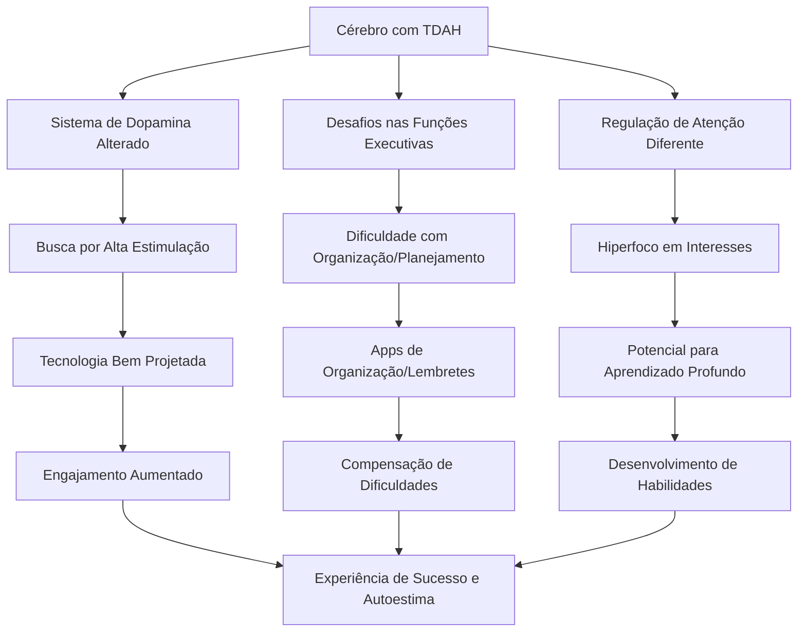
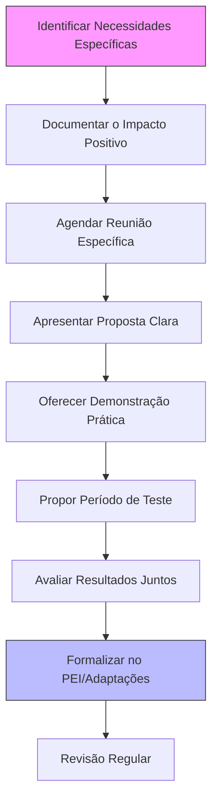

# Tecnologia Como Ferramenta Terapêutica Para TDAH

**Tags:** #TDAH #Tecnologia #FeramentasTerapêuticas #RecursosPais #DesenvolvimentoInfantil #NeurodiversidadeDigital #AprendizagemAssistida

## Aliada Ou Vilã? Um Novo Olhar Sobre Tecnologia E TDAH

Oi! Vamos ter uma conversa franca? Se você é mãe ou pai de uma criança com TDAH, provavelmente já ouviu aquele conselho genérico: "Diminua o tempo de tela!" ou "Videogames e celulares só pioram a atenção!". Mas e se eu dissesse que, usada de forma estratégica, a tecnologia pode ser uma das nossas maiores aliadas na jornada da parentalidade neurodivergente?

Como mãe de um menino com TDAH e psicopedagoga que trabalha há 15 anos com crianças neurodivergentes, já passei por aqueles momentos de culpa toda vez que via meu filho hiperfocado na tela. Já me perguntei mil vezes: "Será que estou facilitando um vício?" ou "Isso vai prejudicar ainda mais a atenção dele?".

É por isso que mergulhei fundo na ciência por trás desse tema e descobri que não é sobre _se_ devemos usar tecnologia, mas _como_ podemos usá-la a nosso favor. E quero compartilhar com você o que descobri e o que realmente funciona na prática.

> 💡 **Mudança de paradigma:** A tecnologia não é inerentemente boa ou má para o TDAH – é uma ferramenta poderosa que, quando usada estrategicamente, pode potencializar o desenvolvimento e compensar desafios específicos.

A verdade? Passei três anos testando diferentes abordagens com meu filho até encontrar o equilíbrio que funcionava para nós. E ainda hoje, ajustamos constantemente. Como aquela vez que encontrei ele às 23h jogando quando deveria estar dormindo há horas – sim, tivemos que reconfigurar todo nosso sistema após esse episódio! Mas os momentos de vitória compensam cada desafio: ver meu filho orgulhosamente mostrando como seu app de organização o ajudou a entregar um trabalho no prazo, sem minha intervenção, não tem preço.

> 🗯️ **Depoimento real:** "Quando descobri que meu filho tinha TDAH, meu primeiro impulso foi cortar completamente os videogames. Três semanas depois, estávamos todos mais frustrados e os problemas de organização e impulsividade continuavam iguais. Foi quando nossa neuropsicóloga sugeriu usarmos o interesse dele em tecnologia como alavanca, não como inimigo. Hoje, dois anos depois, usamos aplicativos que ele escolheu para gerenciar tarefas, e transformamos o tempo de jogo em recompensa por completar responsabilidades. A diferença é como da água para o vinho." — Ana, mãe de Gabriel (11 anos)

## O Porquê Científico: O Cérebro TDAH E a Tecnologia

Vamos entender primeiro por que pessoas com TDAH muitas vezes se dão tão bem com a tecnologia – e também por que às vezes precisamos de estratégias específicas.

### O Que a Ciência Diz Sobre Isso?

O cérebro com TDAH funciona de forma diferente em vários aspectos:

- **Dopamina e sistema de recompensa alterado** – Aquela sensação de satisfação e motivação que sentimos ao realizar tarefas vem em grande parte da dopamina. No TDAH, este sistema funciona de maneira alterada, fazendo com que atividades do dia a dia pareçam menos recompensadoras e mais difíceis de manter o interesse. As experiências digitais bem desenhadas oferecem feedback instantâneo e recompensas frequentes, que ajudam a engajar esse sistema de recompensa.
    
- **Função executiva desafiada** – As funções executivas (planejamento, organização, memória de trabalho, controle de impulsos) são exatamente o que muitas aplicações tecnológicas ajudam a compensar ou treinar.
    
- **Hiperfoco vs. distração** – O cérebro TDAH não tem "déficit de atenção", mas sim uma regulação de atenção diferente. Ele pode hiperfocalizar em atividades altamente estimulantes (como jogos digitais) enquanto luta para manter a atenção em tarefas de baixa estimulação.
    
- **Processamento sensorial diferenciado** - Muitas crianças com TDAH têm sensibilidade sensorial aumentada ou buscam estimulação sensorial. A tecnologia pode oferecer inputs sensoriais controlados, ajudando na autorregulação.
    
- **Variabilidade no desempenho temporal** - Pesquisas mostram que pessoas com TDAH têm maior variabilidade em seu desempenho ao longo do tempo. Ferramentas tecnológicas podem oferecer estrutura e consistência, compensando esses "altos e baixos" naturais do funcionamento cerebral.
    

#### Pesquisas Recentes Que Transformam Nossa Compreensão

Um estudo publicado no _Journal of Attention Disorders_ em 2023 revelou que adolescentes com TDAH que utilizaram apps de gerenciamento de tempo especificamente projetados para funcionamento executivo por 8 semanas mostraram melhorias significativas em medidas de pontualidade e conclusão de tarefas, com mudanças quantificáveis na atividade do córtex pré-frontal em exames de neuroimagem funcional.

Outro estudo fascinante da Universidade de Stanford acompanhou 82 crianças com TDAH durante 14 meses, comparando intervenções tradicionais com abordagens que incorporavam tecnologia assistiva. O grupo que usou ferramentas digitais personalizadas mostrou ganhos 32% maiores em medidas de autorregulação e organização independente.

E aqui está a chave: não é a tecnologia em si, mas como ela é implementada. O Dr. Russell Barkley, um dos maiores especialistas mundiais em TDAH, descreve as ferramentas digitais bem projetadas como "próteses cognitivas" - exatamente como óculos são para quem tem miopia. Elas não curam a condição, mas permitem que a pessoa funcione melhor no mundo.

Pesquisas recentes da Universidade da Califórnia mostram que ferramentas digitais bem projetadas podem ajudar a "andaimar" funções executivas enquanto o cérebro da criança desenvolve suas próprias estratégias. Não é substituir o desenvolvimento natural, mas apoiá-lo, como uma bengala ajuda alguém com uma perna machucada enquanto ela se fortalece.

## Desmistificando Crenças: O Que a Ciência Realmente Diz

|Mito|Realidade Científica|
|---|---|
|"Tecnologia sempre piora o TDAH"|Estudos mostram que tecnologia direcionada e estruturada pode melhorar funções executivas e engajamento em aprendizagem|
|"Tempo de tela é sempre prejudicial"|É a qualidade e o tipo de uso que determinam o impacto, não apenas a quantidade de tempo|
|"Crianças com TDAH não deveriam jogar videogames"|Certos jogos podem treinar habilidades cognitivas específicas e oferecer experiências de fluxo e competência|
|"Apps só distraem mais"|Apps bem escolhidos podem servir como "próteses cognitivas" externas, compensando áreas de dificuldade|

> 🧠 **Explicação neurológica:** A estrutura de muitos jogos e apps oferece justamente o ambiente de previsibilidade, feedback imediato e gratificação que o cérebro com TDAH processa melhor, permitindo que a criança "se encontre" e experimente sucesso, enquanto ambientes não-estruturados frequentemente sobrecarregam o processamento executivo já desafiado.

## Categorias De Ferramentas Tecnológicas Úteis Para O TDAH

### 1. Organizadores Visuais E Gerenciadores De Tempo

**Por que funcionam:** A dificuldade com memória de trabalho e percepção de tempo são características centrais do TDAH. O córtex pré-frontal, que regula essas funções, tem atividade reduzida no TDAH.

**Exemplos práticos:**

- **Timers visuais** como o Time Timer ou apps como o Forest
- **Aplicativos de lista de tarefas** com elementos visuais como Todoist ou Microsoft To Do
- **Calendários digitais** com alertas e lembretes visuais
- **Organizadores de rotina** como Tiimo ou Habitica (gamificado)

**Dica prática personalizada:** Para crianças menores (6-9 anos), transforme a configuração do app em uma atividade conjunta - tire fotos deles realizando cada parte da rotina para criar ícones personalizados. Crianças mais velhas podem personalizar sozinhas, aumentando o engajamento.

### 2. Recursos De Aprendizagem Adaptativa

**Por que funcionam:** Personalizam o ritmo e a apresentação do material conforme o perfil de cada criança, oferecendo desafio suficiente sem sobrecarga.

**Exemplos práticos:**

- **Khan Academy** (permite aprender no próprio ritmo)
- **Assistentes de leitura** como Immersive Reader da Microsoft
- **Mapas mentais digitais** como MindNode ou XMind
- **Livros digitais** com recursos de acessibilidade
- **Plataformas de revisão espaçada** como Anki (extremamente útil para memorização de conteúdo escolar)

**Script para comunicação com a escola:** "Professora Maria, descobrimos que o João aprende melhor quando pode visualizar conceitos em mapas mentais digitais. Seria possível permitir que ele use o app XMind para organizar suas anotações durante a aula? Notamos que isso tem ajudado significativamente a reter informações e organizar ideias, compensando seus desafios com memória de trabalho. Podemos mostrar como funciona e como isso pode beneficiar seu aprendizado sem causar distrações."

### 3. Jogos Terapêuticos E Ferramentas De Treinamento Cognitivo

**Por que funcionam:** Oferecem treinamento de funções executivas em formato envolvente, adaptam a dificuldade conforme o progresso e fornecem feedback imediato.

**Exemplos práticos:**

- **Jogos de treino de atenção** como Memorado
- **Videogames comerciais com benefícios cognitivos** (exemplos mais abaixo)
- **Jogos de incentivo à atividade física** como Ring Fit Adventure
- **Jogos de programação visual** como Scratch Jr (desenvolve pensamento sequencial e planejamento)
- **Jogos de narrativa e resolução de problemas** como What Remains of Edith Finch (para adolescentes)

**Caso real:** "Meu filho de 14 anos tinha grande dificuldade com planejamento e sequenciamento. Seu neuropsicólogo sugeriu o jogo Portal 2, que requer pensamento espacial e planejamento de sequências para resolver quebra-cabeças. Após três meses jogando regularmente, vimos transferência dessas habilidades para tarefas escolares e domésticas. Ele começou a planejar seus trabalhos escolares com antecedência, quebrando-os em etapas de forma similar ao que fazia no jogo."

### 4. Suportes Para Regulação Emocional E Mindfulness

**Por que funcionam:** Pessoas com TDAH frequentemente têm desafios com regulação emocional devido ao desenvolvimento diferente da amígdala e circuitos de controle emocional.

**Exemplos práticos:**

- **Apps de mindfulness** como Calm, Headspace ou Petit Bambou
- **Ferramentas de respiração guiada** como Breathe+ ou Prana Breath
- **Diários de emoções digitais** como Daylio ou Moodnotes
- **Wearables com feedback de biometria** como Apple Watch ou Fitbit com alertas de respiração
- **Apps específicos para crises emocionais** como Rootd (para ataques de pânico) ou Mood Mission

**Estratégia de implementação:** Para crianças resistentes à meditação tradicional, começar com jogos de respiração gamificados como "Breathing Bubbles" (apenas 60 segundos) antes de dormir. Gradualmente introduzir sessões mais longas à medida que percebem os benefícios.

### 5. Ferramentas De Comunicação E Expressão

**Por que funcionam:** Oferecem canais alternativos para expressão e comunicação, apoiando crianças que podem ter dificuldades com a organização verbal de pensamentos.

**Exemplos práticos:**

- **Gravadores de áudio/vídeo** para capturar ideias rapidamente
- **Reconhecimento de voz e ditado** para transformar fala em texto
- **Editores de fotos e vídeos** para expressão criativa
- **Plataformas de storytelling digital** como Toontastic
- **Apps de comunicação visual** como Strip Designer para criar histórias em quadrinhos

**Diferencial neurológico:** Estudos de neuroimagem mostram que quando crianças com TDAH usam múltiplos canais sensoriais para expressar ideias (visual + verbal), há maior ativação nas áreas de processamento de linguagem e integração visual, resultando em memória e compreensão aprimoradas.

### 6. Tecnologias Emergentes Com Potencial Transformador

**Realidade Virtual (VR) e Aumentada (AR):**

- **Ambientes imersivos para treinamento de atenção** - Apps como EndeavorRx (primeiro videogame aprovado pelo FDA como tratamento médico para TDAH)
- **Simulações de habilidades sociais** - Plataformas que permitem praticar interações sociais em ambiente seguro
- **Exposição gradual a estímulos sensoriais** - Útil para quem tem hipersensibilidade

**Neurofeedback digital:**

- **Apps caseiros de neurofeedback** como Muse Headband, que treina atenção sustentada
- **Plataformas de biofeedback** que ensinam autorregulação através de jogos controlados por variáveis fisiológicas

**Assistentes virtuais adaptados:**

- Configurações especiais para Alexa/Google Home que funcionam como lembretes externos
- Rotinas automatizadas para momentos de transição

**Por que são promissoras:** Estas tecnologias trabalham diretamente com os circuitos neurais envolvidos no TDAH, oferecendo feedback em tempo real e treinamento sistemático, criando novas conexões neurais através da neuroplasticidade.

> 🔬 **Pesquisa de ponta:** Um estudo piloto publicado no JAMA Pediatrics em 2023 mostrou que crianças com TDAH que usaram um programa de realidade virtual por 8 semanas tiveram redução de 41% nos sintomas de desatenção comparado ao grupo controle, com efeitos mantidos 3 meses após o término da intervenção.

## Exemplos Práticos Detalhados: Como Implementar Na Vida Real

### Cenário Comum E Como Lidar: A Luta Com a Rotina Matinal

**O Desafio:** João, 9 anos, com TDAH, tem manhãs caóticas. Esquece etapas, se distrai facilmente e frequentemente sai atrasado e estressado.

**Solução Tecnológica:** Criamos um sistema visual digital com o aplicativo Tiimo.

**Implementação passo a passo:**

1. Sentamos juntos para fotografar cada etapa da rotina matinal
2. Criamos um cronograma visual no app com tempos realistas para cada atividade
3. Adicionamos alertas visuais e sonoros personalizados
4. Incluímos recompensas visuais ao completar cada etapa
5. Colocamos um tablet em um suporte na área comum da casa
6. Revisamos juntos o sistema todas as noites antes de dormir
7. Comemoramos o progresso com um sistema de pontos

**Resultado:** Em duas semanas, João passou a seguir a rotina com muito menos intervenção parental. A visualização das etapas e do tempo compensou suas dificuldades executivas, e o sistema de reforço imediato manteve o engajamento. Suas manhãs ficaram mais tranquilas, e a ansiedade diminuiu significativamente.

**Adaptação para diferentes idades:**

- **Pré-escolares (4-6 anos):** Use mais imagens, sons e cores; reduza etapas; adicione elementos lúdicos como personagens favoritos
- **Pré-adolescentes (10-12):** Permita mais autonomia na configuração; inclua sistema de pontos mais sofisticado
- **Adolescentes (13+):** Integre com seus próprios dispositivos; use lembretes mais discretos; conecte a outras recompensas relevantes para a idade

> 🗣️ **Dica de comunicação:** Em vez de comandos repetitivos ("Anda logo!", "Não esquece a escova de dentes!"), use: "Vamos ver o que o app diz que é hora de fazer agora?" ou "Quais pontos você já conseguiu esta manhã?"

### Cenário Comum E Como Lidar: Dificuldade Com Lição De Casa

**O Desafio:** Mariana, 12 anos, tem TDAH predominantemente desatento. A lição de casa é uma batalha diária – ela luta para organizar as tarefas, manter o foco e gerenciar o tempo.

**Solução Tecnológica:** Combinamos um sistema de gerenciamento de tarefas (Todoist) com a técnica Pomodoro digital.

**Implementação passo a passo:**

1. Ensinamos Mariana a registrar todas as tarefas no app assim que recebidas
2. Configuramos o sistema para quebrar tarefas grandes em passos menores
3. Adicionamos um timer visual (Forest app) para intervalos de 15 minutos de foco
4. Criamos pausas programadas de 5 minutos entre os blocos
5. Implementamos um sistema onde árvores virtuais crescem a cada sessão completada
6. Estabelecemos que após plantarem 5 árvores, uma árvore real seria plantada por uma ONG

**Resultado:** O sistema forneceu a estrutura externa que o cérebro de Mariana precisava. A visualização do tempo e das tarefas, combinada com a gratificação de ver seu progresso nas "árvores", aumentou seu engajamento. A lição de casa passou de uma batalha de 3 horas para sessões produtivas de 45-60 minutos.

**O obstáculo que superamos:** Inicialmente, Mariana resistiu ao sistema, vendo-o como "mais uma coisa para se lembrar". A virada aconteceu quando, em vez de impor o sistema, convidamos Mariana a nos ensinar como ela achava que o app funcionaria melhor para ela. Esse senso de controle e propriedade transformou completamente sua adesão.

### Cenário Comum E Como Lidar: Desregulação Emocional E Frustração

**O Desafio:** Felipe, 11 anos, com TDAH e comorbidade com ansiedade, tem dificuldade para identificar e gerenciar emoções intensas. Suas explosões emocionais (especialmente durante transições ou tarefas difíceis) afetam seu desempenho escolar e relações familiares.

**Solução Tecnológica:** Uma combinação de biofeedback com app de monitoramento emocional.

**Implementação passo a passo:**

1. Introduzimos um smartwatch com sensor de frequência cardíaca
2. Configuramos alertas sutis quando sua frequência cardíaca aumenta significativamente
3. Ensinamos técnicas de respiração específicas para usar quando receber os alertas
4. Criamos um diário emocional digital personalizado (Daylio) com ícones e categorias
5. Estabelecemos check-ins regulares para registrar emoções e identificar gatilhos
6. Analisamos dados juntos semanalmente para identificar padrões
7. Desenvolvemos um "plano de ação digital" para diferentes níveis de escalada emocional

**Resultado:** Em dois meses, Felipe passou a reconhecer sinais precoces de desregulação emocional e aplicar técnicas de autorregulação antes que a situação escalasse. A visualização de seus padrões emocionais aumentou sua autoconsciência, e a família notou redução de 70% nas explosões emocionais. Felipe começou a usar seus dados para comunicar proativamente suas necessidades: "Estou percebendo pelo gráfico que sempre fico ansioso antes de aulas de matemática. Podemos criar um plano para isso?"

### Cenário Comum E Como Lidar: Transição Para O Ensino Médio/Múltiplos Professores

**O Desafio:** Renata, 14 anos, com TDAH, está tendo dificuldades para se adaptar à mudança do ensino fundamental (um professor) para o médio (vários professores, matérias e prazos).

**Solução Tecnológica:** Um sistema integrado de organização acadêmica.

**Implementação passo a passo:**

1. Configuramos o Google Classroom em seu tablet para acessar todas as disciplinas
2. Integramos o Google Calendar com códigos de cores para diferentes matérias
3. Criamos templates digitais para anotações com áreas específicas para destacar dúvidas
4. Implementamos um sistema de lembretes escalonados (7 dias, 3 dias, 1 dia antes dos prazos)
5. Estabelecemos uma rotina de revisão semanal de pendências aos domingos
6. Adicionamos um app de captura rápida de voz para registrar ideias/lembretes instantaneamente
7. Criamos um dashboard visual mostrando o progresso em todas as disciplinas

**Resultado:** Renata desenvolveu autonomia acadêmica progressiva. O sistema digital compensou suas dificuldades com memória de trabalho e organização temporal. Seus professores notaram melhora na entrega de trabalhos e preparo para avaliações. Mais importante: sua autoconfiança aumentou significativamente quando percebeu que, com os suportes corretos, podia gerenciar suas responsabilidades.

### Exemplo Prático Detalhado: Videogames Como Aliados Estratégicos

**Caso:** Pedro, 10 anos, com TDAH e dificuldades sociais, hiperfocava apenas em Minecraft.

**Abordagem:** Em vez de limitar o jogo, seus pais transformaram essa paixão em oportunidade de desenvolvimento.

**Implementação:**

1. Criaram um "Minecraft Club" onde Pedro podia ensinar outros amigos sobre o jogo
2. Usaram o modo multijogador para praticar cooperação com supervisão
3. Desafiaram Pedro a criar estruturas específicas, trabalhando planejamento
4. Pediram que explicasse suas criações, praticando narrativas e comunicação
5. Limitaram sessões com timer visual, mas ofereceram tempo "bônus" vinculado a outras responsabilidades completadas
6. Documentaram suas criações em um blog, trabalhando escrita e organização

**Por que funcionou:** O hiperfoco de Pedro no jogo foi redirecionado para desenvolver:

- Habilidades sociais (ensinar é uma forma estruturada de interação)
- Planejamento e organização (construções complexas)
- Comunicação verbal (explicar processos)
- Autorregulação (transição entre atividades)

> 💡 **O que a ciência diz:** Estudos recentes mostram que jogos de construção como Minecraft ativam áreas do cérebro associadas ao planejamento espacial e resolução de problemas, enquanto oferecem um ambiente previsível onde crianças com TDAH podem praticar habilidades sociais com regras claras - algo que frequentemente falta em interações sociais típicas do playground.

## Tabela: Benefícios Potenciais De Diferentes Tipos De Jogos

|Tipo de Jogo|Benefícios Potenciais|Exemplos|Considerações|Conexão com TDAH|
|---|---|---|---|---|
|Jogos de Estratégia|Planejamento, pensamento sequencial, paciência|Civilization, Chess.com, Plants vs Zombies|Escolher ritmo apropriado para idade/perfil|Fortalece córtex pré-frontal e funções executivas|
|Jogos de Construção|Criatividade, planejamento espacial, persistência|Minecraft, Roblox, LEGO Games|Monitorar interações sociais em plataformas abertas|Desenvolve memória de trabalho e organização visual-espacial|
|Jogos de Aventura|Resolução de problemas, flexibilidade cognitiva|Zelda, Unravel, Gris|Verificar conteúdo apropriado para idade|Trabalha flexibilidade cognitiva e pensamento não-linear|
|Jogos Rítmicos|Coordenação motora, tempo, foco|Just Dance, Beat Saber, Rhythm Heaven|Ótimos para pausas ativas e gastar energia|Integra sistema motor com atenção e timing|
|Jogos Cooperativos|Habilidades sociais, comunicação, trabalho em equipe|Overcooked, Mario Party, It Takes Two|Oportunidades para coaching social durante o jogo|Desenvolve comunicação e regulação emocional em ambiente estruturado|
|Jogos Narrativos|Compreensão emocional, empatia, reflexão|Life is Strange, Night in the Woods|Discutir temas maduros juntos|Ajuda a processar experiências emocionais em ambiente seguro|
|Jogos de Sobrevivência|Planejamento de recursos, gerenciamento de prioridades|Subnautica, Don't Starve|Pode causar frustração - adequar dificuldade|Desenvolve análise de consequências e planejamento de longo prazo|

## Tecnologia Na Escola: Parcerias E Advocacy

### Como Trabalhar Com a Escola Para Implementar Ferramentas Tecnológicas

Um dos maiores desafios que enfrentamos como pais de crianças com TDAH é garantir que as ferramentas tecnológicas que funcionam em casa possam ser utilizadas também no ambiente escolar. Aqui está um roteiro para abordagem eficaz:

**Preparação antes da reunião:**

1. **Documente o impacto específico** - Mantenha um registro concreto de como a ferramenta ajuda em casa: "Antes de usar o app de mapas mentais, Luísa levava 2 horas para organizar suas anotações e frequentemente esquecia informações importantes. Agora, consegue fazer em 30 minutos com retenção significativamente melhor."
    
2. **Conecte com objetivos educacionais** - Mostre como a ferramenta ajuda a atingir metas acadêmicas, não apenas a gerenciar o TDAH: "O uso do gravador de voz não é apenas uma 'facilidade' para o TDAH, mas uma ferramenta que melhora a qualidade do conteúdo produzido, permitindo que ele demonstre seu verdadeiro conhecimento."
    
3. **Antecipe objeções** - Prepare respostas para preocupações comuns: "Entendo a preocupação sobre distração. Podemos configurar o tablet especificamente para este app, sem notificações ou outros aplicativos."
    

**Script para a conversa:**

> "Professora Ana, agradeço seu tempo hoje. Como conversamos anteriormente, o Rafael tem dificuldades específicas com organização e planejamento devido ao TDAH. Em casa, descobrimos que o aplicativo [nome] tem ajudado significativamente a compensar essas dificuldades, fornecendo estrutura externa que o cérebro dele ainda está desenvolvendo.
>
> Trouxe algumas amostras do trabalho dele antes e depois de usar esta ferramenta para mostrar o impacto concreto. Como pode ver, a qualidade e completude melhoraram consideravelmente.
>
> Sei que a escola tem políticas sobre uso de tecnologia, e respeito isso completamente. Gostaria de propor um período experimental de duas semanas onde Rafael poderia usar este aplicativo especificamente para [tarefa específica]. Estou disposto a trabalhar com você para estabelecer limites claros e avaliar se realmente beneficia seu desempenho em sala.
>
> O que acha desta proposta? Ou talvez tenha outras sugestões de como poderíamos implementar isso de forma que funcione dentro da estrutura da sala de aula?"

**Dicas para implementação bem-sucedida:**

- Comece com uma classe/professor mais receptivo
- Proponha uso limitado a tarefas específicas inicialmente
- Ofereça-se para treinar o professor no uso da ferramenta
- Crie um sistema de feedback regular entre casa e escola
- Documente melhorias para usar em futuras negociações

> 🎓 **Caso de sucesso:** "Depois de meses tentando convencer a escola a permitir que minha filha usasse o tablet para mapas mentais, mudei minha abordagem. Em vez de focar no TDAH, apresentei como uma ferramenta de 'aprendizagem visual' que beneficiaria todos os alunos. Ofereci-me para fazer uma pequena demonstração para os professores, mostrando como o app funcionava e como os mapas podiam ser exportados para entregar trabalhos. Três professores adotaram para toda a turma, e minha filha pôde usar sem se sentir 'diferente'." — Carlos, pai de Beatriz (13)

## Dica De Ouro (Acionável Imediatamente)

**O Sistema de 5C para Escolher Tecnologia para seu Filho com TDAH:**

1. **Compensatória** - A ferramenta compensa uma dificuldade específica do TDAH?
2. **Construtiva** - Contribui para o desenvolvimento de habilidades importantes?
3. **Clara** - Tem interface intuitiva e direta, sem excesso de distrações?
4. **Customizável** - Pode ser adaptada às necessidades específicas da criança?
5. **Controlável** - Oferece configurações parentais adequadas?

> 🧩 **Aplicação prática:** Antes de baixar um app ou comprar um jogo, faça estas 5 perguntas. Se a resposta for "sim" para pelo menos 3 delas, provavelmente é uma boa escolha.

## Checklist: Implementando Tecnologia De Forma Saudável

✅ **Definir propósito claro** - Identificar qual aspecto do TDAH estamos apoiando ✅ **Estabelecer rotina estruturada** - Horários claros e consistentes para uso ✅ **Preparar transições** - Usar timers visuais e avisos para mudanças de atividade ✅ **Modelar comportamento** - Demonstrar uso saudável de tecnologia como adulto ✅ **Equilibrar com outras atividades** - Especialmente movimento e natureza ✅ **Revisar regularmente** - Avaliar se a ferramenta está cumprindo seu propósito ✅ **Conversar abertamente** - Discutir benefícios e desafios da tecnologia com a criança

## Tecnologia E Comorbidades: Abordagens Personalizadas

Uma realidade que muitos pais enfrentam é que o TDAH raramente vem sozinho - estudos mostram que até 70% das crianças com TDAH apresentam pelo menos uma condição comórbida. A tecnologia pode ser especialmente útil nesses casos, mas requer adaptações específicas.

### TDAH + Ansiedade

**Desafios específicos:** Preocupação excessiva, perfeccionismo paralisante, medo constante de esquecer algo importante

**Adaptações tecnológicas recomendadas:**

- **Configuração de apps:** Tons suaves, estética minimalista, feedbacks positivos (evitar alertas "vermelhos" ou alarmes estridentes)
- **Ferramentas específicas:** Apps de respiração, "caixas de preocupação" digitais para registrar pensamentos ansiosos
- **Modificação de jogos:** Preferir jogos com "modo zen" ou sem pressão de tempo quando apropriado

**Exemplo de implementação:** Para Sofia, 12 anos, TDAH + Ansiedade Generalizada, combinamos um organizador escolar digital com uma função especial - um botão "guardar para depois" que permite adiar tarefas não-essenciais quando ela fica sobrecarregada, sem perder o controle do que precisa ser feito. Também adicionamos um sistema de verificação que mostra visualmente que ela não esqueceu nada importante ao final do dia.

### TDAH + Dislexia/Transtornos De Aprendizagem

**Desafios específicos:** Processamento fonológico, memória verbal, sequenciamento, organização espacial

**Adaptações tecnológicas recomendadas:**

- **Text-to-speech e speech-to-text:** Aplicativos como o Voice Dream Reader ou função de ditado
- **Organizadores gráficos:** Mapas visuais para planejamento de redações
- **Jogos adaptados:** Com menos demanda textual ou opções de narração

**Exemplo de implementação:** Lucas, 9 anos, TDAH + Dislexia, usa o Microsoft Immersive Reader para livros escolares, transformando texto em áudio enquanto destaca visualmente as palavras. Para escrita, usa Dragon Dictation para transformar seus pensamentos falados em texto escrito. Isso reduziu drasticamente sua frustração e aumentou sua produção escrita em 300%.

### TDAH + Transtorno Opositivo-Desafiador (TOD)

**Desafios específicos:** Resistência a direcionamento, necessidade de controle, dificuldade com consequências

**Adaptações tecnológicas recomendadas:**

- **Abordagem colaborativa:** Aplicativos que permitem que a criança faça escolhas dentro de parâmetros
- **Sistemas de recompensa:** Mais imediatos e visualmente impactantes
- **Interfaces adaptativas:** Que permitam personalização e senso de autonomia

**Exemplo de implementação:** Para Mateus, 11 anos, TDAH + TOD, o momento crítico de nossa abordagem foi quando passamos de um sistema onde nós (pais) controlávamos o tempo de tela para um aplicativo que ele mesmo gerenciava. Ele define metas diárias, e o app rastreia sua conclusão. O fato de ter escolha e controle reduziu significativamente a oposição. Claro, definimos limites externos juntos, mas a execução diária está em suas mãos.

## Cuidados Importantes: Nem Tudo São Flores

Vamos ser realistas – tecnologia não é uma solução mágica e vem com seus próprios desafios:

### O Que Observar E Como Lidar

- **Hiperfoco excessivo e dificuldade de transição** - Use timers visuais e avisos de transição consistentes (5 minutos antes, 2 minutos antes)
- **Sobrecarga sensorial** - Limite notificações, use modo noturno/filtros de luz azul, monitore sinais de sobrecarga
- **Dependência vs. Ferramenta** - Ensine a diferença entre usar como apoio vs. deixar a tecnologia fazer todo o trabalho mental
- **Conteúdo inadequado** - Utilize controles parentais e busque recomendações específicas para idade/perfil
- **Efeito na qualidade do sono** - Configure limites firmes para uso noturno, ative filtros de luz azul 2h antes de dormir
- **Comparação social** - Discuta explicitamente sobre representações irrealistas nas redes sociais

**Check-in regular: A tecnologia está servindo a nós ou estamos servindo a ela?**

Estabeleça momentos regulares para avaliar se os suportes tecnológicos estão realmente cumprindo seu propósito. Algumas perguntas úteis:

- A ferramenta está desenvolvendo independência ou criando dependência?
- Estamos vendo transferência de habilidades para contextos não-digitais?
- A criança/adolescente está usando a tecnologia para compensar ou para evitar desenvolver habilidades necessárias?
- Os benefícios superam os desafios em termos de comportamento geral, aprendizagem e bem-estar?

> ❤️ **Nota de apoio:** Não se culpe se às vezes a tecnologia vira uma "babá eletrônica" em dias difíceis. Somos humanos fazendo o melhor que podemos. O que importa é o equilíbrio ao longo do tempo, não a perfeição a cada minuto. E lembre-se: adaptar estratégias para seu filho específico é sabedoria, não fracasso.

**Autocuidado Parental e Tecnologia**

Como pais de crianças neurodivergentes, também precisamos de suporte. A tecnologia pode ajudar:

- **Grupos de apoio online** específicos para pais de crianças com TDAH
- **Apps de mindfulness** e gerenciamento de estresse (5-10 minutos são suficientes!)
- **Lembretes para autocuidado** em seu próprio calendário digital
- **Documentação de progresso** - registre pequenas vitórias para revisar em dias difíceis

## Perguntas Frequentes Dos Pais (FAQ)

**P: Meu filho já passa muito tempo em telas. Se eu introduzir mais tecnologia, não vai piorar o problema?**

R: É uma preocupação válida! A questão central não é a quantidade de tempo em telas, mas a qualidade desse tempo. Pense em dividir o "tempo de tela" em categorias:

- Tempo passivo de consumo (vídeos, redes sociais)
- Tempo ativo de desenvolvimento (apps educacionais, ferramentas de produtividade)
- Tempo social (interações online estruturadas)
- Tempo de lazer (jogos com benefícios)

A estratégia está em reequilibrar essas categorias, não necessariamente reduzir o tempo total. Cada família encontrará seu equilíbrio único.

**P: Como sei se uma ferramenta tecnológica realmente está ajudando ou apenas criando dependência?**

R: Excelente pergunta! Observe estes indicadores de uso saudável:

- A criança consegue fazer transições para fora da tecnologia sem crises extremas
- Há transferência gradual de habilidades para contextos não-digitais
- Você observa progresso mensurável nos desafios específicos do TDAH
- A criança demonstra maior autonomia ao longo do tempo
- O bem-estar emocional geral melhora

Se esses indicadores estiverem presentes, a tecnologia provavelmente está servindo como ferramenta, não como muleta.

**P: E quanto aos outros pais/familiares que criticam o uso de tecnologia?**

R: Este é um desafio comum! Algumas estratégias:

1. Compartilhe informações específicas sobre como a tecnologia está ajudando em desafios específicos do TDAH
2. Compare com outras "ferramentas de assistência" mais aceitas socialmente: "Assim como óculos ajudam quem tem miopia, estes apps ajudam no funcionamento executivo"
3. Mostre resultados concretos: "Antes de usarmos este sistema, levávamos 2 horas e muitas brigas para fazer a lição. Agora são 40 minutos produtivos"
4. Estabeleça limites respeitosos: "Entendo sua preocupação, mas esta foi uma decisão tomada com orientação profissional para as necessidades específicas do nosso filho"

**P: Como escolher entre tantas opções disponíveis? Fico sobrecarregada!**

R: Comece pequeno! Identifique o desafio mais impactante no momento (ex: organização matinal, lição de casa, transições) e foque em uma ferramenta para esse desafio específico. Após 3-4 semanas de implementação consistente, avalie e só então considere adicionar outras ferramentas.

## Perguntas Para Reflexão Dos Pais

1. Quais desafios específicos do TDAH meu filho enfrenta que poderiam ser apoiados pela tecnologia?
2. Como posso estruturar o ambiente digital para oferecer suporte sem criar dependência?
3. Quais são os interesses especiais do meu filho que poderiam ser canalizados através da tecnologia?
4. Como equilibro meus medos sobre tecnologia com as necessidades de desenvolvimento do meu filho?
5. De que maneiras posso usar a tecnologia para fortalecer nossa conexão, em vez de substituí-la?
6. Quais aspectos do TDAH do meu filho respondem melhor às intervenções tecnológicas vs. não-tecnológicas?
7. Como posso avaliar objetivamente se uma ferramenta tecnológica está realmente funcionando para nós?
8. Quais habilidades eu mesmo/a preciso desenvolver para apoiar melhor meu filho no uso da tecnologia?

## Recursos Recomendados

### Livros E Publicações

- **"TDAH e Tecnologia"** - Eduardo Saraiva
- **"Tech Generation"** - Mike Brooks e Jon Lasser
- **"Taking Charge of ADHD"** - Russell Barkley (capítulo sobre tecnologia)
- **"Desconectados"** - Thomas Kersting (para balancear com perspectiva crítica)

### Sites E Blogs

- **ADDitude Magazine** (seção de tecnologia) - artigos especializados e revisados por especialistas
- **CHADD.org** (recursos digitais) - organização baseada em evidências
- **Understood.org** - recursos em português e inglês sobre tecnologia assistiva
- **Instituto NeuroSaber** - conteúdo brasileiro sobre TDAH e tecnologia

### Comunidades Online

- **Grupo Facebook "TDAH Tech Brasil"** - troca de experiências entre pais
- **Canal do YouTube "Smart ADHD Parenting"** - dicas práticas em vídeos curtos
- **Fórum TDAH Brasil** - comunidade moderada por profissionais

### Apps E Ferramentas Específicas Para TDAH

- **Organização:** Todoist, Microsoft To Do, Tiimo, Habitica (gamificado)
- **Foco:** Forest, Focus@Will (música para concentração), Brain.fm, Freedom (bloqueador)
- **Aprendizagem:** Khan Academy Kids, Epic! (leitura), ModMath (matemática), Immersive Reader
- **Regulação Emocional:** Zones of Regulation, Mightier, Breathe Kids
- **Para Pais:** Parenting ADHD & Autism, Headspace (mindfulness), Bordas e Limites (app brasileiro)

### Recursos Para Escolas

- **Guia UDL (Universal Design for Learning)** - para compartilhar com professores
- **Modelo de PEI com tecnologia assistiva** - template para adaptar às necessidades
- **Cartilha "Tecnologia na Sala de Aula"** - para sensibilização de equipe escolar

## Um Olhar Para O Futuro: Tendências Emergentes

O campo da tecnologia para neurodiversidade está evoluindo rapidamente. Algumas tendências promissoras que vale a pena acompanhar:

### Tecnologia Adaptativa Personalizada

Com avanços em inteligência artificial, as ferramentas tecnológicas estão se tornando cada vez mais adaptativas - aprendendo com os padrões individuais e ajustando-se automaticamente. Imaginem aplicativos que detectam quando a atenção está diminuindo e adaptam o conteúdo em tempo real, ou sistemas que identificam períodos ótimos de produtividade e sugerem tarefas adequadas para cada momento cognitivo.

### Neurotecnologia Acessível

Dispositivos que antes estavam restritos a laboratórios de pesquisa estão se tornando acessíveis para uso doméstico. Headsets de EEG simplificados já permitem neurofeedback em casa, ajudando a treinar estados de atenção através de jogos e atividades. No futuro próximo, estes dispositivos serão integrados a aplicativos educacionais e terapêuticos.

### Realidade Virtual Terapêutica

A RV está sendo desenvolvida especificamente para criar ambientes de aprendizagem imersivos para pessoas com TDAH. Estes ambientes controlados permitem praticar habilidades sociais, gerenciamento de tempo e autorregulação em contextos que imitam situações reais, mas com estímulos cuidadosamente administrados.

### Wearables Discretos

Relógios, pulseiras e até joias inteligentes estão sendo projetados para fornecer suporte discreto em tempo real - desde lembretes hápticos (vibração) sobre compromissos até feedback biométrico para autorregulação emocional, sem o estigma de dispositivos "especiais".

> 🔬 **Posicionamento crítico:** Embora estas tecnologias sejam promissoras, é fundamental que seu desenvolvimento continue incluindo pessoas neurodivergentes no processo de design e teste. A tecnologia deve servir à neurodiversidade, não tentar "normalizá-la".

## Conclusão: Um Convite à Experimentação Consciente

A tecnologia, quando usada com intencionalidade, não é inimiga do desenvolvimento infantil – pode ser uma poderosa aliada, especialmente para cérebros neurodivergentes. Como pais de crianças com TDAH, precisamos abandonar o pensamento dicotômico de "tecnologia boa x ruim" e adotar uma visão mais nuançada.

Quando meu filho foi diagnosticado, confesso que me senti completamente perdida. Entre todas as terapias, medicações e estratégias sugeridas, a tecnologia parecia mais parte do problema que da solução. Mas foi justamente ela que nos ofereceu algumas das ferramentas mais transformadoras da nossa jornada.

Isso não significa que tenha sido fácil. Tivemos nossos desafios com limites, experimentamos apps que não funcionaram para nós, enfrentamos críticas de familiares e professores. Houve dias que duvidei das minhas decisões, especialmente quando via outras crianças aparentemente funcionando bem sem tantas "muletas tecnológicas".

Mas cada pequena vitória - um dever entregue no prazo pela primeira vez, uma manhã sem conflitos, um sorriso de orgulho quando o sistema de pontos mostrou visualmente o progresso da semana - me lembrava que estávamos no caminho certo. Nossa solução não seria a mesma de outras famílias, e estava tudo bem.

Lembre-se: você conhece seu filho melhor que ninguém. Use as ideias deste guia como ponto de partida, experimente, observe, e ajuste conforme necessário. E compartilhe suas descobertas com outros pais – estamos todos aprendendo juntos nesta jornada.

Navegar pela parentalidade neurodivergente é como aprender a dançar uma música que só você e seu filho conseguem ouvir completamente. A tecnologia não vai ensinar todos os passos, mas pode ajudar vocês a encontrarem seu próprio ritmo.

E você, já encontrou alguma ferramenta tecnológica que fez diferença na vida do seu filho? Ou tem alguma preocupação específica sobre tecnologia que gostaria de discutir? A conversa continua!

---

_Este guia foi criado com base em pesquisas atuais e experiência prática com crianças neurodivergentes no contexto brasileiro. Lembre-se que cada criança é única e pode responder diferentemente às estratégias apresentadas._

**Links relacionados:**

- [[Entendendo o Funcionamento Executivo no TDAH]]
- [[Estratégias para Transições Suaves]]
- [[Balanceando Limites e Flexibilidade na Parentalidade TDAH]]
- [[Tecnologia na Escola - Guia de Advocacy para Pais]]
- [[TDAH e Comorbidades - Abordagens Integradas]]
- [[Mindfulness Digital para Crianças com TDAH]]