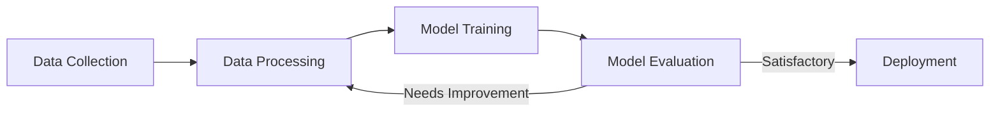

# Artificial Intelligence
{: .fs-9 }

Notes and resources on artificial intelligence topics.
{: .fs-6 .fw-300 }

## Overview

This section contains my notes, thoughts, and resources related to artificial intelligence. Topics range from theoretical concepts to practical applications and recent developments in the field.

## Subcategories

### Communication
AI communication encompasses techniques and frameworks for interaction between AI systems and between humans and AI.

- [AI-to-AI Communication]({{ site.baseurl }}/AI/Comunicação/A2A/)
- [Multi-Channel Processing]({{ site.baseurl }}/AI/Comunicação/MCP/)

### News & Updates
Stay informed about the latest developments in AI technology.

- [April 2025 Updates]({{ site.baseurl }}/AI/Novidades/Abril%20-%202025/)
- [May 2025 Updates]({{ site.baseurl }}/AI/Novidades/Maio%20-%202025/)

## Example Workflow Diagram

## Key Topics

- Machine Learning
- Natural Language Processing
- Computer Vision
- Neural Networks
- Generative AI
- Ethical AI Development
- AI in Business
- Future Trends 