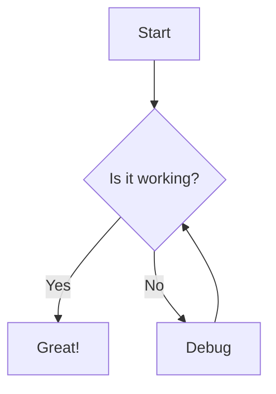

<link rel="stylesheet" href="{{ site.baseurl }}/assets/css/just-the-docs.css">
<link rel="stylesheet" href="{{ site.baseurl }}/assets/css/custom.css">

# Welcome to My Public Notes
{: .fs-9 }

This is a collection of personal notes on various topics including:

- **AI**: Technologies, tools, and frameworks
- **Leadership**: Skills and strategies for effective leadership
- **Parenting**: Tips and resources for parents

## Recent Updates

- Added new AI section with tools and frameworks
- Expanded Leadership resources with team management techniques
- Created Parenting section with age-appropriate activities

## About

This site serves as a knowledge base and reference for topics I'm passionate about. Feel free to explore the different sections using the navigation menu.

## Getting Started

Choose a topic from the menu to begin exploring the content:

1. [AI](/my-public-notes/ai/) - Artificial Intelligence concepts and tools
2. [Leadership](/my-public-notes/leadership/) - Leadership skills and strategies
3. [Parenting](/my-public-notes/parenting/) - Parenting tips and resources

[View on GitHub](https://github.com/felipepimentel/my-public-notes){: .btn .btn-primary .fs-5 .mb-4 .mb-md-0 .mr-2 }

---

## Overview

This site contains my personal notes organized into different categories. Use the navigation menu to explore topics or use the search functionality to find specific information.

## Main Categories

### [AI]({{ site.baseurl }}/AI/)

Notes about artificial intelligence topics, including:
- Communication strategies between AI systems
- Recent developments and news
- Implementation techniques

### [Leadership]({{ site.baseurl }}/Liderança/)

Thoughts and resources on leadership principles and practices, covering:
- Team management
- Communication strategies
- Decision making frameworks
- Leadership styles

### [Parenting]({{ site.baseurl }}/Parentalidade/)

Resources and notes on parenting topics, including:
- Child development stages
- Educational approaches
- Family activities
- Health and wellness

---

## Mermaid Diagram Example

Below is an example of a Mermaid diagram showing a simple workflow:

## About This Site

This site is automatically generated from Markdown files in my GitHub repository using Jekyll and the Just-the-Docs theme. The content is regularly updated with new insights and resources. 