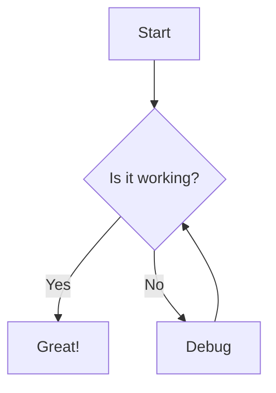

# Welcome to My Public Notes
{: .fs-9 }

A collection of personal notes on various topics including AI, Leadership, and Parenting.
{: .fs-6 .fw-300 }

[View on GitHub](https://github.com/felipepimentel/my-public-notes){: .btn .btn-primary .fs-5 .mb-4 .mb-md-0 .mr-2 }

---

## Overview

This site contains my personal notes organized into different categories. Use the navigation menu to explore topics or use the search functionality to find specific information.

## Main Categories

### [AI]({{ site.baseurl }}/ai/)

Notes about artificial intelligence topics, including:
- Communication strategies between AI systems
- Recent developments and news
- Implementation techniques

### [Leadership]({{ site.baseurl }}/leadership/)

Thoughts and resources on leadership principles and practices, covering:
- Team management
- Communication strategies
- Decision making frameworks
- Leadership styles

### [Parenting]({{ site.baseurl }}/parenting/)

Resources and notes on parenting topics, including:
- Child development stages
- Educational approaches
- Family activities
- Health and wellness

---

## Mermaid Diagram Example

Below is an example of a Mermaid diagram showing a simple workflow:

## About This Site

This site is automatically generated from Markdown files in my GitHub repository using Jekyll and the Just-the-Docs theme. The content is regularly updated with new insights and resources. 