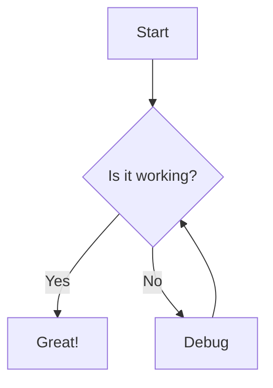
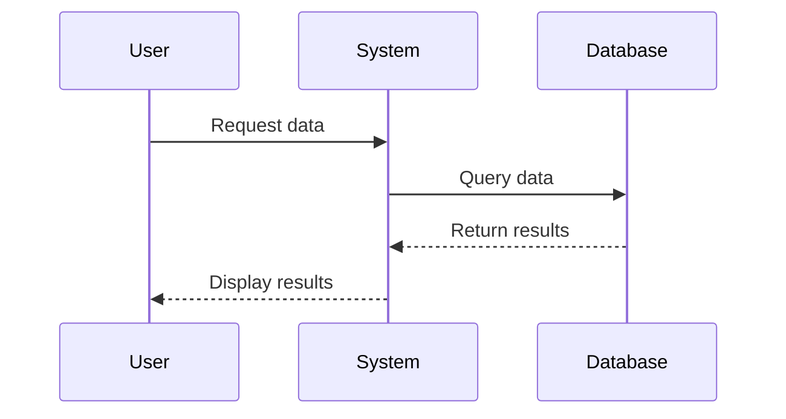
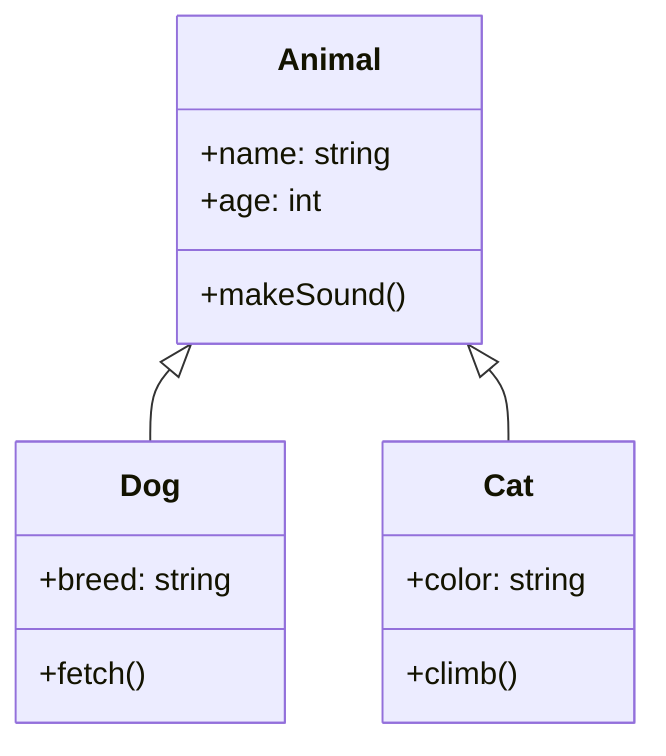
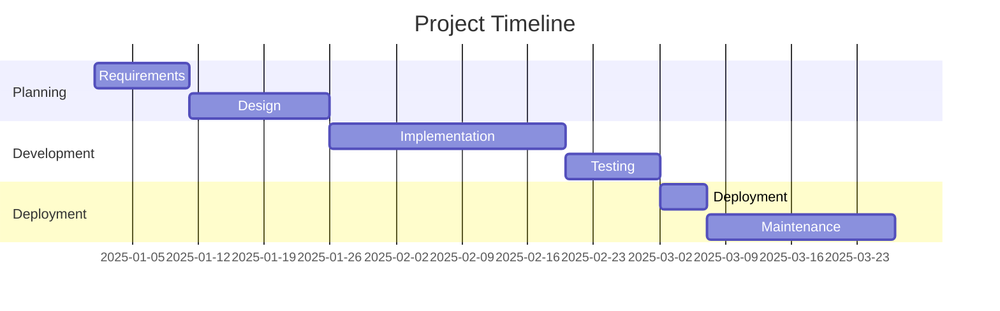

# Sample Page
{: .fs-9 }

This page demonstrates the formatting and features available with the enhanced Just-the-Docs theme.
{: .fs-6 .fw-300 }

## Typography

The theme uses a clean, highly readable font stack optimized for both desktop and mobile reading.

### Headings

# Heading 1
{: .no_toc }

## Heading 2
{: .no_toc }

### Heading 3
{: .no_toc }

#### Heading 4
{: .no_toc }

##### Heading 5
{: .no_toc }

###### Heading 6
{: .no_toc }

## Text Formatting

This is regular paragraph text. It can include **bold text**, *italicized text*, and `code snippets`. You can also [add links](#) to your content.

## Mermaid Diagrams

The theme supports Mermaid diagrams for easy visualization:

### Flowchart



### Sequence Diagram



### Class Diagram



### Gantt Chart



## Custom Callouts

The theme includes custom callout styles for important information.

<div class="note">
This is a note callout. Use it for general information or tips that aren't critical.
</div>

<div class="warning">
This is a warning callout. Use it to alert users about potential problems or important considerations.
</div>

<div class="important">
This is an important callout. Use it for crucial information that shouldn't be overlooked.
</div>

<div class="tip">
This is a tip callout. Use it for helpful advice and suggestions.
</div>

## Code Blocks

```markdown
# Sample Markdown
This is a sample code block showing markdown syntax.

## Subheading
- List item 1
- List item 2
```

```python
# Python code example
def hello_world():
    print("Hello, world!")
    
hello_world()
```

## Tables

| Name     | Type    | Description                           |
|:---------|:--------|:--------------------------------------|
| `name`   | string  | The name of the resource              |
| `path`   | string  | Path to the resource                  |
| `active` | boolean | Whether the resource is active        |
| `count`  | number  | The number of items in the collection |

## Lists

### Unordered Lists

- Item 1
- Item 2
  - Subitem 2.1
  - Subitem 2.2
- Item 3

### Ordered Lists

1. First item
2. Second item
   1. Subitem 2.1
   2. Subitem 2.2
3. Third item

### Task Lists

- [x] Completed task
- [ ] Incomplete task
  - [x] Completed subtask
  - [ ] Incomplete subtask

## Buttons

[Primary Button](#){: .btn .btn-primary }
[Secondary Button](#){: .btn }
[Button with Icon ↗](#){: .btn }

## Images

The theme supports responsive images:


## Blockquotes

> This is a blockquote. It can span multiple lines and is useful for highlighting quotes or important passages from other sources.
>
> You can have multiple paragraphs within a blockquote by adding a blank line between them. 