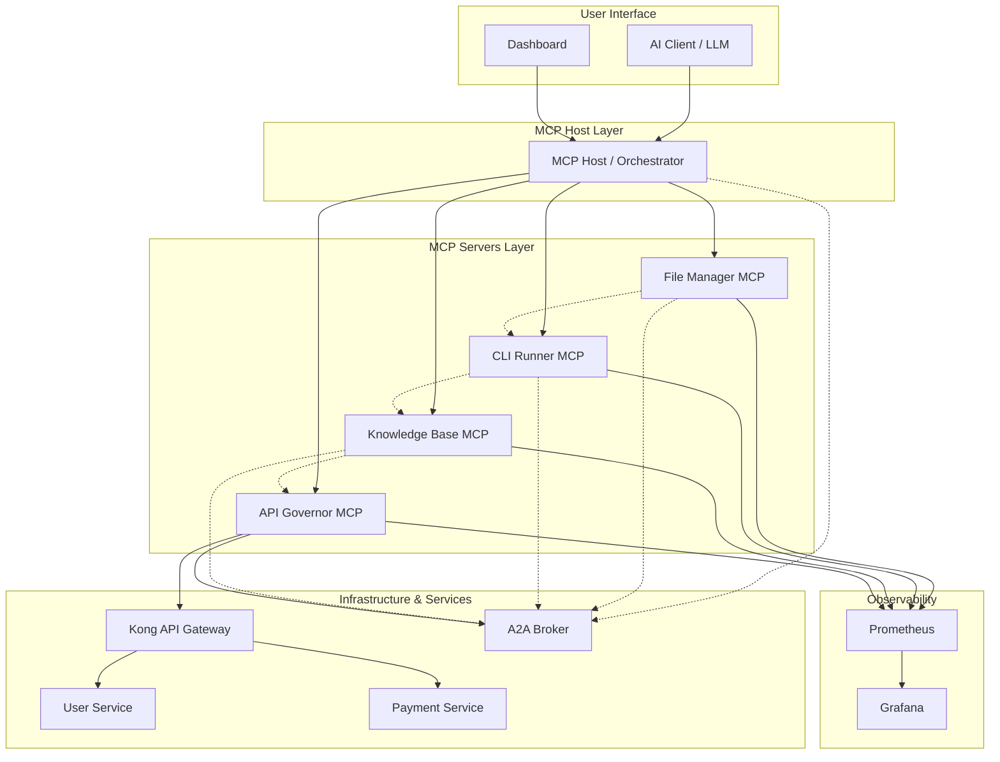

# 🚀 Multi-Agent MCP Platform Demo

This repository showcases a modern AI-driven platform using the Model Context Protocol (MCP) and Agent-to-Agent (A2A) communication. It's designed to demonstrate how AI agents can collaborate and manage complex infrastructure.

## 🏗️ Architecture Overview



## 🧩 Components

### MCP Host
The central orchestrator that receives instructions from AI models (like Claude, GPT-4) and delegates to specialized MCP servers.

### MCP Servers
1. **File Manager MCP** - Manages files and directories with tools like `createFile`, `readFile`, and `listFiles`.
2. **CLI Runner MCP** - Executes shell commands safely with environment isolation.
3. **Knowledge Base MCP** - Provides vector search capabilities for documentation and context.
4. **API Governor MCP** - Manages API configurations, rate limits, and monitoring.

### A2A Communication
Agent-to-Agent communication allows MCP servers to communicate directly with each other through a message broker (RabbitMQ), enabling complex workflows without going through the MCP Host.

### Infrastructure
- **Kong API Gateway** - Routes traffic to microservices with authentication and rate limiting.
- **Example Microservices** - User and Payment services to demonstrate API management.
- **Observability** - Prometheus and Grafana for metrics and visualization.

## 🚀 Getting Started

### Prerequisites
- Docker and Docker Compose
- 8GB RAM minimum
- 20GB free disk space

### Starting the Platform
```bash
# Start the entire platform
docker-compose up -d

# Check status
docker-compose ps

# View logs
docker-compose logs -f mcp-host
```

### Accessing Components
- MCP Dashboard: http://localhost:3001
- Grafana: http://localhost:3000 (admin/mcp)
- RabbitMQ Management: http://localhost:15672 (mcp/mcp)
- Kong Admin API: http://localhost:8081
- Prometheus: http://localhost:9090

## 📝 Example Interactions

### 1. File Operations
```
User: "Create a new configuration file called config.json with the following content: { 'api_key': '12345', 'debug': true }"

AI: Executes by calling the File Manager MCP server's createFile tool.
```

### 2. Running Commands
```
User: "Check the current memory usage of all services"

AI: Executes by calling the CLI Runner MCP server's runCommand tool with "docker stats --no-stream".
```

### 3. Complex Workflow with A2A
```
User: "Deploy a new version of the user service"

AI: Orchestrates a workflow across multiple MCP servers:
1. CLI Runner gets the latest code
2. File Manager updates configuration
3. Knowledge Base checks for breaking changes
4. CLI Runner builds and tests
5. API Governor updates Kong configuration
```

## 🔧 How It Works

1. **MCP Protocol**: Standardized JSON-based protocol for tool definitions and invocations.
2. **A2A Communication**: Allows direct server-to-server communication through RabbitMQ.
3. **Observability**: All operations are logged and metrics collected.
4. **API Governance**: Kong API Gateway manages service access with policies.

## 🛠️ Development and Extension

### Adding New MCP Servers
1. Create a new directory in `mcp-servers/`
2. Implement the MCP server with your tools
3. Add to `docker-compose.yml`

### Adding New Services
1. Create a new directory in `services/`
2. Add service to `docker-compose.yml`
3. Configure in Kong via API Governor

## 📊 Dashboard

The platform includes a real-time dashboard showing:
- Active operations
- System health
- API metrics
- Agent-to-agent communication graph
- Resource utilization

## 🔐 Security Considerations

- All MCP servers implement proper authentication
- Command execution is sandboxed
- API rate limiting prevents abuse
- Sensitive operations require confirmation

## 📚 Further Reading

- [MCP Specification](https://modelcontextprotocol.io/)
- [Agent-to-Agent Communication Patterns](https://www.anthropic.com/news/ai-to-ai-communication)

## 📄 License

MIT 